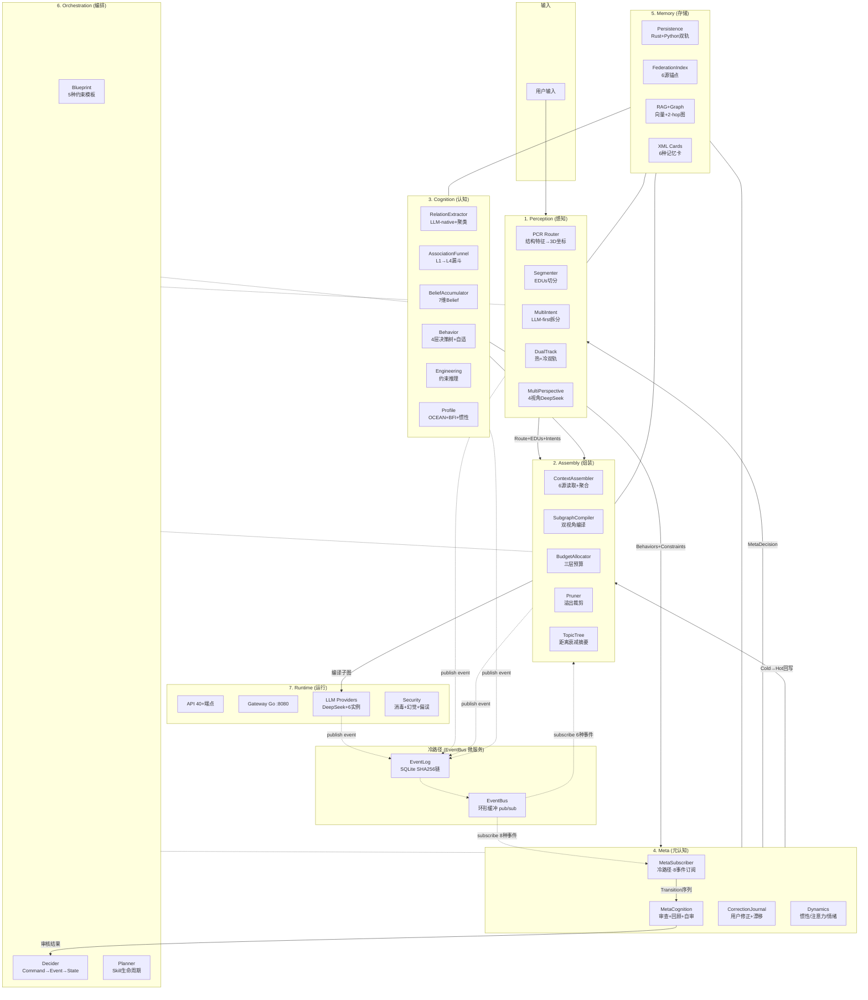
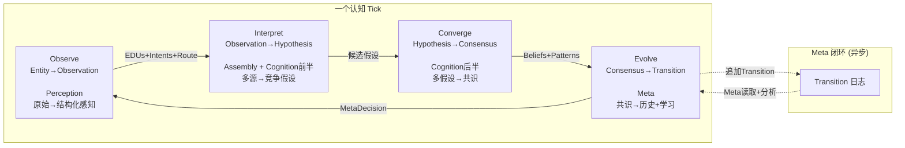
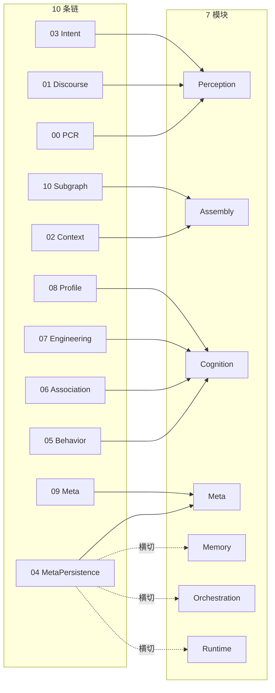
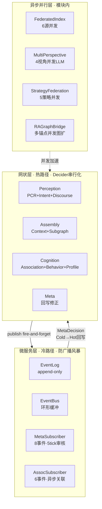
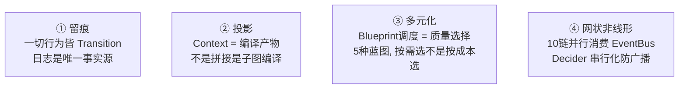

# DialogMesh — 架构全景图 (Mermaid)

```mermaid
flowchart TB
    subgraph USER["输入"]
        U["用户输入"]
    end

    subgraph P["1. Perception (感知)"]
        PCR["PCR Router<br/>结构特征→3D坐标"]
        SEG["Segmenter<br/>EDUs切分"]
        MI["MultiIntent<br/>LLM-first拆分"]
        DT["DualTrack<br/>热+冷双轨"]
        MP["MultiPerspective<br/>4视角DeepSeek"]
    end

    subgraph A["2. Assembly (组装)"]
        CA["ContextAssembler<br/>6源读取+聚合"]
        SC["SubgraphCompiler<br/>双视角编译"]
        BA["BudgetAllocator<br/>三层预算"]
        PR["Pruner<br/>溢出裁剪"]
        TT["TopicTree<br/>距离衰减摘要"]
    end

    subgraph C["3. Cognition (认知)"]
        RE["RelationExtractor<br/>LLM-native+聚类"]
        AF["AssociationFunnel<br/>L1→L4漏斗"]
        BL["BeliefAccumulator<br/>7维Belief"]
        BH["Behavior<br/>4层决策树+自适"]
        EN["Engineering<br/>约束推理"]
        PRF["Profile<br/>OCEAN+BFI+惯性"]
    end

    subgraph M["4. Meta (元认知)"]
        MS["MetaSubscriber<br/>冷路径·8事件订阅"]
        MC["MetaCognition<br/>审查+回顾+自审"]
        CJ["CorrectionJournal<br/>用户修正+漂移"]
        DY["Dynamics<br/>惯性/注意力/情绪"]
    end

    subgraph MM["5. Memory (存储)"]
        PE["Persistence<br/>Rust+Python双轨"]
        FI["FederationIndex<br/>6源锚点"]
        RG["RAG+Graph<br/>向量+2-hop图"]
        XC["XML Cards<br/>6种记忆卡"]
    end

    subgraph O["6. Orchestration (编排)"]
        BP["Blueprint<br/>5种约束模板"]
        DE["Decider<br/>Command→Event→State"]
        PL["Planner<br/>Skill生命周期"]
    end

    subgraph R["7. Runtime (运行)"]
        API["API 40+端点"]
        GW["Gateway Go :8080"]
        LLM["LLM Providers<br/>DeepSeek+6实例"]
        SEC["Security<br/>消毒+幻觉+偏误"]
    end

    subgraph COLD["冷路径 (EventBus 微服务)"]
        EB["EventBus<br/>环形缓冲 pub/sub"]
        EL["EventLog<br/>SQLite SHA256链"]
    end

    %% 热路径数据流
    U --> P
    P -->|"Route+EDUs+Intents"| A
    A -->|"编译子图"| LLM
    C -->|"Relations+Beliefs"| A
    C -->|"Behaviors+Constraints"| M
    M -->|"MetaDecision"| P
    M -->|"Cold→Hot回写"| A

    %% 冷路径
    P -.->|"publish event"| EL
    A -.->|"publish event"| EL
    C -.->|"publish event"| EL
    LLM -.->|"publish event"| EL
    EL -.-> EB
    EB -.->|"subscribe 8种事件"| MS
    EB -.->|"subscribe 6种事件"| A

    %% 横切（无箭头连接，表示依赖关系）
    MM --- P
    MM --- A
    MM --- C
    MM --- M
    O -.- P
    O -.- A
    O -.- C
    O -.- M

    %% Meta闭环
    MS -->|"Transition序列"| MC
    MC -->|"审核结果"| DE
```

# 相变映射

```mermaid
graph LR
    subgraph TICK["一个认知 Tick"]
        O["Observe<br/>Entity→Observation<br/><br/>Perception<br/>原始→结构化感知"]
        I["Interpret<br/>Observation→Hypothesis<br/><br/>Assembly + Cognition前半<br/>多源→竞争假设"]
        C2["Converge<br/>Hypothesis→Consensus<br/><br/>Cognition后半<br/>多假设→共识"]
        E2["Evolve<br/>Consensus→Transition<br/><br/>Meta<br/>共识→历史+学习"]
    end

    O -->|"EDUs+Intents+Route"| I
    I -->|"候选假设"| C2
    C2 -->|"Beliefs+Patterns"| E2
    E2 -->|"MetaDecision"| O

    subgraph COLD["Meta 闭环 (异步)"]
        TR["Transition 日志"]
    end

    E2 -.->|"追加Transition"| TR
    TR -.->|"Meta读取+分析"| E2
```

# 10 链 → 7 模块映射

```mermaid
graph LR
    subgraph CHAINS["10 条链"]
        C00["00 PCR"]
        C01["01 Discourse"]
        C03["03 Intent"]
        C02["02 Context"]
        C10["10 Subgraph"]
        C05["05 Behavior"]
        C06["06 Association"]
        C07["07 Engineering"]
        C08["08 Profile"]
        C04["04 MetaPersistence"]
        C09["09 Meta"]
    end

    subgraph MODS["7 模块"]
        M1["Perception"]
        M2["Assembly"]
        M3["Cognition"]
        M4["Meta"]
        M5["Memory"]
        M6["Orchestration"]
        M7["Runtime"]
    end

    C00 --> M1
    C01 --> M1
    C03 --> M1
    C02 --> M2
    C10 --> M2
    C05 --> M3
    C06 --> M3
    C07 --> M3
    C08 --> M3
    C04 --> M4
    C09 --> M4
    C04 -.->|横切| M5
    C04 -.->|横切| M6
    C04 -.->|横切| M7
```

# 三层部署视图

```mermaid
flowchart TB
    subgraph L1["微服务层 · 冷路径 · 防广播风暴"]
        direction LR
        EB1["EventLog<br/>append-only"]
        EB2["EventBus<br/>环形缓冲"]
        EB3["MetaSubscriber<br/>8事件·5tick审核"]
        EB4["AssocSubscriber<br/>6事件·异步关联"]
    end

    subgraph L2["异步并行层 · 模块内"]
        direction LR
        AP1["FederatedIndex<br/>6源并发"]
        AP2["MultiPerspective<br/>4视角并发LLM"]
        AP3["StrategyFederation<br/>5策略并发"]
        AP4["RAGraphBridge<br/>多锚点并发图扩"]
    end

    subgraph L3["网状层 · 热路径 · Decider串行化"]
        direction LR
        MESH1["Perception<br/>PCR+Intent+Discourse"]
        MESH2["Assembly<br/>Context+Subgraph"]
        MESH3["Cognition<br/>Association+Behavior+Profile"]
        MESH4["Meta<br/>回写修正"]
    end

    L3 -->|"publish fire-and-forget"| L1
    L1 -->|"MetaDecision<br/>Cold→Hot回写"| L3
    L2 -.->|"并发加速"| L3
```

# 四条信念

```mermaid
graph TB
    B1["① 留痕<br/>一切行为皆 Transition<br/>日志是唯一事实源"]
    B2["② 投影<br/>Context = 编译产物<br/>不是拼接是子图编译"]
    B3["③ 多元化<br/>Blueprint调度 = 质量选择<br/>5种蓝图, 按需选不是按成本选"]
    B4["④ 网状非线形<br/>10链并行消费 EventBus<br/>Decider 串行化防广播"]
```
