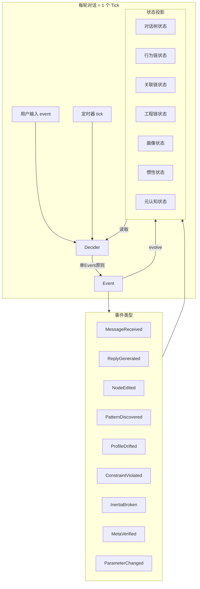

# DialogMesh v6 — 业务全貌 · 全局状态机下的 10 条链

> 版本: v1.0 | 日期: 2026-07-19
> 核心: 10条链 × 全局状态机 × Event Sourcing × 四路径调度

---

## 一、先回答：广播风暴在哪里发生

```
每轮对话后的连锁反应链:

事件触发链 (原始设计 — 无状态机):
  链05 发现 A→B → push 链06
  链06 更新 A↔B → push 链08
  链08 更新 quality_centric → push 链07 + 链01 + 链05
  链07 约束变化 → push 链06 + 链01
  链01 上下文变化 → push 链02
  链02 新标注 → push 链05 + 链06 + 链09
  链09 审核完成 → push 链05 + 链06 + 链08 + 链03
  链03 对话树变化 → push 链04 + 链09
  → 9 条链互推 = 9×8/2 = 36 条 push 路径
  → 任何一条链的修改触发 4-6 条链的连锁反应

状态机方案:
  Command → Decider(唯一入口) → 1个Event → evolve → 下一Tick
  → 每 Tick 只传播 1 个事件
  → 36 条 push 路径 → 6 条 Tick 序列 (串行化)
```

---

## 二、10条链在状态机中的角色

```
链 01-04 (对话树主线): Workflow 协调器
链 05 (行为链):        Activity 消费者 + Event 生产者
链 06 (关联链):        State 投影 + Event 消费者
链 07 (工程链):        State 投影 + Constraint 验证层
链 08 (画像/惯性):     State 投影 + 设计约束输出
链 09 (元认知):        Signal 接收者 + 外部 Activity 触发者
链 10 (子图):          State 读取者 (只读, 不产生 Event)

每条链的 State 是由 Event Log 重放派生出来的——不是独立存储
```

---

## 三、完整事件流



---

## 四、每条链的完整数据流

### 链 01-02: 对话树 + LLM 回复

```
Fast Path (<50ms):
  event → DiscourseBlockTree.segment → 9维粘合度判定
  → 如果 continue: 不需要 LLM → 直接返回上下文
  → 如果 fork/new: 需要 LLM → 进入 Async Path

Async Path:
  SubgraphCompiler.compile_dialogue → 组装6域上下文 → LLM 生成回复
  → ReplyGenerated Event → evolve:
    → 对话树: 更新节点
    → 行为链: 记录 action
    → 关联链: 提取语义关系

Slow Path (Checkpoint):
  → 触发 IncrementalCheckpoint → 持久化变化的分片
  → 扫描 stale annotations → 推送 Signal 给元认知
```

### 链 03: 用户修改对话树

```
用户 PUT /v6/edit/discourse-tree
  → Command{UserEditNode, node_id=n42, change=...}
  → Decider 验证:
    ① 冲突检测: n42 是否正在被其他操作修改?
    ② 权限: 用户是否有权修改?
    ③ 预算: Token 预算是否充足?
  → NodeEdited Event:
    {node_id: n42, change: edit_text, before: ..., after: ...}
  → evolve → 对话树 State 更新
  → 下一 Tick:
    Decider 检测到对话树变化 → PatternDiscovered? 元认知审核?
```

### 链 04: 元认知 + 持久化

```
Slow Path Checkpoint:
  → IncrementalCheckpoint → 只持久化变化的 shard
  → Event Log flush → 追加到 JSONL

元认知审核 (链09触发):
  → Signal{MetaReviewed, target=behavior.pattern.write_code→add_test}
  → Decider → MetaVerified Event
  → evolve → 行为链 State: pattern.reviewed = true
```

### 链 05: 行为链预测 + 发现

```
每轮对话后:
  → State.behavior_chain 读取最近 Actions
  → BehaviorDiscovery.discover:
    ① 统计发现 (零 LLM):
       P(B|A) = count(A→B) / count(A)
       满足 min_repeat≥3, min_conf≥0.75, assoc≥0.3
    ② 前端展示: 候选模式 → 用户 ✓/✗
    ③ 审核: PatternDiscovered Event → 等下一 Tick 元认知处理

预测 (仅混沌区):
  → 四层决策树: 预算→风险→冷启动→CI宽度
  → CI 宽度 ∈ [0.15, 0.40] → 触发 LLM 预测
  → LLM Activity → PredictResult Event
```

### 链 06: 关联链五层漏斗

```
L1 句法 → Fast Path (<5ms)
L1.5 补全 → Fast Path (画像/上下文) + Async Path (轻量 LLM)
L2 语义本体 → Fast Path
L2.5 信念凝聚 → State.association.belief_pool → 每轮贝叶斯更新
L3 意图锁定 → belief_pool.posterior ≥ 0.85 → IntentLocked Event
L4 时序模式 → Async Path
L5 因果晋升 → Slow Path

事件驱动:
  MessageReceived → L1+L1.5+L2 更新
  IntentLocked → L3 锁定
  PatternDiscovered → L4 更新 A↔B 强度
  MetaVerified → L5 伪因果→实因果 晋升
```

### 链 07: 工程链约束推理

```
主要作为 State 投影 — 被动消费:
  文件变更 → Ingestor → Module 节点注册
  PatternDiscovered → 如果匹配工程模板 → 蒸馏为新 Pattern
  ConstraintViolated → 反例检测 → 推送 Signal 给元认知

查询 (Fast Path):
  get_constraints_for(module_type) → 返回约束列表
  get_impact_of_change(module) → 返回影响范围
```

### 链 08: 画像 / 惯性权重图

```
多视角共识 → 惯性模式确认:
  每轮: 各链 evidence 更新 → InertiaWeightGraph.add_evidence
  N≥3 视角证实 → pattern.state = confirmed
  N≥5 视角证实 + 30轮无反例 → stable

打破检测:
  反例出现 → pattern.counter_examples++
  ≥3 反例 → InertiaBroken Event → 元认知审核

设计约束投射:
  profile.get_design_constraints() → 注入各链的参数和上下文
```

### 链 09: 元认知第二大脑

```
被动: 各链推送 Signal (审核请求)
主动: Slow Path 扫描 (低置信度边 / stale 标注 / 衰减惯性)

审核流程:
  Signal → Decider → ReviewItem → 审核队列
  → 紧急: RapidReview Activity (单次 LLM, <5s)
  → 从容: DeliberateReview Activity (多视角, 多轮 LLM)
  → MetaVerified Event → evolve → 各链 State 更新

自我复盘:
  每 Slow Path: self_audit → accuracy < 0.7 → 调整审核阈值
  → MetaParameterChanged Event
```

### 链 10: 子图编译器

```
只读 — 不产生 Event:
  compile_dialogue → 对话树子图 (D+K+E+B+R+P+F)
  compile_meta → 元认知子图 (V+E+M+I+P+Q)

数据来源: 共享 Event Log → 重放得到当前 State → 子图投影
```

---

## 五、四路径调度全景

```
┌──────────────────────────────────────────────────────────────┐
│ 每轮 Tick                                                    │
│                                                              │
│ Fast Path (<50ms):                                          │
│   句法解析 → 9维粘合度 → 画像查询 → 上下文组装              │
│   只读 State, 不产生 Event                                   │
│                                                              │
│ Async Path (50ms-10s):                                      │
│   LLM 回复 → 语义提取 → 行为记录 → Pattern detection        │
│   产生: ReplyGenerated, PatternDiscovered Event             │
│                                                              │
│ Slow Path (10s-60s, 每5轮):                                 │
│   IncrementalCheckpoint → 元认知扫描 → 信念结晶             │
│   产生: MetaVerified, IntentLocked Event                    │
│                                                              │
│ Deep Path (>60s, 每30轮或手动):                             │
│   因果晋升 → 惯性压实 → 自我复盘                             │
│   产生: CausalPromoted, InertiaCompacted Event              │
└──────────────────────────────────────────────────────────────┘
```

---

## 六、状态分片映射

```
ShardedState = 按 discourse_block_id 拆分的 State

写入规则:
  NodeEdited{n42}      → 只更新 shard[n42]
  PatternDiscovered    → 更新 shard[behavior]
  ProfileDrifted{C}    → 更新 shard[profile]
  ConstraintViolated   → 更新 shard[engineering]

增量 Checkpoint:
  Flink 增量 Checkpoint 映射:
    每 Slow Path → 找出变化的 shard → 持久化变化的 key
    未变化的 shard → 跳过 (Reference previous Checkpoint)
  
  HCWA 温度映射:
    active → 内存 (Hot)
    paused → 磁盘 (Warm) — Checkpoint 触发
    cold → 对象存储 (Cold) — 压缩
    frozen → 归档 (Archive) — 元数据+摘要
```

---

## 七、与 references 的完整映射

```
Temporal:
  Workflow = 全局状态机 Tick 循环
  Activity = LLM调用 / 语义提取 / 持久化 / 元认知审核
  Signal = 用户操作 / 元认知审核完成 / 定时器触发
  Event History = Event Log (不可变日志)

Flink:
  Keyed State = ShardedState (按 block_id)
  Checkpoint = IncrementalCheckpoint (每 Slow Path)
  Savepoint = 用户手动快照 (POST /v4/checkpoint)
  State TTL = HCWA 温度迁移 (active→frozen)
  Backpressure = Event Queue > 10 → 丢弃低优先级

LangGraph:
  StateGraph = 对话树 + 关联链 网状结构
  conditional_edges = 9维粘合度判定
  State Reducer = evolve (多 Event 合并到 State)

Event Sourcing:
  Event = NodeEdited, PatternDiscovered, ...
  Event Log = data/events/*.jsonl (不可变)
  State = Event Log 重放派生 (不是独立存储)
  Decider = GlobalDecider (唯一决策入口)
```

---

## 八、剩余缺口

| 缺口 | 说明 | 优先级 |
|------|------|:---:|
| Decider 实现 | Command→Event 验证逻辑 (冲突/权限/预算) | P0 |
| ShardedState | 按 block_id 分片 + IncrementalCheckpoint | P0 |
| Event Log 统一 | 合并 NodeEditRecord + correction_journal + pattern → 一个事件流 | P0 |
| 反压机制 | Event Queue 容量 + 优先级丢弃 | P1 |
| TTL 自动清理 | HCWA 温度迁移自动化 | P2 |
| 存算分离 | ObservationPool + State 分片 → 对象存储 | P2 |
| 因果晋升算法 | L4→L5 充分必要条件判定 | P2 |
