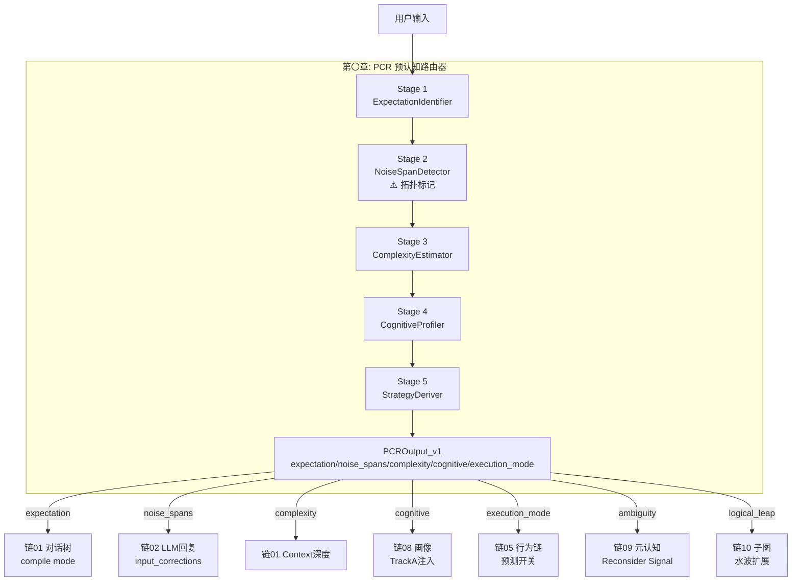
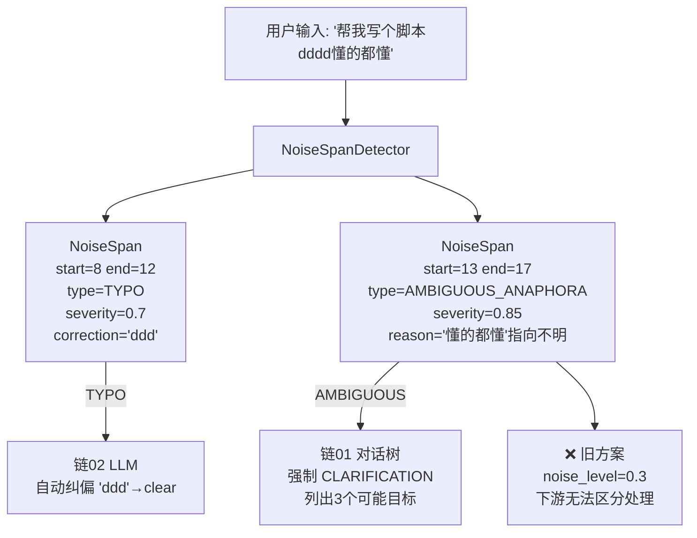
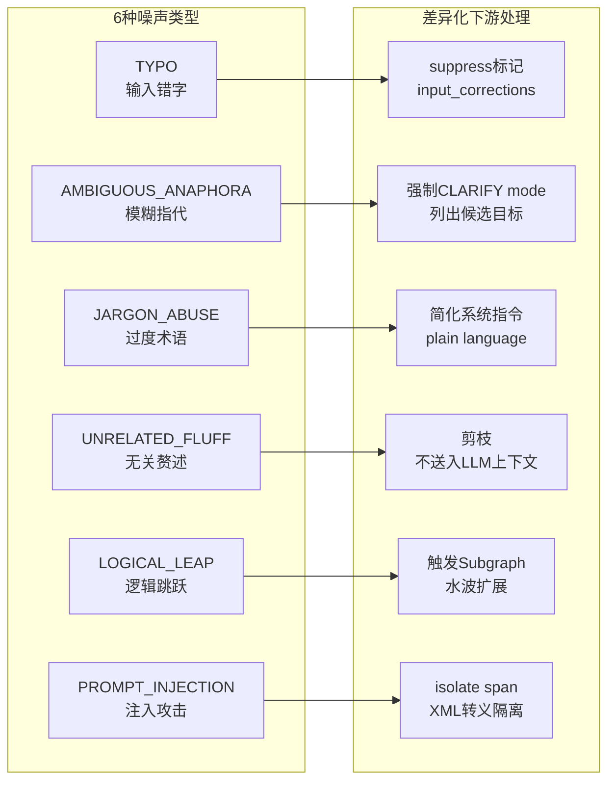
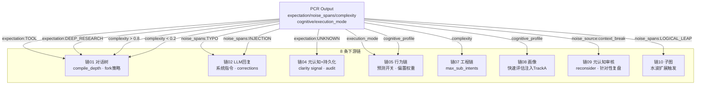
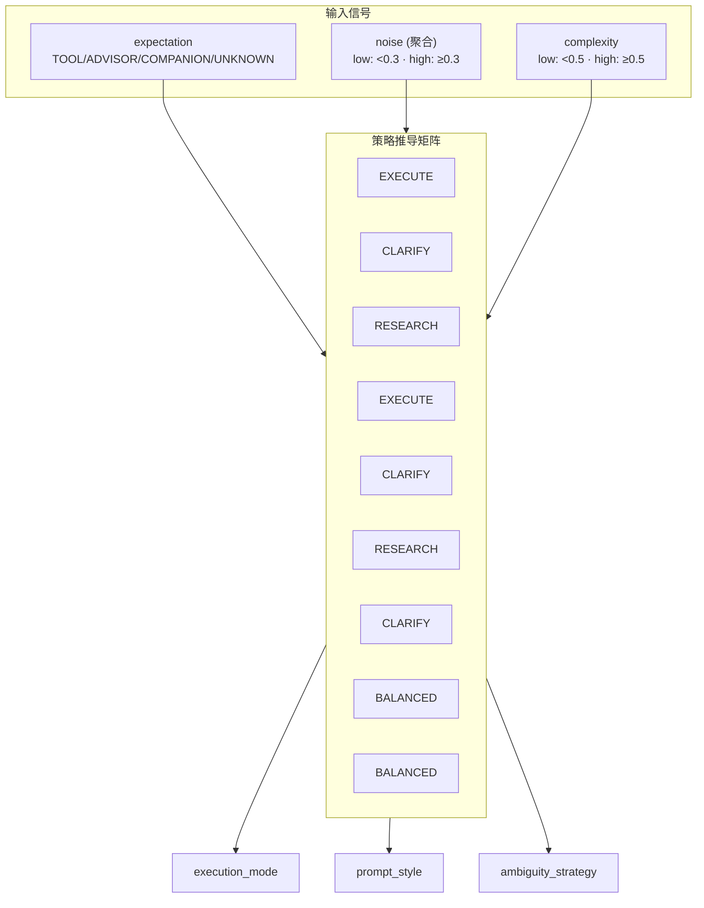
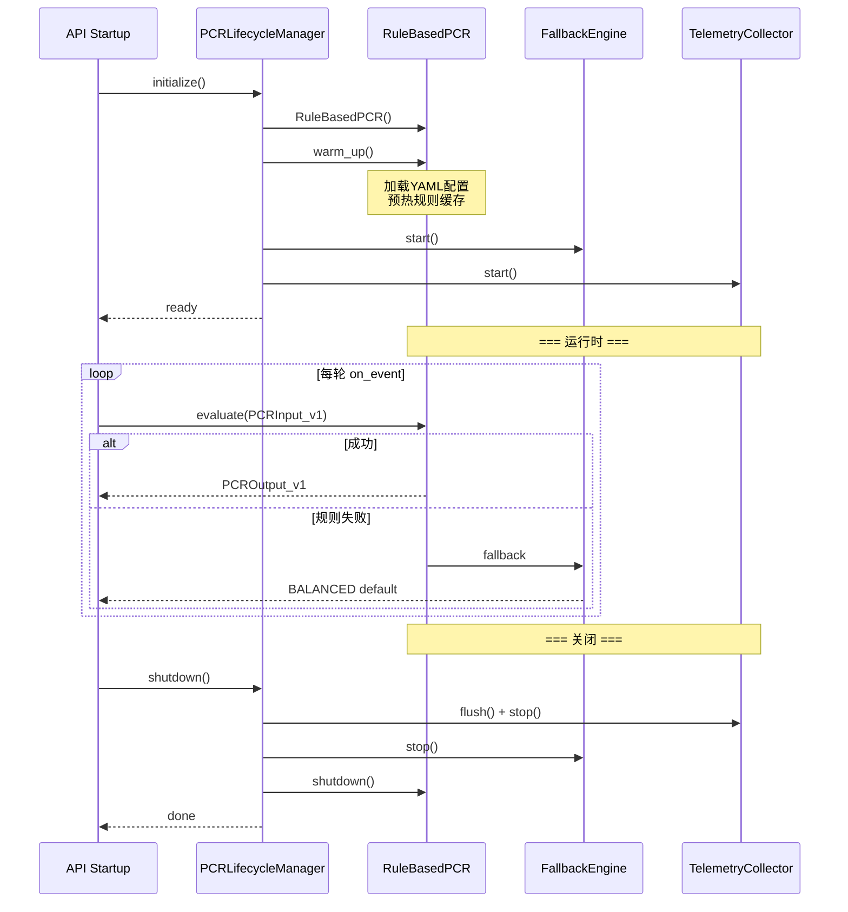
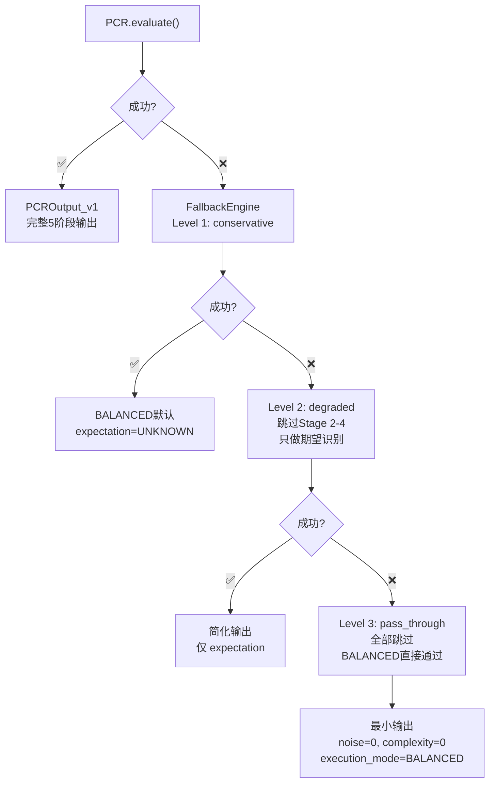
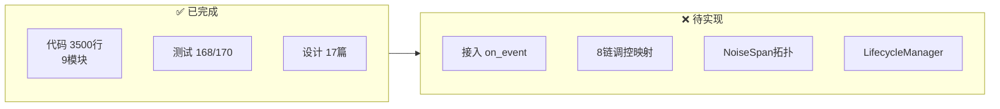
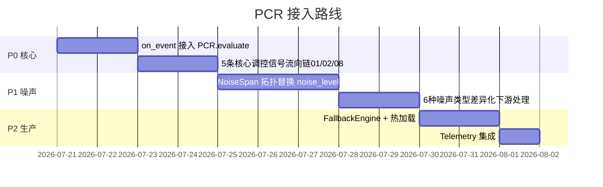

# DialogMesh v6 — 业务链设计 · 第〇章：PCR (预认知路由器)

> 版本: v1.0 | 日期: 2026-07-21
> 
> 设计来源: design_layer0_pcr_and_layer1_intent_parser.md (v2.4) +
>          design_pcr_interface_v2_1.md + design_pcr_issues_discussion.md +
>          ENGINEERING_PCR.md + 噪声拓扑修正讨论
>
> 核心命题: PCR 不做过滤——做热力图标记。用局部 NoiseSpan 取代全局 noise_level。
>          期望/噪声/复杂度/画像 四个信号端到端调控下游 8 条链。

---

## 一、PCR 在 10 链中的位置

---

## 二、5 阶段 Pipeline

```mermaid
flowchart LR
    INPUT["PCRInput_v1<br/>user_text + history"]

    subgraph S1["Stage 1: ExpectationIdentifier"]
        T0["Tier 0: 规则快路径<br/>0-2ms · 90%+"]
        T1["Tier 1: 历史推断<br/>0-1ms · 5%"]
        T2["Tier 2: LLM few-shot<br/>100-200ms · 5%"]
        T0 -->|"confidence≥0.5"| EXP["TOOL/ADVISOR/<br/>COMPANION/UNKNOWN"]
        T1 -->|"follow_markers"| EXP
        T2 -->|"仅低conf触发"| EXP
    end

    subgraph S2["Stage 2: NoiseSpanDetector ⚠️ 重设计"]
        NSEM["N_semantic<br/>填充词·情绪密度"]
        NSTR["N_structural<br/>语法异常·格式"]
        NREF["N_referential<br/>三维:时间/指代/描述"]
        NSEM --> FUSE["融合<br/>N=0.5Ns+0.3Nt+0.2Nr"]
        NSTR --> FUSE
        NREF --> FUSE
        FUSE --> SPANS["NoiseSpan[]<br/>start_char/end_char<br/>type/severity/correction"]
    end

    subgraph S3["Stage 3: ComplexityEstimator"]
        YAML["YAML 配置表匹配"]
        STEPS["步骤计数<br/>step_markers"]
        DOMAINS["领域跨度<br/>matched_domains"]
        YAML --> COMP["complexity_level<br/>0-1"]
        STEPS --> COMP
        DOMAINS --> COMP
    end

    subgraph S4["Stage 4: CognitiveProfiler"]
        COG["cognitive_level"]
        EXP_LEV["expertise_level"]
        PREF["preferred_detail"]
        TRAITS["cognitive_traits"]
    end

    subgraph S5["Stage 5: StrategyDeriver"]
        MODE["execution_mode<br/>FAST_EXECUTE/CLARIFY/DEEP_RESEARCH"]
        STYLE["prompt_style<br/>BRIEF/EXPLAIN/TUTORIAL/BALANCED"]
        AMB["ambiguity_strategy<br/>AUTO/CONSERVATIVE/BALANCED"]
        SUGG["suggested_next_actions"]
    end

    INPUT --> S1
    S1 --> S2
    S2 --> S3
    S3 --> S4
    S4 --> S5
    S5 --> OUT["PCROutput_v1"]
```

---

## 三、NoiseSpan 拓扑 (替代全局 noise_level)

### NoiseSpan 类型 × 处理策略

---

## 四、PCR → 8 链调控映射

---

## 五、决策矩阵 (StrategyDeriver)

| | TOOL | ADVISOR | COMPANION | UNKNOWN |
|---|---|:---:|:---:|---|
| **低噪声·低复杂** | FAST_EXECUTE | DEEP_RESEARCH | EXPLAIN | CLARIFY |
| **低噪声·高复杂** | FAST_EXECUTE | DEEP_RESEARCH | TUTORIAL | CLARIFY |
| **高噪声·低复杂** | CLARIFY | BALANCED | BALANCED | CLARIFY |
| **高噪声·高复杂** | CLARIFY | BALANCED | BALANCED | CLARIFY |

---

## 六、生命周期

---

## 七、三级降级回退

---

## 八、实现状态

---

## 九、接入优先级

