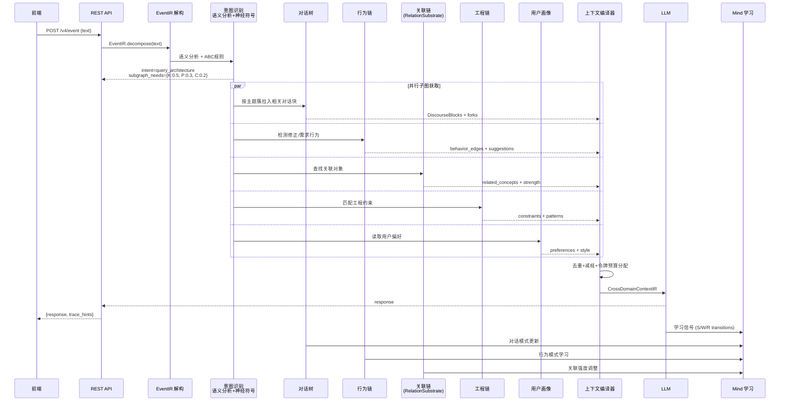
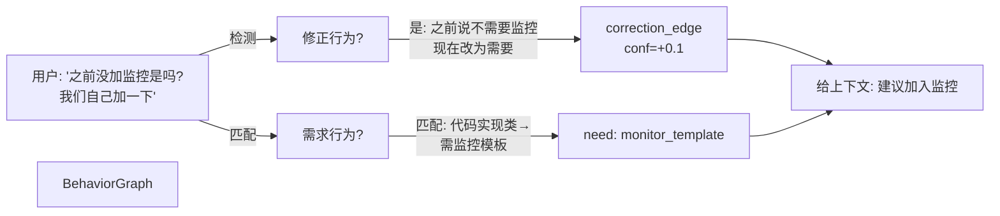
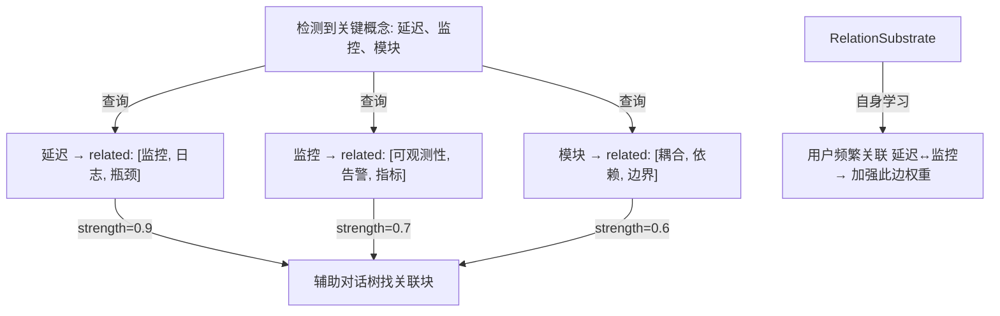
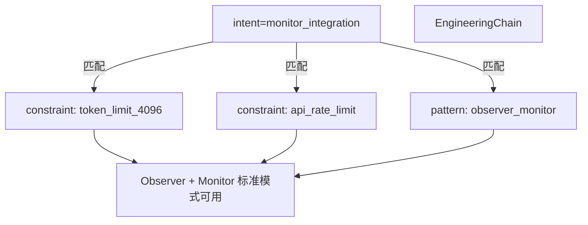
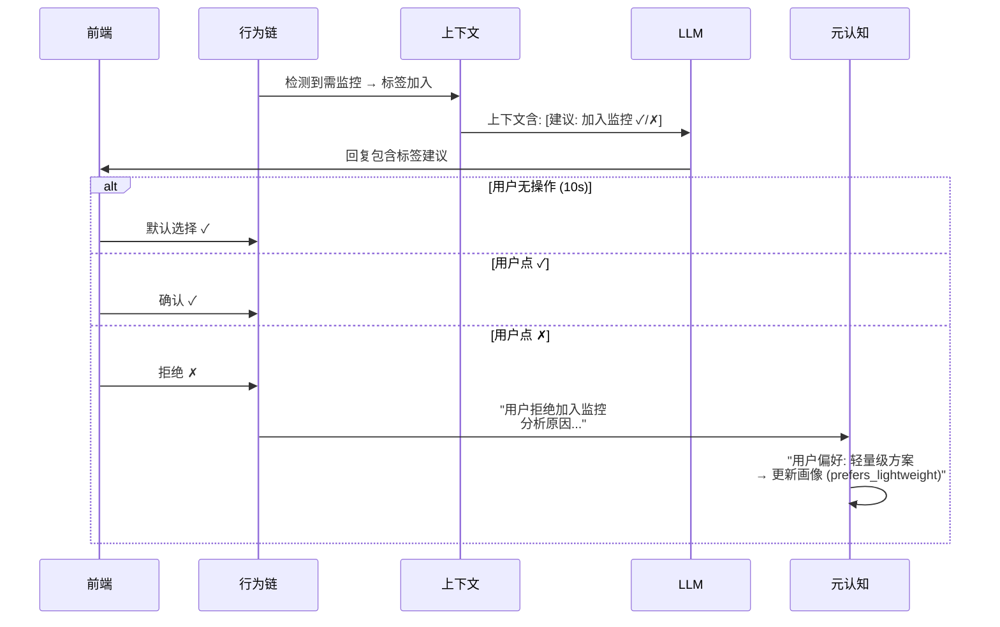
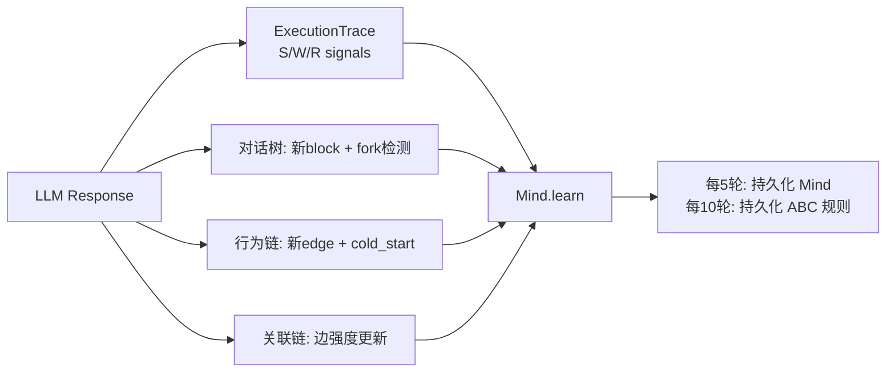

# DialogMesh v6 — 网状业务链设计 · 第一章：对话树主线

> 版本: v1.0 | 状态: 设计讨论 | 2026-07-18
>
> 核心命题: 从用户输入出发，追踪完整的业务链——意图识别→子图获取→并行链处理→上下文组装→LLM调用→回写学习。
> 网状结构非缺陷而是特征——双向模块 (既输入也输出) 构成高耦合自优化系统。

---

## 1. 总览：一条消息的全生命周期



---

## 2. 第一阶段：事件解构 + 意图识别

### 2.1 事件到达

```
用户输入 "这个模块的延迟飙升，之前没加监控是吗？我们自己加一下"
     ↓
POST /v4/event → EventIR {
    text: "这个模块的延迟飙升...",
    event_id: "msg-042",
    kind: "dialog.message"
}
     ↓
Observer 接收 → decompose text into EDUs (Elementary Discourse Units)
```

### 2.2 意图识别的组件

**不是单一模块，是 ABC 三层协作**：

```
┌──────────────────────────────────────────────┐
│ C层: neuro_symbolic.RuleEngine (符号规则)     │
│   premise: keywords=["监控","加"]              │
│   → intent: "engineering_action"              │
│   premise: confidence_drop > 0.1              │
│   → intent: "troubleshooting"                │
│   命中率: ~80%                                │
├──────────────────────────────────────────────┤
│ B层: llm_adapter.LLMAdapter (LLM深层语义)     │
│   当 C层 无匹配规则时触发                      │
│   → LLM分析: "用户同时提到延迟+监控+之前未加"    │
│   → 生成新规则 + intent="monitor_integration" │
├──────────────────────────────────────────────┤
│ A层: soft_config.json (JSON回退)              │
│   B/C 均失败时兜底: intent="general_query"    │
└──────────────────────────────────────────────┘
```

**意图识别输出**:

```json
{
  "intent": "monitor_integration",
  "confidence": 0.87,
  "subgraph_needs": {
    "K": 0.50,    // 工程知识: 监控模式、代码结构
    "D": 0.30,    // 对话树: 之前讨论过"没有监控"的块
    "B": 0.10,    // 行为链: 用户之前要求过什么
    "P": 0.10     // 用户画像: 偏好可视化监控
  },
  "expected_a": "系统需识别: 延迟↔无监控的因果关联, 用户意图是补充监控而非单纯询问"
}
```

---

## 3. 第二阶段：并行子图获取

五个域同时拉取数据——不是串联，是并行。

### 3.1 对话树 (DiscourseTree) — 主题簇匹配

```mermaid
graph TD
    INTENT["intent=monitor_integration<br/>subgraph D=0.30"]
    DT[DiscourseBlockTree]
    
    INTENT -->|按主题拉入| B1["blk_a1: '延迟飙升问题' <br/>temperature=hot"]
    INTENT -->|关联块| B2["blk_a3: '之前讨论架构' <br/>temperature=warm"]
    INTENT -->|弱相关(摘要)| B3["blk_z9: '其他模块讨论' <br/>summary only"]
    
    B1 -->|强关系| CTX[Context Assembly]
    B2 -->|中关系| CTX
    B3 -->|摘要100字| CTX
```

**规则**:
- `temperature=hot` 的块 → 完整 EDU 列表
- `temperature=warm` 的块 → 前3条 EDU + 摘要
- `temperature=cold` 的块 → 仅 topic 摘要
- 同一 `tree_id` 的 fork 分支 → 仅活跃分支的全量, fork 摘要

### 3.2 行为链 (BehaviorGraph) — 修正检测 + 需求匹配



**修正行为**:
- 用户改变之前的决定 → `correction_edge` → 置信度+0.1
- 多个修正指向同一模式 → ABC 规则学习

**需求匹配**:
- 用户说"实现代码" → 检查是否已在做监控
- 如未加 → 提示标签: "建议加入监控 ✓ / ✗"
- 用户打勾 → 不提示
- 用户打叉 → 送到元认知分析: "为什么拒绝?"
- **默认: 10秒内无操作 = 选择 ✓ (加入)**

### 3.3 关联链 (RelationSubstrate) — 跨域关联查找



**双向特性**:
- 关联链既 **输出** 给对话树/工程链/行为链 辅助查找
- 关联链也 **输入** 用户的对话内容来学习新的关联
- 关联强度随时间衰减 (EMA α=0.1)

### 3.4 工程链 (EngineeringChain) — 约束 + 模式



### 3.5 用户画像 (Profile) — 偏好注入

```json
{
  "OCEAN": {"MS": 0.79, "NC": 0.75, "CS": 0.78},
  "preferences": {
    "style": "analytical_detail",
    "viz_preferred": true,
    "monitor_depth": "deep"
  },
  "context_hints": [
    "用户偏好结构化方案而非简单建议",
    "用户有架构审查习惯—提供完整的设计决策链",
    "用户之前对监控的否定改为肯定—尊重修正轨迹"
  ]
}
```

---

## 4. 用户交互标签机制

### 4.1 标签触发条件

```
行为链检测: 代码实现类意图 + 历史无监控记录
         → 触发标签: [建议加入监控] ✓ / ✗

关联链检测: 讨论模块依赖 + 无相关测试记录
         → 触发标签: [建议加入测试] ✓ / ✗

工程链检测: 违反已知约束 (如超过令牌预算)
         → 触发标签: [⚠ 约束冲突: token_limit]
```

### 4.2 标签交互流



---

## 5. 上下文组装 + 收束

### 5.1 组装流程

```
所有域数据到达 CrossDomainContextIR:
  [D] 对话树: 3 blocks (热1+温1+摘要1)         → 800 tokens
  [B] 行为链: 1 修正边 + 1 需求建议             → 150 tokens
  [R] 关联链: 3 强关联概念 + 2 弱关联            → 200 tokens
  [K] 工程链: 2 约束 + 1 模式                    → 300 tokens
  [P] 用户画像: 偏好摘要                         → 100 tokens
  [F] 子图反馈: OCEAN + MBTI                   → 100 tokens
  ───────────────────────────────────────────────
  Total raw: 1650 tokens
  
  去重: 对话树块 A 和关联链 "延迟" 重复 → 保留一处
  减枝: 弱关联(target=0.6 以下) → 压缩为摘要
  预算: token_budget=2000, 实际 1450 → 通过
```

### 5.2 令牌分配

| 域 | 预算占比 | 说明 |
|----|---------|------|
| D (对话树) | 40% | 当前话题上下文优先级最高 |
| K (工程链) | 20% | 约束和模式直接影响回复质量 |
| B (行为链) | 15% | 修正和需求信号 |
| R (关联链) | 10% | 辅助关联理解 |
| P (画像) | 10% | 风格和偏好 |
| F (子图) | 5% | OCEAN 反馈 |

---

## 6. LLM 调用 → 回写学习



---

## 7. 与现有实现的对照

| 设计文档中的内容 | 实现状态 | 说明 |
|-----------------|---------|------|
| EventIR 解构 | ✅ | `event_ir.py` → EDUs + attributes |
| ABC 意图识别 | ✅ | `neuro_symbolic.py` + `llm_adapter.py` |
| 对话树子图 | ✅ | `discourse_block_tree.py` → hot/warm/cold 分级 |
| 行为修正检测 | ✅ | `behavior_graph/` → correction_edge |
| 需求匹配标签 | ⚠️   | API 预留, 引擎逻辑待完善 |
| 标签交互 (✓/✗) | ⚠️   | 前端组件待实现 |
| 关联链双向 | ✅ | `relation_substrate.py` → query + learn |
| 工程链约束 | ✅ | `engineering_chain/` → constraints + patterns |
| 画像偏好 | ✅ | `ocean_profile.py` → preferences |
| 上下文组装 | ✅ | `cross_domain_context_ir.py` → 域分配 |
| 去重减枝 | ⚠️   | 去重逻辑待完善 |
| LLM→Mind 回写 | ✅ | `mind.py` → learn(engine) |
| 10s 默认选择 | ❌   | 待实现 |
| 元认知拒绝分析 | ⚠️   | `correction_journal` 基础, 待完善 |

---

## 8. 下一步: 待梳理的业务链

1. ✅ **对话树主线** (本文)
2. ⏳ 行为链详细逻辑: 修正→学习 → 需求→建议 完整闭环
3. ⏳ 关联链详细逻辑: 双向学习 + 边衰减 + 跨域建议
4. ⏳ 工程链约束传导: 约束冲突→元认知→LLM 知道限制
5. ⏳ Profile 消费: 画像信号如何影响每个链的权重和行为
6. ⏳ 元认知总览: 所有拒绝/修正/异常的统一处理
