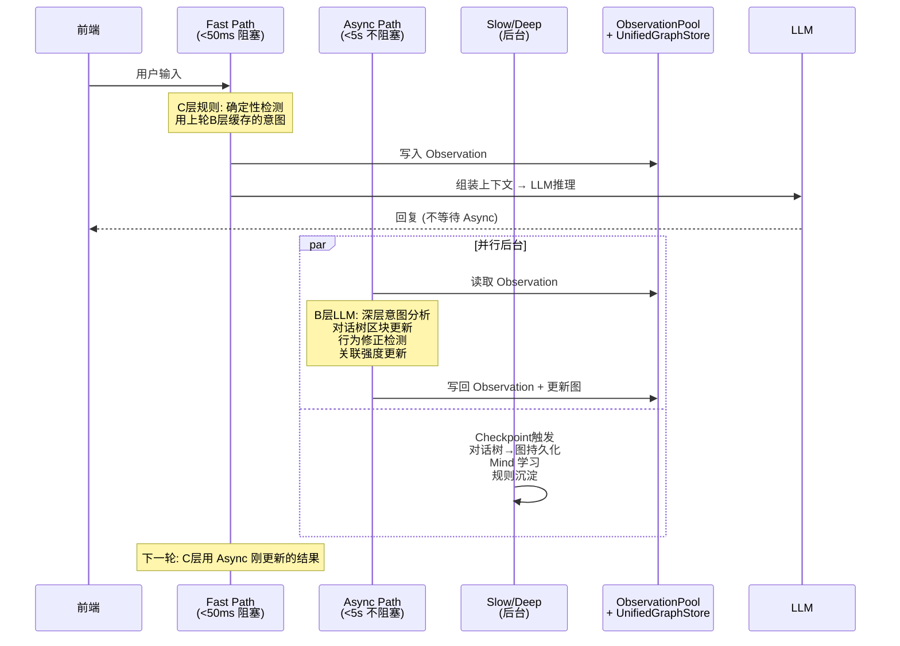
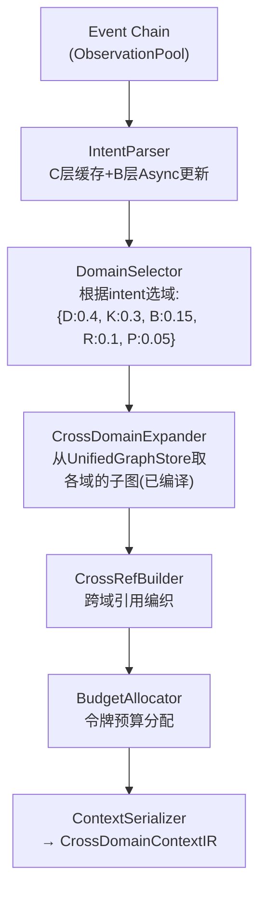

# DialogMesh v6 — 网状业务链设计 · 第一章：对话树主线

> 版本: v3.0 (设计对照修正) | 2026-07-18
>
> **v2→v3 修正**:
> - C/B 层不在同一路径: C∈Fast(<50ms), B∈Async(5s), C用上一轮的B结果
> - 模块不直接调用: 通过 ObservationPool + UnifiedGraphStore 交换
> - 子图编译集成到 Context Compiler, 非独立步骤
> - HCWA 是持久化归档分层, 非运行时缓存缺失处理
> - 剪枝策略 → 标记为设计建议 (非已有设计)

---

## 1. 总览：四路径调度下的对话树主线



---

## 2. 路径归属 (修正核心)

**所有模块有明确路径归属,跨路径通信通过共享存储。**

| 操作 | 路径 | 延迟 | 说明 |
|------|------|------|------|
| EventIR 解构 | Fast | <5ms | 纯文本操作, 无 LLM |
| C层规则匹配 | Fast | <1ms | 确定性规则: 阈值/关键词 |
| B层缓存读取 | Fast | <1ms | 上轮 Async 写入的结果 |
| 上下文组装 | Fast | <20ms | 从 ObservationPool 取已编译的子图 |
| LLM 调用 | Fast | 2-5s | 唯一阻塞操作 |
| B层 LLM 意图分析 | Async | <5s | 不阻塞回复,后台执行 |
| 对话树子图重新编译 | Async | 50-200ms | B层结果触发的子图更新 |
| 行为修正检测 | Async | 10-50ms | 基于新 Observation |
| 关联强度更新 | Async | 5-20ms | 边权重 EMA 衰减 |
| 对话树→图持久化 | Slow | 分钟级 | Checkpoint 触发 |
| Mind 学习 | Slow | 100ms-2s | 每5轮 |
| 规则学习/沉淀 | Deep | 1-10s | N次同类 Pattern 后 |

---

## 3. 意图识别：两层异步

```
┌──────────────────────────────────────────────────────────┐
│ Round N — Fast Path (阻塞用户看到回复)                     │
│                                                          │
│ 1. C-layer 规则匹配 (确定性, <1ms)                        │
│    → 从内存取 "上轮 B-layer 缓存" 的 intent              │
│    → 如果没有 → 取 soft_config.json 默认值              │
│                                                          │
│ 2. 上下文编译器:                                          │
│    从 ObservationPool 取 Async Path 上轮编译好的子图      │
│    (这些子图在 Round N-1 的 Async 阶段已准备好)          │
│                                                          │
│ 3. LLM 调用 → 回复                                       │
└──────────────────────────────────────────────────────────┘
                          │
                          ▼
┌──────────────────────────────────────────────────────────┐
│ Round N — Async Path (不阻塞, 为 Round N+1 准备)          │
│                                                          │
│ B-layer LLM: 分析当前轮次的深层意图                       │
│   → 更新意图缓存 (C-layer 下轮使用)                       │
│   → 重新计算子图需求比例                                  │
│   → 触发 SubgraphCompiler 重新编译                       │
│   → 如果模式重复出现 → 生成新 C-layer 规则 → Slow 持久化  │
│                                                          │
│ 所有模块→写入 ObservationPool / UnifiedGraphStore         │
│ (非直接函数调用, 通过共享存储交换)                         │
└──────────────────────────────────────────────────────────┘
```

**关键**:
- C 层不等待 B 层——C 用 ROUND N-1 的结果
- 第一轮没有缓存→用 A 层 JSON 默认值
- B 层分析当前轮→为下一轮准备数据

---

## 4. 子图编译：统一在 ContextCompiler, 非独立步骤

```
DESIGN_CROSS_DOMAIN_CONTEXT.md §9.2:

当前: 扁平历史 → 窗口过滤 → PCR → LLM

目标: Event Chain → IntentParser → DomainSelector →
      CrossDomainExpander → CrossRefBuilder →
      BudgetAllocator → ContextSerializer → LLM

对话树、行为图、因果链、工程链、用户画像
全部作为 Context Compiler 的数据源。
```

**子图获取不是一个独立步骤——是 ContextCompiler 内部的 DomainSelector + CrossDomainExpander 阶段。**



**SubgraphCompiler 的职责**: 在 Async 阶段根据 B-layer 新意图重新编译各域子图, 写入 UnifiedGraphStore。Fast Path 的 ContextCompiler 直接从 Store 取——不实时编译。

---

## 5. 持久化与节点标注 (修正)

### 5.1 修正网关 — 非缓存缺失, 是持久化时修正

```
DESIGN_DIALOGUE_TREE_PERSISTENCE_ADAPTER:

持久化时做的事情:
  1. 取 NodeAnnotationStore 最新标注 (可能触发重分类)
  2. 结构校验 (合并/拆分/跨节点引用 — 仅追加元数据边)
  3. 转换为图节点 + 边 → UnifiedGraphStore

原则:
  - 不合并节点, 不删除边, 不改变树拓扑
  - 只追加元数据边
  - 标注值与节点本体分离存储 (NodeAnnotationStore)
```

### 5.2 HCWA: 持久化归档分层

```
H (Hot):  当前 Session 对话树 → 全量在内存
C (Warm): 近期 Session → 已持久化为图, 可按需加载
W (Cold): 历史 Session → 图节点带衰减权重
A (Archive): 压缩 → 仅 metadata + 摘要, 极少访问
```

**HCWA 主要用于归档, 不是运行时缓存缺失处理。** 运行时内存未命中走 ObservationPool → UnifiedGraphStore 的通用查询路径。

---

## 6. 设计违规修正对照

| v2 文档 | 问题 | v3 修正 |
|---------|------|---------|
| C层识别复杂意图 | C层<1ms, 不可能做语义理解 | C层只做确定性规则, 用上轮B缓存 |
| CTX→DT 直接调用 | 违反模块隔离原则 | 通过 ObservationPool + Store 间接通信 |
| B层在Fast Path内 | LLM调用>50ms 不可能 | B层在Async Path, 不阻塞 |
| 子图获取是独立阶段 | 设计是ContextCompiler内部阶段 | DomainSelector + CrossDomainExpander ∈ ContextCompiler |
| "缓存缺失→持久化查找" | HCWA是归档分层, 非缓存机制 | ObservationPool→UnifiedGraphStore通用查询 |
| "LLM等待间隙剪枝" | 设计文档无此概念 | 标记为 [设计建议] 非已有设计 |
| 硬编码100字摘要 | 本身就不合理 | 弹性: 令牌预算×相关度 |

---

## 7. 剪枝策略 — 设计建议 (非现有设计)

以下为建议补充到设计文档的内容:

```
设计建议: WorkspaceGC
────────────────────
时机: Slow Path (Checkpoint 触发), 非 LLM 等待间隙
策略: score = frequency × exp(-λ × days_since_access)
       score < threshold → 移至 C/W/A 层
范围: 对话树节点/行为边/关联边 统一处理
保障: 不影响当前 Session 的 Hot 数据
```

---

## 8. 完整路径归属表

| 操作 | Fast | Async | Slow | Deep |
|------|:----:|:-----:|:----:|:----:|
| EventIR 解构 | ✅ | | | |
| C层规则 | ✅ | | | |
| B层缓存读取 | ✅ | | | |
| ContextCompiler(从Store取) | ✅ | | | |
| LLM调用 | ✅ | | | |
| B层LLM意图分析 | | ✅ | | |
| SubgraphCompiler(重新编译) | | ✅ | | |
| 行为修正检测 | | ✅ | | |
| 关联强度更新 | | ✅ | | |
| 对话树区块更新 | | ✅ | | |
| 对话树→图持久化 | | | ✅ | |
| 节点重分类(修正网关) | | | ✅ | |
| HCWA归档降级 | | | ✅ | |
| Mind学习 | | | ✅ | |
| 规则学习/沉淀 | | | | ✅ |
| Pattern分析 | | | | ✅ |
