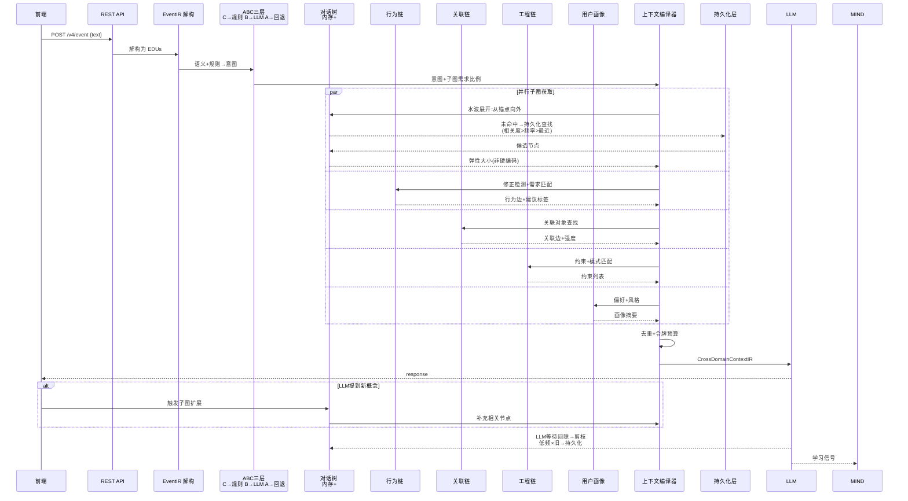
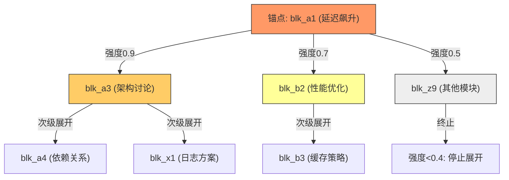
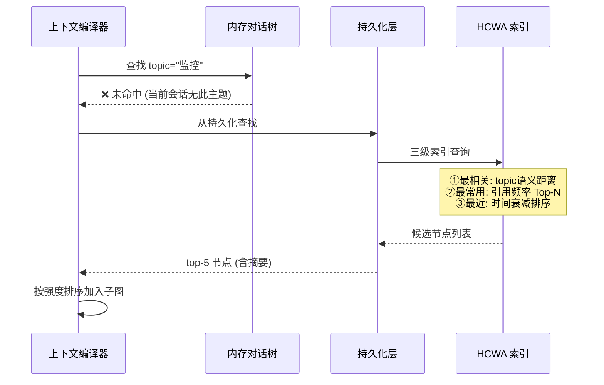
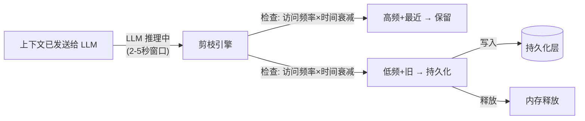

# DialogMesh v6 — 网状业务链设计 · 第一章：对话树主线

> 版本: v2.0 (修正版) | 2026-07-18
>
> **v1→v2 修正**: 意图识别三层分工修正, 子图弹性加载+水波展开, 持久化未命中处理, 剪枝策略, LLM触发补充

---

## 1. 总览：一条消息的全生命周期



---

## 2. 第一阶段：事件解构 + 意图识别

### 2.1 事件到达与解构

```
用户输入 "这个模块的延迟飙升，之前没加监控是吗？我们自己加一下"
     ↓
POST /v4/event → EventIR {
    text: "这个模块的延迟飙升...",
    event_id: "msg-042",
    kind: "dialog.message"
}
     ↓
Observer → decompose → EDUs (Elementary Discourse Units):
  ["这个模块的延迟飙升", "之前没加监控是吗", "我们自己加一下"]
```

### 2.2 意图识别：ABC 三层分工（修正）

**C 层不是意图识别器——它是模式过滤器。**

```
┌──────────────────────────────────────────────────────────────┐
│ 语义分析 (SemanticPath + BGE)                                │
│   → EDUs → 语义向量 → 概念提取                                │
│   → 关键概念: [延迟, 监控, 模块, 自己加]                       │
├──────────────────────────────────────────────────────────────┤
│ C层: 神经符号规则 (确定性的模式匹配)                           │
│   ✓ 能做: 字符串匹配 / 阈值判断 / 简单if-then                 │
│   ✓ 例: confidence < 0.3 → reject_detected                  │
│   ✓ 例: strengthen_count >= 2 → personality_analytical       │
│   ✗ 不能做: 复杂意图识别 (需要语义理解)                        │
├──────────────────────────────────────────────────────────────┤
│ B层: LLM 意图分析 (处理需要语义理解的内容)                     │
│   输入: EDUs + 关键概念 + 对话历史                            │
│   → LLM: "用户在讨论工程问题: 延迟+监控缺失, 意图是补充监控"    │
│   → 生成意图标签: intent="monitor_integration"               │
│   → 输出子图需求比例: {K:0.5, D:0.3, B:0.1, P:0.1}          │
│   同时: 生成新规则 → C层 (如果此模式重复出现)                  │
├──────────────────────────────────────────────────────────────┤
│ A层: JSON 回退                                               │
│   B层 LLM 失败时 → 从 soft_config.json 取默认值               │
│   {default_intent: "query", domain_weights: {K:0.3,D:0.3,...}}│
└──────────────────────────────────────────────────────────────┘
```

**修正点**: C 层不负责复杂意图识别——那是 B 层的职责。C 层只处理**确定性规则**(阈值、字符串匹配)。复杂语义理解必须经过 LLM。

---

## 3. 第二阶段：弹性子图获取（修正）

### 3.1 核心原则

**没有硬编码字数限制。** 所有子图大小由以下因素弹性决定：

| 因素 | 权重 | 说明 |
|------|------|------|
| 意图相关度 | 0.40 | 该节点与当前意图的语义距离 |
| 使用频率 | 0.25 | 该节点在历史上被引用的频率 |
| 最近使用 | 0.20 | 上次被访问的时间 (衰减函数) |
| 令牌预算剩余 | 0.15 | 当前上下文的令牌空间 |

### 3.2 对话树子图：水波展开



**算法**:
```
1. 定位锚点 (与意图语义最相关的 block)
2. 以锚点为圆心, 向外辐射
3. 每条边: 强度 = 语义距离 + 频率 × 衰减
4. 强度 < 阈值 (动态: 0.4 初始, 令牌紧张时上调到 0.6)
5. 每层展开后检查令牌预算:
   - 预算 > 30%: 继续下一层
   - 预算 10-30%: 仅取下一层中强度 > 0.7 的节点
   - 预算 < 10%: 停止, 当前层仅保留摘要
```

### 3.3 内存未命中 → 持久化查找



**HCWA 分级** (UnifiedGraphStore):
- **H (Hot)**: 当前会话活跃, 全量加载
- **C (Warm)**: 近期会话, 按需加载
- **W (Cold)**: 历史会话, 仅加载强相关节点
- **A (Archive)**: 压缩存储, 仅元数据+摘要

### 3.4 LLM 触发的子图扩展

**这是一个实时补充机制**:

```
LLM 回复中提到: "这个监控方案可以参考之前的 Observer 模式..."
     ↓
系统检测到 LLM 提到了不在当前子图中的概念 "Observer模式"
     ↓
触发子图扩展: 从持久化拉取 Observer 相关节点
     ↓
补充到下一轮上下文中
     ↓
用户看到: 系统"自己想起来"之前讨论过的内容
```

### 3.5 剪枝策略：利用 LLM 等待时间



**剪枝条件**:
- `score = frequency × exp(-λ × days_since_access)`
- `score < threshold` → 移出内存, 存入持久化
- 保证内存中对话树节点数 < `max_nodes` 参数 (可配置: 默认 200)
- **不在加载前剪——在发送后、LLM 推理间隙剪**

### 3.6 其他链的相同模式

行为链、关联链、工程链均遵循同一套内存→持久化→水波展开→剪枝机制:

| 链 | 内存态 | 持久化态 | 锚点 | 展开方式 |
|----|--------|---------|------|---------|
| 对话树 | DiscourseBlockTree | HCWA图节点 | 话题块 | 语义距离展开 |
| 行为链 | BehaviorGraph | 行为边图 | 当前行为 | 因果链展开 |
| 关联链 | RelationSubstrate | 关联边图 | 关键概念 | 关联强度展开 |
| 工程链 | KnowledgeGraph | 约束图 | 匹配约束 | 依赖链展开 |

---

## 4. 关键修正对照表

| v1 错误 | v2 修正 | 原因 |
|---------|---------|------|
| C层识别 "monitor_integration" | B层 LLM 负责复杂意图 | C层只能做确定性规则, 语义理解需LLM |
| 硬编码 100 字摘要 | 弹性大小, 由相关度+频率+预算决定 | 硬编码无视上下文需求 |
| 无持久化未命中处理 | HCWA 三级查找 (相关/频率/最近) | 内存未命中不能丢失信息 |
| 无 LLM 触发补充 | LLM 提到新概念 → 自动拉取子图 | 利用 LLM 的发现能力 |
| 无剪枝策略 | LLM等待间隙剪枝, 非加载前 | 不影响当前轮回复 |
| 对话树独有 | 四条链均遵循同一模式 | 系统一致性 |

---

## 5. 与设计文档的对照

| 设计文档 | 相关概念 | 本文位置 |
|----------|---------|---------|
| DESIGN_COGNITIVE_DYNAMICS_V6 | State→Transition, Mind(t)→Mind(t+1) | §3.6 学习 |
| DESIGN_STATE_EVOLUTION_SYSTEM | Mind 驱动 Workspace 初始化 | §2.2 B层 |
| DESIGN_INTERACTION_MODEL | 多层投影 (对话/操作/工程) | §3.6 |
| DESIGN_DIALOGUE_TREE_PERSISTENCE_ADAPTER | 树→图, 修正网关, HCWA | §3.3-3.5 |
| DESIGN_CROSS_DOMAIN_CONTEXT | 域分配+令牌预算 | §3.2 |
| DESIGN_RELATION_SUBSTRATE | 双向学习, 边衰减 | §3.6 |
