# DialogMesh v6 — 业务链设计 · 第一章：Intent Parser (意图解析器)

> 版本: v1.0 | 日期: 2026-07-21
> 
> 设计来源: design_layer1_intent_parser.md (v1.0, 532行) +
>          DESIGN_MULTI_TIER_PIPELINE.md + DESIGN_TIERED_ACTION_RESOLVER.md +
>          ENGINEERING_INTENT_PARSER.md +
>          代码: v3_common/intent_parser.py (1209行) + v4/tiered/ (1800行)
>
> 核心命题: 不是关键词匹配——是多层递进（规则→spaCy→LLM）的工业级解析引擎。
>          PCR 调控信号全程注入 8 阶段 Pipeline。80%+ 输入在规则层完成。

---

## 一、Intent Parser 在 10 链中的位置

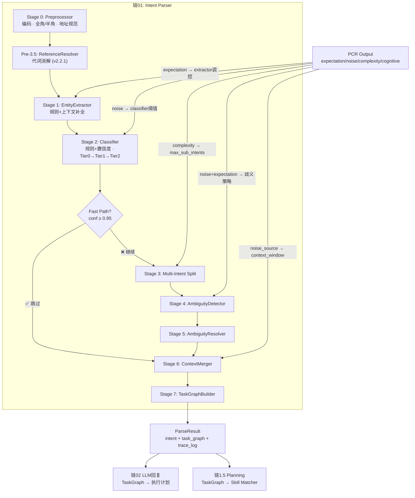

---

## 二、Tier 架构 (Multi-Tier Pipeline)

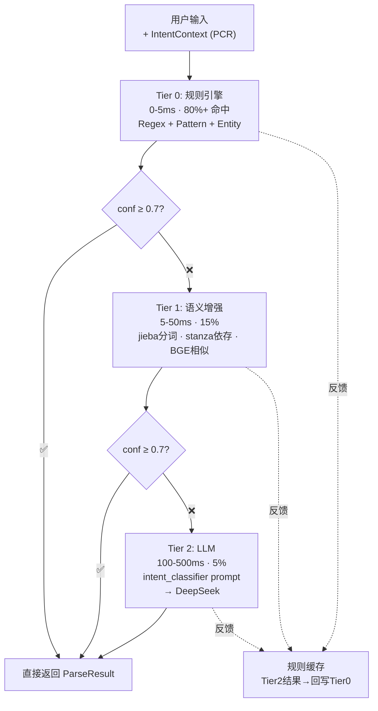

---

## 三、8 阶段 Pipeline 详解

### Stage 0: Preprocessor (预处理)

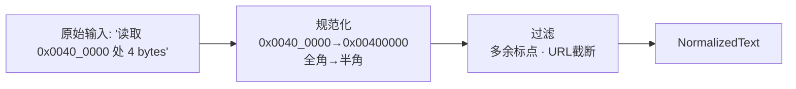

**实现**: `v3_common/intent_parser.py` L632-710 `_preprocess()`  
**PCR 调控**: 无 (预处理不接受 PCR 信号, 纯文本操作)

### Stage 1: EntityExtractor (实体提取)

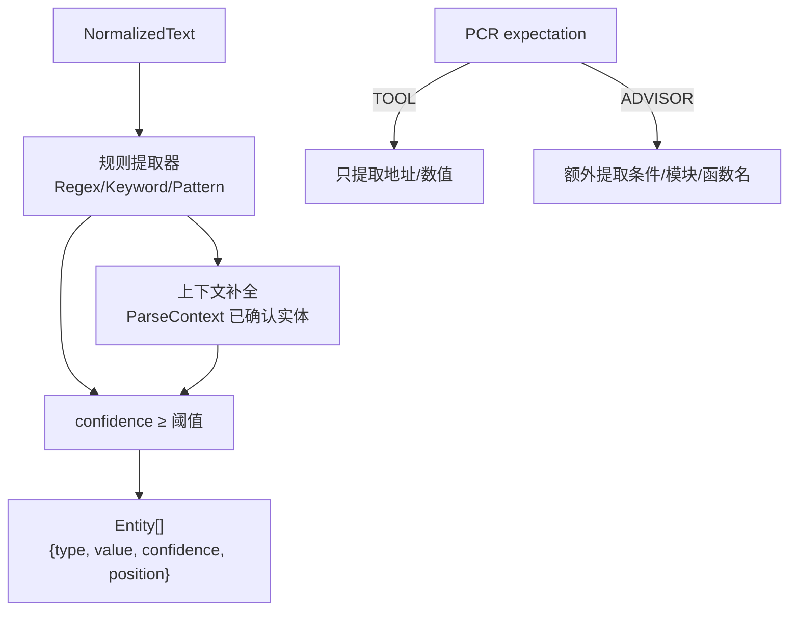

**实现**: `v3_common/intent_parser.py` L710-784 `_extract_entities()`  
**PCR 调控**: ✅ 设计中已定义, 代码待接 (当前 entity extractor 不读 PCR)

### Stage 2: Classifier (意图分类)

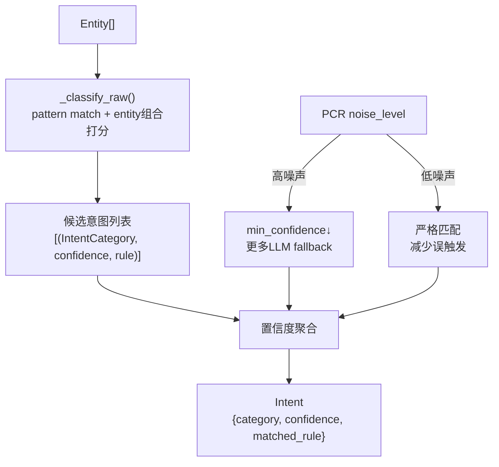

**实现**: `v3_common/intent_parser.py` L818-867 `_classify_raw()` + L867-908 `_classify()`  
**PCR 调控**: ❌ 代码存在但 `_classify()` 不接收 `intent_context.noise_level`

### Pre-3.5: ReferenceResolver (代词消解)

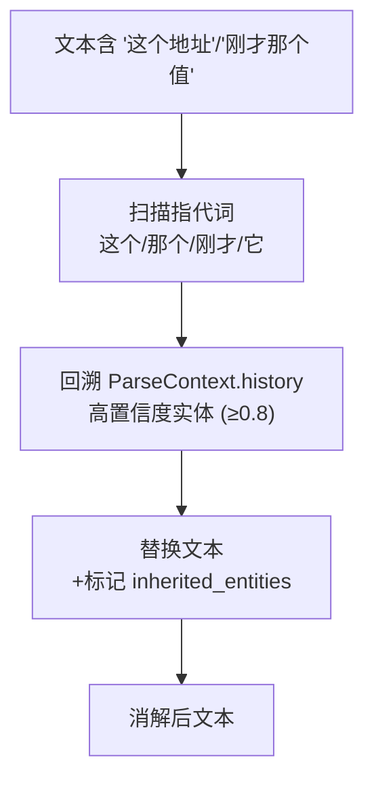

**实现**: `v3_common/intent_parser.py` L552-632 `_resolve_references()`  
**设计来源**: v2.2.1 修正 — 在 Entity Extractor 之前执行

### Stage 3: Multi-Intent Split (多意图拆分)

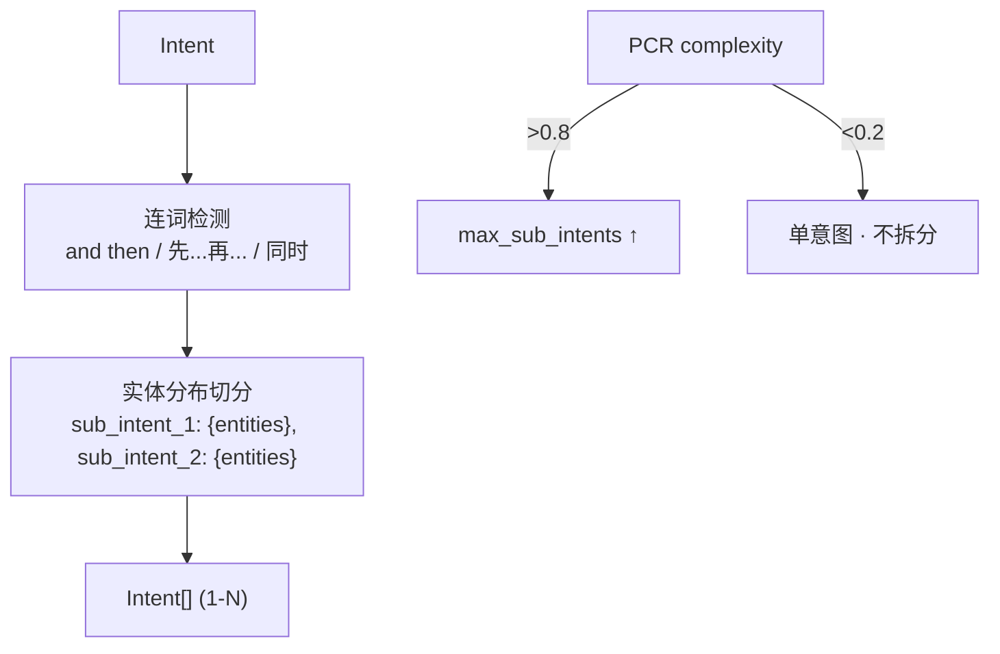

**实现**: `v3_common/intent_parser.py` L908-964 `_split_multi_intent()`  
**PCR 调控**: ⚠️ `complexity→max_sub_intents` 映射在 PCR `rule_based.py` L1111-1116 已实现, 但 `_split_multi_intent` 不读 `intent_context.complexity_level`

### Stage 4: AmbiguityDetector (歧义检测)

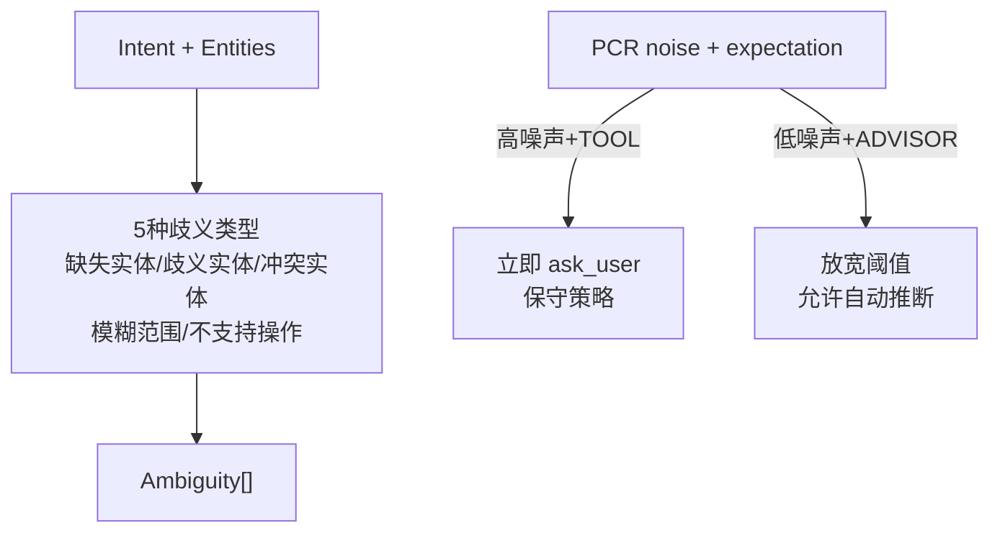

**实现**: `v3_common/intent_parser.py` L964-1026 `_detect_ambiguities()`  
**PCR 调控**: ❌ 当前不接收 noise_source 分类

### Stage 5: AmbiguityResolver (歧义消解)

```
3 种消解策略:
  自动消解:    上下文继承 · 默认值 · 高置信度推断
  延迟消解:    保留 Ambiguity · 标记 NEEDS_CLARIFICATION
  快速失败:    歧义过多 → 生成 clarification_message → ask_user
```

**实现**: `v3_common/intent_parser.py` L1026-1039 `_resolve_ambiguities()`

### Stage 6: ContextMerger (上下文合并)

```
跨轮实体继承 · 进程上下文继承 · 同义词归一化
受 PCR stability 调控: 稳定性 < 0.5 → 去除模糊词
```

### Stage 7: TaskGraphBuilder (任务图构建)

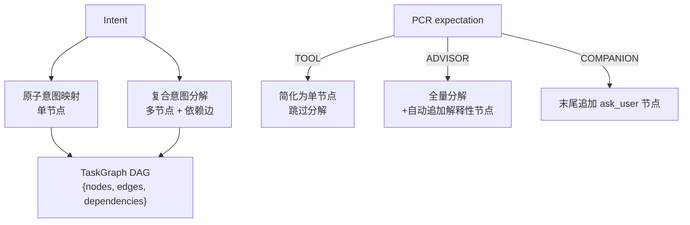

**实现**: `v3_common/intent_parser.py` L1080-1209 `_build_task_graph()`  
**PCR 调控**: ⚠️ expectation→graph策略 设计中已定义, 代码待接

---

## 四、PCR → IntentParser 完整调控表

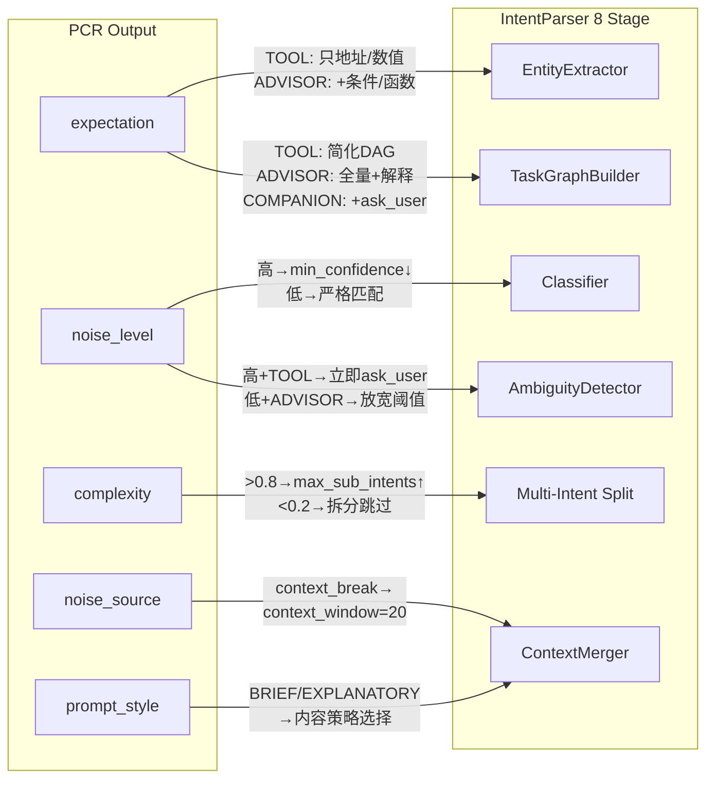

---

## 五、意图类型体系

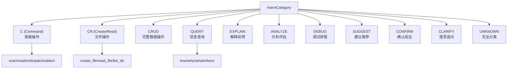

**实现**: `v3_common/intent_rule_registry.py` (304行) — 规则注册中心, 每种意图有 pattern + entity 组合规则

---

## 六、代码 ↔ 设计映射

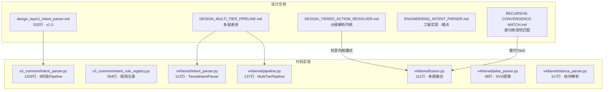

---

## 七、接入 Engine 计划

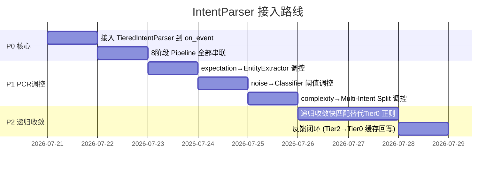

---

## 八、当前状态

```
✅ 代码: v3_common 1209行 + v4/tiered 1800行 = ~3000行
✅ 设计: 5篇核心文档
✅ 测试: v3_common 测试通过

❌ 接入 on_event: 0% — 未被调用
❌ PCR 调控: 0% — 8阶段不接收 PCR 信号
❌ 递归收敛快匹配: 0% — Tier0 仍用正则关键词
❌ 反馈闭环: 0% — Tier2 fallback 结果不回写 Tier0
```
