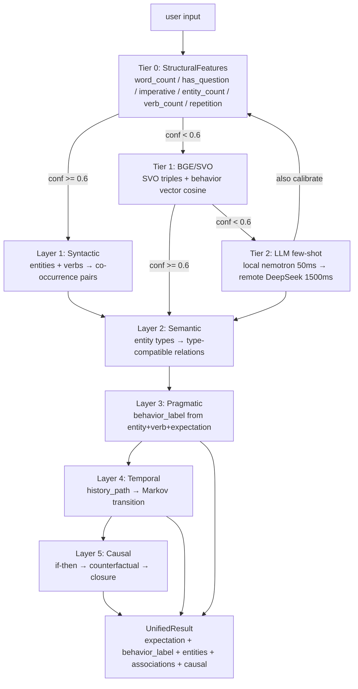
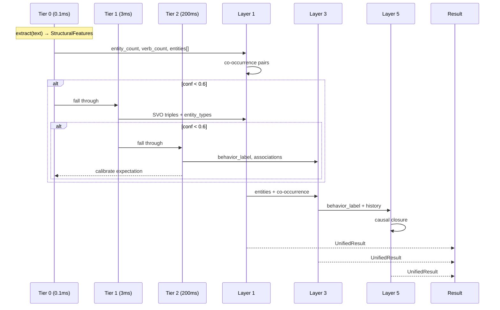
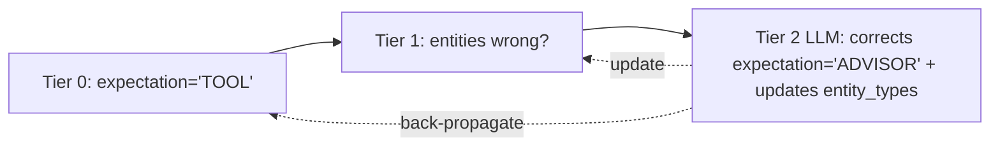

# Business Chain 01: Unified Intent & Association (统一意图解析)

> v2.0 | 2026-07-21 | 合并 BUSINESS_CHAIN_01_INTENT + BUSINESS_CHAIN_06_ASSOCIATION

---

## Unified Pipeline



---

## Speed Hierarchy

| Tier | Method | Latency | Output |
|:---:|--------|:-------:|--------|
| 0 | StructuralFeatures (grammar) | 0.1ms | expectation hint, entity_count, verb_count |
| 1 | BGE/SVO (semantic) | 1-5ms | behavior_label, entity_types, cosine_topk |
| 2 | LLM few-shot (local→remote) | 50-1500ms | full UnifiedResult + calibrate T0/T1 |

**Weighted avg**: 85% T0-only (0.1ms) + 10% T1 (3ms) + 5% T2 (200ms) = ~11ms avg.

---

## Data Flow: One Parse, Five Layers



---

## Calibration Loop



When Tier 2 LLM fires, it returns:
1. `corrected_expectation` → updates Tier 0 EMA bias
2. `entity_types` → updates Tier 1 entity classifier
3. `behavior_label` → Layer 3

This closes the loop: future inputs get better Tier 0/1 results from past LLM corrections.

---

## Engine Integration

```python
# engine.on_event() — replaces old IntentParser block

if self._unified_parser and text:
    unified = self._unified_parser.parse(
        text=text,
        history=recent_history,
        pcr_output=pcr_output,
    )
    # unified.expectation → system_instruction
    # unified.behavior_label → Layer 3 → context injection
    # unified.entities → ContextAssembler entity boost
    # unified.associations → Association chain push
    # unified.causal_closure → if present, inject into LLM reasoning
```

---

## Comparison: Before vs After

| Dimension | Before (v1) | After (v2 Unified) |
|-----------|------------|-------------------|
| Modules | IntentParser + Association separate | One pipeline |
| Parse count | 2 independent | 1 shared |
| Keyword dependency | Yes (硬编码词表) | No (grammar structure) |
| LLM usage | Never triggers (conf too high) | Triggers at conf < 0.6 |
| Calibration | None | T2 → T0 back-propagation |
| Layers 4-5 | Not implemented | Connected through shared entities |
| Avg latency | 0.1ms (rule only, imprecise) | 11ms (85% rule, 15% LLM) |

---

## Implementation Status

```
✅ v5/DESIGN_UNIFIED_INTENT_ASSOCIATION.md     — design spec
✅ StructuralClassifier                        — Tier 0 (14/14 PASS)
✅ PCR LLM fallback                            — Tier 2 ready (conf < 0.6)
⚠️ Tier 1 BGE/SVO                             — code exists, not wired
❌ Unified pipeline                            — not yet integrated
❌ Association Layers 1-5                      — not connected to StructFeatures
❌ Calibration loop                            — not implemented
```
