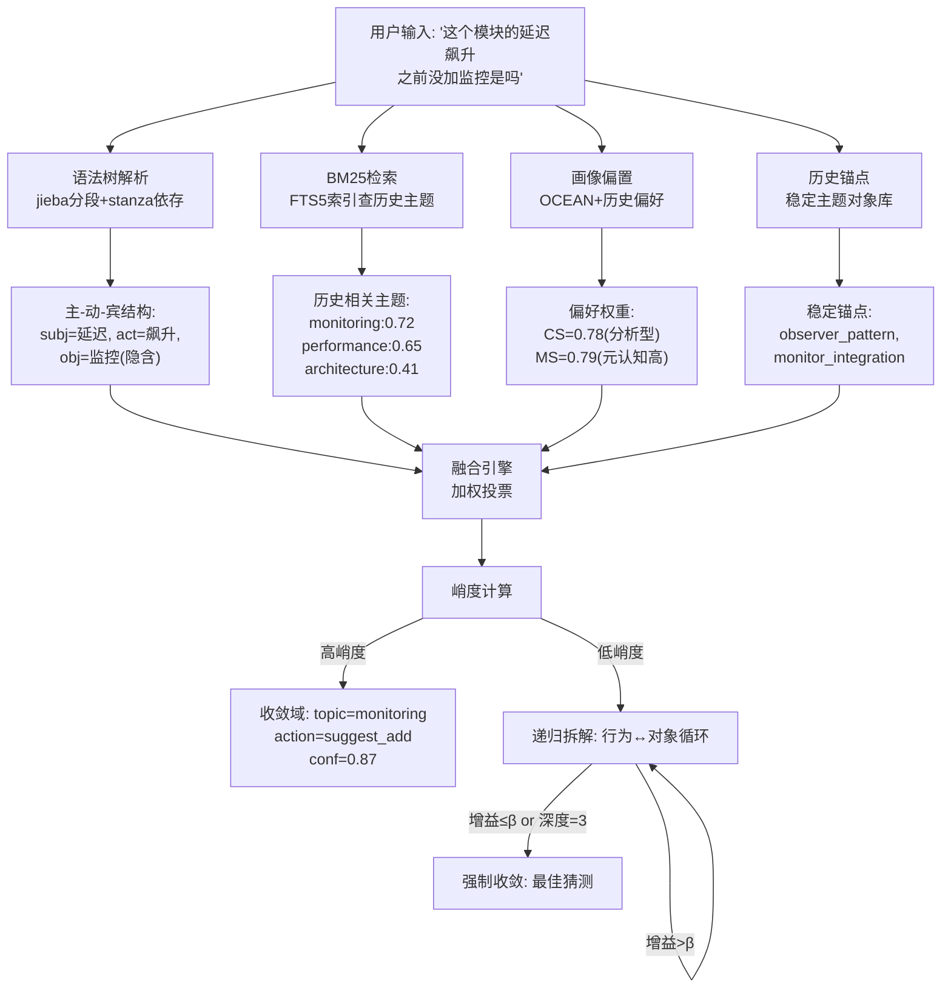
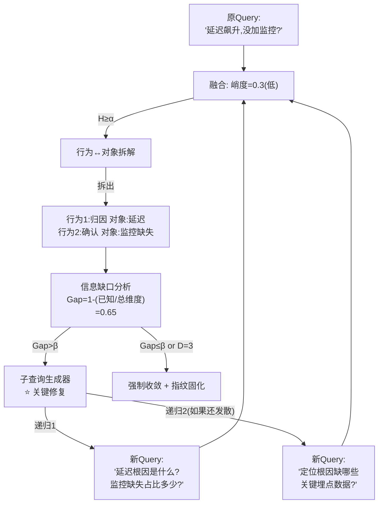
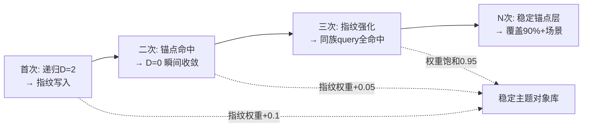

# DialogMesh v6 — 网状业务链设计 · 第二章补充：主题快匹配方案

> 版本: v1.0 | 日期: 2026-07-18
> 状态: 设计讨论
>
> 替代 Tier0 的简单子串匹配。基于递归收敛的多源融合快匹配系统。
> 核心公理：所有LLM交互趋向认知闭合。发散=递归深度不足或信息缺口过大。

---

## 1. 当前 Tier0 的问题

```
DESIGN_TIERED_ACTION_RESOLVER §2.1 (当前):
  Tier 0: 规则匹配 — "文本子串匹配 → 精确映射"
  例: text含"监控" → action="explain", topic="monitoring"

问题:
  ① 误判率高。"监控"可能是 suggest_add / caution / retrospect
  ② 无法处理多义。同一个词在不同上下文有不同语义
  ③ 非收敛。不匹配时直接升级到 Tier1, 浪费一次传播
  ④ 无反馈。不可能从"错误映射"中学习
```

---

## 2. 新方案：递归收敛快匹配系统

### 2.1 两大公理

```
公理一（闭环收敛性）:
  所有LLM交互链路最终趋向认知闭合（收敛）。
  未收敛=递归深度不足或信息缺口过大。

公理二（递归本体论）:
  "行为"与"对象"互为因果。
  拆分行为产生新对象，解析新对象倒逼行为细化，
  直至形成可识别的"主题块（Attractor Basin）"。
```

### 2.2 空间重定义

不使用"近/远/中间"的物理距离。使用**时间-确定性坐标系**:

| 域 | 条件 | 含义 |
|----|------|------|
| **收敛域** | H < α (熵值低) | 单次匹配即可。事实查询、格式转换 |
| **发散域** | H ≥ α (熵值高) | 需要递归拆解。不是"远"——是"待拆分" |
| **耦合态** | 递归链中每个节点 | 既是上一层的发散出口，又是下一层的收敛入口 |

### 2.3 熵的定义

```
H = 生成概率分布的平坦度

低熵: Token{监控:0.92, 延迟:0.05, 其他:0.03}
      → 峭度高 → 直接快匹配

高熵: Token{监控:0.35, 延迟:0.30, 优化:0.20, 其他:0.15}
      → 峭度低 → 需要递归拆解
```

---

## 3. 多源融合架构



---

## 4. 各数据源详解

### 4.1 语法树解析 (SVO 提取)

```
已有: ExtractionBlueprint → jieba + stanza

输入: "这个模块的延迟飙升，之前没加监控是吗？我们自己加一下"

jieba 分词:
  [这个, 模块, 的, 延迟, 飙升, 之前, 没, 加, 监控, 是吗, 我们, 自己, 加, 一下]

stanza 依存解析:
  nsubj(飙升, 延迟)     → 主语: 延迟
  root(飙升)            → 核心动作: 飙升
  dobj(加, 监控)        → 宾语: 监控
  advmod(加, 之前)      → 时间: 之前
  nsubj(加, 我们)       → 施事者: 我们
  advmod(加, 自己)      → 方式: 自己

SVO 三元组:
  {subj: "延迟", verb: "飙升", context: "当前状态"}
  {subj: "我们", verb: "加", obj: "监控", context: "建议动作"}
```

**SVO 的语义权重**: 
- `verb` 权重最大 (0.4) — 动作决定意图类型
- `obj` 次之 (0.3) — 对象决定主题域
- `subj` 再次 (0.2) — 主语提供上下文
- `advmod/conj` 残差 (0.1) — 修饰提供细节

### 4.2 BM25 检索 (FTS5)

```
已有: core/agent/v4/persistence/fts5_index.py — BM25 ranking

查询: "延迟飙升 监控 自己加"
FTS5 BM25 返回:
  doc_id="session_05_block_n42"  score=8.72  topic="monitoring_best_practices"
  doc_id="session_03_block_n18"  score=6.15  topic="performance_optimization"
  doc_id="session_07_block_n03"  score=3.88  topic="observer_pattern"

优势:
  - 处理同义表达 (TF-IDF的进阶: BM25)
  - 文档长度归一化 (避免长文档天然高分)
  - 已有实现, 直接复用
```

### 4.3 用户画像偏置

```
OCEAN 维度映射到主题匹配权重:

CS (Communication Style = 0.78, 分析型):
  → 偏好: 结构化主题 (architecture, design_pattern)
  → 降低: 模糊主题 (general_discussion)

MS (Meta-Cognition = 0.79, 高元认知):
  → 偏好: 自指主题 (system_design, meta_analysis)
  → 降低: 纯执行主题 (simple_query)

NC (Need for Cognition = 0.75, 深度分析):
  → 偏好: 深层主题 (root_cause, causal_chain)
  → 降低: 表层主题 (quick_fix)

DK (Domain Knowledge = 0.65, 技术层):
  → 偏好: 工程主题 (monitoring, pipeline, architecture)
  → 增加此类主题在 BM25 中的权重
```

### 4.4 历史稳定锚点

```
从 Mind 中提取的稳定主题对象:

Mind.attention._anchors:
  "observer_pattern"      weight=0.85  (高频引用)
  "monitor_integration"   weight=0.72
  "discourse_tree"        weight=0.68
  "bge_semantic_match"    weight=0.55

锚点的作用:
  - 如果 SVO+BM25 都无强匹配 → 检查锚点
  - 锚点匹配 → 即使其他源弱, 也提升该主题优先级
  - 锚点权重大于 BM25 单次分数 (代表长期稳定性)
```

---

## 5. 融合算法

### 5.1 加权投票

```python
def fused_score(topic, sources):
    """
    加权融合多源得分。
    
    source_weights:
      SVO:        0.30  (语法结构, 最直接)
      BM25:       0.25  (历史匹配, 统计可靠)
      Anchors:    0.20  (稳定锚点, 长期准确)
      Profile:    0.15  (用户偏置, 个性化)
      Context:    0.10  (当前会话上下文)
    """
    score = 0.0
    score += sources.get('svo', 0) * 0.30
    score += sources.get('bm25', 0) * 0.25
    score += sources.get('anchors', 0) * 0.20
    score += sources.get('profile', 0) * 0.15
    score += sources.get('context', 0) * 0.10
    return score
```

### 5.2 峭度判定

```
计算所有候选主题得分的峭度 (kurtosis):

高峭度 (尖峰分布):
  monitoring:0.87, performance:0.32, architecture:0.21
  → kurtosis = 2.1 (高峰)
  → 直接收敛: topic=monitoring, conf=0.87

低峭度 (平坦分布):
  monitoring:0.45, performance:0.41, architecture:0.38, observer:0.35
  → kurtosis = 0.3 (平坦)
  → 进入递归拆解
```

### 5.3 递归拆解（致命漏洞已修复）

```
⚠ v1 漏洞: 递归拆解指向自己, 下一次循环输入还是原 Query
   → 增益永远相同 → 死循环到 depth=3 → 浪费全部递归步骤

✅ v2 修复: 每次递归须插入 "子查询生成器" —— 缩小信息缺口
```



**子查询生成器的工作**:

```
输入: 原始 Query + 当前 SVO + 已知信息 + 缺口维度
输出: 更精确的新 Query

例:
  Step 0: "延迟飙升,没加监控?"
    已知: {延迟存在, 监控缺失}
    缺口: {根因, 监控与延迟的关系, 补监控的方法}
    → 生成: "延迟根因是什么? 监控缺失在根因中占比多少?"
    
  Step 1: 重新融合 → 峭度仍低(0.5)
    新已知: {根因=待定位, 监控=关键因子}
    新缺口: {定位数据, 埋点, 监控方案}
    → 生成: "要定位延迟根因, 当前系统缺少哪些关键埋点数据?"

  Step 2: 重新融合 → 峭度升高(0.8) → 收敛!
    topic="performance_diagnostics"
    action="suggest_add_instrumentation"
```

**核心差异**:
- v1: 同 Query 递归 → 死循环 → 浪费
- v2: 每次缩小信息缺口 → 有意义的递归 → 每层都在逼近收敛

### 5.4 强制收敛 + 指纹固化

```
强制收敛后立即执行:

1. 压缩递归链上所有中间态:
   fingerprint = compress(
     SVO_triplets[0..D],      # 每层的 SVO
     bm25_scores[0..D],        # 每层的检索结果
     profile_bias,             # 不变的画像偏置
     anchor_matches,           # 命中的锚点
     final_topic,              # 最终收敛主题
     convergence_depth         # 收敛时的深度 (0=直接, 1/2/3=递归)
   )

2. 写回稳定主题对象库:
   Mind.attention.upsert(
     key=fingerprint.hash(),
     topic=final_topic,
     confidence=final_conf,
     fingerprint_vector=fingerprint.vector(),
     creation_depth=convergence_depth  
     # 递归收敛的指纹比直接命中的权重更高!
   )

3. 效果:
   - 下次 "模块卡顿跟监控有关吗?"
   - 锚点直接命中 fingerprint → 峭度拉满 → 瞬间收敛
   - 语法树、BM25 都不需要跑
```

### 5.5 越用越快——自加速循环



**权重机制**:
- 直接收敛的指纹: base_weight=0.7 (一次命中, 可能是偶然)
- 递归收敛的指纹: base_weight=0.85 (经历验证, 更可靠)
- 重复命中: weight = min(0.95, weight + 0.05 × hit_count)
- 长期未命中: weight = weight × exp(-λ × days) (衰减, λ=0.01/天)

---

## 6. 与 TieredActionResolver 的整合

```
当前: Tier0 (子串匹配) → 失败 → Tier1 (嵌入) → 失败 → Tier2 (LLM)

修改后:
  Tier0 (递归收敛快匹配) → conf ≥ 阈值 → 直接返回
                         → conf 中等 → 升级到 Tier1 (嵌入辅助)
                         → conf < 阈值 → 升级到 Tier2 (LLM)
                         → 递归后仍低 → 标记 force_converged

反馈: Tier2 的结果
  → 回写到 Tier0 的指纹缓存 (下一次快)
  → 回写到 Tier1 的嵌入索引 (新action向量)
  → 触发 mark_stale (修正历史错误标注)
```

---

## 7. 量化指标

| 指标 | 符号 | 阈值 | 说明 |
|------|------|------|------|
| 熵值 | H | α=0.6 | H<α→收敛, H≥α→递归 |
| 峭度 | K | K>1.0→直接 | 峰越尖越确定 |
| 递归深度 | D | max=3 | 防死循环 |
| NMI增益 | ΔI | β=0.03 | ΔI≤β→强制收敛 |
| 信息缺口 | Gap | 70% | Gap>70%→澄清反问, 不编造 |
| 融合置信度 | FC | γ=0.7 | FC>γ→直接返回, 不升级 |

---

## 8. 实现路线

| 阶段 | 内容 | 状态 |
|------|------|:----:|
| P0 | SVO 提取 (jieba+stanza 已有) | ✅ |
| P0 | BM25 检索 (FTS5 已有) | ✅ |
| P0 | 加权融合 + 峭度计算 | ⚠️ |
| P1 | 画像偏置 (OCEAN→主题权重) | ⚠️ |
| P1 | 历史锚点 (Mind.attention 已有) | ✅ |
| P1 | 递归拆解 (行为↔对象循环) | ❌ |
| P2 | NMI 增益判定 | ❌ |
| P2 | 主题指纹缓存 | ❌ |
| P2 | Tier0→Tier1→Tier2 反馈闭环 | ⚠️ |

---

## 9. 更新到链 02

此方案替代链 02 的 §2.1 "快逻辑写入" 部分。原来的:

> "Fast Path: Tier0 规则匹配 — '回复含关键词 监控 → topic=monitoring'"

变更为:

> "Fast Path: 递归收敛快匹配 — 语法分析→多源融合→峭度判定→收敛或递归拆解→指纹缓存"
