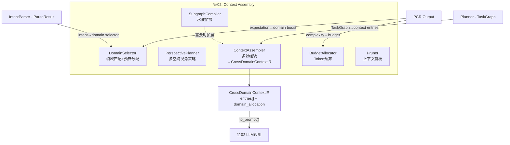
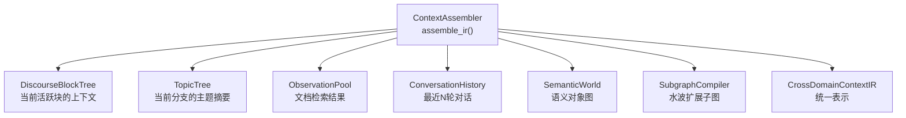
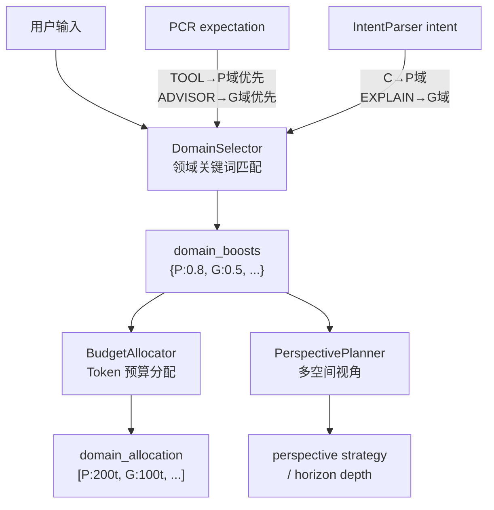
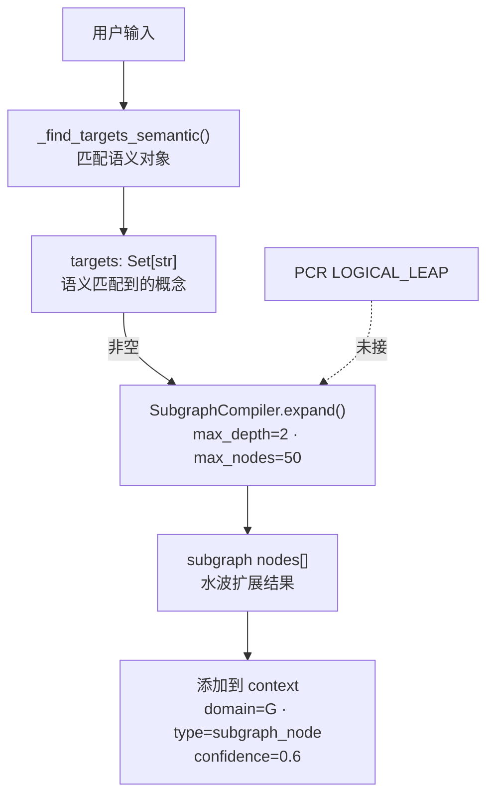
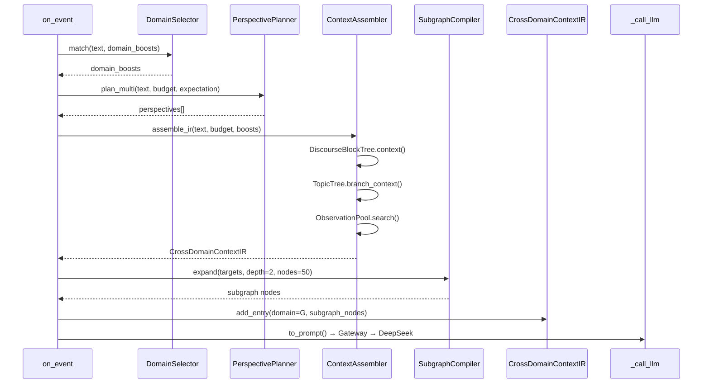
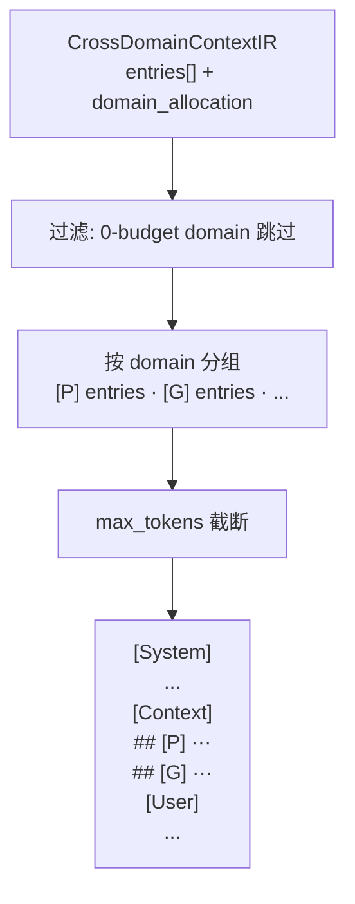
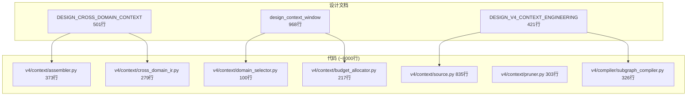

# DialogMesh v6 — 业务链设计 · 第二章：Context (上下文装配)

> 版本: v1.0 | 日期: 2026-07-21
> 
> 设计来源: DESIGN_CROSS_DOMAIN_CONTEXT.md (501行) + design_context_window.md (968行) +
>          CONTEXT_COMPRESSION_DESIGN.md (461行) + DESIGN_V4_CONTEXT_ENGINEERING.md (421行) +
>          ENGINEERING_CONTEXT_MANAGER.md (879行) +
>          代码: v4/context/ (11文件·3542行) + discourse_block_tree (12文件·1600行) +
>                + topic_tree (3文件·1868行) + context_window (6文件·1100行)
>
> 核心命题: 对话不是平铺的文本——是 DiscourseTree + TopicTree + Subgraph 三层结构的动态上下文。
>          Context 回答: "LLM 应该看到什么？多少？以什么优先级？"

---

## 一、Context 在 10 链中的位置



---

## 二、数据源



**实现**: `v4/context/source.py` (835行) — 多源数据提供者  
**当前接入**: DiscourseBlockTree ✅ · TopicTree ✅ · ObservationPool ✅ · SubgraphCompiler ✅

---

## 三、DomainSelector + BudgetAllocator



**实现**: `v4/context/domain_selector.py` (100行) + `budget_allocator.py` (217行)  
**PCR 调控**: ✅ `expectation→domain_boosts` 已接  
**当前问题**: budget 在 to_prompt 时已按 0-budget 过滤 ✅ (上次修复)

---

## 四、SubgraphCompiler



**实现**: `v4/compiler/subgraph_compiler.py` (326行)  
**当前接入**: ✅ `_find_targets_semantic()` + `SubgraphCompiler.expand()`  
**待接**: LOGICAL_LEAP → 水波扩展 (来自 PCR NoiseSpan)

---

## 五、上下文编译流程 (完整)



---

## 六、to_prompt 序列化



**实现**: `v4/context/cross_domain_ir.py` L173-275 `to_prompt()`  
**已修复**: ✅ 0-budget domain 跳过 (上次修复)

---

## 七、代码 ↔ 设计映射



---

## 八、接入 Engine 现状

```
✅ DomainSelector          — 领域匹配 + PCR 调控
✅ PerspectivePlanner      — 多空间视角
✅ ContextAssembler        — 多源组装
✅ BudgetAllocator         — Token 分配
✅ SubgraphCompiler        — 水波扩展
✅ DiscourseBlockTree      — 活跃块上下文
✅ TopicTree               — 主题摘要
✅ to_prompt 0-budget过滤   — 已修复

⚠️ ContextCompressor       — 增量压缩未触发 (代码有, engine未调)
⚠️ Pruner                  — 上下文剪枝未触发
⚠️ LOGICAL_LEAP → Subgraph — PCR 信号未接
⚠️ ContextWindow TTL       — 时间衰减未激活

有效实现率: ~80%
```

---

## 九、剩余差距

| 差距 | 工作量 | 
|------|:---:|
| ContextCompressor 接入 | 10行 |
| Pruner 接入 | 5行 |
| LOGICAL_LEAP → Subgraph | 5行 |
| ContextWindow TTL | 5行 |

**总计: ~25 行**
