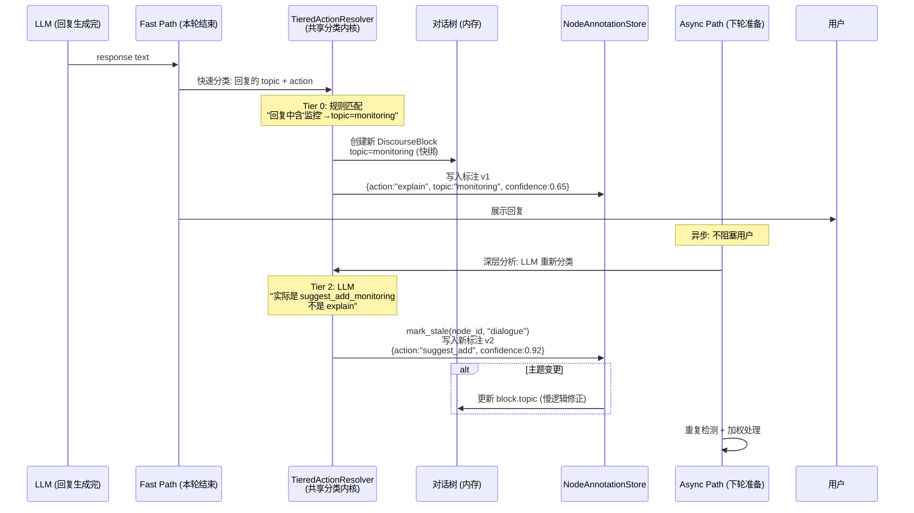
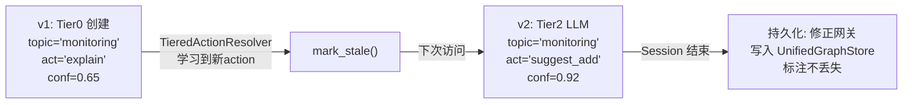
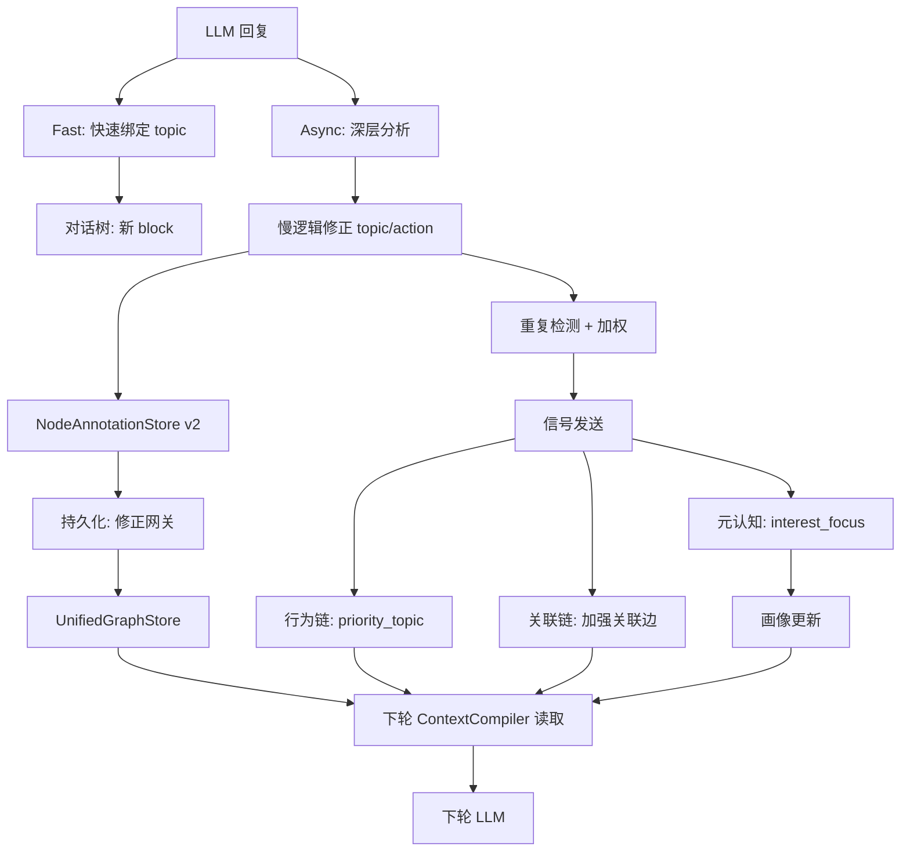

# DialogMesh v6 — 网状业务链设计 · 第二章：LLM回复侧——对话树另一面

> 版本: v1.0 | 日期: 2026-07-18
>
> 第一章是用户输入→LLM。本章是 LLM 回复→对话树回写。
> 核心命题：主题绑定可延后、重复内容加权、标注独立于节点、慢逻辑修正快逻辑。

---

## 1. LLM 回复到达后的全貌



---

## 2. 主题绑定：快逻辑写入, 慢逻辑修正

### 2.1 为什么延后

```
快逻辑 (Tier 0, <1ms):
  规则: "回复含关键词 '监控' → topic = 'monitoring'"
  问题: 误判率高。'监控' 可能是:
    - "我们加个监控" (action: suggest_add)
    - "监控的延迟也需要注意" (action: caution)
    - "之前没加监控是吗" (action: retrospect)
  
慢逻辑 (Tier 2, 500ms-2s, Async):
  LLM: 读完整回复上下文 → 精确分类
  修正快逻辑的错误绑定
```

### 2.2 标注与节点分离

```
DESIGN_INTERACTION_MODEL §4:
  "树的边只表示语义关系（follow_up、elaborate、switch_to）
   链是对关系的注解（Annotation）——不是关系的属性
   同一条关系可以有多个注解"

DESIGN_DIALOGUE_TREE_PERSISTENCE_ADAPTER §4:
  "标注值不存储在树节点内"
  "标注可以版本化，允许追溯历史值"
  "分类器进化后标记为待重分类 → mark_stale()"
```

**节点本体** (不可变):
```python
DiscourseBlock:
  id: "blk_n42"
  text: "根据当前架构,监控需要加在 Observer 之后..."
  edus: [...]
  parent: "blk_n40"
  children: ["blk_n44"]
  # 注意: 没有 topic 字段! 没有 action 字段!
```

**标注** (可变, 版本化):
```python
NodeAnnotation:
  node_id: "blk_n42"
  domain: "dialogue"
  data: {
    "action": "suggest_add",
    "topic": "monitoring",
    "intent_category": "engineering_action"
  }
  version: 2    # v1 是快逻辑, v2 是慢逻辑修正
  stale: False  # True → 下次访问时触发重分类
```

### 2.3 标注版本迁移



---

## 3. 重复内容检测与加权

### 3.1 检测时机

Async Path, 每次新 DiscourseBlock 创建后:

```python
similarity = BGE_semantic(new_block.text, existing_blocks)
if similarity > 0.85:  # 阈值可配置
    trigger_duplicate_handling(new_block, existing_block, similarity)
```

### 3.2 三种情况

| 相似度 | 情况 | 处理 |
|--------|------|------|
| > 0.95 | 几乎重复 | 合并建议 |
| 0.85-0.95 | 高度相关 | 加权 + 可选合并 |
| 0.70-0.85 | 相关话题 | 仅建立关联边 |

### 3.3 用户提示弹窗

```
┌─────────────────────────────────────┐
│ ⚠ 检测到相似内容                      │
│                                     │
│ "监控方案讨论" 与之前                    │
│ "T3的监控推荐" 相似度 92%              │
│                                     │
│ [合并为一个主题]  [保留二者]  [标记重要]  │
│                                     │
│ ☐ 下次不提示                        │
└─────────────────────────────────────┘
```

**规则**:
- 用户无操作 → 不影响。仅后台加权 (见§3.4)
- 用户选"合并" → 对话树合并两个节点, 新增 `merged_from` 引用边
- 用户选"保留二者" → 加 `related` 语义边
- 用户选"标记重要" → 节点 priority+1, 加权
- 用户选"不提示" → 记录到画像 preference

### 3.4 无操作时的后台加权

用户不操作 ≠ 无事发生。重复本身是信号:

```
重复检测 → 加权:
  1. 行为链: "用户反复讨论此主题" → behavior_edge: priority_topic
  2. 元认知: "用户重视此内容 (高重复)" → 画像: interest_focus
  3. 关联链: 加强此主题到所有相关概念的边权重
  4. 工程链: 如为工程话题 → 标记为已关注模块
```

**后续主动建议**:
```
当系统检测到:
  - 该主题已被加权 (用户反复讨论)
  - 当前讨论中再次出现
  - 用户尚未选择合并/删除

→ 系统主动: "您多次讨论监控方案, 是否需要将其设为固定主题锚点?"
```

---

## 4. TieredActionResolver: 共享分类内核

### 4.1 为什么对话树复用而非独占

```
DESIGN_TIERED_ACTION_RESOLVER:
  "DialogueInterpreter    = TieredActionResolver + dialogue_adapter"
  "所有'输入→候选类别'都共享同一内核"

消费者:
  DialogueInterpreter   → 对话轮分类 (topic + action)
  EngineeringInterpreter → 工程操作分类
  BehaviorInterpreter   → 行为分类
  IntentParser          → 用户意图分类
  NegativeKB            → 负面检测分类
```

### 4.2 反馈闭环

```
TieredActionResolver.on_new_action("add_monitoring"):
  → 通知所有 DomainAdapter
  → DialogueAdapter.mark_stale_by_pattern("监控")
  → NodeAnnotationStore: 标记所有 topic 含 "监控" 的节点为 stale
  → 下次访问 → 自动重分类
```

---

## 5. 对话树→LLM 双向反馈



---

## 6. 路径归属表

| 操作 | Fast | Async | Slow |
|------|:----:|:-----:|:----:|
| 快速 topic 绑定 (Tier0) | ✅ | | |
| 创建 DiscourseBlock | ✅ | | |
| 标注 v1 写入 | ✅ | | |
| LLM 重分类 (Tier2) | | ✅ | |
| mark_stale + 标注 v2 | | ✅ | |
| 主题重绑定 (慢逻辑修正) | | ✅ | |
| 重复检测 (BGE) | | ✅ | |
| 弹窗提示用户 | | ✅ | |
| 加权(行为链/元认知/关联链) | | ✅ | |
| 对话树→图持久化 | | | ✅ |
| 修正网关 (重分类+结构校验) | | | ✅ |
| HCWA 归档 | | | ✅ |
| 规则沉淀 (Deep) | | | | ✅ |

---

## 7. 与设计文档对照

| 设计文档 | 关键概念 | 本文位置 |
|----------|---------|---------|
| DESIGN_TIERED_ACTION_RESOLVER | 共享分类内核, 反馈闭环, DomainAdapter | §4 |
| DESIGN_INTERACTION_MODEL §4-5 | 树边仅语义, 链=注解, 双轨制 | §2.2, §3 |
| DESIGN_DIALOGUE_TREE_PERSISTENCE_ADAPTER §3-4 | NodeAnnotationStore, mark_stale, 版本化, 修正网关 | §2, §5 |
| DESIGN_CROSS_DOMAIN_CONTEXT | DomainSelector, BudgetAllocator | §5 双向反馈 |

---

## 8. 现有实现差距

| 内容 | 状态 | 说明 |
|------|:----:|------|
| TieredActionResolver 共享内核 | ✅ | `tiered_action_resolver.py` |
| NodeAnnotationStore | ✅ | `dialogue_tree_persistence_adapter.py` |
| mark_stale + 自动重分类 | ✅ | 设计完整, 实现中 |
| 快绑→慢修正 | ⚠️ | 路径归属已定, 时序待验证 |
| 重复检测 (BGE) | ⚠️ | BGE 可用, 触发阈值待定 |
| 弹窗提示 (merge/delete/重要) | ❌ | 前端组件待实现 |
| 后台加权 (行为/元认知/关联) | ⚠️ | 各链信号通道已通, 逻辑待补 |
| 对话树→图持久化 | ⚠️ | PersistenceAdapter 接口完整, 集成待完成 |
