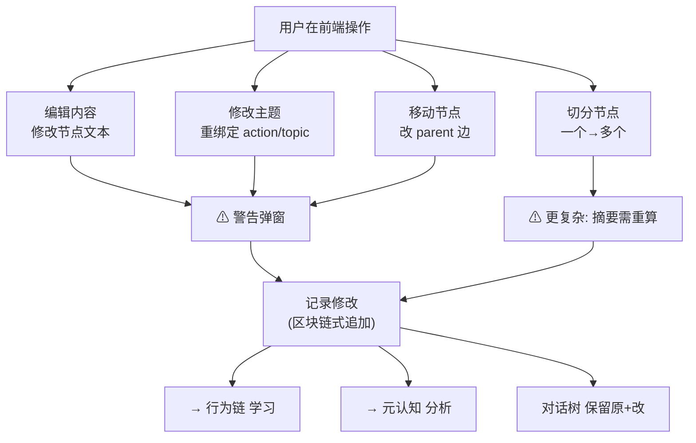
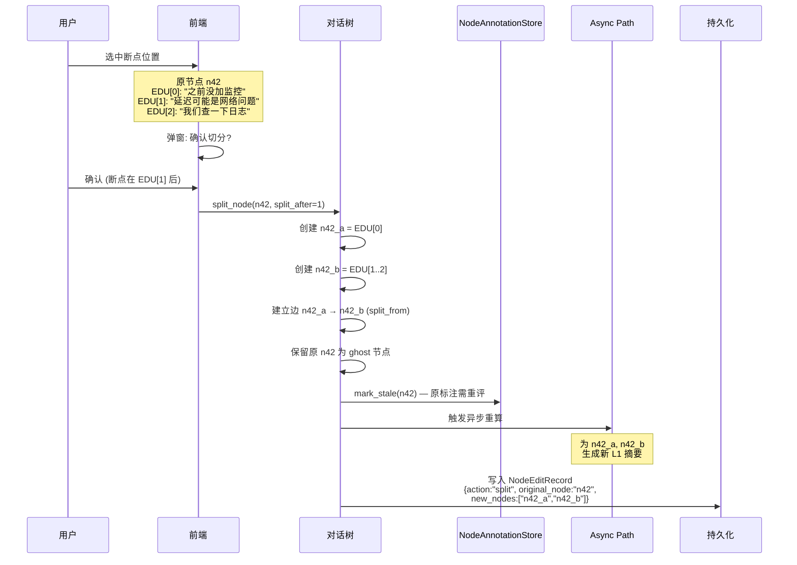

# DialogMesh v6 — 网状业务链设计 · 第三章：用户修改对话树

> 版本: v1.0 | 日期: 2026-07-18
>
> 核心命题: 用户在前端修改对话树节点(内容/主题/边/切分)时,
> 系统如何记录、警告、学习, 以及二级摘要架构下的切分复杂度。

---

## 1. 修改类型总览



---

## 2. 修改记录模型：区块链式追加

### 2.1 不是存两份完整数据

```
❌ 错误: 复制整个 DiscourseBlock → 浪费存储
✅ 正确: 仅记录 {position, original, modified}

类比 Git diff:
  不是存两个完整文件, 只存变更的行。
```

### 2.2 数据结构

```python
@dataclass
class NodeEditRecord:
    """对话树节点的单次修改记录。区块链式: 每个修改链接到上一个。"""
    
    edit_id: str                # 唯一ID, 如 "edit_n42_003"
    node_id: str                # 被修改的节点
    timestamp: float
    
    # 变更内容 (只记录变化的部分)
    field: str                  # "content" | "topic" | "parent" | "action"
    position: Optional[str]     # 文本内的位置 (行/偏移), content变更时使用
    original: str               # 原始文本片段 (不是整个EDU)
    modified: str               # 修改后文本片段
    
    # 链式结构
    prev_edit_id: Optional[str] # 指向上一次修改
    
    # 元信息
    user_action: str            # "edit" | "rewire" | "split" | "delete"
    summary_impact: str         # "none" | "l1_stale" | "l2_stale" | "cascade"
```

### 2.3 存储策略

```
data/dialogue_tree/
└── {session_id}/
    ├── tree.json           # 当前树结构 (节点本体)
    ├── edits/
    │   └── {node_id}.jsonl # 追加式修改日志
    └── snapshots/
        └── {node_id}_v{N}.json  # 仅在"修改过多"时创建快照
```

**快照触发条件**:
```
if len(edit_log) > 10 or cumulative_diff_ratio > 0.6:
    create_snapshot(node_id)
    # 快照存储: 完整的当前版本 (不是全文, 是当前EDU列表)
    # 旧 edit_log 归档, 保留摘要
```

---

## 3. 四种修改类型的详细处理

### 3.1 编辑内容

```
用户: 修改 DiscourseBlock 中某段文本

步骤:
  1. 前端弹窗:
     ┌────────────────────────────────────┐
     │ ⚠ 修改对话记录                       │
     │                                    │
     │ 你正在修改历史对话节点内容。            │
     │ 这会影响基于此节点的摘要、关联链、行为链。 │
     │                                    │
     │ 原内容: "监控模块延迟较高..."          │
     │ 新内容: "监控模块响应时间超过阈值..."    │
     │                                    │
     │ [确认修改]  [取消]                   │
     └────────────────────────────────────┘

  2. 确认后 → 写入 NodeEditRecord:
     {field: "content", position: "EDU[2]",
      original: "延迟较高", modified: "响应时间超过阈值"}

  3. 触发影响分析:
     - 原 L1 摘要可能包含 "延迟高" → 标记 l1_stale
     - 但不立即重算 (等 Slow Path checkpoint)
     
  4. 发送信号:
     - 行为链: "用户修正了节点 n42" → behavior_edge: user_edit
     - 元认知: "为什么改? 原内容不准确? → 画像: correction_prone"
```

### 3.2 修改主题 (topic/action)

```
用户: 把节点从 topic="general" 改为 topic="monitoring"

步骤:
  1. 前端弹窗 (同上结构)
  2. 写入 NodeEditRecord:
     {field: "topic", original: "general", modified: "monitoring"}
  3. 同时更新 NodeAnnotationStore:
     annotation.put(node_id, "dialogue",
       {action: "...", topic: "monitoring", source: "user_edit"},
       version=annotation.version + 1)
  4. 影响:
     - L2 摘要可能变化 (属于新主题)
     - 关联链权重调整 (新主题的关联边)
     - BehaviorChain: "用户重分类了节点" → learning signal
```

### 3.3 移动节点 (重连边)

```
用户: 拖拽节点 n42 从 parent=n40 改为 parent=n57

步骤:
  1. 前端弹窗:
     ┌────────────────────────────────────┐
     │ ⚠ 修改对话树结构                     │
     │                                    │
     │ 你将节点从 "架构讨论" 分支               │
     │ 移动到 "性能优化" 分支。                │
     │                                    │
     │ 这不安全: 语义关系、摘要、关联链         │
     │ 均基于原树结构。移动后可能导致:          │
     │ • L2 主题摘要失准                     │
     │ • 因果链断裂                         │
     │ • 关联链指向错误上下文                  │
     │                                    │
     │ [深思熟虑后确认]  [取消]              │
     └────────────────────────────────────┘

  2. 确认后:
     - 对话树: block.parent = n57, 移除n40的children
     - 保留原边为 "rewired_from" 引用边 (可回溯)
     - 写入 NodeEditRecord:
       {field: "parent", original: "n40", modified: "n57"}

  3. 级联影响:
     - 子树所有节点 → 标记 l2_stale (主题归属变了)
     - 关联链: 旧关联边标记为 "deprecated" (不删除)
     - Slow Path checkpoint: 重新编译受影响子树
```

### 3.4 切分节点

```
用户: 选择断点位置, 将一个 DiscourseBlock 切成多个

这是最复杂的操作——因为涉及二级摘要架构。
```

#### 3.4.1 切分流程



#### 3.4.2 四级摘要的级联影响

```
四级摘要体系 (design_discourse_block_tree_v2 §7):

  v1 (原文):    EDU 原文, 不作压缩 → 对应 active 温度
  v2 (一级):    LLM 生成 20-40字, 含核心意思 + 行为链 + 因果链 + 关联链
               信息丢失 ≤ 20% → 对应 paused 温度
  v3 (二级):    同主题 5+ 轮 → 50-100字 + 完整行为推演图
               元信息展开而非压缩 → 对应 cold 温度
  v4 (归档):    单一主题冻结 → 仅主题标签 + 关键决策 + 索引
               压缩率 > 50% → 对应 frozen 温度

切分对四级摘要的级联:

切分前:
  n42 (v2: "延迟与监控的讨论")
    v3 id: "v3_monitoring_007"

切分后:
  n42_a (v2 需重新生成: "监控缺失确认")
    → 如果 topic 不变: 仍归属 v3_monitoring_007
  n42_b (v2 需重新生成: "延迟根因排查")
    → 如果 topic 变: 归属新的 v3, v3_monitoring_007 标记 stale

级联:
  如果所有子节点 topic 都变 → v3_monitoring_007 需重压缩
  → Slow Path: 重新生成 v3 (只压缩仍有效的子节点)
```

#### 3.4.3 切分后的 L1 生成

```
原 L1 (n42):
  "用户确认之前未添加监控，并开始排查延迟的网络根因"

新 L1 (n42_a, 仅 EDU[0]):
  规则模式 (快速): 
    SVO → {subj:用户, verb:确认, obj:监控缺失}
    → "用户确认监控缺失"
  LLM 模式 (Async, 更准确):
    "用户在排查延迟时发现监控缺失的问题"

新 L1 (n42_b, EDU[1:2]):
  规则模式: 
    SVO → {subj:延迟, verb:排查, obj:网络根因}
    → "排查延迟的网络根因"
  LLM 模式:
    "用户开始排查延迟问题, 初步怀疑网络层面"
```

---

## 4. 警告弹窗分级

| 操作 | 风险等级 | 弹窗措辞 | 按钮 |
|------|:----:|------|------|
| 编辑内容 | 🟡 中 | "修改对话历史。摘要可能失准。" | [确认] [取消] |
| 修改主题 | 🟡 中 | "重分类节点。L2摘要可能需重建。" | [确认] [取消] |
| 移动节点 | 🔴 高 | "改变树结构。因果链/关联链可能断裂。" | [深思熟虑后确认] [取消] |
| 切分节点 | 🟠 较高 | "拆解节点需要重新生成摘要。" | [确认切分] [取消] |

---

## 5. 与行为链的联动

```
所有修改操作 → 写入 BehaviorChain:

① 内容修改:
   行为: user_edit_content
   含: {node_id, field, original_preview, modified_preview}
   行为链推论: "用户倾向于精确表达" → 画像 CS↑

② 主题修改:
   行为: user_reclassify
   含: {node_id, old_topic, new_topic}
   行为链推论: "系统快匹配不准确" → ABC C层规则调整

③ 移动节点:
   行为: user_rewire
   含: {node_id, old_parent, new_parent}
   行为链推论: "系统对语义关系的判断与用户不一致" → 关联边调整

④ 切分节点:
   行为: user_split
   含: {node_id, split_position, sub_nodes}
   行为链推论: "系统聚合过度" → 分割阈值下调
```

---

## 6. 路径归属

| 操作 | Fast | Async | Slow |
|------|:----:|:-----:|:----:|
| 写 NodeEditRecord | ✅ | | |
| 更新 NodeAnnotationStore | ✅ | | |
| 标记 stale (原标注) | ✅ | | |
| 前端弹窗交互 | ✅ | | |
| 树结构修改 (parent/children) | ✅ | | |
| 新 L1 摘要生成 (规则) | ✅ | | |
| 新 L1 摘要生成 (LLM) | | ✅ | |
| L2 摘要级联更新 | | | ✅ |
| 关联边 deprecated 标记 | | ✅ | |
| 树→图持久化 (含修改记录) | | | ✅ |
| 行为链信号写入 | | ✅ | |
| 元认知分析 | | | ✅ |

---

## 7. 与设计文档对照

| 设计文档 | 关键概念 | 本文位置 |
|----------|---------|---------|
| DESIGN_FULL_CONCEPT §8.4 | 二级摘要系统 (L1+L2) | §3.4 |
| DESIGN_V3_1_BEHAVIOR_SUMMARY | 元信息包含行为/因果/关联链 | §3.4.3 |
| DESIGN_DIALOGUE_TREE_PERSISTENCE_ADAPTER §3-4 | NodeAnnotationStore, action_shift 边 | §3.2-3.3 |
| DESIGN_INTERACTION_MODEL §4 | 树边仅语义关系, 链=注解 | §3.3 |
| DESIGN_TIERED_ACTION_RESOLVER | 重分类引擎 | §3.2 |
| DESIGN_COGNITIVE_DYNAMICS_V6 | State→Transition 记录 | §2.2 |

---

## 8. 现有实现差距

| 内容 | 状态 | 说明 |
|------|:----:|------|
| NodeEditRecord 数据模型 | ❌ | 待新建 |
| 区块链式追加存储 | ❌ | 待实现 |
| 前端弹窗 (4种) | ❌ | 前端组件 |
| 内容编辑 | ⚠️ | API 已有 PUT /v6/edit/*, 引擎逻辑待补 |
| 主题修改 | ⚠️ | API + NodeAnnotationStore 基础有, 逻辑待补 |
| 移动节点 | ❌ | 待实现 |
| 切分节点 | ❌ | 最复杂, 需要 L1 重新生成 |
| L2 级联更新 | ❌ | 设计有, 待实现 |
| 行为链联动 | ⚠️ | 通道有, 具体信号逻辑待补 |
