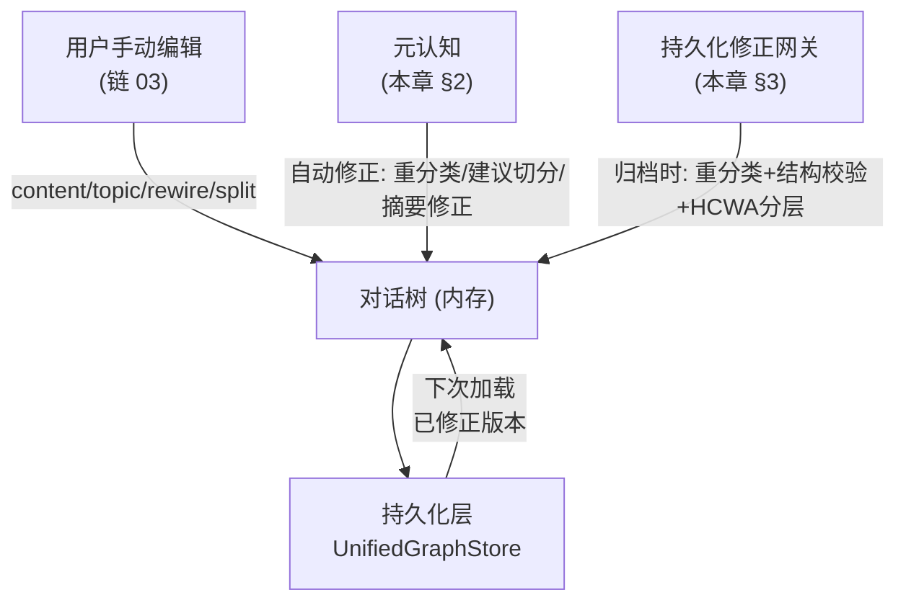
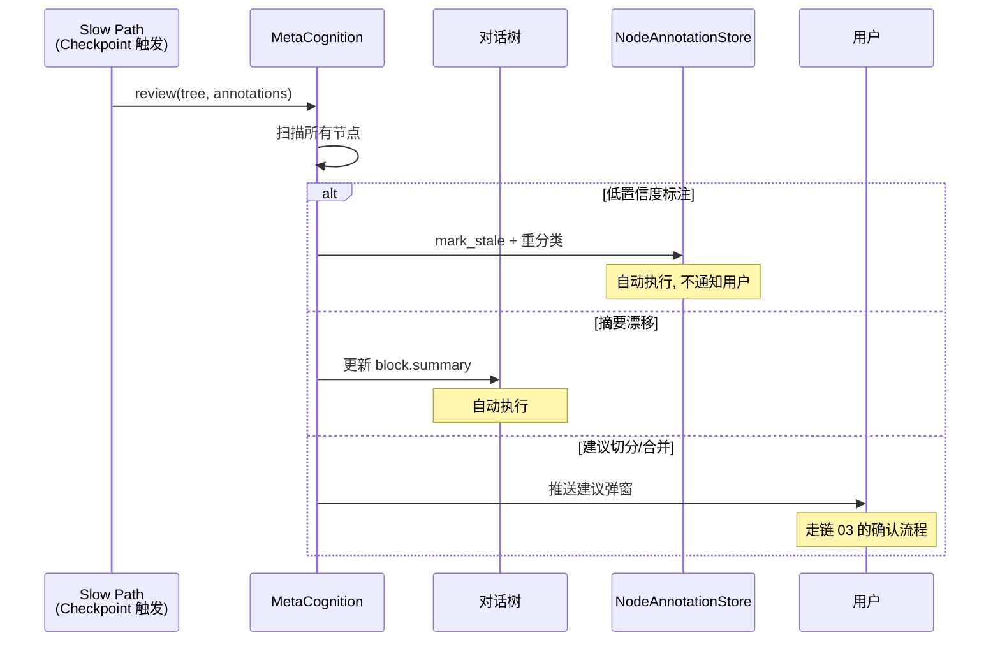
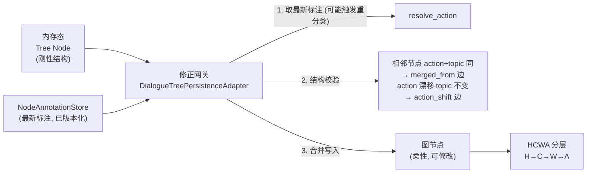
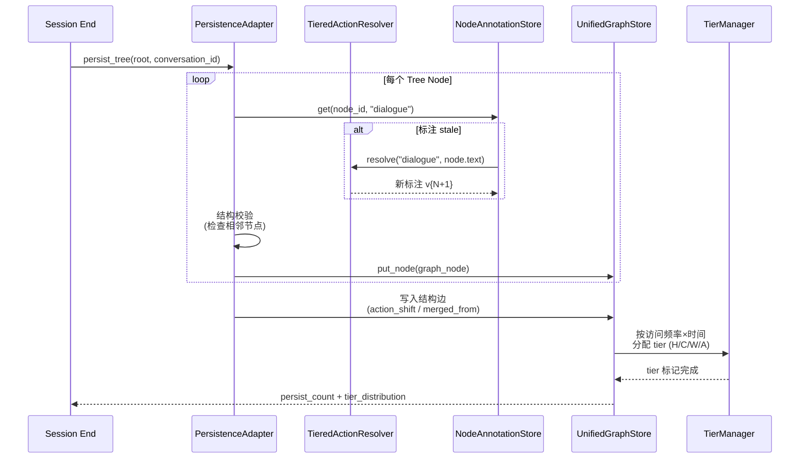

# DialogMesh v6 — 网状业务链设计 · 第四章：内部修改器——元认知 + 持久化网关

> 版本: v1.0 | 日期: 2026-07-18
>
> 核心命题: 对话树有两个"内部修改器"——元认知 (运行时修正) 和 持久化网关 (归档时修正)。
> 不同于用户手动编辑 (链 03), 这些是系统自主触发的修正行为, 构成认知自愈闭环。

---

## 1. 对话树的三个修改源



---

## 2. 元认知：内部自动修改器

### 2.1 定位

```
元认知不是用户触发的——是系统自我审视触发的。

当前状态: 元认知模块不存在。这是设计缺口。

链 02 中提到的:
  - "用户拒绝监控建议 → 元认知分析为什么"
  - "重复检测加权 → 元认知: interest_focus"
  这些都指向同一个缺失模块: MetaCognition
```

### 2.2 元认知的修改权限

| 操作 | 权限 | 说明 |
|------|:----:|------|
| 重分类 action/topic | ✅ 自动 | 基于 Slow Path 分析, 标记旧标注 stale |
| 建议切分节点 | ⚠️ 建议 | 不自动执行, 推送给用户确认 (走链 03) |
| 建议合并节点 | ⚠️ 建议 | 同上 |
| 修正 L1/L2 摘要 | ✅ 自动 | 检测到原摘要与 EDU 内容不一致时 |
| 标记节点为"需人工审查" | ✅ 自动 | 置信度过低时 |
| 删除节点 | ❌ 禁止 | 用户确认才可 |

### 2.3 触发条件

```python
class MetaCognition:
    """系统自我审视——检测对话树的异常并自动修正或建议。"""
    
    def review(self, tree: DiscourseBlockTree, annotations: NodeAnnotationStore):
        for block in tree.iter_blocks():
            # 条件 1: 标注置信度低 + 时间衰减
            ann = annotations.get(block.id, "dialogue")
            if ann and ann.confidence < 0.4:
                yield CorrectionSuggestion(
                    type="reclassify",
                    node=block.id,
                    reason=f"confidence={ann.confidence} < 0.4",
                    new_action=self._deep_classify(block),
                )
            
            # 条件 2: L1 摘要与 EDU 不一致
            if self._semantic_drift(block.summary, block.edus) > 0.3:
                yield CorrectionSuggestion(
                    type="fix_summary",
                    node=block.id,
                    reason="L1 summary drifted from EDU content",
                    new_summary=self._regenerate_l1(block),
                )
            
            # 条件 3: 兄弟节点极度相似 → 建议合并
            for sibling in tree.get_siblings(block):
                if self._similarity(block, sibling) > 0.9:
                    yield CorrectionSuggestion(
                        type="suggest_merge",
                        node=block.id,
                        with_node=sibling.id,
                        reason="near-duplicate siblings",
                    )
```

### 2.4 元认知修正流



### 2.5 与链 02 的联动

```
链 02 中提到:
  1. 用户拒绝监控建议 → MetaCognition 分析拒绝原因
  2. 重复检测加权 → MetaCognition 更新 interest_focus

统一在 MetaCognition:
  拒绝分析: "用户拒绝了自动建议X, 原因可能是..."
     → 更新用户画像 (prefers_manual_control)
     → 调整建议触发阈值
  
  重复模式: "用户反复讨论主题Y"
     → 标记为 priority_topic
     → 限制该主题的自动清理/归档
```

---

## 3. 持久化修正网关：树→图

### 3.1 已有实现

```
DESIGN_DIALOGUE_TREE_PERSISTENCE_ADAPTER ✅ 设计完整
core/agent/v4/persistence/dialogue_tree_adapter.py ✅ 代码已有

功能:
  persist_node(): 树节点→图节点, 合并最新标注
  persist_tree(): 整棵树持久化
  load_node(): 图→树, 分离为 TreeSegment + Annotation
  load_tree(): 整棵树加载, 含重建
  结构校验: action_shift / merged_from 元数据边
```

### 3.2 修正网关做了什么



**关键**: "修正网关" 不改变树结构 (不修改 parent/child), 只追加元数据边 + 更新标注。

### 3.3 持久化的完整业务流



### 3.4 加载时的逆过程

```
下次 Session 启动:
  load_tree(conversation_id)
    → UnifiedGraphStore.query(type="dialogue_tree_node")
    → 取每个图节点 → 拆分为 Tree Node + Annotation
    → 重建树结构 (parent/child 关系)
    → 此时拿到的已是修正版本 (标注是最新的)
```

---

## 4. 三个修改源的对比

| 维度 | 用户编辑 (链 03) | 元认知 (链 04) | 持久化网关 (链 04) |
|------|----------------|---------------|-------------------|
| 触发者 | 用户手动 | 系统 Slow Path | Session End / Checkpoint |
| 权限 | 全部 (需确认) | 自动修正+建议 | 仅标注+元数据边 |
| 能否改树结构 | ✅ | ⚠️ 仅建议 | ❌ 不改变拓扑 |
| 能否改内容 | ✅ | ❌ | ❌ |
| 能否改标注 | ✅ 间接 | ✅ 自动 | ✅ 自动 |
| 记录方式 | NodeEditRecord (diff) | CorrectionSuggestion | Graph metadata |
| 持久化时机 | 立即 | 下次 Checkpoint | 立即 |

---

## 5. 路径归属

| 操作 | Async | Slow | Session End |
|------|:-----:|:----:|:-----------:|
| MetaCognition.scan | | ✅ | |
| 自动重分类 (stale→新标注) | | ✅ | |
| 摘要自动修正 | | ✅ | |
| 建议推送给用户 | | ✅ | |
| persist_node (单节点) | ✅ | | |
| persist_tree (整棵) | | | ✅ |
| 修正网关 (resolve_action) | | | ✅ |
| 结构校验 (action_shift/merged_from) | | | ✅ |
| HCWA 分层 | | | ✅ |
| load_tree (重建) | 启动时 | | |

---

## 6. 设计缺口：元认知模块

```
当前: 不存在 MetaCognition 类。
设计: 链 02/03/04 多处引用, 但无实现。

待实现:
  core/agent/v4/cognitive/metacognition.py
    class MetaCognition:
      review()           → 扫描树, 返回 CorrectionSuggestion[]
      analyze_rejection() → 分析用户拒绝行为
      detect_patterns()  → 发现重复/异常模式
      self_correct()     → 自动修正 (仅低风险操作)
```

---

## 7. 设计文档对照

| 设计文档 | 关键概念 | 本文位置 |
|----------|---------|---------|
| DESIGN_DIALOGUE_TREE_PERSISTENCE_ADAPTER | 修正网关, NodeAnnotationStore, 树→图 | §3 |
| DESIGN_TIERED_ACTION_RESOLVER | 重分类引擎, mark_stale 联动 | §3.2-3.3 |
| DESIGN_COGNITIVE_DYNAMICS_V6 | State→Transition 记录 | §2.2 |
| DESIGN_STATE_EVOLUTION_SYSTEM | Mind 驱动, 长期学习 | §2.5 |
| (新) MetaCognition | 不存在, 需设计 | §6 |

---

## 8. 对话树四链全景

```
链 01: 用户输入 → 树创建           (外部→内部)
链 02: LLM回复 → 标注+修正          (内部输出)
链 03: 用户编辑 → 树修改            (外部修改器)
链 04: 元认知+持久化 → 自动修正      (内部修改器 + 归档)

四链合并 → 对话树完整生命周期
```
