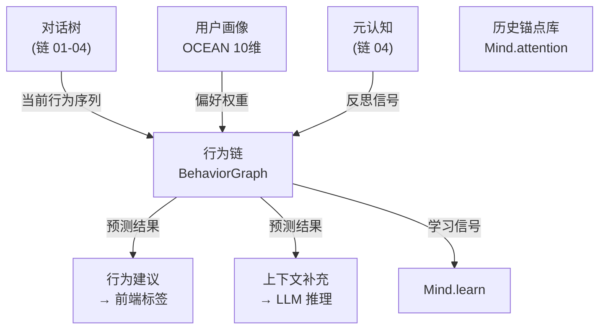
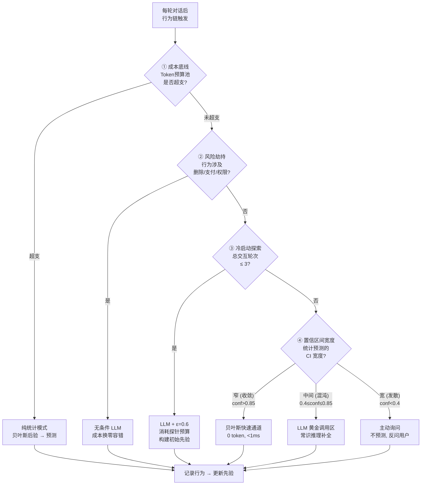
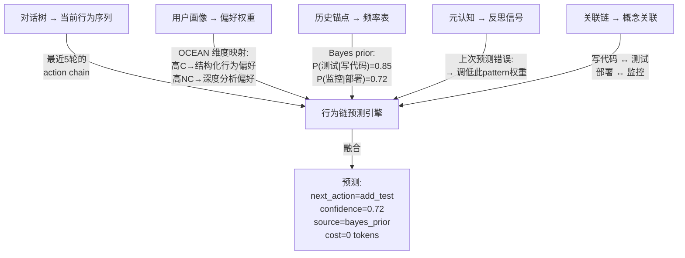

# DialogMesh v6 — 网状业务链设计 · 第五章：行为链预测闭环

> 版本: v1.0 | 日期: 2026-07-19
>
> 核心命题: 行为链不是被动记录器——它是预测引擎。核心困境：贝叶斯冷启动太蠢，LLM 太贵。
> 解决方案：四层优先级决策树 + 动态 ε-greedy + 信息增益奖励。

---

## 1. 行为链的定位

```
DESIGN_V3_1_BEHAVIOR_SUMMARY §3:
  "对话树节点内建行为链——不是嵌入在树边属性中，而是作为节点的元信息"

行为链回答的问题:
  ① 用户下一步可能做什么？
  ② 这个行为是否异常（链断裂）？
  ③ 系统应该主动建议什么？
  ④ 预测对了还是错了 → 如何更新权重？
```



---

## 2. 核心困境：什么时候用 LLM？

```
┌──────────────────────────────────────────────────────────┐
│  成本悖论                                                │
│                                                          │
│  贝叶斯/频率:  0 token, <1ms, 但冷启动时毫无先验          │
│  LLM 推理:     ~800 tokens, ~3s, 但只有模糊地带才值得     │
│  强化学习:     需要阈值边界, 否则永远在震荡                │
│                                                          │
│  关键洞察:                                                │
│  收敛域 (conf>0.85) → 禁用 LLM (统计模型已足够)           │
│  混沌区 (conf 0.4-0.7) → 唯一启用 LLM 的区间             │
│  发散域 (conf<0.3)   → 禁用 LLM (信息太少, 改为主动询问)  │
└──────────────────────────────────────────────────────────┘
```

---

## 3. 四层优先级决策树



### 3.1 各层的详细判据

| 层 | 条件 | 动作 | 成本 |
|:---:|------|------|:---:|
| ① 成本底线 | token_budget_remaining ≤ 0 | 降级为纯统计 | 0 |
| ② 风险劫持 | action ∈ {delete, pay, grant_permission} | 无条件 LLM | ~800 tokens |
| ③ 冷启动 | total_turns ≤ 3 | LLM + ε=0.6 探索 | ~800 × 3 tokens |
| ④ CI 收敛 | confidence_interval_width < 0.15 | 贝叶斯通道 | 0 |
| ④ CI 混沌 | 0.15 ≤ width ≤ 0.4 | LLM 黄金区 | ~800 tokens |
| ④ CI 发散 | width > 0.4 或 info_gap > 0.7 | 主动询问 | 0 (等用户回复) |

---

## 4. 动态 ε-greedy 机制

```
ε = 探索率——冷启动高, 积累足够数据后衰减

冷启动 (turns ≤ 5):    ε = 0.6    → 60% 概率强行调用 LLM
温启动 (turns 6-20):   ε = 0.6 × exp(-0.1 × (turns - 5))
                        → 5→0.6, 10→0.37, 20→0.13
稳定期 (turns > 20):   ε = 0.05   → 5% 轻微探索, 防止退化

历史锚点 > 50 条时:    ε = 0.02   → 几乎纯统计

效果:
  - 冷启动阶段: 每 3 轮调 2 次 LLM → 快速构建先验
  - 稳定期: 每 20 轮调 1 次 LLM → 仅混沌区触发
```

---

## 5. 多源协同：行为链需要什么信息



### 5.1 各源权重

| 数据源 | 冷启动权重 | 稳定期权重 | 说明 |
|--------|:---:|:---:|------|
| 历史锚点 (贝叶斯) | 0.10 | 0.45 | 冷启动时数据少, 稳定期主导 |
| 对话树 (行为序列) | 0.30 | 0.25 | 实时行为永远重要 |
| 用户画像 (OCEAN) | 0.25 | 0.15 | 冷启动时画像价值高 |
| LLM 推理 | 0.30 | 0.05 | 冷启动依赖 LLM, 后期衰减 |
| 关联链 | 0.05 | 0.10 | 长期积累的关联更可靠 |

---

## 6. 强化学习信号

### 6.1 奖励函数

```
不只看"预测对错"——还看"信息增益":

R = α × accuracy + β × info_gain

accuracy:
  +1.0  → 预测正确 (用户确实做了这个行为)
  -0.5  → 预测错误 (用户做了完全不同的事)
  +0.2  → 部分正确 (方向对, 细节不对)

info_gain:
  +0.3  → LLM 推理挖出了新的历史锚点 (新主语/新宾语/新行为模式)
   0.0  → 没有新信息
  -0.1  → LLM 产生了幻觉 (锚点验证失败)

权重:
  α = 0.7 (预测准确性始终重要)
  β = 0.3 (信息增益加速冷启动过渡)
```

### 6.2 Q-table 更新

```
Q(state, action) ← Q(state, action) + α × (R + γ × max_a' Q(state', a') - Q(state, action))

state 编码:
  {current_action, recent_3_actions_hash, session_phase, profile_cluster}

  session_phase: cold_start | warm | stable
  profile_cluster: analytical | exploratory | executive (从 OCEAN 推断)

action 空间:
  {add_test, add_monitor, refactor, deploy, document, ask_clarify, ...}
```

---

## 7. 完整数据流

```mermaid
sequenceDiagram
    participant USER as 用户输入
    participant DT as 对话树
    participant BHV as 行为链预测
    participant LLM as LLM
    participant STATS as 贝叶斯引擎
    participant UI as 前端标签
    
    USER->>DT: "我写完了这个模块"
    DT->>BHV: 行为序列: [write_code, test_local]
    
    BHV->>BHV: 决策树:
      ① 预算: ✅
      ② 风险: ❌ (不是 delete/pay)
      ③ 冷启动: ❌ (turns=42)
      ④ CI宽度: 0.22 (混沌区!)
      
    BHV->>LLM: 启用 LLM 黄金区
    Note over LLM: "用户刚写完模块，历史显示80%会提测试，<br/>且工程链显示该模块缺少测试覆盖，<br/>用户画像高C(结构化)→ 预测: add_test"
    
    LLM-->>BHV: predict: add_test, conf=0.78
    
    BHV->>UI: 前端标签: "建议加入单元测试 ✓/✗"
    
    USER->>UI: ✓ (接受了)
    UI->>BHV: 反馈: 预测正确
    
    BHV->>STATS: 更新贝叶斯: P(test|write_code)+=1
    BHV->>BHV: Q(s,a) += α × (1.0 + 0 - Q_old)
```

---

## 8. 奖励 vs 信息增益：什么时候加分、什么时候重启

```
不是简单的"对了加分, 错了减分"。要区分两种信号:

┌──────────────────────────────────────────────────────────┐
│  奖励信号 (reward):                                       │
│    ✅ 预测了 add_test, 用户确实加了 → +1.0               │
│    ❌ 预测了 add_test, 用户没做任何事 → -0.5             │
│    ⚠️  预测了 add_doc, 用户没加文档但加了注释 → +0.2     │
│         (方向对: 补充信息 → 只是形式不对)                  │
├──────────────────────────────────────────────────────────┤
│  信息增益 (info_gain):                                    │
│    📈 LLM 推理中挖出了新的行为模式                       │
│       "用户写代码→查日志→改配置→再测试"                   │
│       (这是 4 步链, 之前贝叶斯只记录了 2 步)              │
│       → +0.3                                             │
│    📉 LLM 产生了幻觉                                     │
│       预测: deploy_to_production                          │
│       锚点验证: 用户从未部署过, 且工程链无 deploy 配置    │
│       → -0.1, 并标记此 LLM 输出为不可信                   │
│    ➡️  无新信息                                          │
│       LLM 和贝叶斯给出相同预测                            │
│       → 0.0 (这次 LLM 调用是浪费, 记录为负成本事件)       │
└──────────────────────────────────────────────────────────┘
```

---

## 9. 路径归属

| 操作 | Fast | Async | Slow |
|------|:----:|:-----:|:----:|
| 贝叶斯后验计算 | ✅ (<1ms) | | |
| 决策树遍历 (L1-L4) | ✅ (<1ms) | | |
| 前端标签推送 | ✅ | | |
| LLM 行为预测 (混沌区/风险) | | ✅ (2-5s) | |
| Q-table 更新 | | ✅ | |
| 贝叶斯先验更新 | | ✅ | |
| ε 衰减计算 | | ✅ | |
| 历史锚点沉淀 | | | ✅ |
| 行为模式发现 (Deep) | | | | ✅ |

---

## 10. 与设计文档对照

| 设计文档 | 关键概念 | 本文位置 |
|----------|---------|---------|
| DESIGN_V3_1_BEHAVIOR_SUMMARY §3 | 对话树节点内建行为链 | §1 |
| DESIGN_COGNITIVE_DYNAMICS_V6 | State→Transition 预测 | §6 |
| DESIGN_STATE_EVOLUTION_SYSTEM | Mind 驱动的先验学习 | §5 |
| DESIGN_CROSS_DOMAIN_CONTEXT | 行为链作为上下文数据源 | §5 |
| (新) 递归收敛快匹配 | 熵值判定 → 混沌区识别 | §3 L4 |
