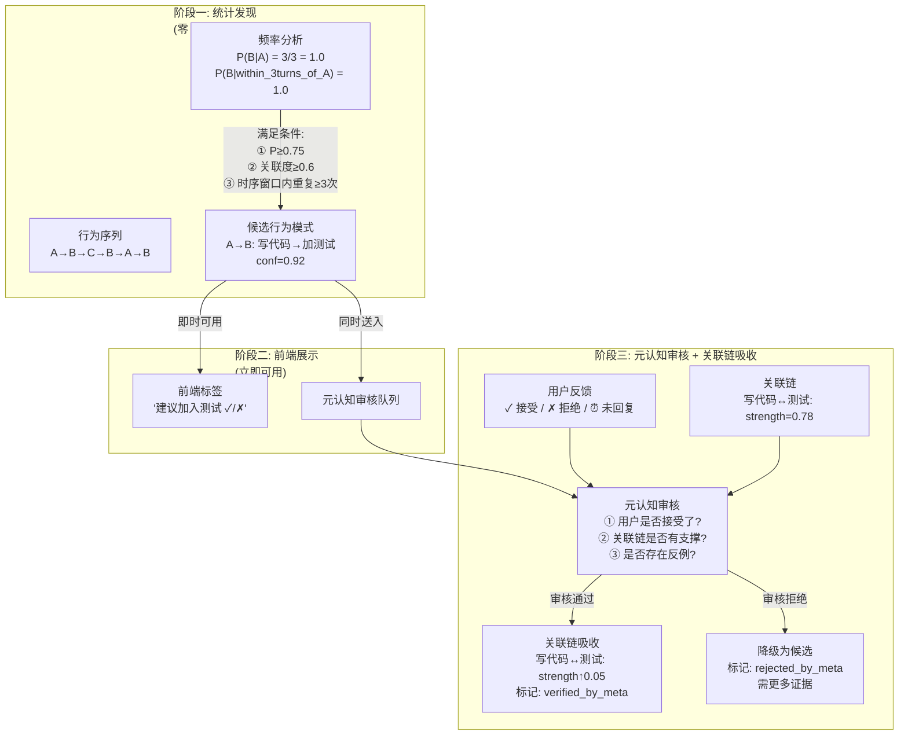
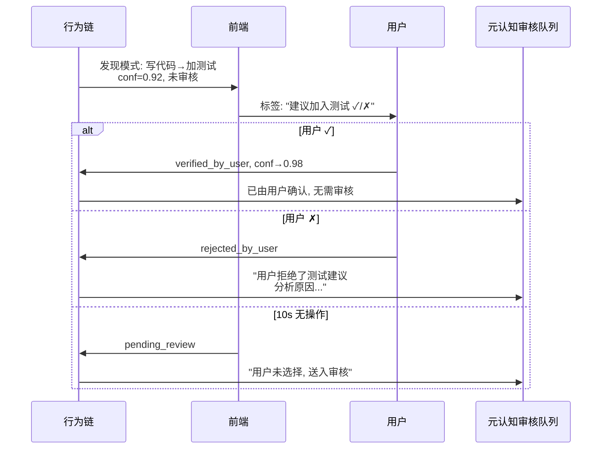
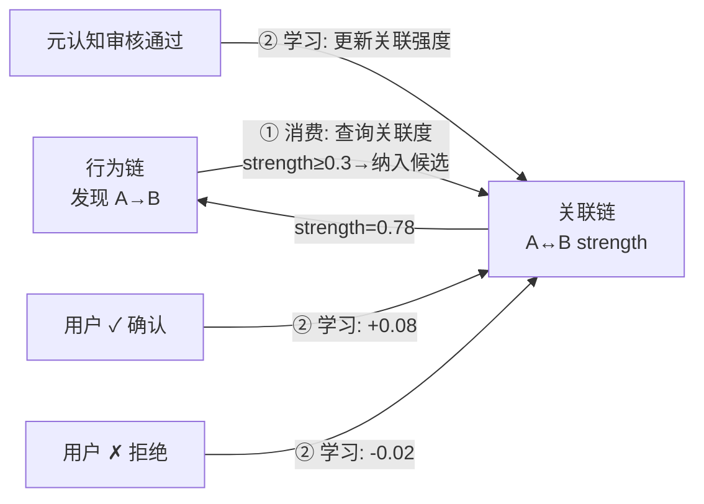

# DialogMesh v6 — 链 05 补充：行为发现·审核·吸收 三阶段闭环

> 版本: v1.0 | 日期: 2026-07-19
>
> 链 05 缺失：行为链不只是预测——更是发现、验证、吸收的完整管线。
> 核心：统计发现 → 前端展示(可消费) → 元认知审核 → 关联链吸收。

---

## 1. 链 05 当前的缺陷

```
链 05 (已写):  重点在 LLM 预测调度 (决策树 + ε-greedy)
             ❌ 缺失: 行为如何被"发现"、如何送审元认知、如何吸收到关联链

设计文档 (DESIGN_V3_1_BEHAVIOR_SUMMARY §3):
  "对话树节点内建 behavior_chain + association_chain"
  "行为链存储行为序列的结构，边的权重存储在 BehaviorGraph"
  ✅ 数据结构已定义——但业务流未完整
```

---

## 2. 行为发现的三个阶段



---

## 3. 阶段一：统计发现——不消耗 LLM

### 3.1 发现条件

```python
def discover_behavior_patterns(behavior_chain, window_size=5):
    """纯统计——零 LLM 成本, <1ms"""
    
    patterns = []
    for action_a in behavior_chain.unique_actions():
        for action_b in behavior_chain.unique_actions():
            if action_a == action_b: continue
            
            # 条件 ①: 时序窗口内共现频率
            cooccurrences = count_cooccurrences(behavior_chain, action_a, action_b, 
                                                within_turns=window_size)
            p_b_given_a = cooccurrences / count(action_a)
            
            # 条件 ②: 关联度 (关联链已有支撑)
            assoc_strength = association_chain.get_strength(action_a, action_b)
            
            # 条件 ③: 重复次数 (不是偶然)
            repeat_count = cooccurrences
            
            if (p_b_given_a >= 0.75 and 
                assoc_strength >= 0.3 and  # 关联链有弱支撑即可
                repeat_count >= 3):        # 至少出现 3 次
                
                patterns.append(BehaviorPattern(
                    trigger=action_a,
                    predicted=action_b,
                    confidence=p_b_given_a,
                    support=repeat_count,
                    association=assoc_strength,
                    source="statistical_discovery",
                    reviewed=False,        # 尚未元认知审核
                ))
    
    return patterns
```

### 3.2 时序性 + 关联性 + 重复性

```
三个必要条件, 缺一不可:

时序性:
  A 发生后, 在 ≤5 轮内出现 B
  → 隔了20轮的B不算(A→B已经被别的事打断了)

关联性:
  A 和 B 本身有语义/概念关联
  → "写代码"和"加测试"有强关联 (关联链: 0.78)
  → "写代码"和"泡咖啡"无关联 (关联链: 0.05) → 即使同现也不记录

重复性:
  同样的 A→B 出现 ≥3 次
  → 1次是偶然, 2次是巧合, 3次是模式
```

---

## 4. 阶段二：前端展示——审核前即可消费

### 4.1 设计原则

```
行为模式一经统计发现, 立即可被前端使用。
不需要等元认知审核——用户自己就是最好的验证者。

三个状态:
  ✓ 用户接受  → 直接标记为 verified_by_user
  ✗ 用户拒绝  → 标记为 rejected_by_user, 仍送元认知分析拒绝原因
  ⏰ 未回复    → 10s 后标记为 pending_review, 送元认知
```

### 4.2 前端标签交互



---

## 5. 阶段三：元认知审核 + 关联链吸收

### 5.1 元认知审核做什么

```
MetaCognition.review_behavior_pattern(pattern):

  检查项:
    ① 关联链一致性:
       关联链中 A↔B 的强度 ≥ 0.5?
       → 是: 审核通过
       → 否: 标记 "关联链不支持, 需更多证据"

    ② 用户反馈一致性:
       用户已接受 → 直接通过
       用户已拒绝 → 分析拒绝原因 (不是否认模式, 是这次不需要?)
       用户未回复 → 继续审核

    ③ 反例检查:
       是否存在 A 发生后 B 没有发生的情况?
       → 比例 > 30% → 降低置信度

    ④ 关联链双向学习:
       审核通过 → 关联链: A↔B strength += 0.05
       审核拒绝 → 关联链: A↔B strength -= 0.02 (不删除, 只是降低)
```

### 5.2 关联链的双重角色



**关联链既是被查询的知识源，也是被更新的学习目标。** 这就是"双向"——两个方向的数据流都成立。

---

## 6. 完整三阶段决策矩阵

| 阶段 | 触发条件 | LLM 成本 | 前端可用 | 元认知介入 |
|------|---------|:---:|:---:|:---:|
| 统计发现 | P(B|A)≥0.75, 重复≥3次, 关联≥0.3 | 0 | ✅ 立即可用 | ⏳ 排队 |
| 用户确认 | 用户 ✓ | 0 | ✅ 已确认 | ✅ 直接通过 |
| 用户拒绝 | 用户 ✗ | 0 | ✅ 已拒绝 | ✅ 分析原因 |
| 未回复 | 10s 超时 | 0 | ⚠️ 默认通过 | ✅ 审核 |
| 元认知审核 | 进入审核队列 | ~800 tokens | N/A | ✅ 正在审核 |
| 关联链吸收 | 审核通过 | 0 | N/A | ✅ 权重更新 |

---

## 7. 与链 05 预测引擎的关系

```
链 05 (已写): 预测——"用户下一步会做什么?"
  使用场景: 主动建议, 抢在用户行为之前

本补充: 发现——"用户已经展示的重复模式是什么?"
  使用场景: 被动发现, 总结用户已有行为规律

两者互补:
  预测 → 如果对了 → 加速统计发现 (跳过 3次重复要求)
  发现 → 被元认知审核通过 → 注入历史锚点 → 提高预测准确率
```

---

## 8. 路径归属 (更新)

| 操作 | Fast | Async | Slow |
|------|:----:|:-----:|:----:|
| 统计发现 (频率分析) | ✅ (<1ms) | | |
| 前端标签推送 | ✅ | | |
| 用户反馈处理 (✓/✗/超时) | ✅ | | |
| 元认知审核 (LLM) | | ✅ | |
| 关联链强度更新 | | ✅ | |
| 历史锚点沉淀 | | | ✅ |
