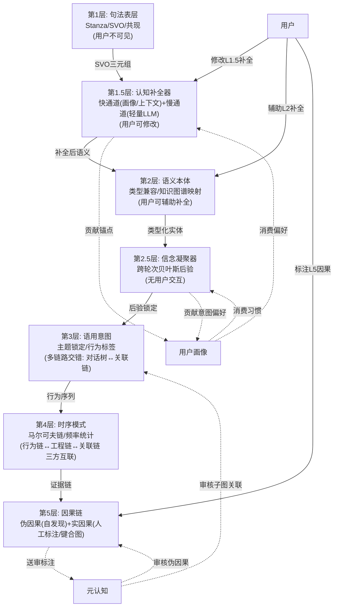
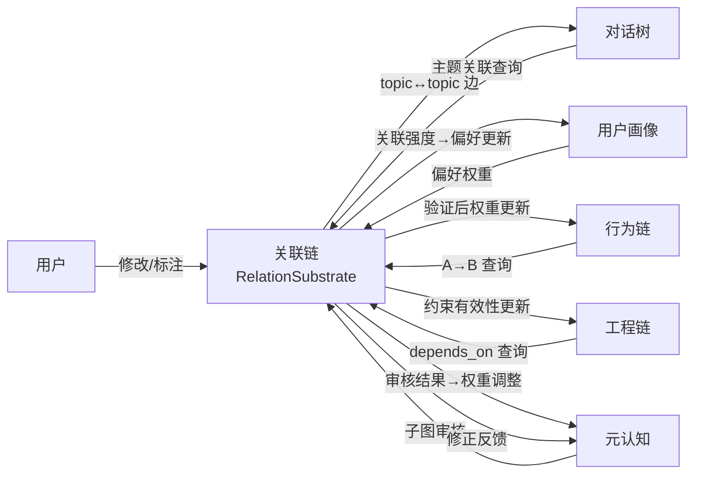

# DialogMesh v6 — 网状业务链设计 · 第六章：关联链——五层漏斗 + 双向消费

> 版本: v1.0 | 日期: 2026-07-19
>
> 核心: 关联链是所有关系的统一基座——不是被动图数据库，是双向引擎。
> 五层漏斗: 句法→补全→语义→信念凝聚→意图→时序→因果。
> 每个夹层都有快慢双通道，用户全程可见可改。

---

## 1. 五层漏斗全景



---

## 2. 各层详解

### 2.1 第1层：句法表层 (Syntactic Surface)

```
输入: 用户原始文本
处理: Stanza 依存句法 + jieba 分词 → SVO 三元组
输出: {subj, verb, obj, advmod, ...} — 纯语法结构
关联类型: 共现 (co-occurrence)
用户可见: ❌ (内容过多, 噪音大, 不需要)

示例:
  "这个模块的延迟飙升"
  → {subj:"延迟", verb:"飙升", advmod:"这个模块"}
  → 关联: 延迟↔飙升 (共现, conf=1.0)
```

### 2.2 第1.5层：认知补全器 (Cognitive Completion)

**对应设计**: DESIGN_V3_1_BEHAVIOR_SUMMARY §2.5 — 约束补全编译器 (HybridCompiler)

```
职责: 把人类高压缩的隐性省略语言 → 机器可读的显式平铺属性

快慢双通道:
  快通道 (<5ms):
    ① 画像命中: 用户历史偏好 → "饮料"→"碳酸饮料" (OCEAN 偏好)
    ② 上文继承: 最近3轮对话 → 代词消解 → 主语补全
    ③ 历史锚点: Mind.attention → "监控"→"Observer pattern"
  
  慢通道 (~50ms):
    ④ 轻量常识模型: BERT-mini / ConceptNet → "呛"→"碳酸刺激"
    ⑤ 关联链查询: A↔B 强度 > 0.7 → 直接注入关联路径

兜底: 快慢均失败 → 保留原始特征, 不强行补全

输出格式: 隐性约束矩阵
  {
    explicit: "饮料→碳酸饮料" (conf=0.89, source=profile),
    implicit_subject: "呛→喉咙/食道",
    default_chain: "[碳酸]→[CO2]→[物理刺激]"
  }

用户可修改: ✅
  用户改 "碳酸饮料"→"酵素饮料" →
    → 元认知: "用户为何改?偏好变了?"
    → 用户画像: 更新 beverage_preference
    → 行为链: 记录 "用户修正补全器"
    → 下次快通道: 优先用用户修正值
```

### 2.3 第2层：语义本体 (Semantic Ontology)

**对应设计**: DESIGN_RELATION_SUBSTRATE — relation_kind + semantic_strength

```
输入: 第1.5层的约束矩阵
处理:
  ① 类型兼容: "碳酸饮料" ∈ 液体, "呛" ∈ 呼吸道刺激
  ② 知识图谱映射: 液体+呼吸道刺激 → 物理属性归因
  ③ 关联链注入: 已有边 A↔B → 直接附加

输出: 类型化实体 + 关系标签
  {entity: "碳酸饮料", type: 液体/食品,
   event: "呛", domain: 感官描述,
   relation: physical_causation, strength: 0.85}

用户可辅助补全: ✅
  前端显示: "系统推断: 碳酸饮料导致呛 → 物理属性归因"
  用户修改: 改 "物理属性归因"→"过敏反应" →
    → 元认知: 审核修正合理性
    → 关联链: 更新边权重
    → 画像: 更新 domain_knowledge
```

### 2.4 第2.5层：信念凝聚器 (Belief Accumulator)

```
职责: 把单轮弱信号 → 多轮累积为强意图

核心机制: 贝叶斯序贯更新
  每轮对话 → 第2层输出语义特征 → 作为一次"投票" → 更新信念池

示例:
  T1: "模块延迟飙升" → vote: {诊断:0.3, 吐槽:0.4}
  T2: "之前没加监控是吗" → vote: {诊断:0.85, 吐槽:0.1}
  → 贝叶斯更新: P(诊断|T1+T2) = 0.3 + (1-0.3)×0.85 = 0.895
  → 超过阈值 0.85 → 输出锁定指令: intent=故障诊断

自洽性校验:
  LLM 生成回复草稿: "需要查看历史监控曲线吗?"
  → 回传信念池 → "查看监控曲线"又增强了诊断意图
  → 最终: P(诊断)=0.97

强制结晶: 
  5轮内未达 0.85 → 输出最大熵默认域 → 主动提问
```

### 2.5 第3层：语用意图 (Pragmatic Intent)

```
输入: 第2.5层的锁定指令
输出: 意图标签 + 行为类型

与对话树强相关:
  意图标签 → 对话树 topic/action 标注
  对话树的历史 topic → 反向验证意图一致性

与画像双向:
  画像偏好 → 影响意图判定权重 (高NC→偏好诊断型意图)
  意图确认 → 更新画像 (常诊断→profile.cognitive_style++)
```

### 2.6 第4层：时序模式 (Temporal Pattern)

**这是关联链、行为链、工程链的三方交汇点。**

```
关联链 → 提供: A↔B 的边权重
关联链 ← 学习: 行为模式确认后更新权重

行为链 → 提供: A→B 的行为序列
行为链 ← 学习: 关联强度影响行为预测

工程链 → 提供: 约束条件 (A 的实现依赖 B)
工程链 ← 学习: 行为模式确认约束有效性

元认知 → 消费: 尚未抵达第4层的子图关联 (L2/L3 已有关联但未验证)
       → 产出: 子图审核报告 → 反馈给关联链
```

### 2.7 第5层：因果链 (Causal Chain)

```
分两种:

伪因果 (自发现):
  来源: 第4层漏斗筛选 → 满足充分性+必要性 → 自动晋升
  特征: conf ≥ 0.7, 来自多源证据
  用户可查看 + 可修改 + 可标注

实因果 (人工核查):
  来源: 键合图 + Petri网 + 系统动力学 离线分析
  特征: 人工标注, 确定性
  用户可标注 + 修改

晋升路径:
  伪因果 → 用户标注"确认" → 实因果
  伪因果 → 元认知发现矛盾 → 降级 → 第4层重新验证

用户修改L5标注:
  → 元认知: 分析修正逻辑
  → 行为链: 用户修正行为记录
  → 画像: 更新 causal_reasoning 偏好
```

---

## 3. 关联链的双向性总结



---

## 4. 用户交互权限

| 层 | 可查看 | 可修改 | 修改记录 | 元认知处理 | 画像学习 |
|:---:|:---:|:---:|:---:|:---:|:---:|
| L1 句法 | ❌ | ❌ | - | - | - |
| L1.5 补全 | ✅ | ✅ | ✅ | 分析修正原因 | 更新补全偏好 |
| L2 语义 | ✅ | ✅ (辅助) | ✅ | 审核一致性 | 更新 domain 偏好 |
| L2.5 信念 | ❌ | ❌ | - | - | 间接贡献 |
| L3 意图 | ✅ | ⚠️ 间接 | 间接 | 冲突时审核 | 更新意图偏好 |
| L4 时序 | ✅ | ⚠️ 间接 | 间接 | 模式异常时审核 | - |
| L5 伪因果 | ✅ | ✅ | ✅ | 审核晋升/降级 | - |
| L5 实因果 | ✅ | ✅ (标注) | ✅ | 审核标注修正 | - |

---

## 5. 路径归属

| 操作 | Fast | Async | Slow | Deep |
|------|:----:|:-----:|:----:|:----:|
| L1 句法解析 (Stanza) | ✅ | | | |
| L1.5 快通道 (画像/上下文) | ✅ | | | |
| L1.5 慢通道 (轻量LLM) | | ✅ | | |
| L2 语义本体映射 | ✅ | | | |
| L2.5 贝叶斯后验 | ✅ (<1ms) | | | |
| L3 意图锁定 | ✅ | | | |
| L4 时序模式检测 | | ✅ | | |
| L5 伪因果晋升 | | | ✅ | |
| L5 实因果 (键合图) | | | | ✅ |
| 元认知子图审核 | | | ✅ | |
| 用户修改→画像学习 | | ✅ | | |
