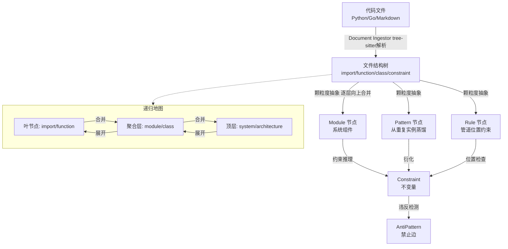
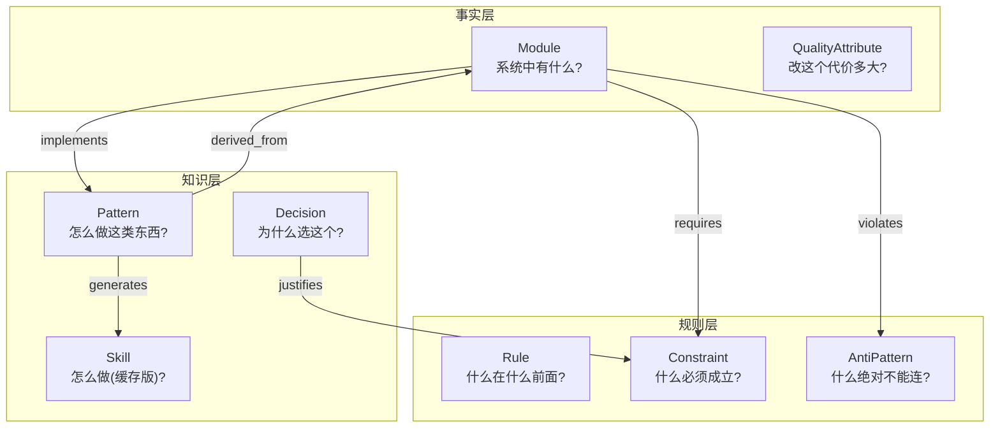
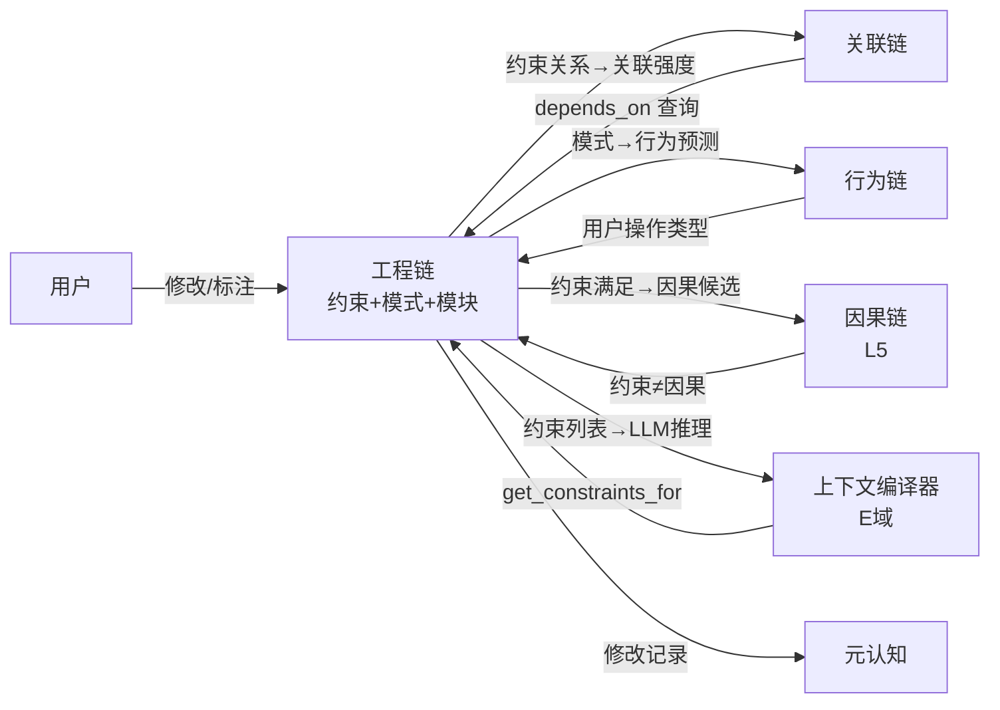

# DialogMesh v6 — 网状业务链设计 · 第七章：工程链——约束推理 + 递归地图

> 版本: v1.0 | 日期: 2026-07-19
>
> 工程链不是代码索引——是约束推理系统。默认绑定代码文件,可扩展。
> 核心: 文件→树结构→逐层抽象→约束推理。支持地图式递归图,可退化为分层结构。

---

## 1. 工程链的定位

```
DESIGN_ENGINEERING_CHAIN §1:
  "工程链回答: 如果系统变化,什么必须跟着变? 
   不是代码索引,不是模块关系图,不是依赖树。
   是可演化的工程知识库。"

与其他链的关系:
  对话树: 描述事实 (发生了什么)
  行为链: 描述操作 (用户做了什么)
  因果链: 描述原因 (为什么这样)
  工程链: 描述不变量 (什么必须成立)
```

---

## 2. 递归地图模型——从文件到约束



### 2.1 颗粒度概念

```
递归地图 = 同一结构的多尺度表示:

叶节点 (颗粒度=0):
  import 语句, function 签名, class 定义
  → 对外: 暴露给关联链的 API 契约
  → 对内: 内部实现细节(可选隐藏)

聚合层 (颗粒度=1):
  模块/文件级别: OpenAiProvider 提供什么, 依赖什么
  → 对外: Public API + 约束
  → 对内: 私有实现(可折叠)

顶层 (颗粒度=2):
  系统/架构级别: Gateway 由哪些模块组成
  → 对外: 架构图
  → 对内: 完整拓扑(可展开)

特性:
  - 高耦合区域: 展开到细颗粒度
  - 低耦合/高聚合: 折叠到粗颗粒度
  → 自适应: 根据关联链的强度决定展开程度
```

### 2.2 文件→树的解析流程

```
Document Ingestor (DESIGN_DOCUMENT_INGESTION_LAYER):
  
  输入: 88 篇 Markdown / Python 源码
  处理:
    ① tree-sitter / heading hierarchy → 解析 DocumentTree
    ② 识别节点类型: Module / Import / Function / Constraint / Pattern
    ③ 绑定物理位置: file_path:line_number → 可追溯
    
  输出: DocumentTree → ObservationBundle → ObservationPool
        → 等待 Engineering Analyzer 消费
```

---

## 3. 七类节点 (DESIGN_ENGINEERING_CHAIN §2)



| 节点类型 | 判别属性 | 生命周期 | 来源 |
|---------|---------|:---:|------|
| Module | 事实性, 有 status, 可注册/卸载 | 无 | manual/auto |
| Constraint | 强制性, 有 evidence 列表 | candidate→verified | manual/derived/verified/core |
| Rule | 顺序性, 描述 pipeline 位置 | derived→verified | manual/derived |
| Pattern | 可复用性, 有 template 结构 | candidate→verified | derived/learned |
| AntiPattern | 禁止性, 有 correct_path | 无 | manual/core (禁止LLM创建) |
| Decision | 追溯性, 有 tradeoff+benefit | 无 | manual (不可自动生成) |
| QualityAttribute | 量化性, 有 impact_score | 无 | manual/derived |
| Skill | 执行性, 可缓存可丢弃 | draft→verified | derived |

---

## 4. 边类型 + 权限矩阵

```
正边:
  requires     A→B  A 必须满足 B
  depends_on   A→B  A 依赖 B
  implements   A→B  A 实现了 B
  improves     A→B  A 提升了 B
  derived_from A→B  A 衍生自 B
  generated_by A→B  自动生成边

负边:
  violates     A→B  A 违反了 B (禁止连接)

权限矩阵 (DESIGN_ENGINEERING_ONTOLOGY §5):
  Module → Constraint: requires ✓
  Module → Pattern: implements ✓
  Module → AntiPattern: violates ✓
  Pattern → Pattern: extends ✓
  Decision → Constraint: justifies ✓
  AntiPattern ← LLM: 禁止自动创建 ✗
```

---

## 5. 约束推理引擎

```
DESIGN_ENGINEERING_CHAIN §4:

核心查询 (供 CrossDomainExpander E 域使用):

  ① get_constraints_for(module_type):
     输入: "Provider"
     输出: [must have Metrics, must implement Health, must expose API]

  ② get_pattern_for(operation):
     输入: "add_plugin"
     输出: Plugin Pattern {template: Interface+Factory+Registry}

  ③ get_impact_of_change(module):
     输入: "RateLimiter"
     输出: {
       affected_modules: [Auth, Gateway],
       violated_constraints: [],
       suggested_patterns: [ThrottlePattern]
     }

  ④ check_violations(module, connection):
     输入: (Controller, Database)
     输出: violates AntiPattern: Controller→Database

触发时机:
  Fast Path: get_constraints_for (新建模块时)
  Async Path: get_impact_of_change (修改模块时)
  Slow Path: pattern distillation (发现重复实例→蒸馏为 Pattern)
```

---

## 6. 白盒化——用户可修改的接口

```
DESIGN_ENGINEERING_ONTOLOGY §6:

用户可修改:
  ① 边规则: 添加新允许边类型 (如 Pattern→Decision 的 influences 边)
  ② 生命周期: 添加新状态
  ③ 节点类型: 添加新类型 (如 Convention)
  ④ source 置信度: 调整初始值
  ⑤ 约束内容: 编辑 Constraint 的 evidence 列表
  ⑥ 模式模板: 修改 Pattern 的 template 结构
  ⑦ 关联: 手动建立 / 断开边

不可修改 (core):
  核心节点类型 (Module/Constraint/Pattern/AntiPattern)
  核心边规则 (violates/requires/implements)
  核心生命周期状态 (candidate→verified)

所有修改 → Event Log → Observation Pool → 学习管线
```

---

## 7. 工程链与其他链的双向交互



---

## 8. 文件绑定——代码→约束的映射

```
每篇导入的文档/代码 → 绑定到 DocumentTree 节点:

  core/agent/llm_providers/openai_provider.py:
    ├─ line 27: class OpenAIProvider(LLMProvider)  → Module: OpenAIProvider
    ├─ line 33: def __init__(...)                   → 构造函数
    ├─ line 53: def _get_client()                   → 私有方法
    └─ line 71: def generate(request)               → Public API
    
  约束推导:
    ① Module = OpenAIProvider
    ② implements Pattern: ProviderInterface (derived_from LLMProvider)
    ③ requires Constraint: Every Provider must expose Metrics
    ④ QualityAttribute: OpenAIProvider → LatencyCost +0.5

  递归地图展开:
    颗粒度=0: OpenAIProvider (单个文件)
    颗粒度=1: llm_providers/ (4个Provider文件)
    颗粒度=2: core/agent/ (完整模块树)
```

---

## 9. 路径归属

| 操作 | Fast | Async | Slow | Deep |
|------|:----:|:-----:|:----:|:----:|
| Document Ingestor 解析 | | ✅ | | |
| Module 注册 | ✅ | | | |
| get_constraints_for | ✅ | | | |
| get_impact_of_change | | ✅ | | |
| Pattern 蒸馏 | | | ✅ | |
| Constraint 验证 | | ✅ | | |
| AntiPattern 检测 | | ✅ | | |
| 用户修改→学习 | | ✅ | | |
| Skill 蒸馏 | | | | ✅ |
| 键合图/Petri网分析 | | | | ✅ |
