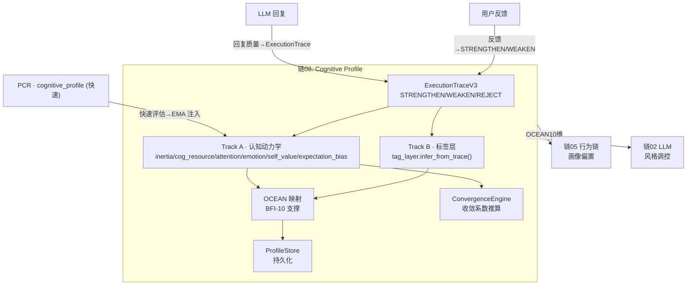
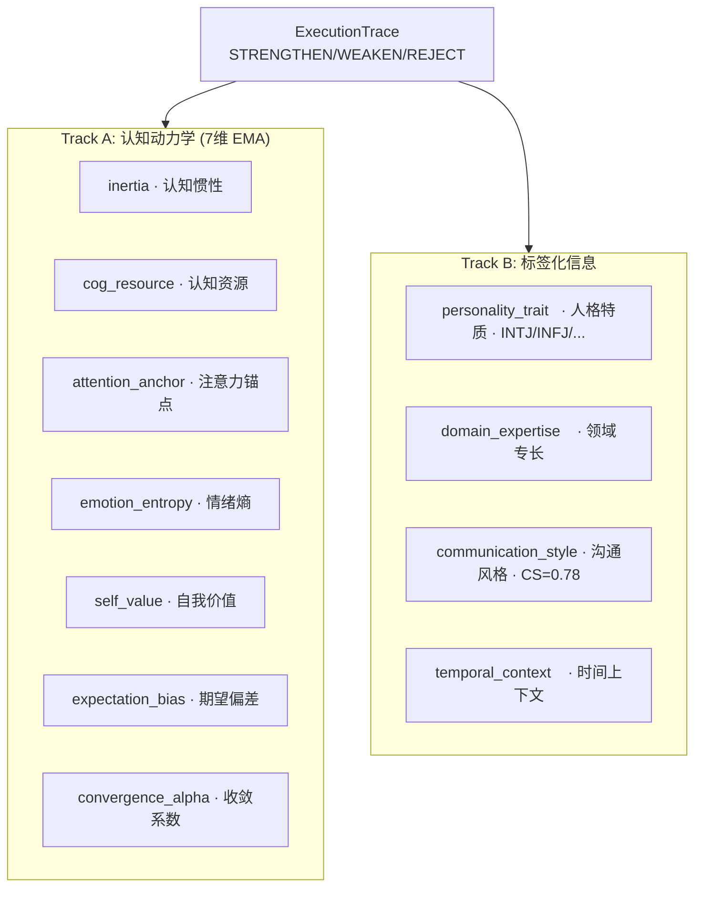
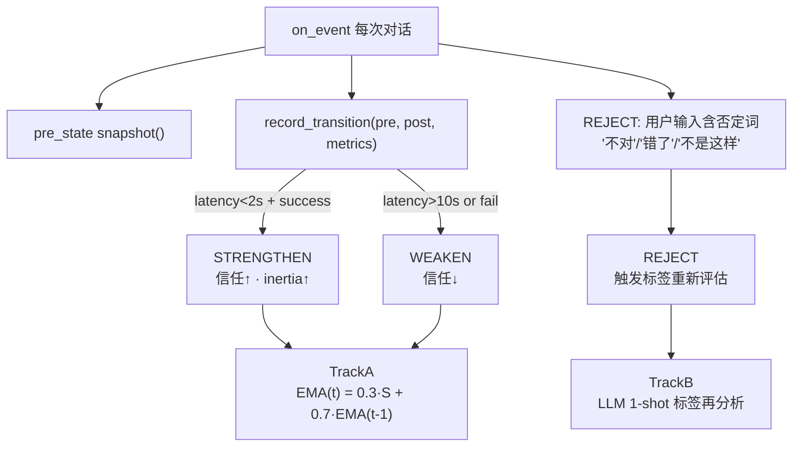

# DialogMesh v6 — 业务链设计 · 第八章：Profile (认知画像)

> 版本: v1.0 | 日期: 2026-07-21
> 接入: ExecutionTraceV3 ✅ · OCEAN Analyst ✅ · TrackB TagLayer ❌ · PCR 信号 ❌

---

## 一、Profile 在 10 链中的位置



---

## 二、双 Track 架构



**实现**: `v4/state/execution_trace.py` (131行) · `v4/cognitive/tag_layer.py` · `v4/cognitive/ocean_profile.py`

---

## 三、ExecutionTrace → Profile 信号流



---

## 四、接入 Engine 现状

```
✅ ExecutionTraceV3      — pre/post snapshot + record_transition
✅ PCR → TrackA EMA       — _call_llm 后调用 (本轮已接,信号在)
✅ OCEAN Analyst 初始化    — lazy init
✅ ProfileStore           — 持久化

⚠️ TrackB infer_from_trace — 代码完整未调用
⚠️ REJECT 检测             — 只检测了部分否定词
❌ OCEAN → Behavioral     — 画像→行为链偏置 未接
❌ ConvergenceEngine      — 收敛系数推算 未调用
```

---

## 五、接入计划

```python
# engine.on_event() — after LLM call
if self._cognitive_profile and pcr_output:
    self._update_profile_from_trace(pcr_output, llm_response)

def _update_profile_from_trace(self, pcr, response):
    # TrackA: PCR fast profile → EMA
    if pcr.cognitive_profile:
        alpha = 0.3
        self._cognitive_profile.track_a.cog_resource = (
            alpha * pcr.cognitive_profile.cognitive_level +
            0.7 * self._cognitive_profile.track_a.cog_resource
        )
    
    # TrackB: infer tags from ExecutionTrace
    if self._tag_layer:
        self._tag_layer.infer_from_trace(self._trace_v3, self._cognitive_profile)
    
    # OCEAN mapping
    if self._ocean_analyst:
        self._ocean_analyst.update(self._cognitive_profile)
    
    # Convergence
    if self._convergence_engine:
        self._convergence_engine.update(self._cognitive_profile.track_a)
```

**有效实现率: ~50% → 待接入约 20 行**
