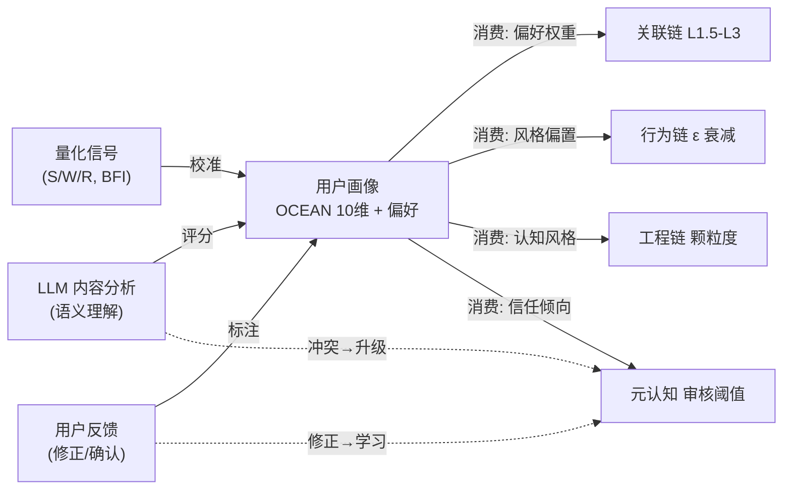
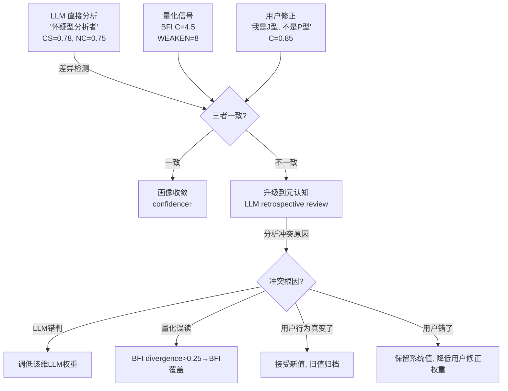

# DialogMesh v6 — 网状业务链设计 · 第八章：画像消费反哺

> 版本: v1.0 | 日期: 2026-07-19
>
> 参考理论: 认知-行为公理化体系 — 双惯性系统、惯性成本最小化、自我抽象化、元监控阈值
> 核心命题: 画像是信息压缩——但也是双向引擎。LLM+量化+用户反馈，三者对抗中收敛。

---

## 1. 画像的双向性



---

## 2. 理论映射

### 2.1 双惯性系统 → 画像稳定性

```
认知惯性 (Cognitive Inertia):
  OCEAN 维度的 EMA 聚合 (α=0.3) → 画像天然具有惯性
  → 单轮波动不会改写画像 (这是对的)
  → 但惯性过强 → 系统"看不到"真实的行为变化

身体惯性 (Bodily Inertia):
  用户的行为模式: 对话风格、提问类型、修正频率
  → 这些构成"行为惯性"
  → 当用户改变行为时 (如从分析型→叙事型) → 惯性被打破

双惯性互锁:
  认知惯性 (OCEAN) ↔ 行为惯性 (对话风格)
  → 任一者变化 → 另一者联动
  → 这是"用户画像需要多轮对话才稳定"的数学解释

惯性成本 C_inertia:
  改变画像 = 打破惯性 = 需要支付成本
  → 用户纠正画像 (PUT /v6/profile) = 用户主动支付惯性成本
  → 系统漂移回原值 = 惯性拉回 (inertia pullback)
```

### 2.2 惯性成本最小化 → 用户修正的数学解释

```
定理14 (惯性成本最小化):
  主体优先选择惯性成本最低的稳态路径
  只有当 ΔΠ = E[V_new - V_old] - C_inertia > 0 时才主动切换

映射到画像:
  用户修正 C=0.46→0.85:
    旧稳态: "系统认为我是P型 (perceiving)"
    新稳态: "我是J型 (judging)"
    C_inertia = 修正认知框架的成本 (否认系统判断)
    ΔΠ = 自我认知准确性的收益 - C_inertia
    
    用户愿意修正 → ΔΠ > 0 → 用户认为准确画像的价值 > 修正成本
    
  系统漂移:
    系统从 C=0.85 漂移回 C=0.62
    → 这是惯性拉回: 系统基于新对话重新计算
    → 如果 ΔΠ 不够大, 用户可能不再修正 (修正成本太高)
    → 需要系统主动检测漂移 → 触发 LLM retrospective review
```

### 2.3 自我抽象化 → 画像维度权重

```
内化型 (S ⊇_in O):
  用户强烈认同某个画像维度 → 该维度权重极高
  例: 用户说 "我绝对是分析型思维" → NC(Need for Cognition) 锁定
  → 即使对话中出现反例, 系统不自动降低 NC

外化型 (S ⊇_out O):
  用户弱认同 → 该维度是"功能评估"而非"自我认同"
  → 系统可灵活调整

检测方式:
  用户修正某个维度 → 该维度进入"被用户关注"列表
  修正次数 > 2 → 标记为 high_self_identification
  → 该维度的 EMA α 从 0.3 降为 0.1 (更难被新数据改写)
```

### 2.4 元监控阈值 θ_ref → 自省型用户画像

```
推论14.1 (自省型个体的惯性成本):
  强自省型个体 (θ_ref 低)
  → 频繁打破认知惯性, 支付持续的高惯性成本
  → 仅当长期自我价值感增益 > 短期惯性成本时才维持

映射:
  高 MS (Meta-Cognition) + 高 NC (Need for Cognition) 的用户
  → θ_ref 低 → 频繁自省 → 画像变化频率高
  → 系统的 EMA α 应调高 (0.3→0.5), 更快响应变化
  
  低 MS 用户 → θ_ref 高 → 极少自省
  → 画像稳定 → EMA α 保持默认
```

---

## 3. 三者对抗模型



---

## 4. 画像对各链的反哺

| 画像维度 | 反哺目标 | 机制 |
|---------|---------|------|
| O (Openness) | 关联链 L1.5 补全 | 高O→弱关联也愿意探索→降低补全置信度阈值 |
| C (Conscientiousness) | 工程链 颗粒度 | 高C→偏好细颗粒度→展开更多代码层级 |
| E (Extraversion) | 行为链 冷启动 | 高E→少轮次即触发建议 (ε衰减更快) |
| A (Agreeableness) | 元认知 审核 | 低A→更严格审核→提高通过阈值 |
| N (Neuroticism) | 对话树 温度 | 高N→波动大→降低 EMA α, 更快响应变化 |
| NC (Need for Cognition) | 关联链 L2.5 信念 | 高NC→需要更多证据才锁定意图 |
| CS (Comm Style) | 上下文编译器 | 分析型→偏好 K/E 域, 叙事型→偏好 D 域 |
| DK (Domain Knowledge) | 关联链 L2 语义 | 高DK→减少 L1.5 常识补全调用 |
| MS (Meta-Cognition) | 行为链 发现阈值 | 高MS→接受更低 min_repeat_count (习惯自省) |
| CL (Curiosity) | 关联链 L5 因果 | 高CL→更积极探索伪因果→晋升更快 |

---

## 5. OCEAN → 参数映射表

```
PUT /v6/parameters 可被画像自动调节的参数:

OCEAN C > 0.7:
  → behavior.min_repeat_count -= 1
  → engineering.granularity_level += 1 (展开到更细颗粒度)

OCEAN NC > 0.7:
  → behavior.min_repeat_count += 1 (需要更多证据)
  → association.belief_threshold += 0.05

OCEAN A < 0.4:
  → behavior.auto_accept_timeout += 5s (给更多时间犹豫)
  → meta.review_strictness += 0.1

OCEAN MS > 0.7:
  → profile.ema_alpha += 0.1 (更快响应变化)
  → meta.retrospective_frequency += 1 (更多元认知审核)

OCEAN CL > 0.7:
  → behavior.epsilon_min += 0.01 (保持更多探索)
  → association.causal_promotion_threshold -= 0.05
```

---

## 6. 画像修正的惯性模型

```
用户修正 C=0.46→0.85:
  t0: 惯性打破点 (用户支付 C_inertia)
  t1: 新稳态建立 (C ≈ 0.85)
  
系统漂移:
  EMA 自然回归 → C 从 0.85 逐渐回落
  → 这是惯性拉回 (系统基于新数据"认为"旧值更准确)
  → 当 drift > 0.25 → 触发 retrospective review

用户不再次修正:
  推论14.2 (证实偏见):
  用户接受系统漂移 → "系统可能比我自己更客观"
  → 原修正进入"低置信度"状态
  → 系统标记: user_correction_stale

用户再次修正:
  → 该维度进入 high_self_identification
  → EMA α 从 0.3 降为 0.1 (锁定)
  → meta 记录: "用户对该维度有强烈自我认同"
```

---

## 7. 路径归属

| 操作 | Fast | Async | Slow |
|------|:----:|:-----:|:----:|
| 画像读取 (各链消费) | ✅ | | |
| 三者对抗检测 | ✅ (<1ms) | | |
| LLM retrospective review | | ✅ | |
| 画像 EMA 更新 | ✅ | | |
| 参数自动调节 (OCEAN→params) | | ✅ | |
| 自我抽象化检测 | | ✅ | |
| 画像持久化 | | | ✅ |
| 长期惯性分析 (Deep) | | | | ✅ |
