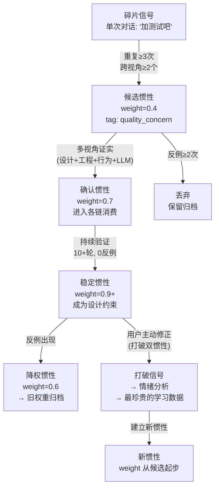
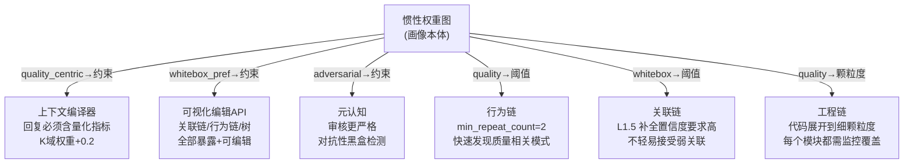

# DialogMesh v6 — 链 08 v2：画像即惯性权重图——多视角共识下的稳定投射

> 版本: v2.0 | 日期: 2026-07-19
>
> v1→v2: 画像不是 OCEAN 10维的被动聚合——是跨链惯性模式的权重图。
> 核心: 稳定=高权重。多视角共识=证实。打破惯性=最强信号。
> 惯性不被消除，只被降低权重或掩盖。画像即设计约束。

---

## 1. 画像的本体：惯性权重图

```
旧模型 (链08 v1):
  画像 = OCEAN 10维浮点数 → 调节各链参数
  问题: 扁平。无法解释"用户习惯高标准"如何影响系统行为

新模型 (v2):
  画像 = 惯性模式的加权图

  ┌──────────────────────────────────────────────────────┐
  │  惯性模式: "质量高标准 (Quality Centric)"             │
  │                                                     │
  │  多视角共识:                                         │
  │    设计视角: 用户频繁要求白盒化、可审计、可追溯       │
  │    工程视角: 用户反复提加监控、加测试、加日志         │
  │    行为视角: 用户倾向结构化方案、拒绝临时补丁         │
  │    对话视角: 用户对"crash-free≠working"的持续强调   │
  │    LLM 视角: 回复中多次识别 "quantitative honesty"   │
  │    元认知: 审核发现用户修正行为集中于"质量"维度       │
  │                                                     │
  │  稳定性: 高 (跨 6 个视角, 横跨 30+ 轮对话)          │
  │  权重: 0.92  (几乎不可动摇)                          │
  │  投射:                                               │
  │    → 设计内容: 必须提供量化指标, 不可只给定性结论    │
  │    → 工程建议: 优先推荐监控/测试/日志方案            │
  │    → 上下文组装: K域权重+0.2, E域权重+0.15          │
  │    → 回复风格: 数据结构化, 附带验证步骤              │
  │    → 元认知阈值: 提高审核标准 (匹配用户高标准)       │
  └──────────────────────────────────────────────────────┘
```

---

## 2. 惯性模式的生命周期



---

## 3. 多视角共识机制

```
惯性确认 = Σ(各视角验证) > 阈值

单视角检测:
  设计视角: 对话树 topic 聚类 → 用户反复讨论"质量"相关主题
  工程视角: 工程链约束查询 → 用户频繁建立 requires(test) 边
  行为视角: 行为链 pattern → 用户完成代码后总执行 add_test
  LLM 视角: 回复内容分析 → "量化优先/拒绝浅层修复/要求全量测试"
  元认知: 审核日志 → 用户修正主要集中在"质量"维度
  关联链: L3 意图 → 用户对话意图聚类为 [quality_assurance]

多视角共识判定:
  N_view_verified ≥ 3 → candidate → confirmed (weight 0.5→0.7)
  N_view_verified ≥ 5 → confirmed → stable (weight 0.7→0.9)
  任1视角出现反例 → weight -= 0.05 (不立即降级)
  任3视角出现反例 → 触发 inertia_break_review
```

---

## 4. 惯性打破——最强学习信号

### 4.1 打破检测

```
惯性模式: quality_centric (weight=0.92, 稳定30轮)
触发打破:
  对话树: 用户对质量问题说 "算了, 先上线" (首次)
  行为链: 用户跳过测试直接部署 (首次)
  
检测:
  ① 反例计数器 +1 (quality_centric.inertia_strength -= 0.05 → 0.87)
  ② 如果伴随情绪信号 (WEAKEN spike, 语气变化):
     → 标记为 potential_inertia_break
     → 不立即降权, 等待确认
  
  ③ 连续3次反例 → inertia_break_confirmed
     → 元认知 review: "为什么用户从质量优先变成了速度优先?"
     → 分析可能的根因:
        外部压力? 时间紧迫? → 临时打破, 会恢复
        价值观变化?  → 永久打破, 需要建立新惯性
        情境依赖?    → 惯性本身有开关条件
```

### 4.2 打破时的情绪关联

```
定理2 (情绪核心公理):
  情绪波动 = 预期失衡 + 双惯性打破

映射:
  用户打破质量惯性 → 如果伴随负面情绪 (WEAKEN)
  → 这是用户"被迫"打破惯性 (非自愿)
  → 系统应标注: 这是情境性打破, 不应永久降权
  
  用户打破质量惯性 → 如果无情绪波动
  → 用户已"内化"了新行为模式
  → 系统应标注: 这是真实的惯性迁移
```

---

## 5. 惯性→设计约束的投射机制

```
每个稳定惯性 → 生成一条设计约束:

惯性: quality_centric (weight=0.92)
  → 设计约束:
    ① 回复必须包含量化指标 (不可纯定性)
    ② 工程建议必须附带验证步骤
    ③ 代码建议必须包含测试方案
    ④ 上下文 K域 优先展示

惯性: whitebox_preference (weight=0.88)
  → 设计约束:
    ① 系统决策链必须可追溯
    ② 前端必须暴露关联链/行为链数据
    ③ 参数修改路径必须可视化

惯性: adversarial_thinking (weight=0.85)
  → 设计约束:
    ① 回复避免过度肯定的措辞
    ② 提供多个方案而非单一最佳方案
    ③ 重视"什么可能出错"而非"这没问题"
```

---

## 6. 惯性权重图的数据结构

```python
@dataclass
class InertiaPattern:
    """一个跨链稳定的惯性模式"""
    id: str                     # "quality_centric"
    label: str                  # "质量高标准"
    
    # 多视角证据
    evidence: Dict[str, float]  # {"design":0.9, "engineering":0.85, "behavior":0.78, ...}
    verified_views: int         # 已证实的视角数
    
    # 稳定性
    weight: float               # 0.0-1.0, 当前权重
    peak_weight: float          # 历史最高权重
    rounds_stable: int          # 连续稳定轮数
    last_verified: float        # 最后验证时间
    
    # 打破追踪
    counter_examples: int       # 反例计数
    inertia_break_events: list  # 打破事件记录
    
    # 投射
    design_constraints: list    # → 设计约束列表
    parameter_overrides: dict   # → 参数覆盖 (高于用户可调默认值)
    
    # 生命周期
    state: str                  # candidate | confirmed | stable | weakening | broken | archived

class InertiaWeightGraph:
    """画像本体——惯性模式的加权图"""
    
    patterns: Dict[str, InertiaPattern]
    
    def get_design_constraints(self) -> List[DesignConstraint]:
        """聚合所有稳定惯性的设计约束"""
    
    def get_parameter_overrides(self) -> Dict[str, Any]:
        """聚合所有稳定惯性的参数覆盖"""
    
    def detect_break(self, pattern_id: str, evidence: Dict) -> BreakSignal:
        """检测并处理惯性打破"""
```

---

## 7. 各链消费惯性的方式



---

## 8. 路径归属 (更新)

| 操作 | Fast | Async | Slow | Deep |
|------|:----:|:-----:|:----:|:----:|
| 单链信号检测 | ✅ | | | |
| 多视角共识判定 | | ✅ | | |
| 惯性权重更新 | | ✅ | | |
| 打破检测 (反例) | | ✅ | | |
| 打破确认 (3次反例) | | | ✅ | |
| LLM retrospective review | | ✅ | | |
| 设计约束投射 | ✅ | | | |
| 惯性模式沉淀 (Deep) | | | | | ✅ |
| 跨 session 持久化 | | | ✅ | |
