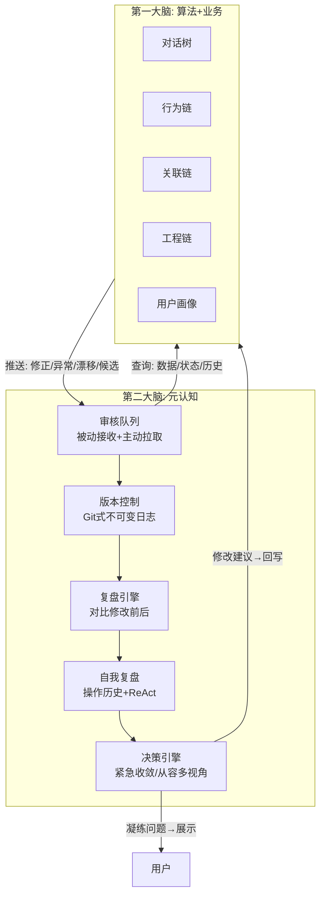
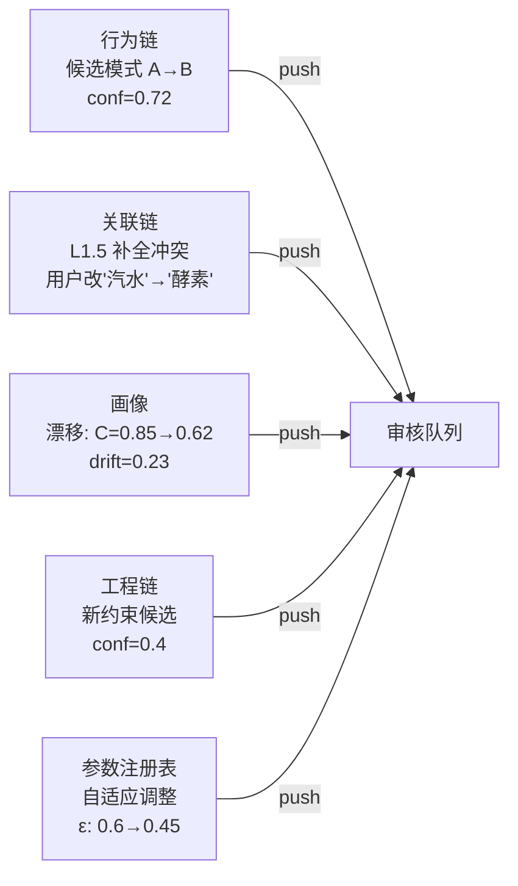
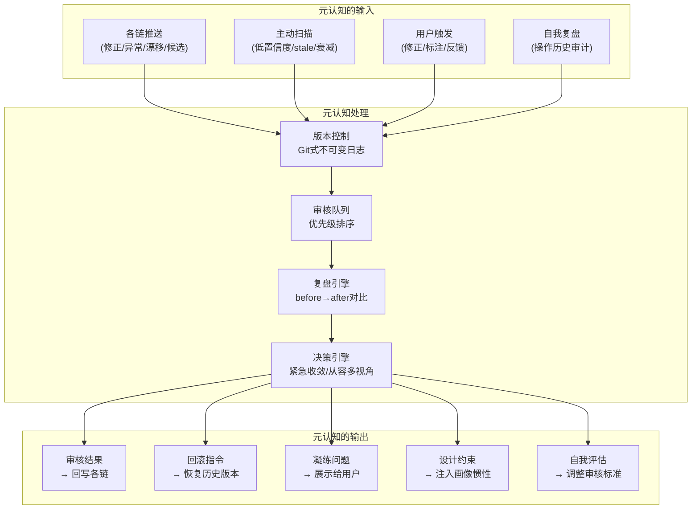

# DialogMesh v6 — 网状业务链设计 · 第九章：元认知——系统的第二大脑

> 版本: v1.0 | 日期: 2026-07-19
>
> 元认知 = 第二大脑。第一大脑是算法+业务。第二大脑是反思、审核、回溯。
> 所有可修改数据有 Git 式版本控制。复盘 = 对比修改前后的运行数据变化。
> 预留外部能力接口 (搜索/验证/论文)。双模式决策 (紧急收敛/从容多视角)。

---

## 1. 元认知的定位



---

## 2. 版本控制——Git 式不可变日志

### 2.1 设计原则

```
所有可修改的数据都有版本控制——如 Git commit 一样不可篡改:

  commit  = {timestamp, author, operation, before_hash, after_hash, diff}
  
  可回滚: 恢复到任意历史版本
  可追溯: 每次修改都有 author + reason
  可审计: 完整的 diff 链 → 复盘时重建全貌
```

### 2.2 覆盖范围

| 数据 | 版本控制 | 粒量 | 示例 |
|------|:---:|------|------|
| 对话树节点 | ✅ | per-node edit log | NodeEditRecord (链03) |
| 关联链边权重 | ✅ | per-edge strength history | A↔B: 0.78→0.83 (t=45) |
| 工程链约束 | ✅ | per-constraint revision | Constraint v2.1→v2.2 |
| 用户画像 OCEAN | ✅ | per-dim EMA history | C: 0.46→0.78→0.62→0.85 |
| 参数注册表 | ✅ | per-param change log | `slow_path.threshold`: 5→3→7 |
| ABC 规则 | ✅ | per-rule version | Rule v3: hits 12→15 |
| 惯性模式 | ✅ | per-pattern weight trace | quality_centric: 0.7→0.92 |
| 元认知自身决策 | ✅ | per-decision log | 审核通过/拒绝+原因 |

### 2.3 数据结构

```python
@dataclass
class VersionedState:
    """Git 式版本控制条目"""
    commit_id: str          # SHA256 of (prev_hash + data + timestamp)
    parent_id: str          # 指向上一个版本
    timestamp: float
    author: str             # "user" | "meta_cognition" | "engine" | "abc_layer"
    operation: str          # "update" | "rollback" | "merge" | "split"
    target: str             # "profile.C" | "rule.personality_t_type" | "param.slow_path"
    before: Any             # 修改前的值 (精简摘要)
    after: Any              # 修改后的值
    diff: str               # 人类可读的 diff
    reason: str             # 为什么修改
    verification: str       # "pending" | "verified" | "rejected"
```

---

## 3. 审核队列——被动+主动

### 3.1 被动接收 (各链推送)



### 3.2 主动拉取

```
元认知定时扫描:
  每 Slow Path checkpoint (5轮):
    ① 扫描关联链 L2-L3 → 寻找低置信度边 (conf<0.4)
    ② 扫描行为链 → 寻找长期未触发的预测模式 (7天无命中)
    ③ 扫描工程链 → 寻找违反 constraints 的模块
    ④ 扫描对话树 → 寻找 stale 标注 (NodeAnnotationStore)
    ⑤ 扫描惯性权重图 → 寻找久未验证的模式 (>30轮)
```

### 3.3 审核优先级

```
紧急 (立即, <5s):
  ① 风险操作: delete/pay/permission → 无条件审核
  ② 用户主动修正: PUT /v6/profile → 立即审核
  ③ 漂移检测: drift > 0.25 → 立即审核
  ④ 断路器 OPEN → 立即审核

从容 (Slow Path, 分钟级):
  ⑤ 候选模式: 行为链发现的 A→B 模式
  ⑥ 低置信度关联: conf<0.4 的边
  ⑦ 参数自适应: 参数注册表的变化
  ⑧ 惯性衰减: 长期未验证的模式
```

---

## 4. 复盘引擎——修改前后的运行数据对比

### 4.1 核心机制

```
复盘 = 修改前 × 修改后的运行数据对比

输入:
  修改前: 系统运行快照 (修改前 N 轮的指标)
  修改后: 系统运行快照 (修改后 N 轮的指标)
  修改内容: diff (谁改了什么、为什么)

输出:
  效果评估: 修改是否改善了指标?
  副作用: 是否引入了新的问题?
  建议: 继续深入 / 回滚 / 调整方向
```

### 4.2 复盘示例：参数自适应

```
参数: slow_path.event_threshold: 5 → 3
原因: 引擎自适应调整 (Slow Path 触发频率偏低)

修改前 10轮:
  Slow Path 触发: 1次
  规则学习: 0条
  内存使用: 45MB

修改后 10轮:
  Slow Path 触发: 3次
  规则学习: 2条
  内存使用: 62MB (+37%)

复盘 verdict:
  正向: 规则学习从 0→2 (效果提升)
  负向: 内存使用 +37% (副作用)
  建议: 阈值调为 4 (折中), 同时优化内存回收
```

### 4.3 复盘输出格式

```python
@dataclass
class RetrospectionReport:
    target: str                 # 被复盘的对象
    change: VersionedState      # 修改记录
    
    # 效果评估
    metrics_before: Dict        # 修改前指标
    metrics_after: Dict         # 修改后指标
    delta: Dict                 # 变化量
    
    # 判定
    verdict: str                # "effective" | "neutral" | "harmful" | "inconclusive"
    confidence: float
    
    # 建议
    recommendation: str         # "keep" | "rollback" | "adjust" | "investigate"
    rollback_id: Optional[str]  # 如果建议回滚, 回滚到哪个 commit
```

---

## 5. 自我复盘——元认知看自己的操作

### 5.1 ReAct 式记忆

```
元认知维护自己的操作历史:

  OperationLog:
    t=42: 审核通过: behavior_pattern{write_code→add_test} (conf 0.72→0.78)
    t=43: 审核拒绝: L1.5补全{饮料→酵素} (关联链不支持, 等待更多证据)
    t=44: 漂移检测: profile.C 0.85→0.62 → 用户行为变化? 触发 review
    t=45: 参数复盘: ε_greedy 0.6→0.45 → 有效 (token 节省 15%)
    t=46: 主动扫描: 3个低置信度关联边 → 排队等待下轮审核
```

### 5.2 自我复盘触发

```
每 Slow Path checkpoint:
  ① 检查自己最近 N 条决策:
     有多少被后续验证为正确? (accuracy)
     有多少被用户覆盖? (user_override_rate)
     有多少导致副作用? (side_effect_rate)
  
  ② 如果 accuracy < 0.7:
     → 调高审核阈值 (更保守)
     → 自我复盘: "最近的决策为什么错误率偏高?"
  
  ③ 如果 user_override_rate > 0.3:
     → "我的审核与用户判断差异太大"
     → 分析差异模式 → 调整审核标准
```

---

## 6. 双模式决策引擎

### 6.1 紧急收敛模式

```
触发: 风险操作 / 用户主动修正 / 漂移 > 0.25

流程:
  ① 单次 LLM 调用 (<5s)
  ② 聚焦当前问题, 不考虑长期影响
  ③ 输出: {verdict, action, confidence}
  ④ 不等待多视角验证 → 立即执行
  ⑤ 标记为 "rapid_decision" → 后续 Slow Path 审查

适用:
  delete/pay 操作 → 需要立即判断
  断路器 OPEN → 需要立即切换 Provider
  用户修正画像 → 需要立即响应
```

### 6.2 从容多视角模式

```
触发: 候选模式 / 低置信度关联 / 参数自适应

流程:
  ① 收集多视角证据:
     设计视角: 关联链的边支持度
     工程视角: 工程链的约束一致性
     行为视角: 行为链的模式频率
     对话视角: 对话树的主题聚类
    
  ② 多轮 LLM 迭代 (可跨 Slow Path):
     Round 1: 各视角独立分析
     Round 2: 交叉验证, 寻找矛盾
     Round 3: 综合判定
  
  ③ 歧义无法消解 → 凝练问题给用户:
     "系统在 A 和 B 之间无法判断, 因为 [证据矛盾]。
      你认为应该: [选项A] [选项B] [都不是]"
  
  ④ 用户不回复 → 保留为 pending, 下次重新评估

适用:
  候选行为模式 → 需要多视角验证
  低置信度关联 → 需要更多证据
  参数自适应 → 需要观察效果
```

---

## 7. 预留外部能力接口

```python
class MetaCognitionCapabilities:
    """预留接口——当前不可用, 但接口已定义"""
    
    # ── 外部搜索 ──
    def web_search(self, query: str, max_results: int = 5) -> List[SearchResult]:
        """搜索互联网获取信息 (预留)"""
        raise NotImplementedError("web_search not available")
    
    # ── 环境验证 ──
    def env_validate(self, hypothesis: str, sandbox_id: str) -> ValidationResult:
        """在沙盒环境中验证假设 (预留)"""
        raise NotImplementedError("env_validate not available")
    
    # ── 论文文献 ──
    def literature_search(self, topic: str, max_papers: int = 10) -> List[Paper]:
        """搜索学术论文参考文献 (预留)"""
        raise NotImplementedError("literature_search not available")
    
    # ── 数据查询 ──
    def data_query(self, sql: str) -> QueryResult:
        """执行外部数据查询 (预留)"""
        raise NotImplementedError("data_query not available")
    
    # ── 代码执行 ──
    def code_execute(self, code: str, language: str, timeout_s: int = 30) -> ExecutionResult:
        """在隔离环境中执行代码 (预留)"""
        raise NotImplementedError("code_execute not available")
```

---

## 8. 全链路交互总览



---

## 9. 路径归属

| 操作 | Fast | Async | Slow |
|------|:----:|:-----:|:----:|
| 版本控制写入 | ✅ | | |
| 审核队列排序 | ✅ | | |
| 紧急决策 (风险/修正/漂移) | | ✅ | |
| 复盘引擎 (before/after) | | | ✅ |
| 从容多视角决策 | | | ✅ |
| 主动扫描 (低置信度/stale) | | | ✅ |
| 自我复盘 (操作审计) | | | ✅ |
| 凝练问题→用户 | | | ✅ |
| 外部搜索/验证 (预留) | | | | (未来) |
