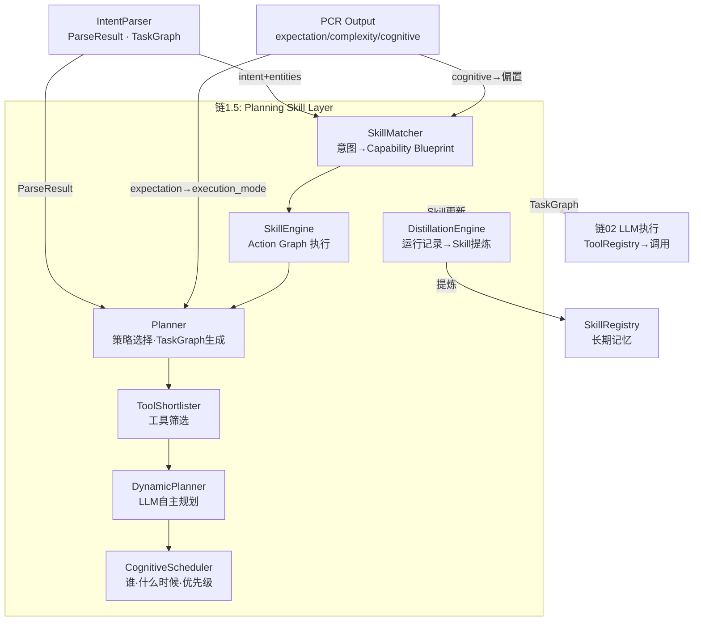
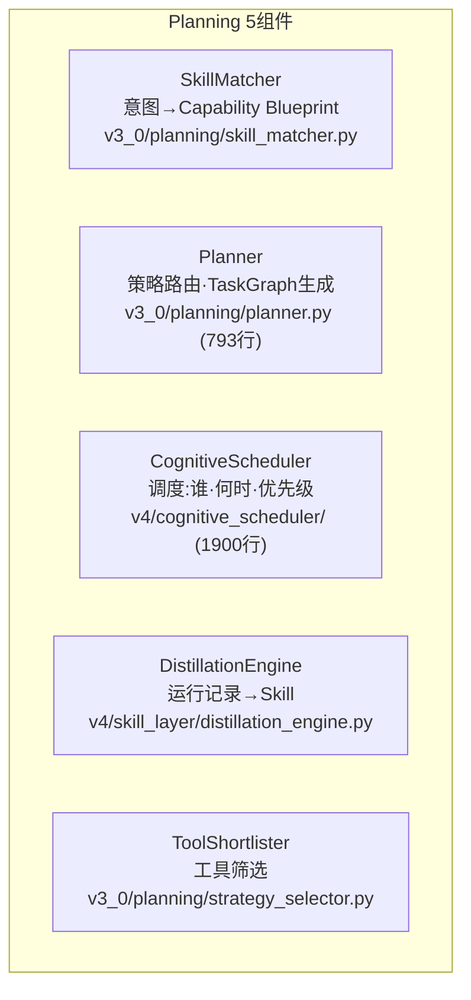
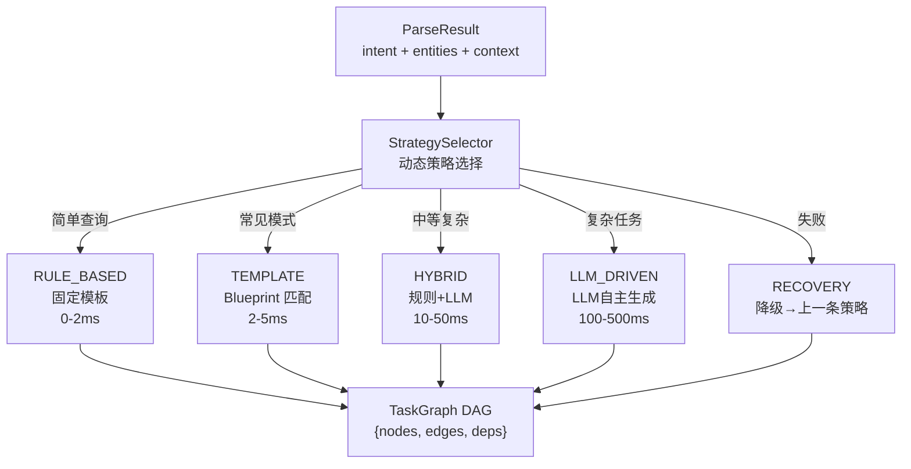
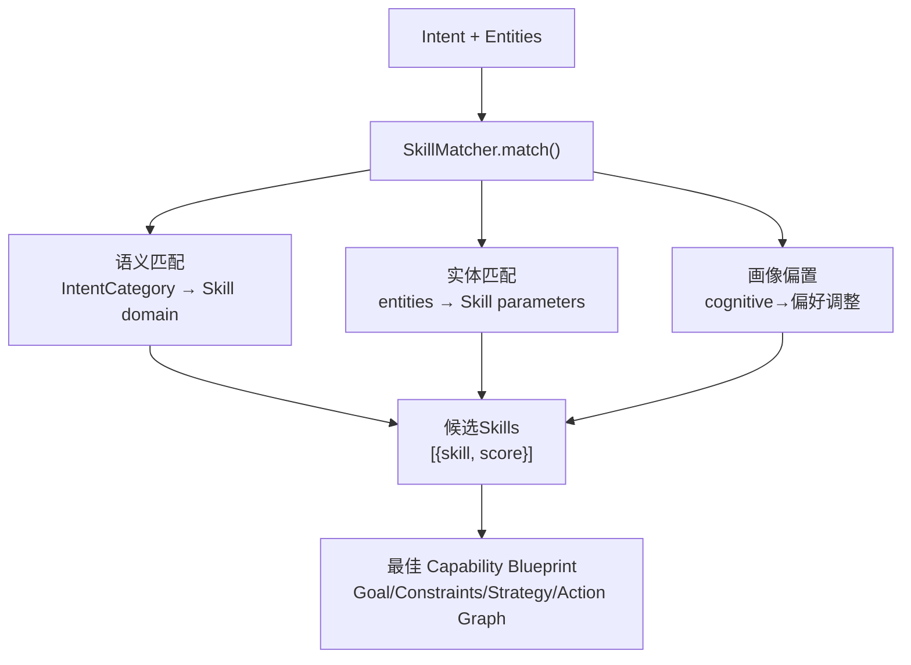
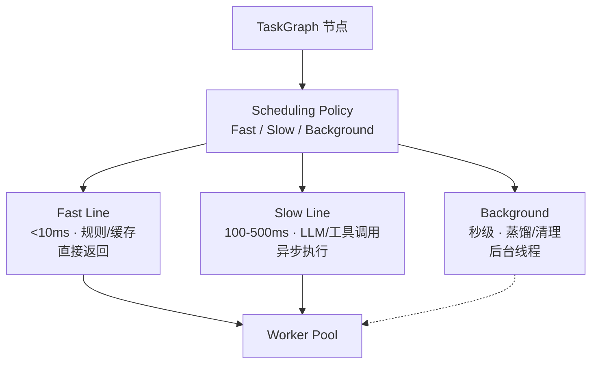
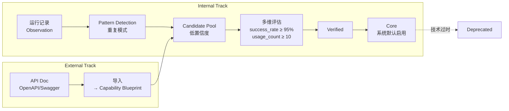
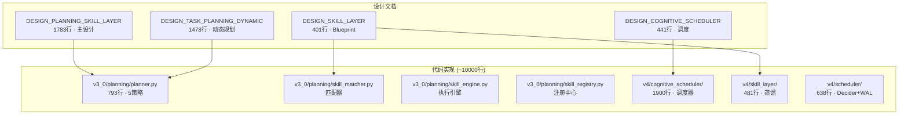

# DialogMesh v6 — 业务链设计 · 第1.5章：Planning (规划技能层)

> 版本: v1.0 | 日期: 2026-07-21
> 
> 设计来源: DESIGN_PLANNING_SKILL_LAYER.md (1783行) +
>          DESIGN_SKILL_LAYER.md (401行) + DESIGN_COGNITIVE_SCHEDULER.md (441行) +
>          DESIGN_TASK_PLANNING_DYNAMIC.md (1478行) +
>          DESIGN_PERSPECTIVE_PLANNER.md +
>          代码: v3_0/planning/ (16文件·~5000行) + v4/skill_layer/ (8文件·481行) +
>                v4/cognitive_scheduler/ (11文件·1900行) + v4/scheduler/ (3文件·638行)
>
> 核心命题: IntentParser 告诉你"用户想要什么"——
>          Planning 告诉你"系统应该怎么给"。
>          不是选模板——是 LLM 自主生成可执行的 TaskGraph。

---

## 一、Planning 在 10 链中的位置



---

## 二、5个核心组件



---

## 三、Planner 5策略



**实现**: `v3_0/planning/strategy_selector.py` — 基于 intent + complexity + cognitive_profile 动态选择。  
**PCR 调控**: `execution_mode=FAST_EXECUTE` → 直接 RULE_BASED · `DEEP_RESEARCH` → LLM_DRIVEN

---

## 四、SkillMatcher



**实现**: `v3_0/planning/skill_matcher.py`  
**Capability Blueprint 结构** (design: `DESIGN_SKILL_LAYER.md`):

```
Capability Blueprint
├── Goal          为什么做
├── Constraints   不能违反哪些 (引用 Engineering Chain)
├── Strategy      推荐策略 (引用 Pattern)
├── Action Graph  语义动作序列 (独立于执行器)
├── Verification  如何验证 (引用 Constraint Engine)
└── Reflection    执行后反馈 (引用 Hypothesis Engine)
```

---

## 五、CognitiveScheduler



**实现**: `v4/cognitive_scheduler/scheduler.py` + `path_scheduler.py` (493行)  
**核心**: 决定谁、什么时候、跑多久、以什么优先级——不负责执行，只调度

---

## 六、Skill Lifecycle (双轨蒸馏)



**实现**: `v4/skill_layer/distillation_engine.py` (198行) + `skill_pool.py` (55行)

---

## 七、代码↔设计映射



---

## 八、接入 Engine 现状 + 计划

```
引擎已接入:
  ✅ PerspectivePlanner      — 在 _compile_context 中使用
  ✅ CausalPlanner           — 因果关系推理

引擎未接入 (全部代码完备):
  ❌ Planner (5策略)         — v3_0/planning/planner.py
  ❌ SkillMatcher            — v3_0/planning/skill_matcher.py
  ❌ SkillEngine             — v3_0/planning/skill_engine.py
  ❌ CognitiveScheduler      — v4/cognitive_scheduler/
  ❌ DistillationEngine      — v4/skill_layer/
  ❌ DeciderState + WAL      — v4/scheduler/

接入点: on_event 中, ParseResult 生成后
  → SkillMatcher.match(intent) → Capability Blueprint
  → Planner.plan(intent, blueprint) → TaskGraph
  → CognitiveScheduler.schedule(task_graph) → Execution Plan
```

---

## 九、接入代码模板

```python
# engine.on_event() — after IntentParser.parse()

if parse_result and self._planner:
    # Step 1: Match skill
    blueprint = self._skill_matcher.match(
        intent=parse_result.intent,
        entities=parse_result.entities,
        profile_bias=pcr_output.cognitive_profile if pcr_output else None,
    )
    
    # Step 2: Plan
    plan = await self._planner.plan(
        intent=parse_result.intent,
        blueprint=blueprint,
        strategy=self._select_strategy(pcr_output),
    )
    
    # Step 3: Schedule
    execution = self._scheduler.schedule(plan.task_graph)
    
    # Inject into context for LLM
    parse_result.task_graph = plan.task_graph
```

---

## 十、状态总览

```
✅ 设计: 20篇完整
✅ 代码: ~10000行 · 6包 · 30+文件
⚠️ 引擎部分接入: PerspectivePlanner + CausalPlanner
❌ 核心未接: Planner/SkillMatcher/Scheduler/Distillation
❌ PCR信号未流入: expectation→strategy, cognitive→skill偏置

有效实现率: ~5% (仅 PerspectivePlanner 被引擎使用)
```
