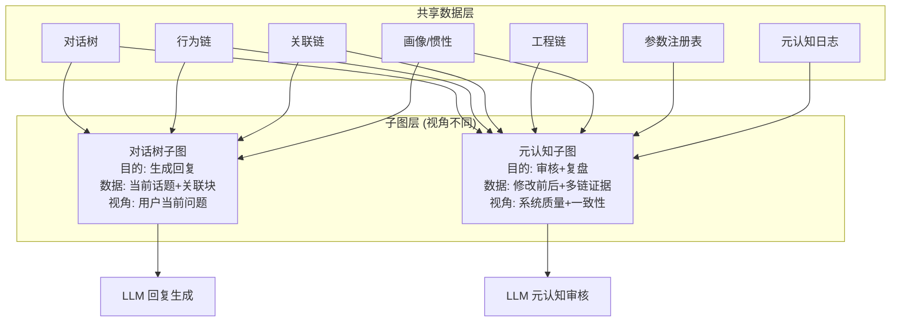
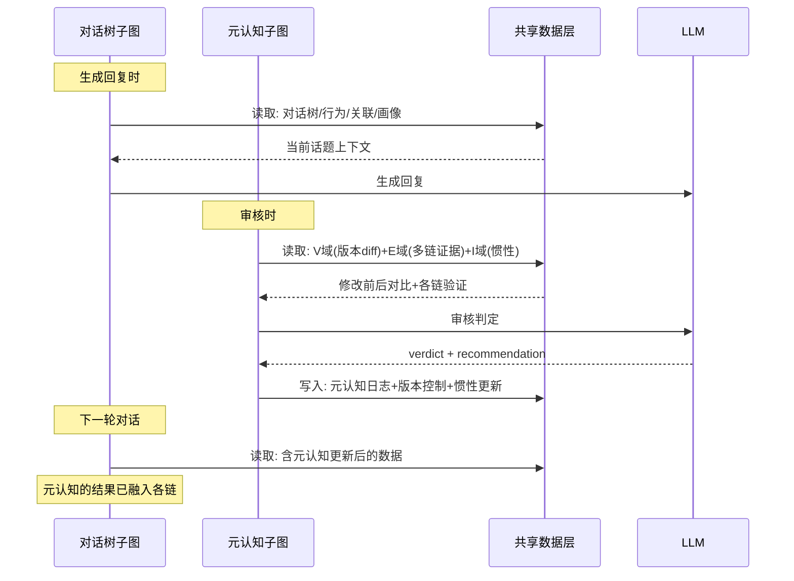
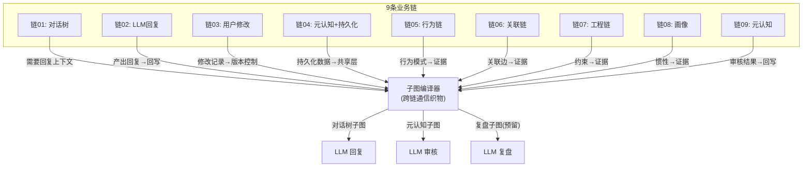

# DialogMesh v6 — 网状业务链设计 · 第十章：子图——跨链通信与元认知专属上下文

> 版本: v1.0 | 日期: 2026-07-19
>
> 子图不是对话树的附庸——它是跨链通信的核心织物。
> 元认知需要自己的子图，对话树需要自己的子图，两者数据源相同、视角不同。

---

## 1. 子图的本质：不是数据，是视角



---

## 2. 对话树子图 (已有, 链01 §4)

```
目的: 为 LLM 生成回复提供上下文
视角: 当前用户问题的局部视野
数据源:
  D 域 (对话树): 当前话题块 + 关联块 (水波展开)
  K 域 (工程): 约束 + 模式
  B 域 (行为): 修正检测 + 需求建议
  P 域 (画像): 偏好 + 风格
  F 域 (子图反馈): OCEAN + MBTI

令牌分配: D:40%, K:20%, B:15%, R:10%, P:10%, F:5%
```

---

## 3. 元认知子图 (新)

### 3.1 目的与视角

```
目的: 为 LLM 元认知审核/复盘提供上下文
视角: 系统质量 + 多链一致性 + 修改效果

与对话树子图的关键区别:
  对话树子图: 窄而深 → 聚焦当前话题, 高质量细节
  元认知子图: 宽而浅 → 覆盖多链, 摘要级证据, 找矛盾
```

### 3.2 数据源与权重

| 域 | 内容 | 权重 | 说明 |
|----|------|:---:|------|
| **M (Meta)** | 元认知自身操作历史 | 15% | 上次做了什么决定? 对了还是错了? |
| **V (Version)** | Git 版本控制 diff | 25% | 修改前后的完整对比 (复盘核心) |
| **E (Evidence)** | 多链证据汇总 | 30% | 关联链边/行为模式/工程约束的一致性 |
| **I (Inertia)** | 惯性权重图 | 15% | 哪些惯性正在被打破? |
| **P (Profile)** | 用户画像摘要 | 10% | 用户偏好 → 影响审核标准 |
| **Q (Question)** | 当前审核对象 | 5% | 正在审核的具体条目 |

### 3.3 令牌分配

```
M 域 (操作历史):   15%  → 最近 10 条决策摘要
V 域 (版本 diff):   25%  → 修改前后的关键指标对比
E 域 (多链证据):   30%  → 各链对当前审核对象的验证/矛盾
I 域 (惯性):       15%  → 受影响的惯性模式 (权重变化)
P 域 (画像):       10%  → OCEAN 摘要 + 修正历史
Q 域 (问题):        5%  → 审核对象原文
─────────────────────────────
Total: 100% (默认 2000 tokens)
```

---

## 4. 子图的双向流动



---

## 5. 子图编译器——统一接口

```python
class SubgraphCompiler:
    """编译跨域子图——支持多种视角"""
    
    def compile_dialogue_subgraph(self, intent: Intent, budget: int) -> CrossDomainContext:
        """对话树子图: 为回复生成"""
        domains = {
            "D": self._get_discourse_blocks(intent, budget * 0.40),
            "K": self._get_engineering_context(intent, budget * 0.20),
            "B": self._get_behavior_signals(intent, budget * 0.15),
            "R": self._get_relation_context(intent, budget * 0.10),
            "P": self._get_profile_summary(budget * 0.10),
            "F": self._get_ocean_feedback(budget * 0.05),
        }
        return self._assemble(domains, budget)
    
    def compile_meta_subgraph(self, review_target: ReviewTarget, budget: int) -> MetaContext:
        """元认知子图: 为审核/复盘"""
        domains = {
            "V": self._get_version_diff(review_target, budget * 0.25),
            "E": self._get_multi_chain_evidence(review_target, budget * 0.30),
            "M": self._get_meta_operation_history(budget * 0.15),
            "I": self._get_inertia_impact(review_target, budget * 0.15),
            "P": self._get_profile_summary(budget * 0.10),
            "Q": self._get_review_target_detail(review_target, budget * 0.05),
        }
        return self._assemble(domains, budget)
    
    def compile_retrospection_subgraph(self, retro_target: str, budget: int) -> RetroContext:
        """复盘子图: 为深度回溯 (预留)"""
        # 未来: 包含更长时间跨度的 before/after 对比
```

---

## 6. 子图在各链中的角色



---

## 7. 闭环判定

```
业务闭环 = 10 条链 + 1 个跨链子图 + 1 个开关网关

  9 条业务链: 覆盖认知推理全链路
  1 条子图: 跨链通信织物 (对话树视角 + 元认知视角)
  1 个网关: DialogMesh ↔ switch gateway

闭环标志:
  ✅ 用户输入 → 对话树子图 → LLM 回复
  ✅ LLM 回复 → 各链回写 → 惯性更新
  ✅ 系统异常 → 元认知子图 → 审核/复盘
  ✅ 用户修改 → 版本控制 → 元认知消费
  ✅ 元认知决策 → 回写各链 → 下次对话可见
  ✅ 全部通过 switch 网关 → Provider 透明切换
```

---

## 8. 路径归属

| 操作 | Fast | Async | Slow |
|------|:----:|:-----:|:----:|
| 对话树子图编译 | ✅ | | |
| LLM 回复生成 | ✅ | | |
| 元认知子图编译 | | ✅ | |
| LLM 审核调用 | | ✅ | |
| 复盘子图编译 | | | ✅ |
| 子图回写共享数据层 | | ✅ | |
| 版本控制写入 | ✅ | | |
