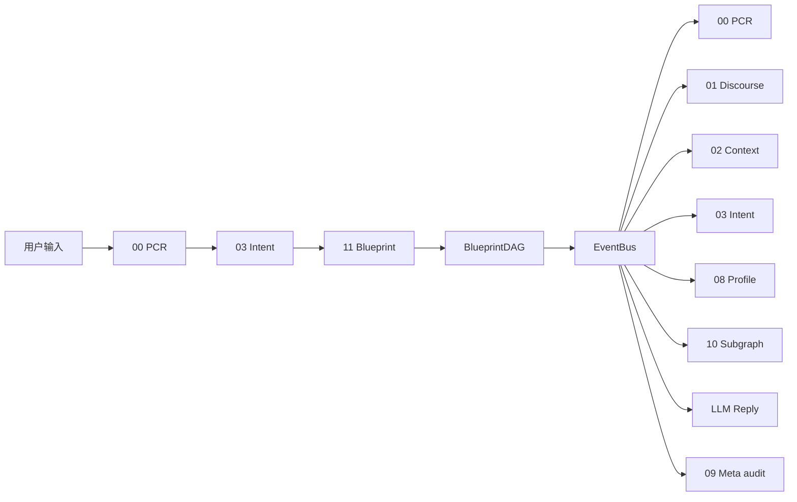
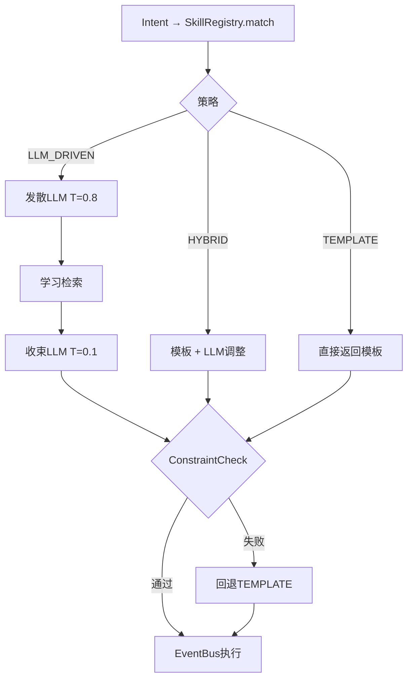

# BUSINESS_CHAIN_11_BLUEPRINT.md

> Blueprint 编排链 — LLM 动态构建执行 DAG

---

## 一、位置

---

## 二、阶段

---

## 三、代码映射

| 模块 | 代码 | 行 |
|------|------|----|
| 数据模型 | `core/agent/blueprint/models.py` | 148 |
| SkillRegistry | `core/agent/blueprint/skill_registry.py` | 198 |
| LLM构建器 | `core/agent/blueprint/llm_dag_builder.py` | 270 |
| 引擎+约束 | `core/agent/blueprint/engine.py` | 213 |
| 执行器 | `core/agent/blueprint/executor.py` | 175 |
| 元反馈 | `core/agent/blueprint/meta_feedback.py` | 168 |

---

## 四、集成状态

| 组件 | 状态 |
|------|:----:|
| BlueprintDAG dataclass | ✅ |
| 5内置模板 | ✅ |
| SkillRegistry匹配 | ✅ |
| 发散LLM | ✅ |
| 学习检索 | ⚠️ 基础 |
| 收束LLM | ✅ |
| ConstraintChecker | ✅ |
| BlueprintEngine三策略 | ✅ |
| EventBus执行 | ⚠️ 桥接模式 |
| Meta异步学习 | ✅ |
| 前端统一DAG渲染 | ❌ P4 |

---

## 五、下游调控

- EventBus 10链状态 → Meta评分 → SkillRegistry权重调整
- 连续3次低分 → LLM_DRIVEN→HYBRID→TEMPLATE
- 连续5次高分 → 升级策略
