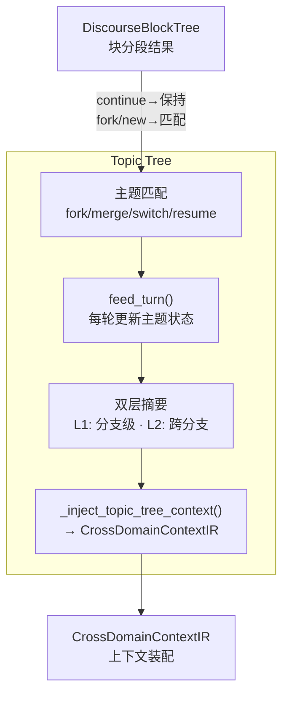
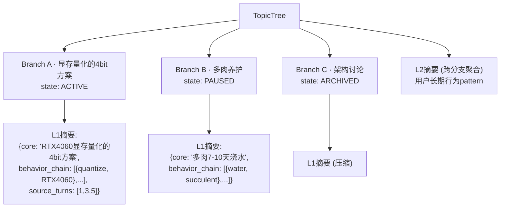
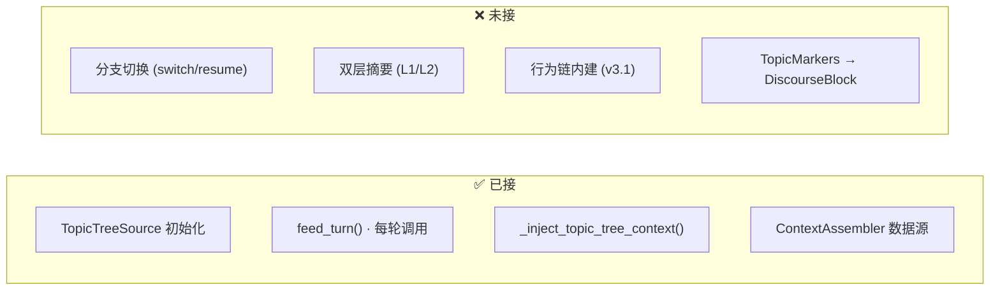

# DialogMesh v6 — 业务链设计 · 第2.1章：Topic Tree (主题树)

> 版本: v1.0 | 日期: 2026-07-21
> 接入: TopicTree feed ✅ · Context injection ✅ · 分支切换 ❌ · 双层摘要 ❌

---

## 一、在 10 链中的位置



---

## 二、核心模型



**状态机**: ACTIVE → PAUSED → ARCHIVED  
**上下文隔离**: 活跃分支全量 · 非活跃分支摘要

---

## 三、引擎现状



**代码**: `topic_tree/manager_v2.py` (1091行) + `manager.py` (624行) + `v4/context/topic_tree_source.py` (183行)

---

## 四、接入差距

```
✅ 初始化 + feed_turn            — 每轮对话更新主题
✅ Context injection             — _inject_topic_tree_context
✅ ContextAssembler 数据源         — TopicTreeSource
❌ 分支切换                      — switch/resume API
❌ 双层摘要                      — summary_engine 未触发
❌ 行为链内建                    — v3.1 设计
❌ 递归收敛主题快匹配             — BUSINESS_CHAIN_02_APPENDIX

有效实现率: ~45%
需接入约 30 行
```
