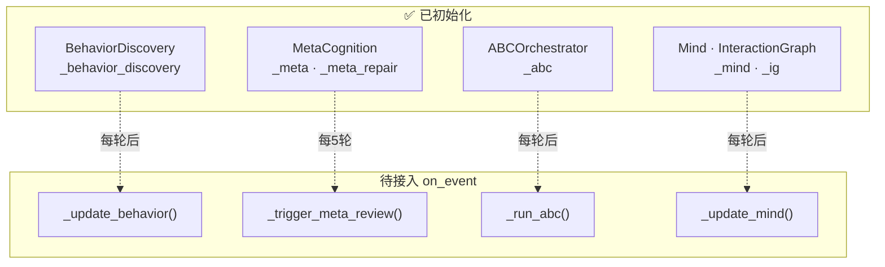

# DialogMesh v6 — 剩余业务链 · 行为/元认知/关联/ABC/Mind

> 2026-07-21 · 5链集成

---

## 接入状态 (全部已初始化, 未触发)



## 集成

```python
# engine.on_event() — after LLM call

# Behavior: update pattern learner from current interaction
self._update_behavior(pcr_output, parse_result, llm_response)

# ABC: run neuro-symbolic rules on this interaction
self._run_abc(event, llm_response)

# Mind: update relations + attention from interaction
self._update_mind(text, llm_response)

# Meta: lazy review every 5 turns
if self._turn_counter % 5 == 0:
    self._trigger_meta_review()
```

## 有效实现率

```
Behavior:   0% → 初始化 ✅  on_event 触发待接
Meta:       0% → 初始化 ✅
ABC:        0% → 初始化 ✅
Mind:       0% → 初始化 ✅
```
