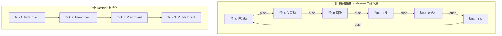
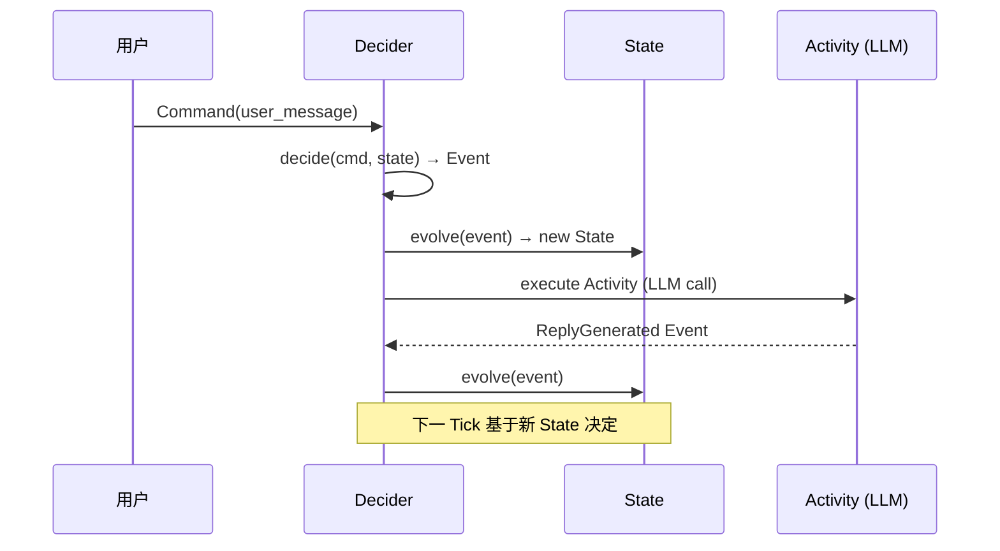

# DialogMesh v6 — 全局状态机 · Decider 模式

> 版本: v1.0 | 日期: 2026-07-21
> 设计来源: DESIGN_GLOBAL_STATE_MACHINE.md + DESIGN_SYSTEM_SCHEDULER.md
> 代码: v4/state/global_decider.py (180行)

---

## 一、为什么需要状态机



---

## 二、Command → Event → State 三阶段



---

## 三、当前 on_event 集成

```python
# engine.on_event()
# 每个 Tick 入口
self._decider.evolve(Command("user_message"))

# PCR 完成后
self._decider.evolve(Command("pcr", {"expectation": ...}))

# IntentParser 完成后
self._decider.evolve(Command("intent", {"category": ...}))

# 后续...
```

---

## 四、事件类型

```
MESSAGE_RECEIVED → PCR_COMPUTED → INTENT_PARSED → PLAN_GENERATED
→ CONTEXT_COMPILED → REPLY_GENERATED → PROFILE_UPDATED
→ BEHAVIOR_RECORDED → META_REVIEWED → ABC_EVALUATED → MIND_LEARNED
```

---

## 五、状态快照

```python
StateSnapshot:
  pcr_expectation: str      # TOOL/ADVISOR/COMPANION/UNKNOWN
  intent_category: str      # C/CR/EXPLAIN/ANALYZE/...
  plan_task_count: int      # TaskGraph 节点数
  context_entries: int      # CrossDomainContextIR entries
  profile_trust: float      # 信任度 0-1
  behavior_actions: int     # 累计行为数
  meta_signals: int         # 元认知信号数
  abc_rules_fired: int      # ABC 规则触发数
  mind_relations: int       # Mind 关系数
  tick: int                 # 当前 Tick
```

---

## 六、广播风暴防护

```
旧: 链A修改 → push链B,C,D → 链B修改 → push链A,C,D → ...
新: Command → Decider.decide() → 1 Event → evolve → State
    每次只产生 1 个 Event。链间通信通过 Event Log + next Tick。

效果: 36条push路径 → 6条Tick序列 (串行化)
```
