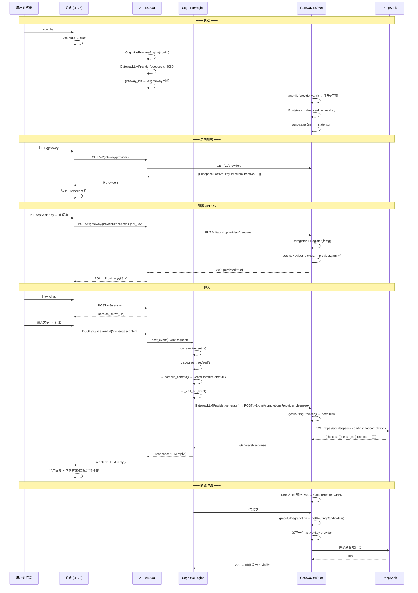
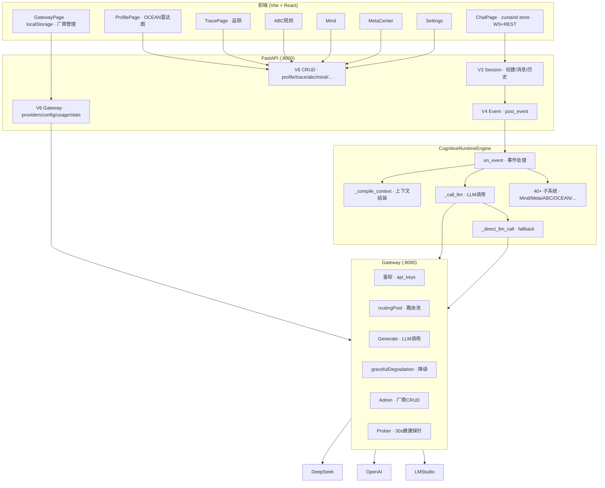
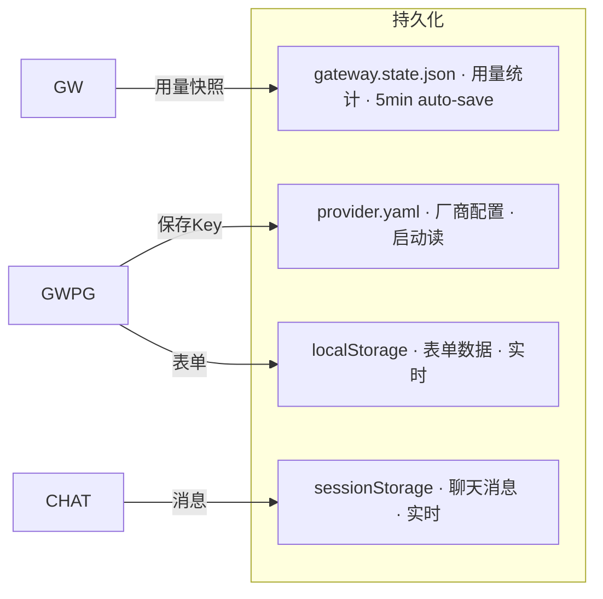
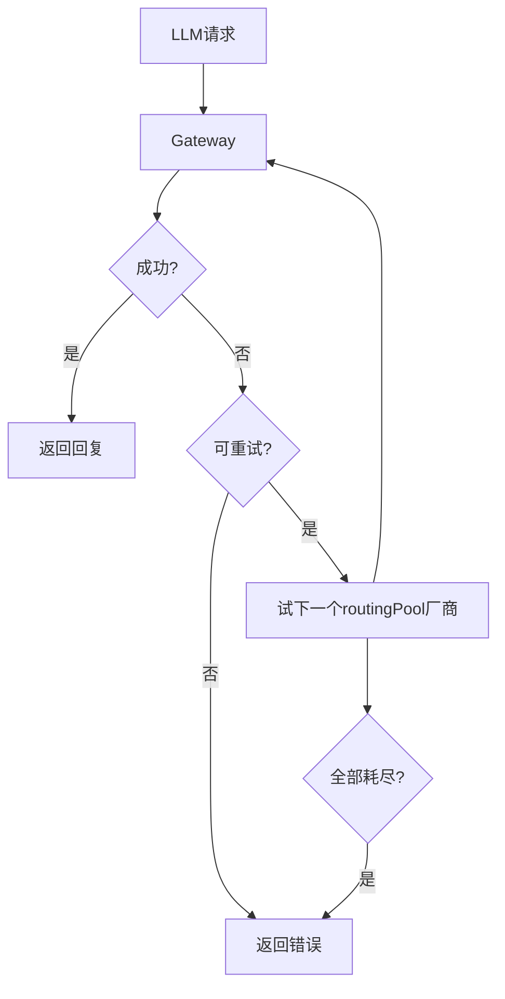

# DialogMesh v6 — 当前完整业务流 (2026-07-21)

## 端到端请求流



---

## 组件关系图



---

## 数据持久化



---

## 错误恢复



---

## 当前状态

```
✅ Gateway: 9 providers, deepseek active+key, routingPool管理
✅ API: V3/V4/V6 全端点, GatewayLLMProvider
✅ Engine: on_event → compile_context → call_llm → fallback
✅ Chat: POST /v3/session/{id}/message → 回复
✅ 持久化: provider.yaml + localStorage + sessionStorage
✅ 降级: gracefulDegradation → routingPool 自动切换

⚠️  Message消失: zustand store已部署, 待前端构建验证
⚠️  上下文隔离: to_prompt预算过滤已修, 待API重启
```
