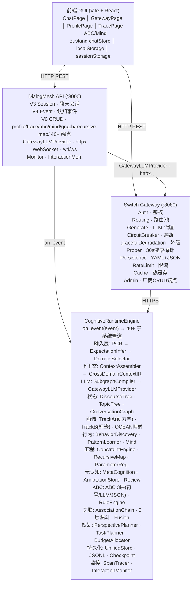
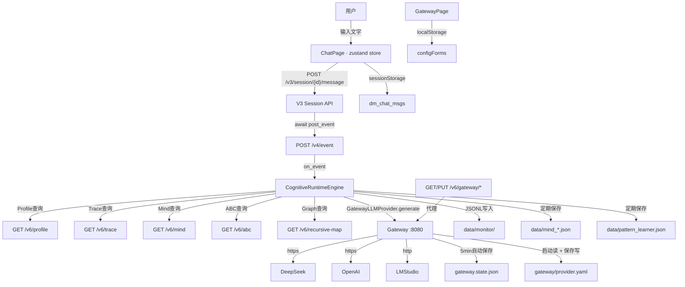

# DialogMesh v6 — 系统全貌业务流

> 2026-07-21 · 基于实际实现

---

## 一、系统全景（四大组件）

```
┌──────────────────────────────────────────────────────────────┐
│                    前端 GUI (Vite + React)                     │
│  ChatPage │ GatewayPage │ ProfilePage │ TracePage │ ABC/Mind │
│  zustand chatStore │ localStorage │ sessionStorage           │
└──────────────┬───────────────────────────┬───────────────────┘
               │ HTTP REST                  │ HTTP REST
               ▼                            ▼
┌──────────────────────────────┐  ┌────────────────────────────┐
│  DialogMesh API (:8000)      │  │  Switch Gateway (:8080)    │
│  ────────────────────────── │  │  ────────────────────────  │
│  V3 Session · 聊天会话       │  │  Auth · 鉴权                │
│  V4 Event · 认知事件         │  │  Routing · 路由池           │
│  V6 CRUD · profile/trace/    │  │  Generate · LLM 代理        │
│          abc/mind/graph/     │  │  CircuitBreaker · 熔断      │
│          recursive-map/      │  │  gracefulDegradation · 降级 │
│          40+ 端点             │  │  Prober · 30s健康探针       │
│  ────────────────────────── │  │  Persistence · YAML+JSON    │
│  GatewayLLMProvider · httpx  │──│  RateLimit · 限流           │
│  WebSocket · /v4/ws          │  │  Cache · 热缓存              │
│  Monitor · InteractionMon.   │  │  Admin · 厂商CRUD端点       │
└──────────────┬───────────────┘  └──────────────┬─────────────┘
               │                                  │ HTTPS
               ▼                                  ▼
┌──────────────────────────────────────────────────────────────┐
│               CognitiveRuntimeEngine                          │
│  ┌─────────────────────────────────────────────────────────┐ │
│  │ on_event(event) → 40+ 子系统管道                          │ │
│  │                                                         │ │
│  │ 输入层: PCR → ExpectationInfer → DomainSelector          │ │
│  │ 上下文: ContextAssembler → CrossDomainContextIR          │ │
│  │ LLM:   SubgraphCompiler → GatewayLLMProvider             │ │
│  │ 状态:  DiscourseTree · TopicTree · ConversationGraph     │ │
│  │ 画像:  TrackA(动力学) · TrackB(标签) · OCEAN映射          │ │
│  │ 行为:  BehaviorDiscovery · PatternLearner · Mind         │ │
│  │ 工程:  ConstraintEngine · RecursiveMap · ParameterReg.   │ │
│  │ 元认知: MetaCognition · AnnotationStore · Review         │ │
│  │ ABC:   ABC 3层(符号/LLM/JSON) · RuleEngine               │ │
│  │ 关联:  AssociationChain · 5层漏斗 · Fusion               │ │
│  │ 规划:  PerspectivePlanner · TaskPlanner · BudgetAllocator│ │
│  │ 持久化: UnifiedStore · JSONL · Checkpoint                │ │
│  │ 监控:  SpanTracer · InteractionMonitor                   │ │
│  └─────────────────────────────────────────────────────────┘ │
└──────────────────────────────────────────────────────────────┘
```

---




## 二、请求链路总览

```
用户输入 → 前端 ChatPage → V3 Session API → V4 Event API
  → CognitiveEngine.on_event()
    ├─ Layer 0: PCR 噪声过滤 · 期望推断
    ├─ Layer 1: Intent Parser · DomainSelector · 预算分配
    ├─ Context: ContextAssembler → CrossDomainContextIR
    ├─ LLM: SubgraphCompiler → GatewayLLMProvider → Gateway → DeepSeek
    ├─ State: DiscourseTree · TopicTree · ConversationGraph 更新
    ├─ Behavior: BehaviorDiscovery · PatternLearner · Mind
    ├─ Profile: TrackA 信号累计 → STRENGTHEN/WEAKEN/REJECT
    ├─ Meta: AnnotationStore 记录 · Feedback 处理
    ├─ ABC: 3层规则匹配 → 新规则学习
    └─ Persist: JSONL 每轮快照 · 周期性全量保存
  → LLM回复 → V3 API → 前端 ChatPage → 用户看到
```

---

## 三、组件间数据流



---

## 四、Gateway 内部 14 条业务线

```
POST /v1/chat/completions 进入:
  ① 鉴权: Bearer token ∈ api_keys
  ② 限流: tokenEstimate → rate limit check
  ③ 租户: quota 校验
  ④ 路由: getRoutingProvider() → routingPool → 首个active+key
  ⑤ 断路器: CircuitBreaker 检查 → OPEN时跳过
  ⑥ 生成: manager.Generate() → HTTP call to upstream LLM
  ⑦ 失败降级: gracefulDegradation → 遍历routingPool候选
  ⑧ 合并: 对流式结果缓存合并
  ⑨ 成本: pricing 记录
  ⑩ Cache: 热缓存命中 (非stream)
  ⑪ 测量: metrics recording
  ⑫ 审计: structured logging
  ⑬ 健康: 30s background prober
  ⑭ 配置: YAML持久化 (admin endpoints)
```

---

## 五、Engine 内部管道（40+ 子系统）

```
on_event(event_ir):
│
├─ [Layer 0 · Pre-Cognitive Router]
│   ├─ NoiseDetector      · 垃圾/广告过滤
│   ├─ ExpectationInfer   · 期望类型推断
│   └─ CognitiveQuickScan · 认知状态快速评估
│
├─ [Layer 1 · IntentParser]
│   ├─ Preprocessor       · 文本预处理
│   ├─ EntityExtractor    · 实体提取
│   ├─ IntentClassifier   · 意图分类
│   └─ AmbiguityResolver  · 歧义消解
│
├─ [Context Assembly]
│   ├─ DomainSelector     · 领域匹配 + 预算分配
│   ├─ PerspectivePlanner · 视角规划
│   ├─ ContextAssembler   · 上下文组装 → CrossDomainContextIR
│   ├─ BudgetAllocator    · Token预算分配
│   └─ SubgraphCompiler   · 按需水波扩展子图
│
├─ [LLM Interaction]
│   ├─ LLMAdapter         · Prompt模板
│   ├─ GatewayLLMProvider · httpx → Gateway → DeepSeek
│   ├─ _direct_llm_call   · 降级直连Gateway
│   └─ ReasoningPolicy    · Temperature/重复惩罚
│
├─ [Discourse Tree · 对话树]
│   ├─ DiscourseBlockTree · 9维粘合度判定
│   ├─ SegmentationEngine · 话题切分
│   ├─ BranchManager      · Fork/Continue/Merge
│   └─ NodeEditor         · 手动编辑子树
│
├─ [Cognitive Profile · 画像]
│   ├─ TrackA · 认知动力学   · inertia/cog_resource/attention
│   ├─ TrackB · 标签层       · personality_trait/domain_expertise
│   ├─ OCEANMapper           · 行为信号 → OCEAN映射
│   ├─ ExecutionTrace        · STRENGTHEN/WEAKEN/REJECT
│   └─ TagLayer              · infer_from_trace
│
├─ [Behavior Chain · 行为链]
│   ├─ BehaviorDiscovery     · P(B|A) 统计发现
│   ├─ PatternLearner        · 在线训练
│   ├─ BehaviorPredictor     · 4层决策树预测
│   ├─ ConstraintCompleter   · 约束生成
│   └─ BehaviorGraph         · 行为图
│
├─ [Association Chain · 关联链]
│   ├─ 5-Layer Funnel · Co-occur→Semantic→Behavioral→Causal→Meta
│   ├─ Fusion Engine  · 统一概率融合
│   └─ NegativeKB     · 矛盾关系库
│
├─ [Engineering Chain · 工程链]
│   ├─ ConstraintEngine     · 软硬约束管理
│   ├─ RecursiveMap         · 递归地图
│   ├─ ParameterRegistry    · 参数注册中心
│   └─ TTLMigration         · 温度时间衰减
│
├─ [Meta Cognitive · 元认知]
│   ├─ MetaCognitionLayer   · 自我审查
│   ├─ AnnotationStore      · 人工标注系统
│   ├─ ReviewEngine         · 复盘引擎
│   ├─ DriftDetector        · 画像漂移检测
│   └─ SelfRepair           · 规则自修复
│
├─ [ABC Framework · 神经符号]
│   ├─ Layer C · 符号规则   · composable rules · 80%命中
│   ├─ Layer B · LLM规则    · 冷启动 · 自适应
│   └─ Layer A · JSON默认   · 确定性回退
│
├─ [Mind Space]
│   ├─ UnifiedMind          · 关系+注意力+错误记忆
│   ├─ InteractionGraph     · 动态边生成
│   └─ MindSpacePanel       · 前端可视化
│
├─ [Persistence · 持久化]
│   ├─ UnifiedStore         · JSONL每轮快照
│   ├─ AnnotationStore      · 写审计+完整性校验
│   ├─ CheckpointManager    · 增量快照
│   └─ EventLog             · Event Sourcing日志
│
└─ [Observability · 可观测性]
    ├─ InteractionMonitor   · JSONL + HTML Dashboard
    ├─ SpanTracer           · Waterfall追踪
    └─ MetricsRegistry      · 计数器 + 延迟
```

---

## 六、数据持久化全景

| 存储 | 位置 | 触发 | 内容 |
|------|------|------|------|
| provider.yaml | gateway/ | 启动读 / 保存写 | 厂商配置 + API keys |
| gateway.state.json | gateway/ | 5min自动保存 | 用量统计 (无key) |
| chat_*.jsonl | data/monitor/ | 每轮对话后立即写 | 完整对话日志 |
| _profile.json | data/monitor/ | session结束时 | 认知画像快照 |
| _summary.json | data/monitor/ | session结束时 | 会话摘要 |
| mind_*.json | data/ | 每5轮定期保存 | Mind关系图谱 |
| pattern_learner.json | data/ | 每10轮定期保存 | ABC规则集 |
| annotations/ | data/ | 实时 | 人工标注审计记录 |
| dm_chat_store | sessionStorage | 消息变化时 | 聊天消息 (100条上限) |
| configForms | localStorage | 表单输入时 | Gateway表单数据 |

---

## 七、当前实现状态

```
✅ 全链路通的:
   ChatPage → V3 → V4 → Engine → GatewayLLMProvider → Gateway → DeepSeek
   GatewayPage → V6 Proxy → Gateway Admin → YAML持久化
   Gateway路由: routingPool + active+key过滤 + 降级重试
   Profile/Trace/Mind/ABC/RecursiveMap 端点
   前端 zustand chatStore + sessionStorage 持久化

⚠️ 需要API重启才生效:
   GatewayLLMProvider 替代 OpenAIProvider
   to_prompt 预算过滤
   _direct_llm_call 干净消息模式

⚠️ 引擎深层:
   40+子系统代码存在且可运行，但LLM调用层简化了
   对话树/画像/行为链 处理正常的内部状态
   但最终LLM调用用干净消息 → 内部状态仅用于"认知推理"
   需要 SubgraphCompiler 将相关域上下文注入LLM
```
