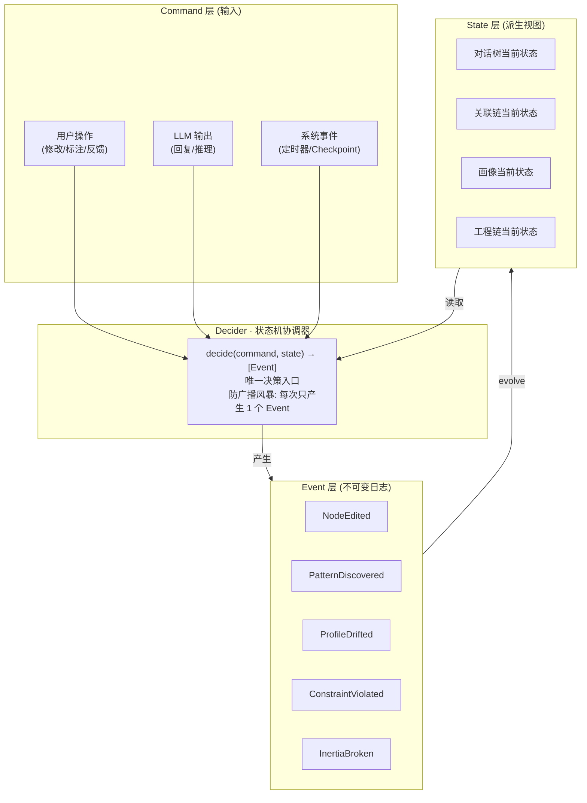
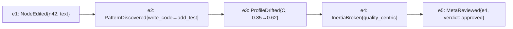
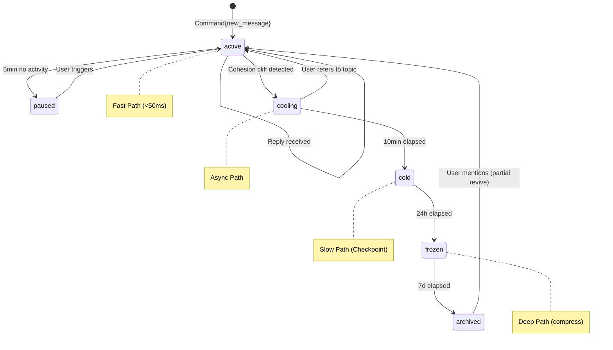

# DialogMesh v6 — 全局状态机 · 防广播风暴 + 事件溯源

> 版本: v1.0 | 日期: 2026-07-19
>
> 参考: Temporal Workflow+Activity, Event Sourcing+Decider, Flink Checkpoint, LangGraph StateGraph
> 核心: Command→Event→State 三阶段取代 modify→record 二元模型

---

## 1. 广播风暴的诊断

```
当前问题:
  链05 行为链: 发现 A→B 模式 → 推送给链06 关联链
  链06 关联链: 更新 A↔B 强度 → 推送给链08 画像
  链08 画像: 更新 quality_centric 惯性 → 推送给链07 工程链
  链07 工程链: 约束变化 → 推送给链01 对话树
  链01 对话树: 上下文变化 → 推送给链02 LLM回复
  链02 LLM回复: 新的标注 → 推送给链05 行为链 ...

  一轮修改 → 触发 6 条链的连锁反应 → 每条链又触发更多
  → 指数级放大 = 广播风暴

根因: 链之间直接 push 通信, 无协调者, 无反压机制
```

## 2. 全局状态机架构



### 2.1 Decider Pattern

```python
class GlobalDecider:
    """唯一决策入口 — 防止广播风暴。
    
    Temporal Workflow 映射:
      decide = Workflow.logic (产生 Event)
      evolve = apply Event → update State
      Activity = LLM call (外部操作, 可重试)
    """

    def decide(self, command: Command, state: GlobalState) -> List[Event]:
        """从当前状态+命令 → 产生事件列表。
        
        关键: 每次只产生 1 个 Event。
        如果需要多链联动 → 让下一个 Event 在 evolve 后再触发。
        不是一次性推给所有链 — 是逐个 Event 的状态机转移。
        """
        events = []

        if isinstance(command, NodeEditCommand):
            # 只产生 NodeEdited event
            events.append(NodeEdited(node_id=command.node_id, 
                                     change=command.change,
                                     author=command.author))
            # 不立即推送给行为链/关联链 — 等下一个 tick 再处理

        elif isinstance(command, ProfileDriftCommand):
            # 只产生 ProfileDrifted event
            events.append(ProfileDrifted(dimension=command.dim, drift=command.drift))

        # ... 其他 command 类型
        
        return events

    def evolve(self, state: GlobalState, event: Event) -> GlobalState:
        """应用事件到状态 — 纯函数, 可重放。"""
        if isinstance(event, NodeEdited):
            state.discourse_tree.apply(event)
        elif isinstance(event, ProfileDrifted):
            state.profile.apply(event)
        # ...
        return state
```

### 2.2 广播风暴防护机制

```
原理:
  旧: 链A修改 → push给链B,C,D → 链B修改 → push给链A,C,D → ...
  新: Command → Decider → 1个Event → evolve → State变化
      下一轮 Tick → Decider 检测 State 变化 → 产生下一个 Event

防风暴三板斧:
  ① 单 Event 原则: 每次 Tick 只产生 1 个 Event
  ② 反压机制: 如果 Event Queue > 10 → 降级 (丢弃低优先级 Event)
  ③ 增量 Checkpoint: 只持久化变化的 State 分片 (参考 Flink)
```

---

## 3. Event Sourcing — 事件日志是数据库

### 3.1 Command → Event → State 三阶段

```
旧模型 (二元):
  modify(target, data) → append to NodeEditRecord
  问题: 无法区分"意图"和"结果", 无法重放

新模型 (三元):
  Command ("用户修改了 C=0.85")
    → Decider 验证 (冲突检测 / 权限 / 预算)
    → Event ("ProfileCorrected{dim:C, from:0.62, to:0.85}")
    → evolve → State ("profile.C = 0.85")

优势:
  ① Event 是不可变日志 → 可完整重放
  ② 当前 State 只是 Event 的投影 → 可从任何 Event 重建
  ③ 元认知可以"重放"过去的事件序列来做复盘
```

### 3.2 事件流拓扑



---

## 4. 状态分片 — Flink Keyed State 映射

```python
class ShardedState:
    """按 discourse_block_id 分片的状态存储。
    
    映射: Flink KeyedState — 每个 key 独立状态, 互不干扰
    场景: 用户修改 node_n42 → 只影响 n42 的状态分片
          不会触发 node_n99 的状态重建
    """

    def __init__(self):
        self._shards: Dict[str, BlockState] = {}
        self._event_log: EventLog

    def get_block_state(self, block_id: str) -> BlockState:
        return self._shards.get(block_id, BlockState.empty())

    def apply_event_to_block(self, block_id: str, event: Event):
        shard = self.get_block_state(block_id)
        evolved = shard.evolve(event)
        self._shards[block_id] = evolved
        self._event_log.append(event)  # 一次性写入
```

---

## 5. 生命周期下的状态机



---

## 6. 路径调度 → Temporal Activity 映射

```
Temporal 模型:
  Workflow = 对话树 (协调逻辑, 不执行 IO)
  Activity = LLM 调用 / 语义提取 / 持久化 (外部操作, 可重试)

DialogMesh 映射:

  Fast Path → no Activity (纯内存操作)
  Async Path → Activity{retry=2, timeout=10s}
  Slow Path → Activity{retry=1, timeout=60s}
  Deep Path → Child Workflow{独立生命周期}

Temporal 信号:
  用户修改 → Signal(workflow_id, "user_edit", data)
  元认知审核完成 → Signal(workflow_id, "meta_verified", data)
```

---

## 7. 完整 Tick 周期

```python
class DialogMeshTick:
    """一个完整的 Tick — 状态机的单步推进。

    参考: Temporal Workflow 的一个 Decision Task。
    """

    def tick(self, state: GlobalState, commands: List[Command]) -> GlobalState:
        # 1. 收集本轮 Command (用户输入 + 定时器 + 回写)
        
        # 2. 反压检查
        if self._event_queue.size() > 10:
            self._drop_low_priority_events()
        
        # 3. Decider: Command → Event (每次只产 1 个)
        events = []
        for cmd in sorted(commands, key=priority):
            event = self._decider.decide(cmd, state)
            if event:
                events.append(event)
                break  # 单Event原则
        
        # 4. Evolve: Event → State
        for event in events:
            state = self._decider.evolve(state, event)
            self._event_log.append(event)
        
        # 5. 增量 Checkpoint (只持久化变化的 shard)
        self._checkpoint_incremental(state)
        
        return state
```

---

## 8. 与现有设计对照

| 现有设计 | 状态机映射 | 变化 |
|---------|-----------|------|
| `_feed_*` 各链独立调用 | Decider 统一入口 | 不再各自 push, 由状态机协调 |
| `NodeEditRecord` 独立存储 | Event Log 统一存储 | 所有修改合并为一个事件流 |
| Fast/Async/Slow/Deep 路径 | Workflow + Activity 分离 | Activity 可独立重试 |
| HCWA 分层 | ShardedState + TTL | 过期的 shard 自动冷存储 |
| `correction_journal` | ProfileDrifted Event → Decider | 漂移检测 → 状态机事件 |
| 元认知 push/scan | Signal → Decider | 元认知通过 Signal 触发状态机 |
