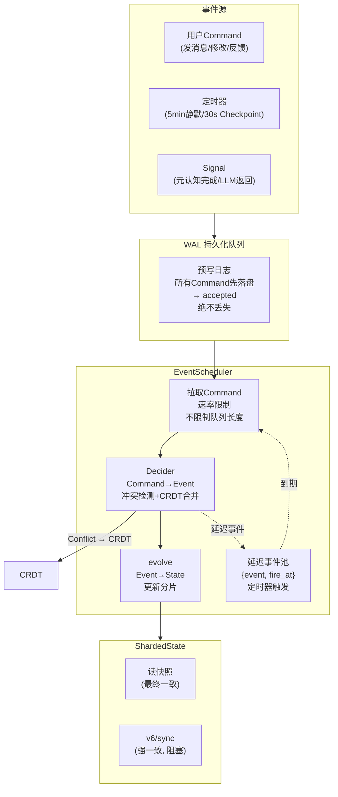
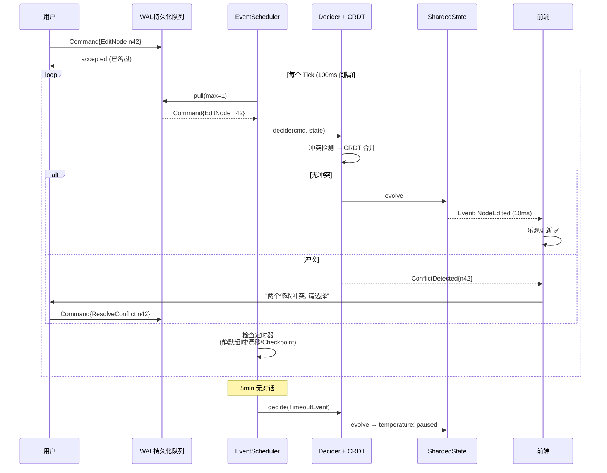

# DialogMesh v6 — 系统调度器 · 补全全局状态机的缺失一环

> 版本: v1.0 | 日期: 2026-07-19
> 修复: 并发冲突 / 延迟积压 / 反压丢事件 / 过时读 / 调度器缺失

---

## 一、四个硬核风险 → 统一方案

```
风险一 (并发冲突)    → CRDT 合并 + Git Rebase 语义
风险二 (延迟积压)    → 因果锚点 + 前端乐观更新
风险三 (反压丢事件)  → WAL 持久化队列 + 分级降级 (不丢事件)
风险四 (过时读)      → 事件溯源快照读 + /v6/sync 强一致
风险五 (调度器缺失)  → EventScheduler (被动 Tick + 主动定时器)
```

---

## 二、系统调度器架构



---

## 三、风险一：CRDT + Git Rebase 解决并发冲突

```python
class CRDTMerger:
    """处理并发写入冲突。

    策略:
      1. 文本偏移量不重叠 → 自动合并 (类似 Git auto-merge)
      2. 重叠且可 LWW → 最后写入者胜 (Last-Write-Wins)
      3. 重叠且语义冲突 → 标记冲突, 交给元认知解决
    """

    def merge(self, base_state, event_a, event_b) -> MergeResult:
        """尝试合并两个并发事件到同一分片。"""
        
        # Case 1: 不同维度 → 自动合并
        if event_a.field != event_b.field:
            state = base_state.clone()
            state.apply(event_a)
            state.apply(event_b)
            return MergeResult(status="auto_merged", state=state)
        
        # Case 2: 同一字段, 不重叠偏移 → 自动合并
        if self._ranges_non_overlapping(event_a.change_range, event_b.change_range):
            return MergeResult(status="auto_merged", 
                            state=self._apply_both(base_state, event_a, event_b))
        
        # Case 3: 文本重叠, 内容相同 → LWW (无实际冲突)
        if event_a.new_value == event_b.new_value:
            # 最后一个到达者胜 (基于 Event 时间戳)
            return MergeResult(status="lww_resolved",
                            state=base_state.apply(event_b) if event_b.ts > event_a.ts 
                                  else base_state.apply(event_a))
        
        # Case 4: 真正的语义冲突 → 创建冲突分支
        return MergeResult(
            status="conflict",
            conflict_info={
                "base": base_state,
                "ours": event_a,
                "theirs": event_b,
                "resolution": "pending_meta_review",  # 交给元认知
            },
            state=base_state,  # 保持原状态不变
        )

    def _ranges_non_overlapping(self, r1, r2):
        return r1.end < r2.start or r2.end < r1.start
```

### Git Rebase 语义

```
用户视角:
  用户A 修改 n42 文本 (行5→8)
  用户B 修改 n42 文本 (行12→15)
  → 偏移不重叠 → 自动合并 ✅

用户视角 (冲突):
  用户A 修改 n42 标题
  用户B 修改 n42 标题 (同一字段)
  → 冲突标记 → 前端显示冲突解决器:
    "两个修改冲突。选择:
     [保留我的] [保留对方的] [手动合并]"
  → 用户选择 → 新的 Event: ConflictResolved
```

---

## 四、风险二：因果锚点 + 乐观更新

```python
@dataclass
class CausalAnchor:
    """事件间的因果链。

    用户修改 → NodeEdited → PatternDiscovered → ProfileDrifted → MetaReviewed
    每个后续事件携带 parent_event_id, 前端可追踪涟漪效应。
    """
    event_id: str
    parent_event_id: str = ""       # 事件来源
    causal_chain_depth: int = 0     # 从原始用户操作开始的深度
    estimated_chain_length: int = 0  # 预计还会产生多少个连锁事件

class CausalTracker:
    """追踪因果链, 供前端乐观更新。

    前端逻辑:
      ① 用户操作 → 前端立即显示效果 (optimistic update)
      ② 1s 后 → /v6/causal-chain?event={id} → 查看后续事件
      ③ 显示 "关联链更新中... (已完成 2/4)"
      ④ 全部完成 → 显示 "已同步"
    """

    def get_chain(self, root_event_id: str) -> List[Event]:
        """获取从 root_event 开始的完整因果链。"""
        chain = []
        current_id = root_event_id
        while current_id:
            event = self._event_log.get(current_id)
            if not event: break
            chain.append(event)
            # 查找继承 parent_event_id 的后续事件
            children = self._event_log.find_by_parent(current_id)
            if children:
                current_id = children[0].event_id  # 只取第一个子事件
            else:
                break
        return chain

    def estimate_remaining(self, current_depth: int) -> int:
        """估算因果链剩余长度。
        从历史 ChainLength 分布中取 90 分位数作为上界预测。
        """
        history = [5, 3, 6, 4, 5, 3, 7]  # 历史因果链的长度
        p90 = sorted(history)[int(len(history) * 0.9)]
        return max(0, p90 - current_depth)
```

---

## 五、风险三：WAL 持久化队列（不丢事件）

```python
class WriteAheadLog:
    """预写日志 — 所有 Command 先落盘, 再入队。

    参考: Kafka / Temporal 的持久化保证。
    绝不丢弃事件。只限制处理速率, 不限制队列长度。
    """

    def __init__(self, path: str = "data/wal"):
        self._path = path
        self._wal_file = f"{path}/wal.jsonl"
        self._offset = 0           # 当前消费到哪
        self._written = 0          # 总共写入了多少

    def append(self, command: Command) -> str:
        """先落盘 → 返回 accepted。同步写入, 保证持久化。"""
        entry = {
            "id": f"cmd_{int(time.time()*1000)}_{self._written}",
            "ts": time.time(),
            "type": command.__class__.__name__,
            "data": command.to_dict(),
            "status": "accepted",
        }
        os.makedirs(self._path, exist_ok=True)
        with open(self._wal_file, "a", encoding="utf-8") as f:
            f.write(json.dumps(entry, ensure_ascii=False) + "\n")
            f.flush()  # 确保落盘
        self._written += 1
        return entry["id"]

    def pull(self, max_items: int = 1) -> List[dict]:
        """Decider 从 WAL 拉取待处理消息。速率限制在 max_items。
        
        不限制队列长度 — WAL 是无限文件, 只限制 pull 速率。
        """
        items = []
        with open(self._wal_file, "r", encoding="utf-8") as f:
            for i, line in enumerate(f):
                if i < self._offset: continue
                if len(items) >= max_items: break
                items.append(json.loads(line))
                self._offset += 1
        return items

    def ack(self, command_id: str):
        """标记消息已处理 (更新 WAL entry 的 status)。"""
        # 实际实现: 使用偏移量 + 已处理索引
        pass
```

### 分级降级策略 (不丢事件)

```
正常模式 (Queue < 50):
  所有 Event 按序处理。无限制。

警告模式 (Queue 50-200):
  暂停 Deep Path (链07 因果晋升, 链09 主动扫描)
  保留 Fast/Async/Slow Path

降级模式 (Queue > 200):
  暂停元认知审核 (链09, 只做 Rapid Review)
  暂停行为发现 (链05 统计, 仍保留 LLM 预测)
  优先: 链03 (用户编辑) > 链01-02 (LLM 回复) > 链05 (行为) > 其他

紧急模式 (Queue > 500):
  仅保留: 链01-02 (对话基本功能) + 链03 (用户编辑不可丢)
  暂停: 所有其他链
  通知: 前端显示 "系统负载过高, 深度分析暂停"
```

---

## 六、风险四：事件溯源快照读 + 强一致端点

```python
class SnapshotRead:
    """Fast Path 读取的是事件溯源快照 — 最终一致性。

    明确文档化:
      读取的不是"此时此刻"的 State。
      读取的是"上一个 Checkpoint + 已处理的 Events"的投影。
      延迟: 0-500ms (取决于 Event 处理速率)

    如果必须立即看到修改效果:
      → GET /v6/sync?block_id=n42
      → 阻塞至 evolve(current_events) 完成
      → 返回最新 State → 延迟: 1-2s
    """

    def read_fast(self, block_id: str) -> BlockState:
        """Fast Path: 最终一致性读。"""
        return self._state_cache.get(block_id, BlockState.empty())

    def read_sync(self, block_id: str) -> BlockState:
        """强一致读: 阻塞至所有 pending Events 处理完成。"""
        # 1. 处理 WAL 中所有 pending Command
        while self._wal.has_pending():
            cmd = self._wal.pull_one()
            event = self._decider.decide(cmd, self._current_state)
            self._current_state = self._decider.evolve(self._current_state, event)
        # 2. 返回最新状态
        return self._current_state.get_block(block_id)
```

---

## 七、EventScheduler — 主动调度器

```python
class EventScheduler:
    """统一调度器 — 被动 Tick + 主动定时器。

    之前: 只有被动 Tick (每轮对话触发一次)
    现在: 也有主动定时器事件 (静默超时/漂移检测/Checkpoint)
    """

    def __init__(self):
        self._delayed_events: List[DelayedEvent] = []

    def schedule_delayed(self, event: Event, fire_after_seconds: float):
        """安排一个延迟事件 — 相当于 setTimeout。
        
        映射:
          5min 无对话 → TimeoutEvent → 温度 active→paused (链01)
          30s Checkpoint → CheckpointEvent → IncrementalCheckpoint (链04)
          1h 惯性扫描 → InertiaScanEvent → 检测衰减惯性 (链08)
          24h 因果晋升 → CausalScanEvent → 伪因果→实因果 (链06 L5)
        """
        self._delayed_events.append(DelayedEvent(
            event=event,
            fire_at=time.time() + fire_after_seconds,
        ))

    def tick(self):
        """每个 Tick (被动触发 + 定时器到期)。"""

        # 1. 检查定时器
        now = time.time()
        ready = [d for d in self._delayed_events if d.fire_at <= now]
        self._delayed_events = [d for d in self._delayed_events if d.fire_at > now]

        # 2. 处理定时器事件
        for delayed in ready:
            self.decider.decide(delayed.event, self._current_state)

        # 3. 处理 WAL 中的用户 Command
        commands = self._wal.pull(max_items=1 if self._wal.pending() > 50 else 3)
        for cmd in commands:
            event = self.decider.decide(cmd.to_command(), self._current_state)
            self._current_state = self.decider.evolve(self._current_state, event)

        # 4. 每 N 个 Tick 触发 Checkpoint
        if self._tick_count % 5 == 0:
            self.schedule_delayed(CheckpointEvent(), fire_after_seconds=0)

        # 5. 用户每轮对话后, 重置静默计时器
        self._silence_timer = 300  # 5min
```

---

## 八、完整调度周期



---

## 九、对现有实现的改造点

| 模块 | 改造 | 优先级 |
|------|------|:---:|
| WAL 持久化队列 | 新: `core/agent/v4/scheduler/wal.py` | P0 |
| EventScheduler | 新: `core/agent/v4/scheduler/scheduler.py` | P0 |
| CRDT 合并器 | 新: `core/agent/v4/scheduler/crdt.py` | P0 |
| CausalTracker | 新: `core/agent/v4/cognitive/causal_tracker.py` | P1 |
| SnapshotRead + /v6/sync | 扩: `api.py` 加端点 | P1 |
| 分级降级 | 扩: `scheduler.py` 加降级模式 | P1 |
| 前端乐观更新 | 扩: 前端 causal chain 轮询 | P2 |
