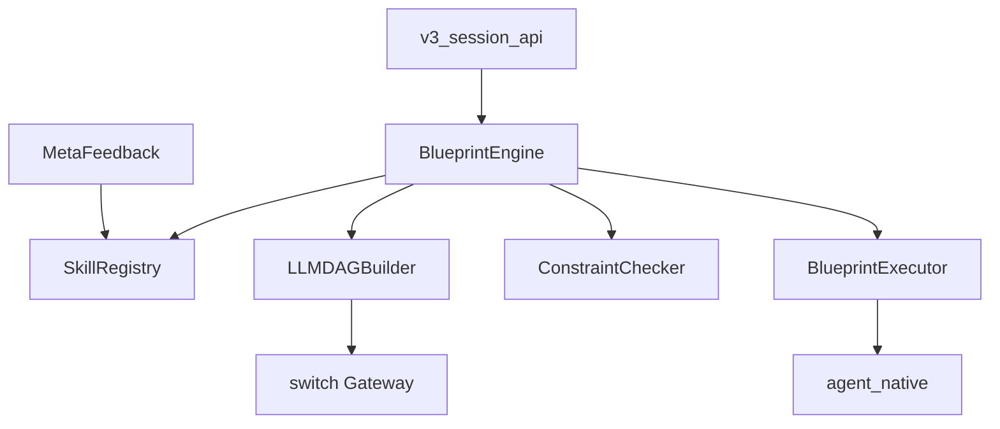

# ENGINEERING_BLUEPRINT.md

> Blueprint 编排层工程规格 — 数据契约 + 组件依赖 + 部署

---

## 一、数据契约

见 `core/agent/blueprint/models.py`:
- `BlueprintDAG`: nodes, edges, strategy, confidence, design_rationale
- `BlueprintNode`: node_id, chain, params, priority, checkpoint
- `BlueprintEdge`: from_node, to_node, data_key, required
- `ExecutionAudit`: request_id, blueprint_id, strategy, dag_quality_score

---

## 二、组件依赖图



---

## 三、启动序列

1. import → BlueprintEngine 实例化 (lazy load LLMDAGBuilder + SkillRegistry)
2. SkillRegistry 加载 5 内置模板
3. v3_session_api.send_message() 调用 BlueprintEngine.build()
4. 返回 task_graph 到前端

---

## 四、文件清单

```
core/agent/blueprint/
  __init__.py          (28L)  模块导出
  models.py           (148L)  数据模型
  skill_registry.py   (198L)  5模板 + 匹配
  llm_dag_builder.py  (270L)  发散/学习/收束
  engine.py           (213L)  引擎 + 约束检查
  executor.py         (175L)  DAG 执行
  meta_feedback.py    (168L)  异步学习

总计: ~1,200L
```
