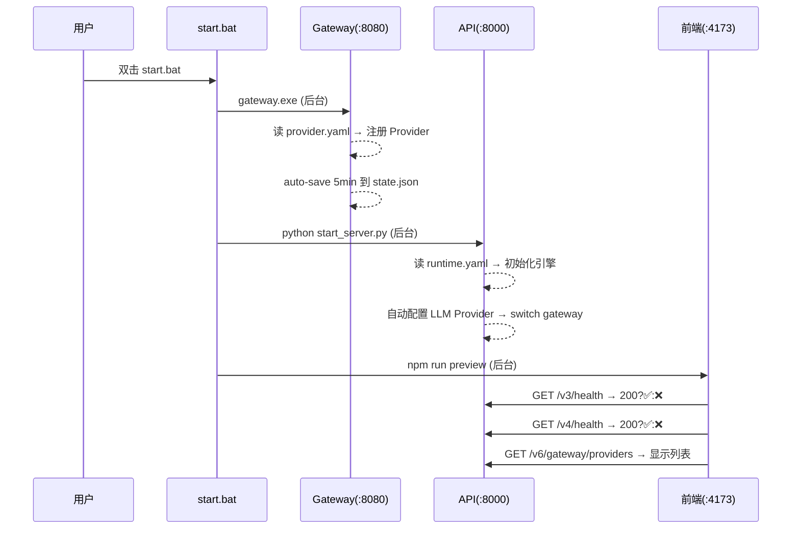
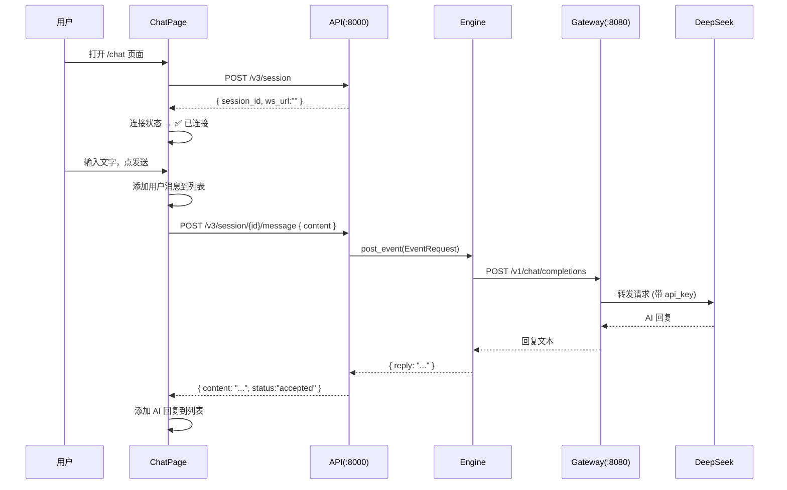
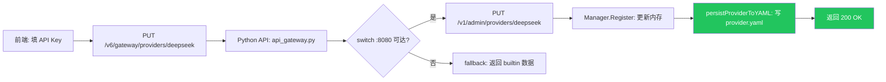
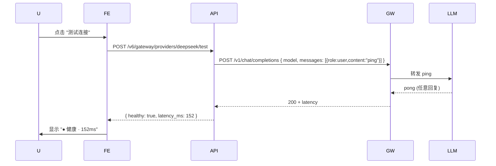
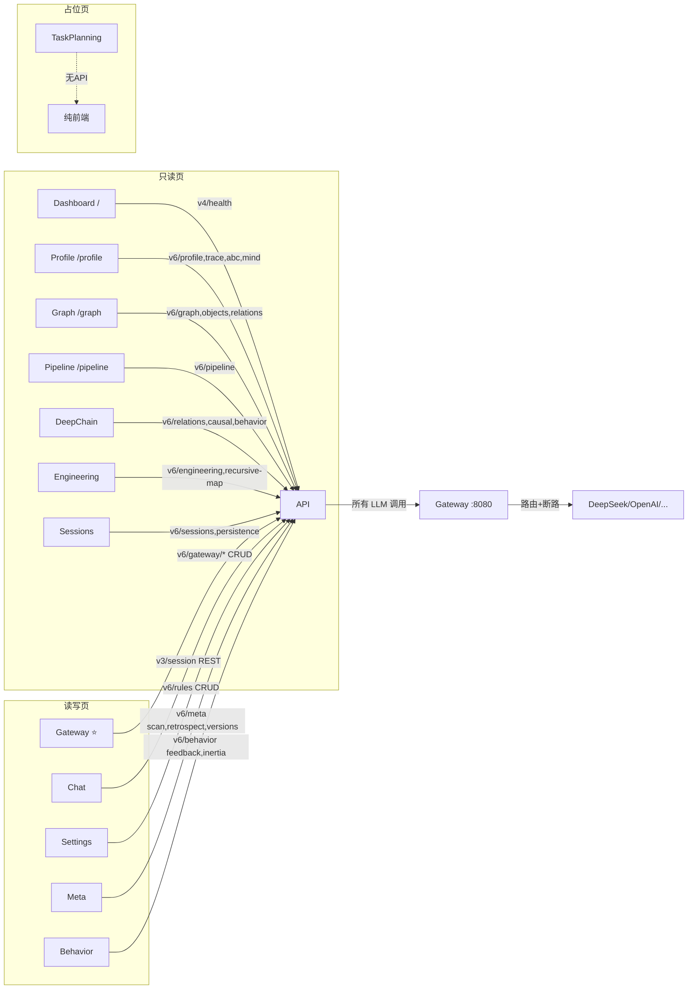

# DialogMesh v6 — 前端业务流 (Mermaid)

> 2026-07-20 · 基于 v6 api.py + v6.ts + *.tsx 源码提取

---

## 一、全局启动流



---

## 二、Gateway 页面 — Provider 管理 ⭐

```mermaid
flowchart TD
    A[打开 /gateway 页面] --> B[useV6Gateway 轮询 15s]
    B --> C{API 在线?}
    C -->|是| D[GET /v6/gateway/providers]
    C -->|否| E[用 DEFAULT_PROVIDERS 兜底]
    D --> F[显示 9 个 Provider 卡片]
    E --> F

    F --> G[用户点击 Provider 展开]
    G --> H[显示 API Key 输入框 + Base URL 输入框]

    H --> I{用户操作}
    I -->|填 key + 点保存| J[PUT /v6/gateway/providers/{name}]
    I -->|点测试连接| K[POST /v6/gateway/providers/{name}/test]
    I -->|点拉取模型| L[POST /v6/gateway/providers/{name}/models]

    J --> M[Gateway PUT /v1/admin/providers/{name}]
    M --> N[更新内存 + 持久化到 provider.yaml]
    N --> O[返回 200 → Provider 卡片变绿]

    K --> P[Gateway → 发 ping 到上游 LLM]
    P --> Q{连通?}
    Q -->|是| R[显示延迟 + ✅]
    Q -->|否| S[显示错误]

    L --> T[Gateway → 调 /models 端点]
    T --> U[显示模型列表]
```

---

## 三、对话 Chat 页面 — REST 流程



---

## 四、配置保存 — 持久化链路



**验证**: 关闭浏览器 → 重新打开 → `GET /v6/gateway/providers` → `configured: true`

---

## 五、测试连接 — 发 Ping 流程



---

## 六、前端 14 页 × 后端交互矩阵



---

## 七、数据流向总结

| 方向 | 路径 | 说明 |
|------|------|------|
| **读** | 前端 → API → 内存/Store | 14 页，40+ 端点 |
| **写(配置)** | 前端 → API → Gateway → provider.yaml | Key/URL 持久化 ✅ |
| **写(对话)** | 前端 → API → Engine → Gateway → LLM | V3 REST ✅ |
| **写(规则)** | 前端 → API → 内存规则库 | Settings 页 |
| **写(画像)** | 前端 → API → Engine Profile | Profile 页 |
| **轮询** | 前端 → API (15s) → Gateway (15s) | 自动健康检查 |

---

## 八、当前功能完成度

```
Gateway 管理:  读 ✅  写 ✅  测试 ✅  持久化 ✅
Chat 对话:    建会话 ✅  发送 ✅  回复 ⚠️ (concepts已修)
Profile:      读 ✅  编辑 ⚠️
Settings:     读 ✅  编辑 ⚠️ (字段名)
Meta:         读 ✅  扫描 ⚠️
Behavior:     读 ✅  反馈 ⚠️
其余 8 页:    读 ✅
```
