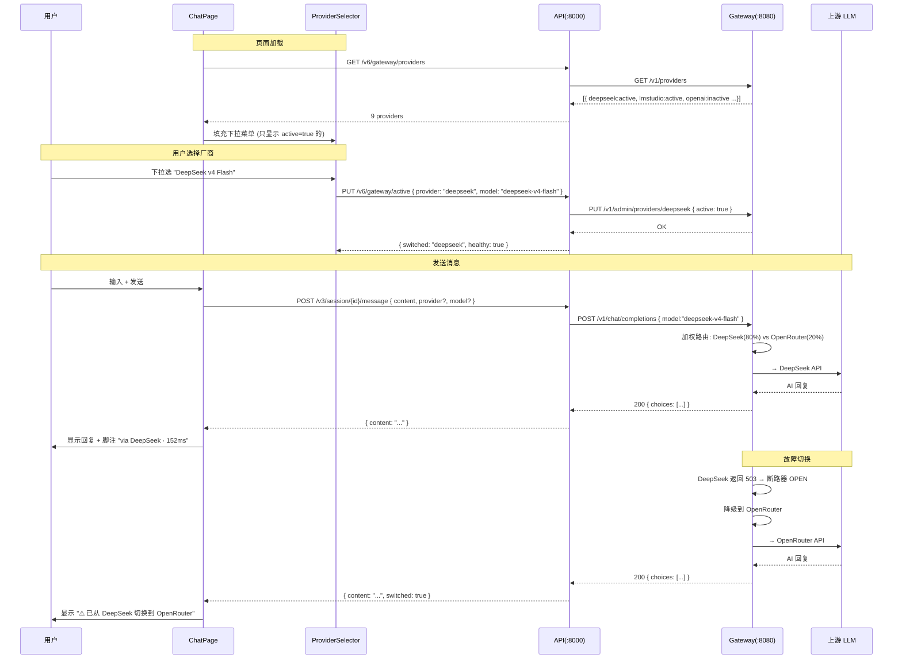
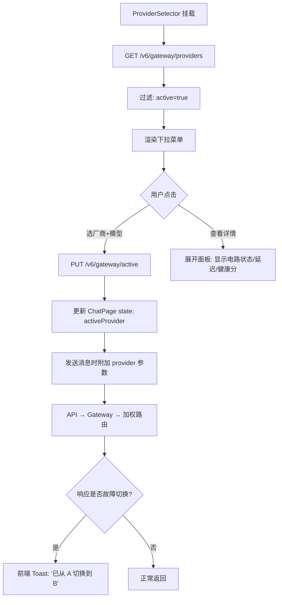

# DialogMesh v6 — 对话模型选择业务流

> 用户通过前端选择 LLM 厂商 → 发送时指定模型 → 网关加权路由 → 可见切换

---

## 完整流程

---

## ProviderSelector 组件交互

---

## 实现清单

| 功能 | 文件 | 状态 |
|------|------|:---:|
| Provider 下拉选择器 | ChatPanel.tsx (新增) | ❌ 未实现 |
| 当前 Provider 显示 | ChatPanel header | ❌ 未实现 |
| 发送时带 model 参数 | ChatPage.tsx handleUserMessage | ❌ 未实现 |
| 切换 Provider API | v6.ts setGatewayActive | ✅ 已有 |
| 加权路由 | Gateway routing.go | ✅ 已有 |
| 断路器+降级 | Gateway circuit.go | ✅ 已有 |
| 故障切换提示 | ChatPage 响应解析 | ❌ 未实现 |
