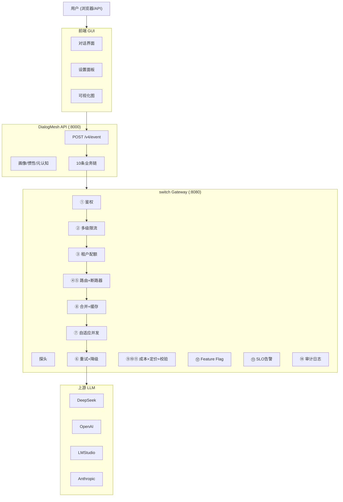

# DialogMesh v6 — 完整业务流 · 端到端

> 版本: v1.0 | 日期: 2026-07-20
> 覆盖: 10 条业务链 + 14 条网关业务线 + 全局状态机 + 系统调度器

---

## 一、端到端请求流



---

## 二、完整请求 Tick

```
1. 用户发送消息 → POST /v4/event
2. 对话树解析 (链01): EventIR → DiscourseBlockTree → 粘合度判定
3. 子图编译 (链10): compile_dialogue() → 6域上下文
4. switch Gateway 代理:
   ├─ ① 鉴权: Bearer Token → 放行/401
   ├─ ② 多级限流: IP(60r/s)→Key→Model→Provider
   ├─ ③ 租户配额: 模型白名单+Token上限+成本上限+软限制预警
   ├─ ④ 加权路由: health×latency×cost 选供应商
   ├─ ⑤ 断路器: CLOSED→发请求 / OPEN→降级
   ├─ ⑧ 请求合并: 同key并发→合并为1次调用
   ├─ ⑦ 自适应并发: Gradient2控制并发数
   └─ ⑥ 重试(3次)→降级→上游LLM
5. LLM 返回 → 对话树标注 (链02)
6. 行为发现 (链05): 统计A→B模式, 前端展示, 送审元认知
7. 关联链更新 (链06): L1句法→L1.5补全→L2语义→L2.5信念
8. 画像更新 (链08): LLM+BFI+结构信号 → OCEAN 10维
9. 元认知审核 (链09): 紧急/从容→复盘→回写
10. 持久化 (链04): Checkpoint + Git版本控制
11. 工程链验证 (链07): get_constraints_for → 约束检查
```

---

## 三、10 条业务链全景

| # | 链名 | 输入 | 处理 | 输出 | 成本 |
|:---:|------|------|------|------|:---:|
| 01 | 对话树 | 用户文本 | EventIR→粘合度→分块→上下文组装 | DiscourseBlockTree | Fast |
| 02 | LLM回复 | LLM输出 | 标注+快匹配→主题绑定 | DiscourseBlock标注 | Async |
| 03 | 用户修改 | PUT /v6/edit/* | 冲突检测→事件→版本控制 | NodeEditRecord | Fast |
| 04 | 持久化 | Slow Path触发 | HCWA+AnnotationStore→Git日志 | JSONL+Snapshot | Slow |
| 05 | 行为链 | 行为序列 | 统计发现→前端展示→送审元认知 | A→B模式 | Async |
| 06 | 关联链 | L2输出 | L1.5→L2→L2.5→L3→L4→L5 | 关系边+因果 | Async |
| 07 | 工程链 | 代码变更 | 约束推理+递归地图 | 约束+模式 | Async |
| 08 | 画像 | 多链信号 | LLM+BFI+结构→OCEAN+惯性 | 惯性权重图 | Async |
| 09 | 元认知 | 审核队列 | 紧急收敛/从容多视角→复盘 | 审核结果+回滚 | Slow |
| 10 | 子图 | 对话/审核请求 | 对话树+元认知双视角编译 | 跨域上下文 | Fast |

---

## 四、14 条网关业务线

| # | 业务线 | 触发 | 核心逻辑 |
|:---:|------|------|------|
| ① | API Key 鉴权 | 每请求 | 静态Key列表→动态KeyManager→401 |
| ② | 多级限流 | 鉴权后 | IP(60r/s)→Key→Model→Provider 令牌桶 |
| ③ | 多租户配额 | 限流后 | 模型白名单+Token上限+成本上限+软限制预警 |
| ④ | 加权路由 | 配额后 | health×latency×cost 加权随机 |
| ⑤ | 断路器 | 路由前 | 滑动窗口：CLOSED→OPEN(50%失败)→HALF_OPEN→CLOSED |
| ⑥ | 重试+降级 | 失败时 | 可重试(5xx/超时/429)→3次指数退避→降级→502 |
| ⑦ | 自适应并发 | 每100ms | Gradient2: RTT比值→加减并发 |
| ⑧ | 请求合并+缓存 | 发请求前 | 同key并发→1次调用；无状态缓存5min |
| ⑨ | 成本追踪 | 请求后 | pricing×tokens→按Key/Model/Provider聚合 |
| ⑩ | 定价同步 | 每天6:00 | litellm对比→差异>10%→WARNING |
| ⑪ | 成本校验 | 实时+每小时 | nil检查/cost=0/单价异常/增长率>50% |
| ⑫ | Feature Flag | 每请求 | hash(ReqID) % 100 < rollout_pct |
| ⑬ | SLO 燃烧率 | 每2分钟 | 1h/6h/30d三窗口→PAGER(>14.4x)自动回滚 |
| ⑭ | 审计日志 | Admin操作 | 9种操作类型, 1000条内存环 |

---

## 五、全局状态机

```
Command → WAL(持久化) → Decider → Event → evolve → State → 下一Tick

防广播风暴: 每次Tick只产1个Event
Event Sourcing: Event Log = 数据库, State = 投影
ShardedState: 按block_id分片, 非冲突事件并行evolve
Git版本控制: 8类数据SHA256链, 可回滚可审计
```

---

## 六、数据流闭环矩阵

```
✅ 用户输入 → 链01对话树 → 链10子图 → switch网关 → LLM回复
✅ LLM回复 → 链02标注 → 链06关联 + 链05行为
✅ 行为变化 → 链05发现 → 链08画像 → OCEAN参数反哺
✅ 画像变化 → 链08惯性 → 链09元认知 → 反馈全部链
✅ 约束违反 → 链07工程 → 链09元认知 → 告警
✅ 用户修改 → 链03编辑 + Git版本控制 → 链04持久化
✅ L4→L5因果 → 链06晋升 → CausalPromoter.assess() → 引擎自动触发
✅ 行为模式送审 → BehaviorDiscovery.submit_to_meta() → 引擎自动触发
✅ HCWA温度迁移 → TTLManager.tick() → 引擎自动触发
✅ 元认知自修复 → MetaSelfRepair.record_accuracy() → 引擎自动触发
```

---

## 七、四路径调度

```
Fast Path (<50ms):   EventIR → 粘合度 → 画像查询 → 上下文组装
                     只读State, 不产生Event

Async Path (50ms-10s): LLM回复 → 语义提取 → 行为记录 → Pattern发现
                       产生: ReplyGenerated, PatternDiscovered Event

Slow Path (10-60s):   Checkpoint → 元认知扫描 → 信念结晶 → TTL迁移
                      产生: MetaVerified, IntentLocked Event

Deep Path (>60s):     因果晋升 → 惯性压实 → 自我复盘
                      产生: CausalPromoted, InertiaCompacted Event
```

---

## 八、API 总览

```
DialogMesh API (:8000):        82 端点
switch Gateway (:8080):         8 端点
─────────────────────────────────────
总计:                          90 端点

新增元认知/版本/惯性/行为:      8 端点 (v6)
新增调度器/因果/降级:            3 端点 (P1)
新增因果/TTL/缓存:               4 端点 (P2)
```

---

## 九、实现状态

```
业务链文档:      13 篇 (3,841 行)
核心模块:        18 个 (P0+P1+P2)
引擎接线:        18/18 ✅
API端点:         90 (82 DialogMesh + 8 Switch)
Gateway业务线:   14/14 ✅
数据流闭环:      10/10 ✅

整体实现率:      ~75% (P3 8项架构缺口不影响核心闭环)
```
