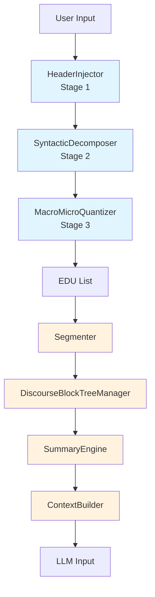
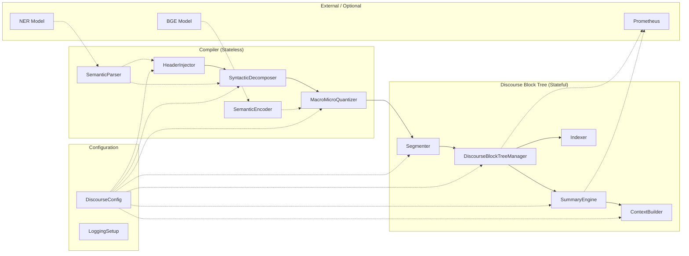
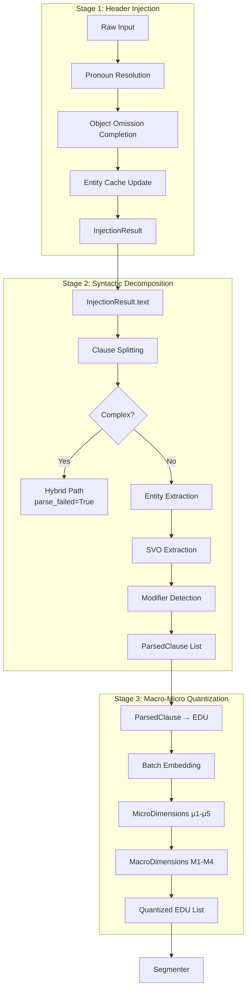
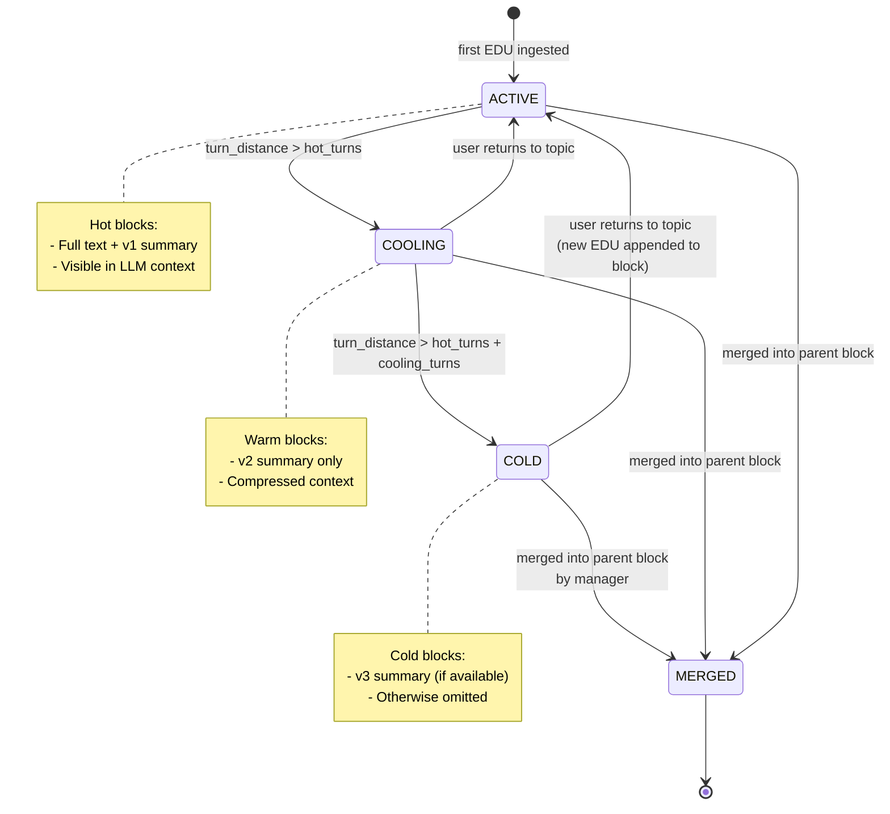
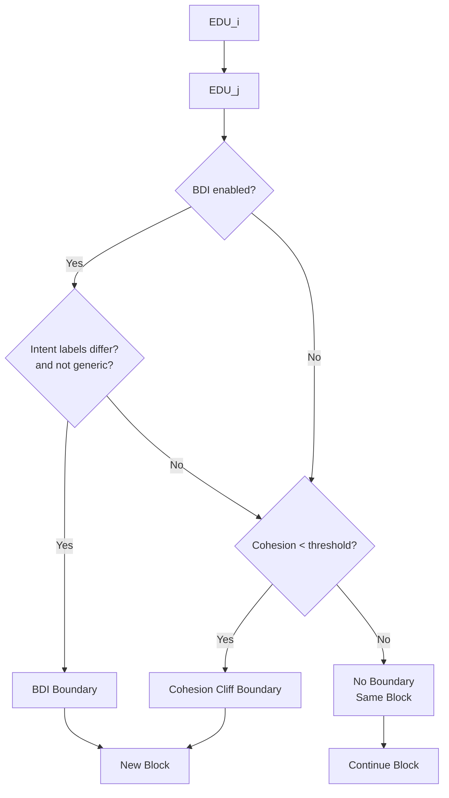
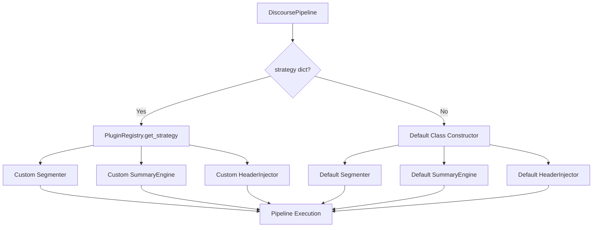
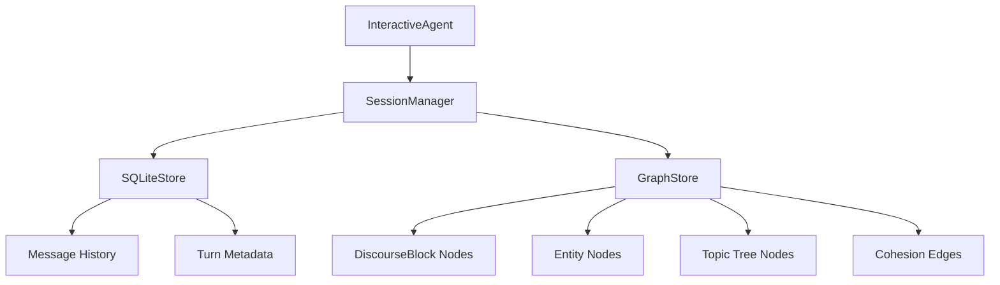

# MemoryGraph Architecture

> System architecture diagrams, data-flow pipelines, and state machines for the Discourse Block Tree.  
> All diagrams are rendered in Mermaid syntax and can be previewed in GitHub, VS Code, or any Mermaid-compatible viewer.

---

## 1. High-Level Data Flow



**Legend:**
- Blue = Compiler stages (stateless, deterministic)
- Orange = Discourse Block Tree management (stateful, lifecycle-aware)

---

## 2. Component Relationship Diagram



**Key relationships:**
- `SemanticEncoder` and `SemanticParser` are shared utilities consumed by multiple compiler stages.
- `DiscourseConfig` is read by every major component; values are snapshotted at construction time.
- `Indexer` maintains four-dimensional indices (time, entity, intent, turn) over the block tree for fast queries.
- Prometheus metrics are emitted optionally; the system falls back to plain-text if `prometheus-client` is not installed.

---

## 3. Compiler Three-Stage Pipeline



**Stage 1 details:**
- Resolution priority: coreference chains > same-turn reference > context nearest > causal KB > history pool > semantic similarity.
- Maintains per-session entity cache and coreference-chain cache.

**Stage 2 details:**
- Clause splitting uses Chinese/English punctuation regex (`。！？；.!?;`).
- Complexity detection triggers when: >5 clauses, ≥2 ambiguous conjunctions, or a long clause without entities.
- SVO extraction uses `SemanticParser` first; falls back to regex + dictionary lookup.

**Stage 3 details:**
- Batch embedding: collects all uncached EDU texts, encodes them in one BGE forward pass, then populates the cache.
- Micro dimensions are computed per-EDU (intra-EDU density).
- Macro dimensions are computed per adjacent pair (inter-EDU cohesion).

---

## 4. DiscourseBlock Lifecycle State Machine



**State definitions:**

| State | Condition | Context Tier |
|-------|-----------|--------------|
| `ACTIVE` | `current_turn - end_turn ≤ hot_turns` | Hot (full text + v1) |
| `COOLING` | `hot_turns < distance ≤ hot_turns + cooling_turns` | Warm (v2) |
| `COLD` | `distance > hot_turns + cooling_turns` | Cold (v3 or omitted) |
| `MERGED` | Block was absorbed into a parent block | Removed from independent context |

**Transitions are triggered by:**
- `DiscourseBlockTreeManager._update_block_states()` — called on every `ingest_turn()`.
- Manager merge logic — when a new block's cohesion with the active block exceeds `merge_threshold`.

---

## 5. Segmenter Boundary Detection Logic



**Boundary priority:**
1. BDI (Burst Drift of Intent) — highest priority, forced split regardless of cohesion.
2. Cohesion Cliff — second priority, splits when the fused 9-dimensional score drops below `threshold`.
3. No boundary — EDU continues the current block.

---

## 6. Context Builder Assembly Logic

```mermaid
flowchart TD
    A[Get all blocks] --> B[Sort by start_turn]
    B --> C{For each block}
    C --> D{turn_distance ≤ hot_turns?}
    D -- Yes --> E[Format as Hot:<br/>full_text + v1]
    D -- No --> F{turn_distance ≤ hot_turns*2?}
    F -- Yes --> G[Format as Warm:<br/>v2 (fallback v1)]
    F -- No --> H[Format as Cold:<br/>v3 (fallback v2 → archived)]
    E --> I[Join with newlines]
    G --> I
    H --> I
    I --> J[Return context string]
```

---

## 7. Plugin System Architecture



**PluginRegistry** is a global, module-level registry. It supports:
- `register_strategy(name, component_type, factory_func)`
- `get_strategy(component_type, name=None)` — returns default if name missing.
- `list_strategies()` — introspection for debugging.
- `unregister_strategy()` / `clear()` — for testing and hot-swapping.

---

## 8. Metrics Export Flow

```mermaid
flowchart LR
    A[DiscoursePipeline.process_turn] --> B{success?}
    B -- Yes --> C[inc_discourse_requests]
    B -- Yes --> D[observe_discourse_latency]
    B -- Yes --> E[inc_edu_processed]
    B -- Yes --> F[inc_total_blocks]
    B -- Yes --> G[set_active_blocks]
    B -- Yes --> H{v3 triggered?}
    H -- Yes --> I[inc_v3_triggered]
    B -- No --> J[record_error]

    C --> K[MetricsCollector]
    D --> K
    E --> K
    F --> K
    G --> K
    I --> K
    J --> K

    K --> L[to_prometheus]
    K --> M[discourse_summary]
    L --> N[/metrics endpoint or log]
    M --> O[In-memory snapshot]
```

**Prometheus text format fallback:**
If `prometheus-client` is not installed, `MetricsCollector.to_prometheus()` still produces a valid Prometheus exposition string (lines of `# TYPE ...` and `name value`). The only difference is that no `MetricFamily` objects or `CollectorRegistry` are used — the output is built with pure string concatenation.

---

## 9. Session / Persistence Overview (Future)



*Note: Persistence layer is implemented in `core/agent/persistence/` but is outside the scope of the real-time DiscourseBlockTree pipeline. The pipeline can be run entirely in-memory without SQLite or graph stores.*
