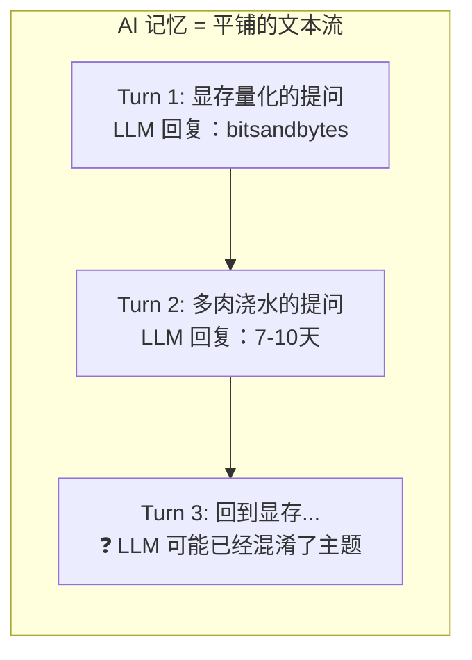
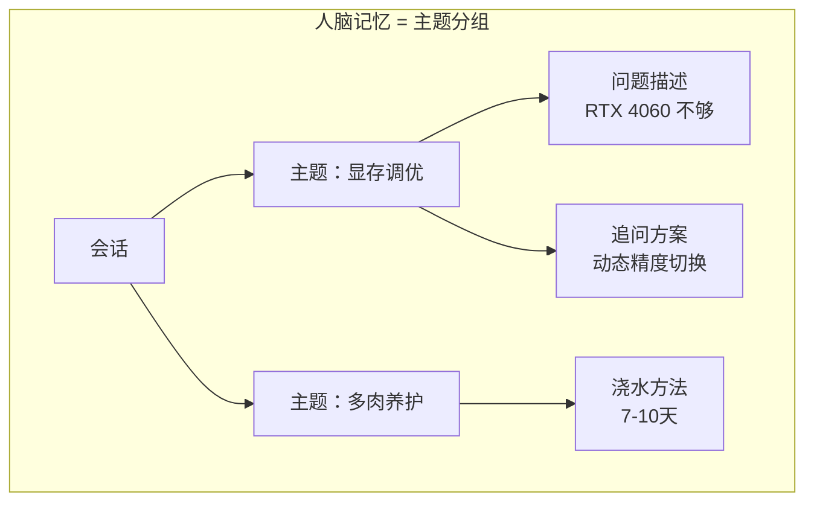
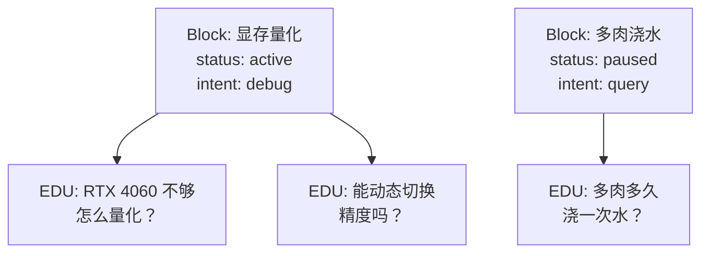

# Chapter 1：为什么对话需要一棵树？

> 居家办公时，一边调试本地大模型显存量化，一边操心窗台多肉养护，和 AI 聊天来回切换两个完全无关的话题。人脑能分开存储两套主题记忆，切换不混乱；但通用 AI 的线性上下文会把所有内容揉在一起，频繁跨话题后极易信息串台、重复沟通。

---

## 一、问题：AI 没有"换话题"这个概念

当你在 ChatGPT 里这样聊天时——

```text
你：我的 RTX 4060 显存不够，怎么量化？
AI：可以用 bitsandbytes 做 4bit 量化，显存占用降低约 60%...

你：对了，多肉多久浇一次水？
AI：多肉一般 7-10 天浇一次，见干见湿...

你：刚才那个量化方案，能不能在推理时动态切换精度？
AI：❓（可能混淆了上下文）
```

**AI 的记忆是这样组织的：**



所有内容按时间顺序排成一条线。当你说"刚才那个量化方案"时，AI 很难准确定位"刚才"是哪个话题块——因为在线性文本流里，上个话题的信息已经被新话题稀释了。

这不是 LLM 的错，这是**记忆结构**的问题。

**人脑的做法完全相反：**



人脑的记忆组块本身没有固定结构——激活时呈网状（图），推理时压缩为树状（结构化索引）。
对话块树借鉴了这种灵活性。每个块上的指针用伪代码表达：

```python
# 块间指针（cross_ref）
pointer = 0     # 指向父块（默认，无跨分支引用）
pointer = 1     # 指向另一分支的单个相关块
pointer > 1     # 指向跨分支引用数组，支持多跳联想
```

这就是**树-图混合结构（Tree-Graph Hybrid）**：
存储和检索时是图状联想网络，呈现给 LLM 时压缩回树状索引。
指针值为 0 时就是普通树结构，>0 时开启了跨分支联想能力。

## 二、方案：对话块树（Discourse Block Tree）

核心思路很简单：**不要按时间顺序存对话，按主题分组存。**

每个"主题块"（DiscourseBlock）记录三样东西：

```python
@dataclass
class DiscourseBlock:
    block_id: str           # 块的唯一 ID
    parent_id: str | None   # 父块 ID（= 归属哪个话题）
    primary_intent: str     # 这个块在聊什么（主题标签）
    atomic_units: list      # 这个话题下的多条对话记录
    status: str             # 活跃 / 暂停 / 冷却
```

当系统读到一句新对话时，它做三件事：

1. **检测是否是话题切换**——关键词"对了"、"另外"、"回到刚才那个"会触发新分支
2. **创建新块或回溯到旧块**——如果是新话题，新建一个块挂在当前话题下；如果是回溯，定位到对应的旧块
3. **标记块温度**——频繁访问的块"热"，长时间不碰的块"冷"，释放缓存空间

```python
tree = DiscourseBlockTreeManager()

# Turn 1: 系统创建根块
tree.ingest_turn(1, "RTX 4060 显存不够，怎么量化？")

# Turn 2: 检测到"对了"→ 话题切换，创建子块
tree.ingest_turn(2, "对了，多肉多久浇一次水？")

# Turn 3: 检测到"回到"→ 回溯到 Turn 1 的块
tree.ingest_turn(3, "回到刚才那个量化方案，能动态切换精度吗？")
```

**完整的状态是这样的：**



当你说"回到刚才那个"时，系统不是去最后几轮对话里翻，而是直接在你的主题树上找到"显存量化"的块，激活它，**继续原来的话题上下文**。

---

## 三、比 Context Window 好在哪？

你可能会问：LLM 不也有 context window 吗？

区别在于：

| | 线性 Context Window | 对话块树 |
|---|---|---|
| 存储结构 | FIFO 队列，先进先出 | 树状主题索引 |
| 话题切换 | 旧内容被挤出窗口 | 旧内容保持完整 |
| 回溯机制 | 需要重新输入上下文 | 索引定位（平均 O(1)）|
| 缓存策略 | 无差异，全量保留最近 N 轮 | 热/温/冷三级温度管理 |

Context window 主要解决单次推理的 token 容量问题，对话块树聚焦多话题记忆的精准检索——二者是互补关系而非替代关系：对话树筛选出对应话题内容后，仍需填入上下文窗口供 LLM 消费。

---

## 四、一个真实的运行轨迹

这是我们跑的一个 98 轮综合测试中的一段（话题切换测试集）：

```text
[39] 帮我写Python函数处理日志文件                → 创建块 A: "写日志函数"
[40] 对了，昨天那个神经网络训练停了是什么情况？      → 检测到"对了"，创建块 B: "训练中断"
[41] 回到刚才那个日志函数，要加上异常处理           → 检测到"回到"，回溯到块 A
[42] 另外之前说的磁盘告警阈值设了吗？              → 检测到"另外"，创建块 C: "磁盘告警"
...
```

系统的 `divergence（话题发散度）`（话题发散度）会在每次话题切换时上升，连续同话题对话时下降。在我们的测试中，`divergence` 从 0.00 上升到 **0.28**——说明系统正确检测到了 9 个测试场景中的多次话题切换。

```
Profile: meta=0.86, div=0.28, conf=0.52
```

---

## 下一期预告

对话树解决了"找得着"的问题，但它还不会**从用户的纠正中学习**。

"不对，不要删那个文件"——当用户纠正你时，系统应该记住这个教训，下次不再犯同样的错误。这就是 **BehaviorGraph（行为图）** 要做的事。


---

**Chapter 2 预告：** 本文是对话块树的概念引入。Chapter 2 将给出 DialogMesh v3.2 **11 模块管线**的完整设计概览，包括每个模块的接口定义、数据流向图和代码落地路径。

---

> **DialogMesh** 是一个开源的 LLM 对话架构项目，地址：[github.com/aptshark-g/DialogMesh](https://github.com/aptshark-g/DialogMesh)
> 


---

## 附录：技术细节与相关工作

> 本节面向想深入了解对话树架构细节、设计决策依据、以及与其他记忆系统深度对比的读者。

---

### 一、对话树的理论基础

对话树并非凭空设计。它的核心思想来源于三个经典话语理论：

#### 1. Grosz & Sidner 话语结构理论（1986）

Grosz 和 Sidner 将话语理解为三层结构：
- **语言结构（Linguistic Structure）**：话语的实际文本序列，以话语段（discourse segment）为基本单位
- **意图结构（Intentional Structure）**：说话者的目的以及话语段之间的意图关系（dominance、satisfaction-precedence）
- **注意力状态（Attentional State）**：当前对话的焦点，随话题切换而转移，通过焦点栈（focus stack）管理

我们的 **DiscourseBlock** 对应语言结构中的话语段，每个块是一次完整话题讨论的最小语义单位。块间的 **cross_ref** 对应意图结构中的意图关系——当用户说"回到刚才那个问题"时，系统不是通过文本相似度猜测，而是通过 cross_ref 的 dominance 关系在焦点栈中精确定位到前一个相关块。**多级摘要**（v1-v3）对应注意力状态的焦点摘要——焦点移开后，当前块的内容被压缩为三级摘要而非直接丢弃。

我们实现的 segmenter.py 中的 Segmenter 类使用 _merge_isolated 和边界检测逻辑，其核心思路直接继承自 Grosz & Sidner 的线索短语（cue phrase）和边界词方法。我们还增加了一个关键改进：当检测到潜在边界但后续轮次的验证信号不足时（例如用户只是短暂插话而非真正切换话题），边界被标记为"软边界"而非硬分割，后续对话可以桥接两个块。

#### 2. 修辞结构理论（RST, Mann & Thompson, 1988）

RST 定义了一组核心-卫星关系（nucleus-satellite relations）来描述文本片段间的语义联系，例如 elaboration（详细说明）、justification（证明）、volitional-result（意图性结果）等。

我们的 **cross_ref.ref_type** 类型直接映射到 RST 的关系分类：
- **analogy**：类比关系（对应 RST 的 similarity）
- **continuation**：续接关系（对应 RST 的 sequence）
- **correction**：修正关系（对应 RST 的 antithesis）
- **see_also**：参考关系（对应 RST 的 elaboration）
- **behavior_similar**：行为相似（v3.2 扩展，RST 无直接对应）

不同之处在于 RST 是静态文本分析（论文写完后标注），而我们的 cross_ref 是在对话过程中动态建立的——系统在运行中自动检测话题关系并建立引用。

#### 3. TextTiling（Hearst, 1997）

> 说明：RST 和 TextTiling 原版针对静态文本设计。本文借鉴其核心思路，针对交互式对话场景做了大量适配修改——包括动态跨块引用、三级边界检测、长话题拆分等——不完全等同于原版算法。

TextTiling 是经典的话题分割算法，基于词袋相似度（相邻窗口的 cosine similarity）检测话题边界。我们在 segmenter.py 中实现了相似的滑动窗口方法，但做了两处重要改进：
1. **伪边界过滤**：低置信度边界标记为软边界而非硬分割，允许后续对话桥接两个块
2. **长话题拆分**：单块轮数超阈值时自动拆分，防止块膨胀（阈值可配置，默认 20 轮）

---

### 二、对话树的实现架构

#### 1. DiscourseBlock 数据模型

每个 DiscourseBlock 承载五个维度的信息：

```python
@dataclass
class DiscourseBlock:
    block_id: str            # 全局唯一 ID（块创建时生成）
    turn_range: tuple        # [start_turn, end_turn]
    primary_intent: str      # HARD_BOUNDARY 语法树提取的主要意图
    entities: list           # 命名实体列表
    utterances: list         # 原始话语
    coherence_score: float   # 块内连贯度（TextTiling 评分）
    cross_refs: list         # 跨块引用索引
    group_refs: list         # 超边引用（v3.2 新增）
    temperature: str         # HOT / WARM / COLD / FROZEN
```

**温度管理系统**（temperature）是对话树的运行状态管理核心：
- **HOT**：当前活跃块，在上下文窗口内
- **WARM**：近期块，在短期记忆中
- **COLD**：历史块，已归档但可通过 cross_ref 回升
- **FROZEN**：会话边界外的永久归档块

温度转换规则：新块创建时 HOT，窗口滑动后转为 WARM，访问间隔超过阈值后转为 COLD，会话结束时所有块转为 FROZEN。

#### 2. 话题切分与三级边界检测

边界检测使用三级策略，对应不同的检测信源和切换强度：

| 级别 | 检测方法 | 切换强度 | 典型触发 |
|:----:|:---------|:--------:|:---------|
| L0 硬边界 | 语法树 cue phrase 匹配 | 强 | "对了"、"说起来"、"回到" |
| L1 软边界 | TextTiling 余弦下降 | 中 | 话题自然过渡 |
| L2 隐式边界 | 时间间隔 + 话题恢复 | 弱 | 沉默后重启 |

L0 硬边界：HARD_BOUNDARY 语法树（compiler 的规则引擎）检测到明确的话题切换词。这是最可靠的切换检测。
L1 软边界：当 TextTiling 检测到词袋相似度下降超过阈值但无 cue phrase 匹配时，标记为软边界。后续轮次可能确认或撤销。
L2 隐式边界：当用户长时间沉默后重新开启对话，或从其他应用切回时，系统根据时间间隔和语义分析判断是否需要新建块。

#### 3. 跨块引用（CrossReference / GroupReference（超边引用））

每个 cross_ref 记录五维信息：

```python
@dataclass
class CrossReference:
    target_block_id: str   # 目标块
    ref_type: str          # analogy / continuation / correction / see_also / behavior_similar
    strength: float        # 引用强度 0.0-1.0
    created_at_turn: int   # 创建轮次
    source: str            # manual / auto_entity / auto_graph
```

**GroupReference** 是 v3.2 新增的扩展，支持超边（hyperedge）连接：当 A、B、C 三个块共同指向一个结论 D 时，GroupReference 记录完整的 N 路连接而非两两配对。这在类比推理和复杂话题引用场景中很常见——例如"RTX 4060 显存不足"+"上次调优推荐系统也遇到过"+"最终用梯度累积解决"——三者放在一起才构成完整类比，pairwise 连接会丢失信息。

#### 4. 三级摘要流水线（v1-v4）

每个块同时维护三级摘要，加载上游 L1Summary 模块：

```
v1 原文摘要：提取块内关键语句（keyword extraction）
v2 实体级摘要：命名实体 + 动作类型 + 主题词
v3 里程碑级摘要：错误发生 / 用户纠正 / 结论达成
v4 LLM 压缩（可选）：LLM 生成极简话题摘要
```

默认使用 v1-v3，全部在本地完成。v4 需要外部 LLM provider（DeepSeek 可用）。v4 的输出是约 80-120 字的极简话题摘要，用于快速概览。

#### 5. 对话树与行为图的融合

对话树不存储行为权重——那是 BehaviorGraph 的职责。二者通过 edge_id 形成松耦合引用关系：

```
DiscourseBlock.cross_refs  →  引用 BehaviorGraph 的 edge_id（非权重）
BehaviorGraph.edges        →  存储权重、样本数、纠正次数、激活计数
```

这种分离设计的好处：
- **剪枝不影响话题结构**：BehaviorGraph 可以裁剪低活跃度的边，TopicTreeNode 中的引用标记为 orphaned 而非删除——拓扑结构保留供历史回溯
- **话题切换不影响权重学习**：BehaviorGraph 的 EMA 权重更新不依赖话题边界信息
- **可以独立优化**：对话树的摘要策略和行为图的学习策略可以分别调优

---

### 三、与其他记忆系统的深度对比

#### 1. 原生 Context Window（GPT-4 / Claude）
整段对话平铺成线性 prompt。话题切换后旧信息被动留在上下文中，直到被新内容按 FIFO 策略挤出窗口。
- 话题跟踪：无。系统不知道哪些 token 属于哪个话题。
- 回溯准确率：低。"回到刚才那个"只能靠文本相似度猜测。
- 与我们的关键差异：我们显式建模话题结构，回溯通过块 ID 精确定位。

#### 2. LangChain 记忆系统

> 客观说明：LangChain 拥有成熟的插件系统、生产级部署方案和活跃的社区生态，在工程成熟度上远超当前项目阶段。我们的设计在话题结构上更有优势，但整体生态完整性远不及 LangChain。

LangChain 的三种记忆模式全是纯文本操作，没有话题结构建模：
- **ConversationBufferMemory**：等同于原生 Context Window
- **ConversationSummaryMemory**：定期 LLM 摘要。摘要压缩时丢失的正是话题边界处的信息——我们的三级摘要确保话题核心不被压缩
- **VectorStoreRetrieverMemory**：语义相似度召回文本片段，但没有话题边界意识。召回的是"跟这句话语义相似的前文"而非"前一个话题块"

#### 3. MemGPT / Letta（2024）

> 客观说明：MemGPT 的标准化记忆读写函数和长期记忆持久化方案经过充分工业验证。我们的对话树在话题感知上有创新，但记忆持久化的可靠性尚需积累。

结构化记忆管理：工作记忆（LLM 上下文窗口）、外化记忆（数据库长期存储）、记忆函数（write/retrieve/forget）。但 MemGPT 的检索是上下文无关的固定大小文本块——它不知道哪些块属于同一个话题。我们的对话树在此基础上增加了话题结构。

#### 4. 腾讯 HY-Memory（2026）

> 客观说明：HY-Memory 已在腾讯内部大规模线上验证，跨会话记忆的完整性是其核心优势。我们更多的是在不同维度（行为学习、画像、因果）上实现差异化。

HY-Memory 是目前与我们最相关的系统。其完整架构：

**双系统设计（System1/System2）：**
- **System1（快速路径）**：轻量级键值匹配 + 向量检索，毫秒级返回。处理大多数日常查询。
- **System2（深度路径）**：LLM 驱动的记忆理解和推理。仅在 System1 置信度不足时激活。负责决定什么信息值得写入长期记忆。
- **System1/System2 之间的置信度阈值**是 HY-Memory 的核心调优参数。我们吸收了这一点，hy_memory_mode 中使用 0.6 作为 System1 置信度阈值。

**跨会话记忆管理：**
- 会话结束时的记忆评分流程：统计本次会话中的关键信息 -> 对每条信息进行重要性打分 -> 高于阈值的信息持久化到长期记忆
- 新会话启动时的恢复流程：从长期记忆中召回高重要性信息 -> 重建当前会话的上下文
- 评分因子包括：用户主动标记、引用次数、语义密度

**显式重要性评分：**
- 每条记忆有一个明确的 importance 分数（0.0-1.0）
- 重要性高的信息即使使用频率低也不会被淘汰
- 与我们的 BehaviorGraph 机制对比：HY-Memory 是显式评分（主动决定），我们是隐式统计（通过 EMA 权重和激活计数被动反映）

**与我们的详细对比：**

| 维度 | HY-Memory | 我们的对话树 + 行为认知框架 |
|:-----|:----------|:-------------------------|
| System1/System2 | 键值检索 -> LLM 推理 | 已吸收为 hy_memory_mode（4 轨道融合） |
| 话题结构 | 无（纯文本块） | DiscourseBlock + 三级摘要 + 超边引用 |
| 跨会话记忆 | 完整支持 + 重要性评分 | 部分（merge_session，图边待实现） |
| 行为学习 | 无 | BehaviorGraph EMA 四因子权重 |
| 用户画像 | 无 | CognitiveProfile 8 维稳定画像 |
| 行为预测 | 无 | Predictor LLM 候选生成 + 四维排序 |
| 融合引擎 | 双系统简单合并 | 4 轨道 x 3 阶段 + 战略阶段 4 |
| 安全护栏 | 无 | NegativeKB 三级熔断 + do-calculus |
| 因果推理 | 无 | CausalSubstrate 8 元角色 + DoCalculus |
| 图检索 | 文本向量检索 | BGE 语义级联 + 多跳扩展 + ColdIndexer回升 |

#### 5. 学术论文方案

**HyperMem（ACL 2026 接收，思路待公开）：**
三级超图：主题（Topic）-> 片段（Episode）-> 事实（Fact）。通过加权超边连接同级别节点。检索时粗到细遍历：Topic -> Episode -> Fact。使用 RRF（Reciprocal Rank Fusion）融合 BM25 和稠密向量嵌入。我们吸收了超边思想到 GroupReference，RRF 融合到 waterwave_activate（语义级联检索） 的 BGE+token 混合相似度计算。

**TiMem（ACL 2026 Findings 接收，思路待公开）：**
时序分层记忆。核心贡献是复杂性感知的检索策略：简单查询检索少量高精度结果，复杂查询检索更多结果。我们吸收了 ComplexityScorer，但用激活计数取代了 TiMem 的时间衰减机制——我们认为"用户做了这个行为 N 次"比"30 天前做了这个行为"更有意义。

**HiGMem：**
LLM 引导的分层记忆。核心贡献是证据判断过滤：将候选记忆交给 LLM 判断相关性，仅在证据充分时才纳入长期记忆。我们吸收了 LLM 证据判断到 ProfileUpdater._judge_evidence()，同时增加了 trait 级别的过滤控制（仅对 neuroticism / risk_tolerance 等高噪声 trait 启用）。

---

### 四、从相关系统中吸收的内容（已实现一览）

| 来源 | 吸收内容 | 实现位置 | 状态 |
|:-----|:---------|:---------|:-----|
| HY-Memory | 多跳图检索 expand_hops | integration.py waterwave_activate | DONE |
| HY-Memory | 显式重要性评分 importance | behavior_graph/models.py | DONE |
| HY-Memory | System1/System2 hy_memory_mode | integration.py process() | DONE |
| HY-Memory | 跨会话 merge_session | predictor/cognitive_profile.py | DONE |
| HY-Memory | 自演化事件 _fire_event | integration.py | DONE |
| HY-Memory | 批处理 ConsolidationCycle | consolidation.py | DONE |
| HyperMem | 超边 GroupReference | discourse_block_tree/models.py | DONE |
| HyperMem | RRF 融合 BGE+token | integration.py waterwave_activate | DONE |
| TiMem | 复杂性感知 ComplexityScorer | integration.py waterwave_activate | DONE |
| HiGMem | LLM 证据判断 | predictor/cognitive_profile.py | DONE |
| Generative Agents | 反思式更新 | consolidation.py / metacognition.py | DONE |
| Reflexion | 自我评估 | metacognition.py MetaCognitionAdapter | DONE |

---

### 五、已知局限

1. **LLM 压缩依赖。** L2 Summary v4（LLM 生成的极简话题摘要）需要外部 provider。已实现 keyword 降级路径，provider 不可用时自动降级到 v3 关键词摘要。

2. **元认知未自动接入管线。** MetaCognitionAdapter 功能正常且经 DeepSeek 验证，已默认启用，调度器按 token 阈值或变化检测自动触发评估。结果目前仅记录，暂不反馈管线决策。

3. **图边不跨会话。** CognitiveProfile 支持跨会话合并（merge_session），但 BehaviorGraph 边仅在单会话内有效。跨会话的图边持久化方案已设计：高重要性边从 Layer 2 存入 Layer 3 ColdIndexer，新会话启动时回升。已通过 ColdIndexer save/load 实现：会话结束时调用 save()，新会话启动时 load() 回升。

4. **单用户焦点。** 整个系统为单用户场景设计和测试。多用户隔离（BehaviorGraph 按 user_id 分片、每用户独立画像）需要架构层面改动。

5. **BGE 模型依赖。** 水波语义级联（waterwave_activate）依赖 BAAI/bge-small-zh-v1.5（384 维嵌入）。已支持首次加载自动下载，无需手动预装。网络不可用时降级为 token 重叠，首轮加载约 2.5 秒。

---

### 六、相关项目

| 项目 | 范围 | 与我们的关键差异 |
|:-----|:-----|:-----------------|
| **HY-Memory（腾讯）** | 记忆管理 | 无行为学习/画像/因果/安全；有完整的跨会话和 System1/System2 |
| **HyMEM** | GUI 代理记忆 | 针对 GUI 轨迹非通用对话；图检索算法有参考价值 |
| **HyperMem（ACL 2026 接收，思路待公开）** | 超图记忆 | 粗到细检索类似；我们增加行为图 + 融合引擎 + 画像 |
| **TiMem（ACL 2026 Findings 接收，思路待公开）** | 时序记忆 | 复杂性感知类似；我们用激活计数取代时间衰减 |
| **HiGMem** | LLM 引导记忆 | 证据判断过滤类似；我们增加因果推理 + 安全护栏 |
| **Zep / Graphiti** | 时序知识图 | 事件驱动的实体关系图（距离较远，P3+ 考虑） |
