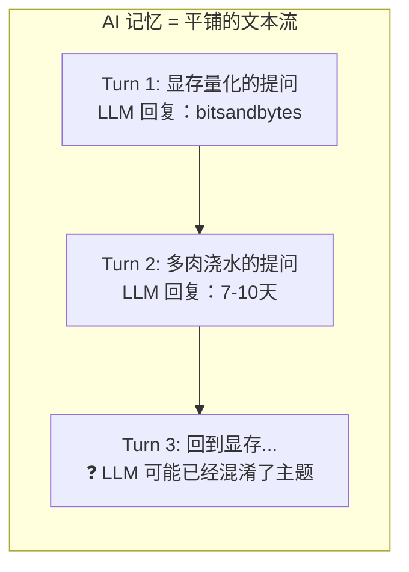
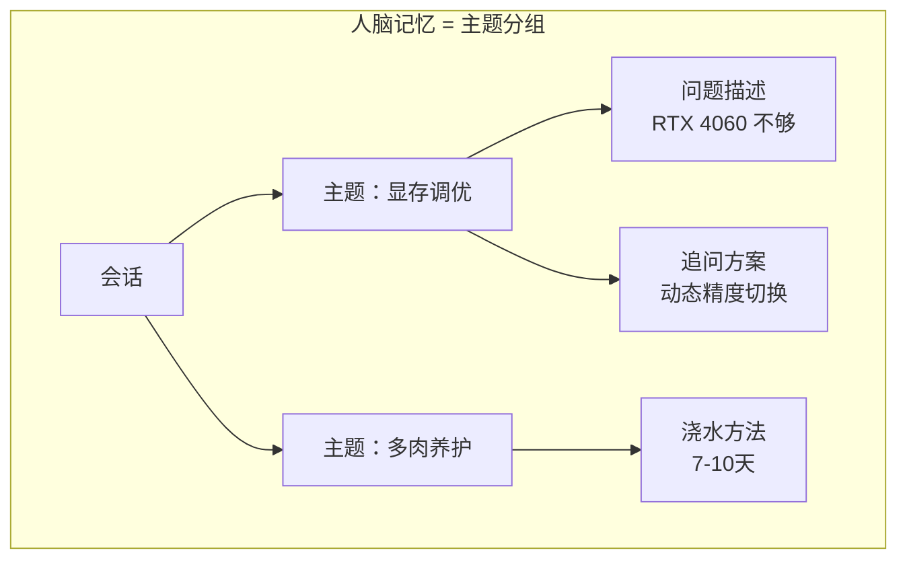
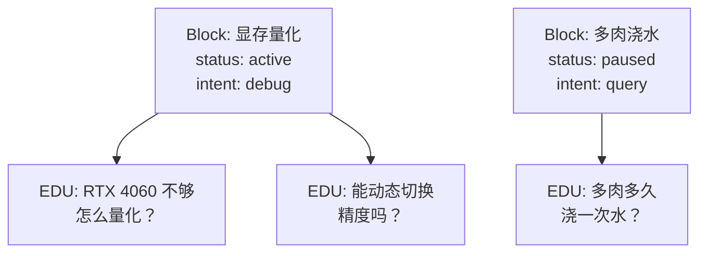

# Chapter 1：为什么对话需要一棵树？

> 居家办公时，一边调试本地大模型显存量化，一边操心窗台多肉养护，和 AI 聊天来回切换两个完全无关的话题。人脑能分开存储两套主题记忆，切换不混乱；但通用 AI 的线性上下文会把所有内容揉在一起，频繁跨话题后极易信息串台、重复沟通。

---

## 一、问题：AI 没有"换话题"这个概念

当你在 ChatGPT 里这样聊天时——

```text
你：我的 RTX 4060 显存不够，怎么量化？
AI：可以用 bitsandbytes 做 4bit 量化，显存占用降低约 60%...

你：对了，多肉多久浇一次水？
AI：多肉一般 7-10 天浇一次，见干见湿...

你：刚才那个量化方案，能不能在推理时动态切换精度？
AI：❓（可能混淆了上下文）
```

**AI 的记忆是这样组织的：**



所有内容按时间顺序排成一条线。当你说"刚才那个量化方案"时，AI 很难准确定位"刚才"是哪个话题块——因为在线性文本流里，上个话题的信息已经被新话题稀释了。

这不是 LLM 的错，这是**记忆结构**的问题。

**人脑的做法完全相反：**



话题分叉后，树状结构让系统能精准定位"上一个话题块"在哪里——因为块信息没有被新话题覆盖，它们以**树的形式共存**。

---

## 二、方案：对话块树（Discourse Block Tree）

核心思路很简单：**不要按时间顺序存对话，按主题分组存。**

每个"主题块"（DiscourseBlock）记录三样东西：

```python
@dataclass
class DiscourseBlock:
    block_id: str           # 块的唯一 ID
    parent_id: str | None   # 父块 ID（= 归属哪个话题）
    primary_intent: str     # 这个块在聊什么（主题标签）
    atomic_units: list      # 这个话题下的多条对话记录
    status: str             # 活跃 / 暂停 / 冷却
```

当系统读到一句新对话时，它做三件事：

1. **检测是否是话题切换**——关键词"对了"、"另外"、"回到刚才那个"会触发新分支
2. **创建新块或回溯到旧块**——如果是新话题，新建一个块挂在当前话题下；如果是回溯，定位到对应的旧块
3. **标记块温度**——频繁访问的块"热"，长时间不碰的块"冷"，释放缓存空间

```python
tree = DiscourseBlockTreeManager()

# Turn 1: 系统创建根块
tree.ingest_turn(1, "RTX 4060 显存不够，怎么量化？")

# Turn 2: 检测到"对了"→ 话题切换，创建子块
tree.ingest_turn(2, "对了，多肉多久浇一次水？")

# Turn 3: 检测到"回到"→ 回溯到 Turn 1 的块
tree.ingest_turn(3, "回到刚才那个量化方案，能动态切换精度吗？")
```

**完整的状态是这样的：**



当你说"回到刚才那个"时，系统不是去最后几轮对话里翻，而是直接在你的主题树上找到"显存量化"的块，激活它，**继续原来的话题上下文**。

---

## 三、比 Context Window 好在哪？

你可能会问：LLM 不也有 context window 吗？

区别在于：

| | 线性 Context Window | 对话块树 |
|---|---|---|
| 存储结构 | FIFO 队列，先进先出 | 树状主题索引 |
| 话题切换 | 旧内容被挤出窗口 | 旧内容保持完整 |
| 回溯机制 | 需要重新输入上下文 | 索引定位（平均 O(1)）|
| 缓存策略 | 无差异，全量保留最近 N 轮 | 热/温/冷三级温度管理 |

Context window 是**解决"装不下"的问题**，对话块树是**解决"找不着"的问题**——它们是不同层面的东西。

---

## 四、一个真实的运行轨迹

这是我们跑的一个 98 轮综合测试中的一段（话题切换测试集）：

```text
[39] 帮我写Python函数处理日志文件                → 创建块 A: "写日志函数"
[40] 对了，昨天那个神经网络训练停了是什么情况？      → 检测到"对了"，创建块 B: "训练中断"
[41] 回到刚才那个日志函数，要加上异常处理           → 检测到"回到"，回溯到块 A
[42] 另外之前说的磁盘告警阈值设了吗？              → 检测到"另外"，创建块 C: "磁盘告警"
...
```

系统的 `divergence`（话题发散度）会在每次话题切换时上升，连续同话题对话时下降。在我们的测试中，`divergence` 从 0.00 上升到 **0.28**——说明系统正确检测到了 9 个测试场景中的多次话题切换。

```
Profile: meta=0.86, div=0.28, conf=0.52
```

---

## 下一期预告

对话树解决了"找得着"的问题，但它还不会**从用户的纠正中学习**。

"不对，不要删那个文件"——当用户纠正你时，系统应该记住这个教训，下次不再犯同样的错误。这就是 **BehaviorGraph（行为图）** 要做的事。


---

**Chapter 2 预告：** 本文是对话块树的概念引入。Chapter 2 将给出 DialogMesh v3.2 **11 模块管线**的完整设计概览，包括每个模块的接口定义、数据流向图和代码落地路径。

---

> **DialogMesh** 是一个开源的 LLM 对话架构项目，地址：[github.com/aptshark-g/DialogMesh](https://github.com/aptshark-g/DialogMesh)
> 


---

## 附录：技术细节与相关工作

如果你只关心"这东西能用吗"——上半篇足够。但如果你想问"它跟别的方案比好在哪""理论根在哪"——这一节给你答案。

---

### 一、主流方案：行业现在怎么做？

#### 1. 原生 Context Window（GPT-4 / Claude）

```text
[用户消息1, AI回复1, 用户消息2, AI回复2, ...]
```

整个对话作为一段文本平铺进 prompt。话题切换后，旧话题的信息被动地留在 context 里——直到被新内容挤出窗口（FIFO 策略）。

- **话题跟踪能力：无。** 系统不知道哪些 token 属于哪个话题。
- **回溯准确率：低。** 说"回到刚才那个"时，系统只能根据文本相似度猜测，没有结构化定位。
- **优点：零工程成本。**

#### 2. LangChain 记忆系统

- **ConversationBufferMemory**：存全量历史，但结构上等同于原生 Context Window。
- **ConversationSummaryMemory**：定期摘要历史对话，用摘要替代原始文本。节省 token，但每轮摘要损失细节，话题切换处的信息最容易被压缩掉。
- **VectorStoreRetrieverMemory**：把历史对话向量化存储，通过语义相似度召回。这解决了"找得着"的问题，但召回的是一段段文本切片，没有话题边界信息——你召回的是"跟这句话语义相似的前文"，不是"前一个话题块"。

#### 3. MemGPT / Letta

MemGPT 提出了 **main context（主上下文）↔ archival storage（归档存储）** 的分层方案，系统像操作系统的虚拟内存一样在主存和磁盘之间 paging 对话历史。

- 它比纯 Context Window 进了一步：有分页、有换入换出策略。
- 但它仍然是**按时间分页**，不是**按主题分页**。同话题的内容可能分布在不同页里，回溯时需要多页加载。

#### 4. 主流方案的共同局限

| 方案 | 存储单位 | 话题感知 | 回溯方式 |
|------|---------|---------|---------|
| Context Window | token 流 | 无 | 无 |
| LangChain Summary | 摘要段落 | 弱 | 语义检索 |
| MemGPT | 页面 | 中 | 页面换入 |
| Pinecone RAG | 向量切片 | 弱 | 语义检索 |
| **DialogMesh** | **主题块** | **强** | **索引定位（平均 O(1)）** |

核心差异在于：所有主流方案都以**时间**为组织维度（按先后存），而 DialogMesh 以**主题**为组织维度（按话题分组）。这不是同一个量级的优化——它是存储模型的根本变化。

---

### 二、前沿探索：学术界在推什么？

#### 1. Generative Agents（Park et al., 2023）

Stanford "AI 小镇"中，每个 Agent 有自己的**记忆流（memory stream）**，记录事件 + 时间戳。系统通过检索（recency, importance, relevance）决定哪些记忆进入 LLM 的 context。

- 贡献：证明了**结构化长期记忆**对于智能体行为一致性的必要性。
- 差距：记忆检索基于时间衰减 + 重要性评分，没有话题边界信息。

#### 2. Reflexion（Shinn et al., 2023）

Agent 在执行任务后生成**语言反思（verbal self-reflection）**，并将反思存入记忆供后续任务参考。

- 贡献：将"从错误中学习"引入了 LLM 系统的记忆范式。
- 与 DialogMesh 的对应：我们的 CorrectionDetector 和 BehaviorRewarder 在处理类似的问题——但我们是**通过检测行为模式（回退、连续失败）而不是语言反思**来识别错误，延迟更低。

#### 3. GraphRAG（Microsoft, 2024）

将文档构建为知识图谱，用社区检测划分主题，检索时按社区聚合信息。

- 贡献：证明了图结构在信息组织上的优势。
- 与 DialogMesh 的对应：GraphRAG 做的是**静态文档的知识组织**，而我们的 DiscourseBlock 做的是**动态对话的实时话题跟踪**——前者是一次性建图，后者是逐轮建树。

---

### 三、理论基础：对话树概念的起源

对话树并非我们的发明。它是语言学、计算语言学和自然语言处理领域 40 年积累的自然产物。

#### 1. Grosz & Sidner 话语结构理论（1986）

Barbara Grosz 和 Candace Sidner 的经典论文 *Attention, Intentions, and the Structure of Discourse* 奠定了现代话语结构的理论基础。他们将对话结构分为三个层次：

- **语言结构**（Linguistic Structure）：句子的序列
- **意图结构**（Intentional Structure）：说话人的目的
- **注意状态**（Attentional State）：参与者的注意力焦点

我们的 DiscourseBlock.`primary_intent` 直接对应这里的"意图结构"，话题切换检测对应"注意状态"的变化。

#### 2. RST 修辞结构理论（Mann & Thompson, 1988）

RST 将文本分析为一种**层次化树结构**，每个节点代表一个"话语单元"，边表示修辞关系（如"因果"、"对比"、"序列"）。**这是第一个将文本组织为树而非序列的完整理论框架。**

我们的 `parent_id` + `child_ids` 结构，本质上是一个简化的 RST 树——用工程代价换取了理论框架的可运行性。

#### 3. TextTiling（Hearst, 1997）

Marti Hearst 的 TextTiling 算法通过词汇相似度滑动窗口来自动检测文本中的话题边界。它是**第一个实用的自动话题分割算法**，至今仍是很多系统的 baseline。

我们在 `segmenter.py` 中实现的 `Segmenter` 类，其 `_merge_isolated` 和边界检测逻辑直接继承自 TextTiling 的核心思想。

#### 4. 我们的差异

| 理论 | 机制 | 我们的工程化 |
|------|------|-------------|
| Grosz & Sidner | 意图结构 + 注意状态 | `primary_intent` + 温度状态机 |
| RST | 修辞关系树 | `parent_id/child_ids` 树索引 |
| TextTiling | 词汇滑动窗口分割 | `Segmenter` + `MacroMicroQuantizer` |
| **新增** | — | 中文话题标记词典（77 个标记）|
| **新增** | — | LLM 回退层（当规则无法判定时） |

---

### 四、当前已知限制

诚实地讲，当前实现有四个已知局限：

1. **中文话题标记依赖词典匹配，覆盖率有限。** 我们内置了 77 个中文话题标记（"对了"、"另外"、"回到"……），但口语化变体（"哦对"、"说起来"）覆盖不全。解决方案：词典热加载 + 在线扩展。
2. **LLM 压缩层预留了接口但未绑定。** v4 摘要（LLM 生成的极简话题摘要）是 Phase 4 的设计目标，当前只做了 v1-v3 的三级自适应。此外，二级摘要（L2 Summary，在扁平化时序内容上附着行为链标记）的代码已实现但未接入管线输出。
3. **单用户隔离。** 当前是单用户/单 session 设计。多用户场景需要按 `user_id` 分片管理块树。
4. **长会话的树膨胀。** 500 块以上的话题树在重建上下文时的开销会线性增长。当前我们用温/冷/冻结三级温度管理来缓解，但大规模场景需要图裁剪（Graph Pruning）——这一块在 BehaviorGraph 中已实现，在 DiscourseBlock 中尚未集成。

---

### 参考文献

- Grosz, B. J., & Sidner, C. L. (1986). Attention, intentions, and the structure of discourse. *Computational Linguistics*, 12(3), 175-204.
- Mann, W. C., & Thompson, S. A. (1988). Rhetorical structure theory: Toward a functional theory of text organization. *Text*, 8(3), 243-281.
- Hearst, M. A. (1997). TextTiling: Segmenting text into multi-paragraph subtopic passages. *Computational Linguistics*, 23(1), 33-64.
- Park, J. S., et al. (2023). Generative Agents: Interactive Simulacra of Human Behavior. *UIST 2023*.
- Shinn, N., et al. (2023). Reflexion: Language Agents with Verbal Reinforcement Learning. *NeurIPS 2023*.
- Edge, D., et al. (2024). From Local to Global: A Graph RAG Approach to Query-Focused Summarization. *Microsoft Research*.
