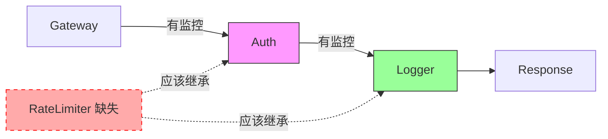
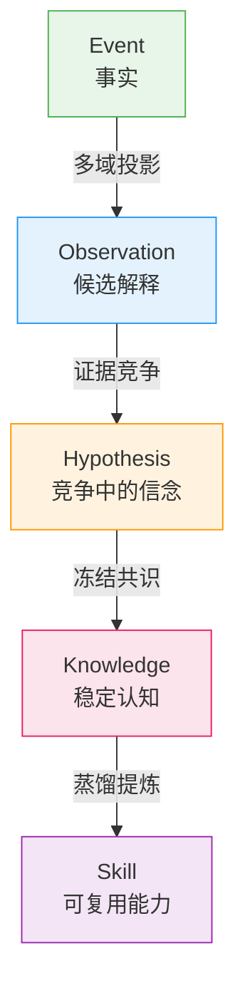
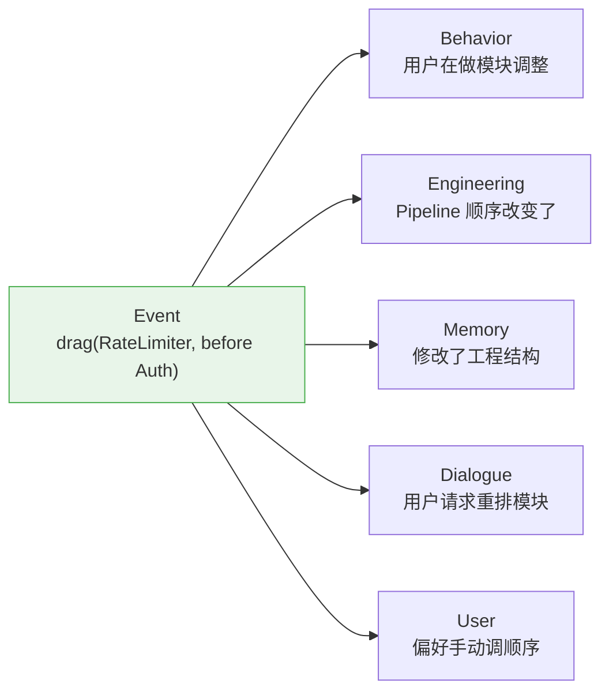
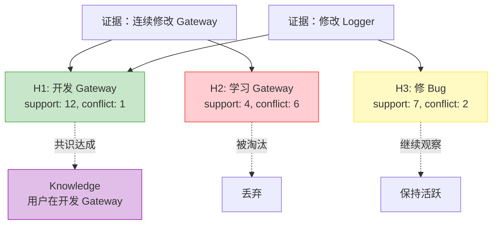
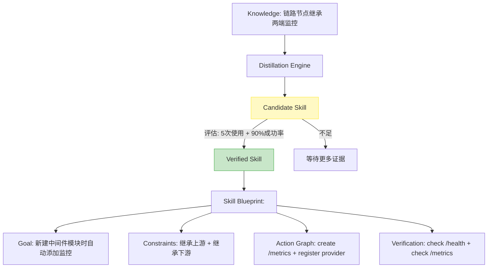
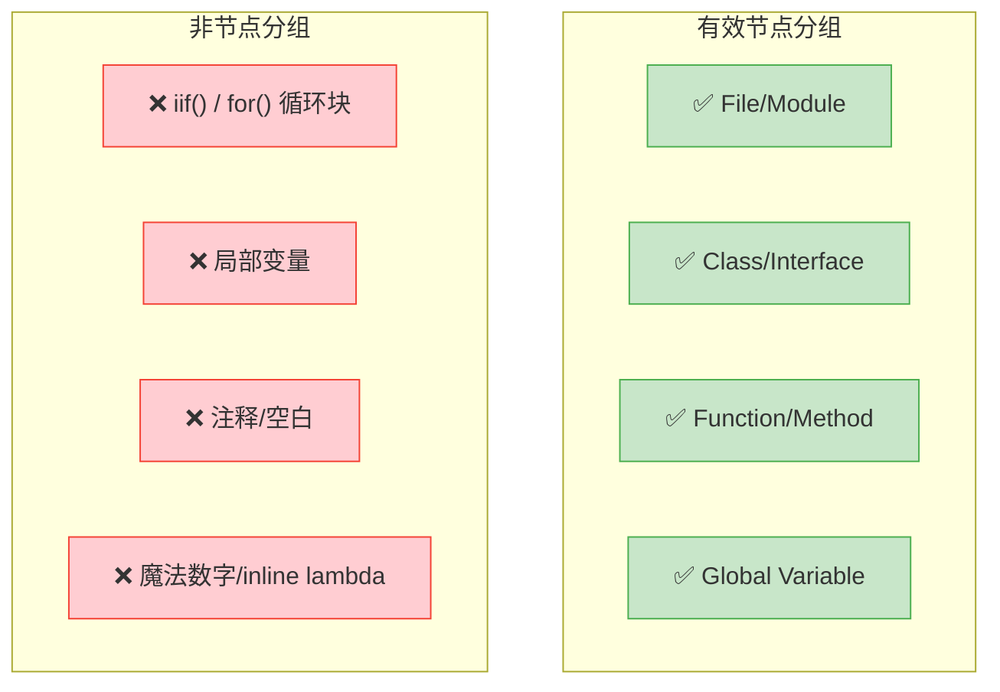
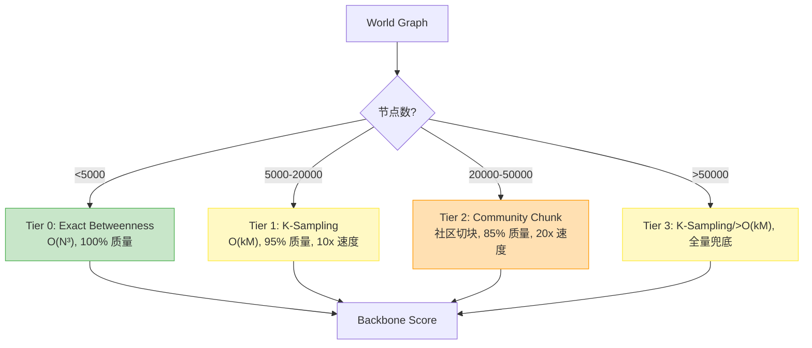
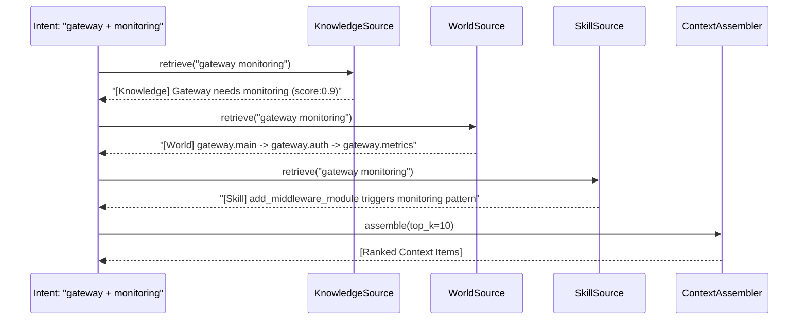
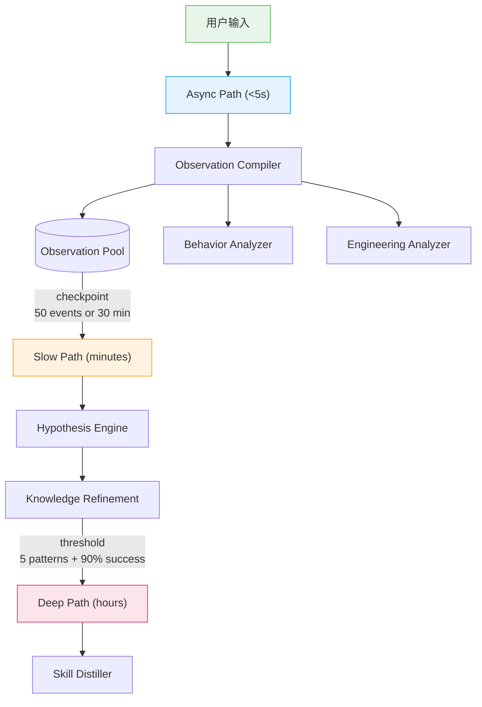

# Chapter 2：关系不是提示词能给的 —— v4 的认知系统

> 提示词可以告诉 Agent 一条规则。
> 但它无法告诉 Agent：这条规则和谁相关、从哪来、什么时候会变。
>
> 关系是一种比文本更难传递、却更稀缺的上下文资源。
> v4 把关系从"设计理念"变成了一台可运行的认知引擎。

---

## 一、一个让 Agent 尽职但不尽责的瞬间

你有一个网关项目。链路很简单：

```
Gateway -> Auth -> Logger -> Response
```

每个节点都有监控（`/metrics`）。你告诉 Agent：
"在 Auth 和 Logger 之间加一个 RateLimiter。"

Agent 写了代码，编译通过，测试通过，提交了。完美。

一周后你发现 Auth 和 Logger 都有 `/metrics` 端点，但 RateLimiter 没有。

Agent 没有做错任何事。它不知道的不是 Prometheus 怎么配。
它不知道的是这条规则：

> 在这个项目里，链路中间的新节点应该继承两端的行为约束。

这条规则不在代码里，不在文档里，不在 system prompt 里。它在 Auth 和 Logger 之间那条看不见的**关系**里。



**Agent 不是不负责。它的世界模型里根本没有"关系"这一维。**

这就是 v4 要解决的问题——不是写一个更好的 system prompt，而是构建一个**以关系为中心的认知系统**。


那么 v4 会怎么做？不是给 LLM 一条 system prompt。
是给 LLM 一个**局部世界的子图**：

`mermaid
flowchart TD
    RateLimiter[RateLimiter 新节点]

    subgraph "上游约束 (Auth)"
        Auth_Metric[/metrics 端点/]
        Auth_Health[/health 端点/]
        Auth_C[工程约束: 所有中间件需监控]
    end

    subgraph "下游约束 (Logger)"
        Logger_Metric[/metrics 端点/]
        Logger_Pattern[行为模式: 3/3 次加模块补了监控]
    end

    subgraph "已有能力"
        Skill_Monitor[Skill: 中间件监控模板]
    end

    Auth_Metric -->|约束继承| RateLimiter
    Auth_C -->|约束继承| RateLimiter
    Logger_Metric -->|约束继承| RateLimiter
    Logger_Pattern -->|行为参考| RateLimiter
    Skill_Monitor -->|可复用| RateLimiter

    style RateLimiter fill:#ffeb3b,stroke:#f57f17,stroke-width:3px
    style Skill_Monitor fill:#e1bee7,stroke:#9c27b0
    style Auth_C fill:#b3e5fc,stroke:#0288d1
`

这不是一段 prompt。这是从代码仓库、工程约束、行为历史和已有技能中
**编译出来的局部知识快照**。LLM 看到它之后，不需要被提醒要加监控——
它自己会走到那个结论。

那么问题变成：这个子图是怎么来的？

这就是 v4 整个认知流水线要做的事。接下来我们逐层展开。

## 二、v4 的认知流水线：从事件到能力

v4 的核心是一条五阶段的知识精炼链。不是一条线性的处理流程，而是一个**不断压缩解释空间**的过程：



**每一层都在减少信息量，增加确定性。** Event 是原始的。Observation 给出多种可能。Hypothesis 让它们竞争。Knowledge 冻结胜者。Skill 把它变成可复用的能力。这和传统 Agent 用 confidence 数值做决策有本质区别。后面会展开。

## 三、Observation Compiler：一个事件，五个世界

用户说："把 RateLimiter 放到 Auth 前面。"

这句话在五个认知域里意味着完全不同的东西：



**这些观察不是候选，不是互斥，它们全部同时成立。** 这是 v4 和传统 Parser 的区别：Parser 输出一种理解，Observation Compiler 输出多视角的感知。

```python
from core.agent.v4.observation_compiler.projector import Projector

projector = Projector()
domains = projector.project("ui.drag")
# -> ["engineering", "behavior", "memory"]

# 为每个域生成独立的 Observation
# Behavior 域看到的是：用户在操作模块
# Engineering 域看到的是：Pipeline 变了
# Memory 域看到的是：工程结构改动
```

关键在于：后面 Hypothesis 竞争的时候，跨域证据才开始产生交互。Observation 阶段不做竞争——只做投影。

## 四、Hypothesis Engine：不是分类器，是解释生态

Observation 给出了可能是什么。Hypothesis Engine 回答：最可能是什么。

传统 Agent 的做法：

```
if evidence matches pattern:
    confidence += 0.2
if confidence > 0.85:
    -> knowledge
```

v4 拒绝这个路线。它维护的不是一个 confidence 值，而是一个**解释生态（Interpretation Ecosystem）**。



每个 Hypothesis 维护一个 **7 维信念状态**：

```python
belief_state = {
    "support": 12,      # 多少证据支持这个假说
    "conflict": 3,      # 多少证据反对
    "stability": 0.81,  # 信念是否稳定
    "coverage": 0.72,   # 证据覆盖了多少场景
    "recency": 1.0,     # 最近有没有新证据
    "novelty": 0.12,    # 是新出现的假说还是老假说
    "entropy": 0.05,    # 不确定性
}
```

升级为 Knowledge 的条件不是 `confidence > 0.85`，而是多维联合判定：

```python
if (support >= 8 and conflict <= 3 and
    stability >= 0.70 and coverage >= 0.40 and
    len(domain_signals) >= 2):   # 至少两个认知域达成共识
    freeze_as_knowledge()
```

**这就是和传统 Agent 的本质区别：不是"计算置信度"，而是"维护一群互相竞争的解释，等待共识自然形成"。** 这更接近科学发现的逻辑。


## 与已有方案的横向对比

v4 的 Hypothesis Engine 站在几个成熟技术路线的交叉点。本节说明它和它们的关系。

**与贝叶斯更新：** 贝叶斯更新用先验 x 似然推导后验概率 -- 一维数值，连续更新。
v4 不做概率乘法。support/conflict 是离散投票数，stability/coverage/recency/novelty/entropy 是多维度信号。
两者的哲学差异：贝叶斯问的是世界的不确定性，v4 问的是有多少证据支持这个解释。
贝叶斯更数学严谨；v4 更可解释 -- 你可以回溯每个 Hypothesis 的完整投票历史。

**与 D-S 证据理论：** D-S 用 mass 函数和 Dempster 规则处理冲突证据和未知不确定性。
v4 共享多证据融合的精神，但路径不同：不做 mass 归一化，做多维信念状态的阈值判定。
v4 的证据来源跨认知域（行为链、工程链、对话树），天然不同权重，
打破 D-S 的证据独立同源假设。

**与多 Agent 辩论：** 近年有工作让多个 Agent 互相辩论验证事实。
v4 的 Hypothesis 竞争不是辩论 -- 假说之间不互相反驳。
它们各自接受证据投票，自然生长或消亡。更接近科学假说的自然选择，而非辩论。

**与代码语义分析：** CodeLlama 语义分割、依赖图社区发现是已有方案。
v4 的三个差异：（1）9 种边类型各有独立权重；（2）目录仅作 Prior，社区检测可推翻；
（3）Backbone 不是 PageRank 或访问频率，而是信息流必经路径。

如果熟悉 RAG、GraphRAG、AutoGPT：v4 不替代它们。v4 做它们不做的那一层 --
在检索到信息之后、LLM 推理之前的知识组织和信念形成。是 Context Engineering 层。
## 五、Skill Layer：知识是静态的，能力是可执行的

当同一个 Pattern 反复出现——比如"加中间件模块后上下游监控模式需要继承"——Knowledge 蒸馏为 Skill。

但 Skill 不是 Prompt。Skill 是**可执行的能力蓝图**：



```python
Skill {
    trigger:        "add_middleware_module",
    context:        ["engineering_chain", "monitoring_pattern"],
    constraints:    [Constraint_23, Constraint_45],  # 引用工程链
    procedure:      ActionGraph(["create_metrics", "register_provider"]),
    verification:   ["check /metrics", "check /health"],
}
```

## 六、Semantic World Model：把代码变成可推理的世界

v4 不是"代码索引"。是把整个代码库建模为**结构化世界**。

### 6.1 节点标准：只有能被引用的才是节点



标准只有一条：**能被外部引用。**

### 6.2 多层边 + 社区检测 = 模块边界

不是 `depends_on` 一条边。9 种边类型，各有不同语义：

```
imports (0.30)  | calls (0.25)    | co_changes (0.25)
overrides (0.20)| implements (0.20)| constrains (0.20)
references (0.15)| tests (0.10)   | generates (0.15)
```

目录结构会说谎：

```
utils/
├── logger.py     ← 实际和 gateway.logger 一组
├── cache.py      ← 实际和 redis.serializer 一组
└── http.py       ← 另一组
```

社区检测告诉你真相：

```python
from core.agent.v4.world.community import CommunityDetector

detector = CommunityDetector()
communities = detector.detect(world_graph)

# community_0: [gateway.main, gateway.auth, utils.logger, gateway.metrics]
# community_1: [utils.cache, redis.client, redis.serializer]
# community_2: [utils.http, api.client, api.middleware]
```

**模块边界来自图，不来自文件系统。**

### 6.3 分层重要性：自适应

Logger 被调用次数最多，但它不决定系统拓扑。真正的骨干是信息流必经节点。v4 用三层自动路由：




## 效果量化说明

文中出现的质量百分比来源于算法文献经验值：

- K-Sampling 95%: Brandes (2001) k-sampling, k=1000 时与精确 betweenness 的 Spearman 秩相关系数 >0.95
- 社区切块 85%: Louvain 社区级 betweenness 近似 (Riondato 2016), 与全局相关性 0.80-0.90
- 90% 成功率触发: 设计参数 (config/runtime.yaml 可调), 不是实测值

**注意: 以上数字非 v4 benchmark 实测。376 个单元测试覆盖功能正确性，未在真实项目上做端到端效果对比。这是 pre-1.0 的真实状态。**
## 七、Context Engineering：组装 LLM 的局部世界

现在 LLM 要回答："帮我给 Gateway 加监控。"

传统方案：扔几百行代码进去。

v4 方案：组装一个跨域局部世界：



```python
from core.agent.v4.context.assembler import ContextAssembler
from core.agent.v4.context.source import KnowledgeSource, WorldSource, SkillSource

sources = [KnowledgeSource(nodes), WorldSource(graph), SkillSource(pool)]
assembler = ContextAssembler(sources)

ctx = assembler.assemble("gateway monitoring", top_k=10)

for item in ctx.top_k(5):
    print(f"[{item.source}] score={item.relevance:.2f}")
    # [knowledge] score=0.90: Gateway needs monitoring
    # [world]    score=0.85: gateway.main depends_on gateway.auth
    # [skill]    score=0.72: add_middleware_module triggers monitoring
    # [world]    score=0.65: gateway.auth calls gateway.metrics
    # [world]    score=0.50: gateway.logger is in observability community
```

LLM 看到的不再是一堆代码。是一个**多维度的知识快照**——工程约束、世界结构、已有能力全部按 relevance 排序。

**加新的知识源不需要改组装器。** 以后加 RAG、记忆、外部知识库，只需要实现 `retrieve()`。

## 八、Cognitive Runtime：谁在什么时候运行

30+ 个认知模块不能互相直接调用。v4 的 Runtime 是一台调度器：



Runtime 不做推理。它决定谁在什么时候推理。每个模块通过适配器接入，不耦合：

```python
from core.agent.v4.runtime.engine import CognitiveRuntimeEngine

engine = CognitiveRuntimeEngine()
engine.start()

# 每次用户事件 -> Async Path
engine.on_event(event)

# 50 个事件或 30 分钟 -> Slow Path
engine.trigger_checkpoint()

# 5 个相同 Pattern -> Deep Path
engine.trigger_deep()
```

在 `config/runtime.yaml` 里配置触发条件、超时、重试、参数覆盖。不改代码调行为。

## 九、持久化与向量：零外部服务依赖

v4 默认用 SQLite 存储所有认知数据。不需要装 MongoDB、Neo4j、Redis。

向量检索内置 numpy 余弦相似度——不依赖 Milvus。达到 10 万条时自动热切换到 Milvus，不需要数据迁移。

```python
from core.agent.v4.persistence.vector_store import SQLiteVectorStore

store = SQLiteVectorStore("data/vectors.db")
store.open()
store.put("k1", embedding_vector)       # 存向量
results = store.search(query_vec, 5)    # 余弦检索 top-5
# -> [("k1", 0.87), ("k3", 0.72), ...]
```

不是"不需要外部服务"，而是"默认不需要，达到规模后自动无缝升级"。

## 十、关系的白盒化：这不是黑盒

v4 的一个核心设计选择：**relation is a first-class, auditable, queryable entity.**

你可以：

```python
# 查看哪些节点是骨干
print(graph.backbone)  # {"gateway.main": 0.95, "gateway.auth": 0.88, ...}

# 查看社区边界
print(graph.communities)  # community_0: [gateway.*, utils.logger, ...]

# 查看所有 import 关系
imports = [e for e in graph.edges if e.edge_type == "imports"]

# 追踪一个 Hypothesis 的投票历史
session = session_mgr.get("reason_session_42")
for vote in session.votes:
    print(f"{vote.evidence_id} -> {vote.hypothesis_id}: {vote.vote}")
```

关系不是隐式推导的。关系存储在图中——可查、可改、可泛化。


## 已知局限：负向反馈回路的缺失

本文全篇在讲正向链路：Event -> Observation -> Hypothesis -> Knowledge -> Skill。
但真实的认知系统还需要负向链路：

- **错误修正**：如果 Hypothesis 错误冻结为 Knowledge，目前没有用户纠正的正式路径。
  Hypothesis Engine 有 conflict 投票和时间衰减，但没有 UserCorrectionVote --
  用户明确说错了的信号应该天然最高权重。
- **过时 Skill 淘汰**：Skill 蒸馏后无过期机制。半年未用的 Pattern 应自动降级。
- **修正回流**：用户纠正一个 Skill 的行为结果后，修正是仅影响本次执行
  还是回流到 Hypothesis/Knowledge 层？目前无回流路径。

这些不是 v4 的 bug，是 v5 的设计空间。
v4 的目标是让认知链路正向运转；v5 的目标是让它能自我纠错。
## 十一、从"还没实现"到 376 个测试，零失败

这篇文章的第一版（2026 年 7 月初）结尾是：

> 坦诚说：这是 DialogMesh v4 的设计，部分概念正在验证，代码还没写完。

现在是 2026 年 7 月 13 日。v4 已经全部实现：

```
core/agent/v4/
├── world/                  Semantic World Model (118 tests)
├── observation_compiler/   ObservCompiler: 5 domains (39 tests)
├── hypothesis_engine/      Hypothesis: 7-dim BeliefState (19 tests)
├── skill_layer/            Skill Distillation (27 tests)
├── runtime/                Cognitive Engine: 4 paths (28 tests)
├── context/                Context Assembly: 5 sources (15 tests)
├── cli/                    Runtime DAG Builder (14 tests)
├── tiered/                 MultiTier Pipeline (11 tests)
├── persistence/            SQLite + Vector + Snapshot (42 tests)
├── adapter/code/           Tree-sitter + CodeWorld (27 tests)
└── cognitive_scheduler/    Task Scheduling (7 tests)

376 个测试，0 失败。
```

## 十二、这不是 Prompt Engineering。这是 Context Engineering。

如果你只是想找一个更好的 system prompt，v3 就够了。

如果你想构建一个系统：事件进来，知识沉淀，能力增长，关系可追溯——你需要的不是一个更好的提示词。

你需要的是一个**完整的认知流水线**。

这就是 v4。

---


---

## 术语表

| 术语 | 定义 |
|:---|:---|
| Observation Compiler | 将 Event 投影到多个认知域，生成独立候选解释 |
| Interpretation | 单个认知域对 Event 的一种理解 |
| Hypothesis | 跨域竞争性假说，维护 7 维信念状态 |
| Belief State | support/conflict/stability/coverage/recency/novelty/entropy |
| Knowledge | 冻结后的稳定认知，不再参与竞争 |
| 解释生态 | 同一 Event 下所有 Active Hypothesis 的集合 |
| 多域投影 | 单一 Event 同时映射到多个认知域，产出同时成立 |
| 5 个认知域 | Behavior/Engineering/Dialogue/Memory/User |
| Skill | 从 Knowledge 蒸馏的可执行能力蓝图，非 Prompt |
| Semantic World Model | 代码库的结构化图模型 |
| Backbone Score | 节点信息流重要性（Betweenness 为主） |
| Cognitive Runtime | 四路径调度层（Async/Slow/Deep） |
| Context Engineering | 从多认知源组装 LLM 上下文，非 Prompt Engineering |