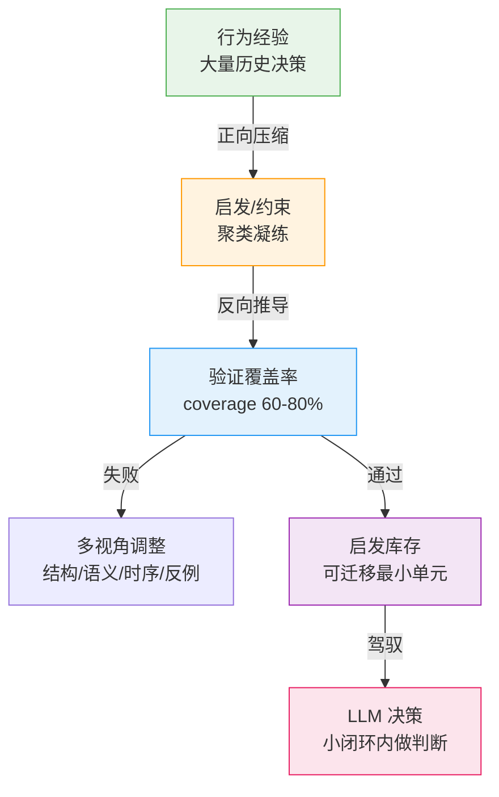
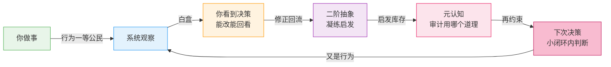

# Chapter 3：约束是长出来的，不是写出来的 —— 二阶抽象与驾驭

> LLM 自己裁决的时候，提不出好建议，还容易跑歪。
> 核心不是推理能力不足，是**启发性缺乏**——它没有"道理"可讲。
> 人靠道理、理论、名言驾驭自己；二阶抽象就是给 LLM 造道理的机制。

---

## 一、一个"会选但不会判断"的瞬间

你让 Agent 重构一个模块。它拿到了三个候选方案：

```
方案 A — 某篇论文的架构（前沿，但重）
方案 B — 现有项目的模式（稳，但旧）
方案 C — 糅合：A 的思想 + B 的骨架
```

Agent 怎么选？凭**习惯**。

大多数时候它会选 C——糅合最安全，看起来"兼顾"。有时候它会被 A 吸引——前沿论文的光环。你问它为什么，它能给出漂亮的理由。但你知道：那不是判断，那是习惯性路径。

**真正的判断应该是什么？**

是质疑方案本身："这三个可能都不对——也许该先去看看别的项目怎么处理，或者先确认重构是不是真的必要。"

Agent 为什么不质疑？因为它走不了远路。

---

## 二、小代价小闭环：Agent 循环的"损失函数"

Agent 的执行循环有一个硬约束：**防止死循环**。

为了不死循环，系统采用"小代价小闭环"——每次决策只走一小步，验证，再走一步。这很像损失函数：每一步都有代价，代价不能无限累积。

```
走远路的代价:
  质疑方案 → 读更多论文 → 发现更多方案 → 再质疑 → ...
  → 发散无界 → 死循环 / 超预算

小闭环的收益:
  每一步有界 → 可验证 → 可回退 → 系统稳定
```

所以 Agent 被困在了一个两难里：

```
不敢走远（循环约束） × 不会判断（习惯拍板）
```

放开循环约束？不行——那会死循环。给 Agent 更强的推理？也不行——推理再强，没有可调用的判断准则，还是在三个方案里凭习惯挑。

**解药不是放开循环，是给循环里塞进"道理"。**

---

## 三、人是怎么解决这个问题的？

人面对同样的情况，会调用**启发（heuristics）**：

```
"早重构早省心"（YAGNI 的变体）
"三次重复就该抽象"（Rule of Three）
"先让测试说话"（测试先行）
"前沿方案要等项目验证"（技术债意识）
"先质疑问题，再质疑方案"（元认知）
```

这些不是逻辑推理，不是穷举，是**压缩过的判断准则**——可迁移、不依赖具体场景、能快速决策。

Gigerenzer 的生态理性研究说：启发不是"次优的近似"，是"生态中的理性"。人在不确定环境里靠少量启发做出好决策，比穷举更有效。De Groot 的棋手研究发现：专家和新手的差别不是算得深，是**模式库存**——专家一眼认出局面，调用对应的应对模式。

**专家 = 大量可调用的启发模式。** 人靠着"道理、理论、名言"这些压缩物来驾驭自己——面对新情况，调用一个合适的道理，而不是从零推理。

LLM 缺的不是推理能力。**它缺的是启发库存（heuristic inventory）。**

---

## 四、约束 = 动力系统，但约束也会出问题

我们设计系统时，习惯用**约束**引导行为：

```
权限约束: 不能写 /etc
安全约束: shell 命令要审批
循环约束: 最大步数 / 预算上限
```

约束就像动力系统里的势场——它不规定轨迹，但它把行为**引导**在合法区域内。没有约束，LLM 的行为是自由粒子；有约束，行为被锚定在可达区域。

但约束本身也会出问题：

```
约束错了  → 把正确行为挡在外面（过度限制）
约束过时  → 环境变了，约束还停留在过去
约束冲突  → 两个约束互相矛盾，行为无所适从
```

约束不够 → 跑歪。约束太死 → 僵化。**约束不是越多越好，约束是需要被"再约束"的。**

---

## 五、元认知：对思考的思考，对约束的再约束

当约束本身出问题时，缺的是什么？

**元认知（metacognition）**——对思考本身的整理与复盘。

但这里有一个陷阱：**"让 LLM 再核查一遍自己的回答" ≠ 元认知。**

那是 ReAct——把同样的思考再跑一遍，没有新信息，只是自我确认。真正的元认知是：

```
对约束下行为的再约束:
  这次决策用哪个启发？为什么是这个而不是那个？
  这个启发还适用吗？上次用它是什么时候？
  有没有更好的启发我没想起来？
```

这就是"对思考本身整理和复盘"——不是重新推理，是**审计自己用了什么道理**。

但问题来了：**哪来那么多约束？**

---

## 六、二阶抽象：约束是长出来的，不是写出来的

这就是我们的方法——**二阶抽象（Second-Order Abstraction）**。



**不是手写约束，是从行为里长出约束。**

```
正向压缩:  1000 次决策 → 聚类 → 凝练成 10 条启发
反向验证:  10 条启发 → 反推 1000 次决策 → 覆盖多少?
          60-80% = 学到了（可迁移的规律）
          100%   = 过拟合（把原文背下来了）
          0%     = 幻觉（启发是编的）
失败 → 多视角调整（结构/语义/时序/反例四视角重新审视）
通过 → 进入启发库存
```

**为什么是 60-80% 而不是 100%？** 100% 意味着规则完美复刻了训练数据——那是背诵，不是抽象。60-80% 意味着规则抓住了主要模式，同时保留了泛化空间。这和损失函数的设计哲学一致：训练到过拟合点之前停下。

**这就是"伪二阶抽象"**——不是"再抽象一次"（那会越抽越空），而是"逆推验证抽象质量"：

```
DMN 发散: 让 LLM 无约束猜测 → 海量假设（包括错的）
ECN 收敛: 带上下文筛选 → 保留对齐的假设 + 拒绝理由
启发链:   凝练成可迁移的启发单元

关键: 被拒绝的假设和拒绝理由本身就是知识 —
  "什么被拒、为什么被拒" = 知识边界的学习
```

---

## 六.5 怎么实现：发散是"掩盖"，收敛是"暴露"

思想有了，实现是什么？**二阶抽象的工程实现 = 上下文的掩盖与暴露。**

### 发散：让 LLM 在"失忆"状态下猜

```
实现: 掩盖上下文 → LLM(temperature=0.8, no_context) → 生成 K 个猜测 (K=3-5)

为什么掩盖有用?
  掩盖 = 剥夺证据 → LLM 不得不调取预训练知识 (先验)
  → 产生发散性假设 (包括"合理但没被验证"的、甚至错的)
  → 这些假设不是答案, 是候选的"道理"

例子 (卡尔曼 × 信息论 — 两个相反哲学的碰撞):
  "系统里有个低概率事件反复出现。"
  掩盖上下文后让 LLM 猜: 这事件是什么?
  猜 1: 传感器噪声 → 应该抹平 (卡尔曼式: 低权重处理)
  猜 2: 新状态突变 → 应该深挖 (信息论式: 罕见=高信息量)
  猜 3: 用户新意图 → 应该记录 (行为式: 值得建模)
  → 三个猜测 = 三个"道理"候选, 各自有哲学来源
```

**卡尔曼和信息论为什么"完全相反却能统一"？** 这正是发散要暴露的东西：

```
卡尔曼: 低概率 = 噪声 → 抹平 (保持状态稳定)
信息论: 低概率 = 高信息量 (I = -log₂ P) → 保留 (罕见≠无关)

表面矛盾, 深层统一 (A7):
  判断依据不是"概率高低", 是"能否被现有模型解释":
    能解释 → 噪声 (抹平, 卡尔曼的 R 估计)
    不能解释 → 新信息 (深挖, Shannon 的信息价值)
  → 同一个低概率事件, 两种哲学给出相反动作,
    但统一在"解释能力"这一个判据下
```

让 LLM **猜**这个统一过程，比直接告诉它"你要用可解释性判断"有效得多——因为猜测迫使它调取两种哲学的完整脉络，再在发散空间里让它们碰撞。

### 收敛：让 LLM 在"全记忆"状态下筛

```
实现: 暴露上下文 → LLM(temperature=0.1, full_context) → 筛选 + 排序

为什么暴露有用?
  暴露 = 恢复证据 → LLM 用真实数据验证猜测
  → 保留对齐的假设 + 给出拒绝理由
  → 拒绝理由 = 知识边界 ("猜 1 被拒, 因为最近三次都是真 bug")
```

### 反事实：把低概率高价值"反向推"

发散不只是正向猜，还可以**反事实推**：

```
反事实 (counterfactual):
  "如果这个低概率事件不是噪声, 它可能是什么机制导致的?"
  → 把信息论的"高价值"反向化 → 去推、去猜、去找、去连接
  → 不是等它出现 (被动), 是主动构造"它出现后意味着什么" (主动)

实现:
  信息论定位: 低概率高价值 → 标记为待解释 (保留, 不抹平)
  反事实发散: 构造假设 "如果 X 是真的 → 会有什么连锁?" → K 个猜想
  证据连接:   在真实数据里找这些连锁的痕迹 → 命中 → 假设升级
              未命中 → 假设降级 (但拒绝理由进知识边界)
```

这就像侦探先假设"如果凶手是 X，现场应该有什么"，再回去找。**反事实让系统在信息不足时也能主动探索，而不是等数据说话。**

### 完整实现流程（设计文档 v5 的真实参数）

```
每 N 轮 (N=5):
  1. 提取最近 N 轮的推导链 (L2 实体边 + L2.5 信念轨迹)
  2. 发散: LLM(temperature=0.8, no_context) → K 个猜测 (K=3-5)
     └─ 掩盖上下文 → 调取先验 → 发散假设 (含卡尔曼/信息论碰撞)
  3. 收敛: LLM(temperature=0.1, full_context) → 筛选 + 排序
     └─ 暴露上下文 → 证据验证 → 保留 + 拒绝理由
  4. 反事实: 对低概率高价值假设 → 反向构造连锁猜想 → 找证据连接
  5. 启发: LLM 生成启发链 (模式描述 + 适用条件 + 反例 + 推理路径)
  6. 存入启发池, 替换低覆盖率旧启发
  7. 元认知监测覆盖率: < 阈值 → 重新发散; 新旧冲突 → 裁决
```

**为什么"掩盖/暴露"是实现核心？** 因为它是唯一能让 LLM 同时调用"先验（无上下文时的预训练知识）"和"后验（有上下文时的证据验证）"的机制——先验产生候选道理，后验检验道理，反事实扩展道理。三步都是 LLM 调用，但**掩盖/暴露切换决定了它调用的是先验还是后验**。这就是"伪二阶抽象"的工程落地：抽象不是从数据里提取，是让 LLM 在两种信息状态下反复碰撞。

---

## 七、闭环：行为 → 启发 → 元认知 → 驾驭

现在把整个链条串起来：



```
行为一等公民 (A9):  行为是学习数据 — 你的每次决策都是原料
白盒 (A19):        决策可查看、可修改 — 你看到系统在用什么道理
二阶抽象 (A24):    从行为中提炼启发 — 约束长出来，不是写出来
元认知 (A10):      审计用哪个道理 — 对约束的再约束
驾驭:              启发库存让小闭环内做出像判断的选择
```

**没有二阶抽象，元认知就是空转**——ReAct 式自嗨，没有约束库存可以审计。**有了二阶抽象，元认知才有原料**——它审计的不是空泛的"思考质量"，而是具体的"这次用了哪条启发、为什么、还适用吗"。

---

## 八、冲突是原料：可递归的元认知

现在到了最关键的一步——**对二阶抽象本身再抽象**。

### 8.1 启发会冲突，冲突不是缺陷，是下一层的输入

```
启发库存里必然有冲突:
  "糅合优先" (稳妥) vs "质疑优先" (深挖)
  "抹平噪声" (卡尔曼) vs "深挖罕见" (信息论)
  "快反馈" (A16) vs "验证真实" (A18)

冲突怎么处理? 不能丢 — 冲突本身是信息。
```

公理可以诞生定理，但公理不必都一样。我们的系统里 A1-A25 是**并列公理**，它们冲突时靠**元规则**编排（§5）：

```
体验不阻断 > 单次准确     (A16 优先)
真实验证 > 指标好看       (A18 优先)
安全约束不可协商          (A21 底线)
记录永不可删              (A17 底线)
兑底: 回到约束空间         (A12 兜底)
```

**这套元规则本身就是对公理冲突的"二阶抽象"**——从公理碰撞的经验中凝练出的编排规则。

### 8.2 编排的抉择本身也是思考行为

选"体验优先"还是"验证优先"——**这个选择本身，也是一种行为**。

```
层 1: 行为 → 二阶抽象 → 启发 (约束长出来)
层 2: 启发冲突 → 元规则编排 → 裁决 (公理诞生定理)
层 3: 元规则冲突 → 再抽象 → 元元规则 (对裁决的裁决)
层 4: ...
```

**这就是"对思考的思考"的真义**（区别于 ReAct）：

```
ReAct:     思考 → 检查思考 (同层, 无新原料)
可递归:    思考 → 抽象出思考的规律 → 用规律驾驭思考
           → 抽象"规律的使用" → ... (每层产生真实的新东西)
```

### 8.3 递归有底，不是无限

你可能会问：这样会不会无限递归？**不会，而且这个"底"正是 A24 的反面验证：**

```
凝练 = 压缩 = 输出必须 < 输入

十几条公理 → 只能凝练出 2-3 条元规则 (如果真有可凝练的模式)
           → 或 0 条 (如果公理本就独立, 无冲突模式可提炼)

凝练不出更多 = 正常! 凝练的目的不是"产生更多规则",
是"发现规则之间的关系" (编排, 不是堆叠)。
```

递归的底是**自适应停止条件**：

```
底 = 输入多样性不足, 凝练收益 → 0, 停止
```

但要注意：**凝练的原料不是公理本身，是"公理冲突的实例"**：

```
公理 = 宪法 (少)
冲突实例 = 判例 (无限! 每次真实冲突都是新场景)
元规则 = 司法解释 (从判例中凝练)

→ 公理只有十几条, 但公理冲突的实例是无限的
→ 凝练不会枯竭: 原料是"冲突的案例", 不是"公理列表"
→ 递归的底 = 当"冲突实例的多样性"不再提供新模式时
```

### 8.4 同一个机制，三个应用面

```
二阶抽象不是一种工具, 是一种思想 — 同一个机制, 三个对象:

① RAG 聚类压缩      → 对象: 内容      → 解决聚类 + 高价值召回
② 启发使用驾驭      → 对象: 行为      → 解决 LLM 决策跑偏
③ 公理冲突裁决      → 对象: 裁决      → 解决元规则自身的冲突
```

每一层都用同一个"掩盖/发散/收敛/反事实"机制，只是对象不同：内容、行为、裁决。**每一层的输出都是下一层的输入**——这就是可递归的元认知。

```
行为 → 启发 (抽象)
启发 → 元规则 (对抽象的抽象)
元规则 → 元元规则 (对抽象的抽象的抽象)
...直到凝练收益归零 (自适应停止)
```

**这才是"思想不是工具"**：工具是一次性的压缩器；思想是可递归的机制——压缩、使用压缩、压缩"压缩的使用"。RAG 用它，凝练后的启发用它，公理冲突的选择也用它。

---

## 九、这不是 Skill 套皮

有人会问：这不就是 skill 吗？不就是把成功经验存下来复用吗？

不是。区别在三个地方：

| 维度 | Skill | 二阶抽象 |
|------|-------|---------|
| 对象 | 可执行的动作序列（怎么做） | 可迁移的判断准则（怎么想） |
| 验证 | 执行成功 = 有效 | **反推覆盖 60-80% = 有效** |
| 用途 | 复用流程 | **驾驭决策 + 喂养元认知** |
| 实现 | 模板 + 参数化 | **掩盖/暴露切换 (发散/收敛) + 反事实** |

Skill 回答"这件事怎么做"，二阶抽象回答"这件事该不该做、用什么道理判断"。前者是程序库，后者是价值观。

**思想 + 实现**：二阶抽象的思想是"约束从行为里长出来"，实现是"掩盖→发散→收敛→反事实→启发链"。就像 RPC——思想是"远程调用像本地调用"，实现可以是 REST、gRPC、消息队列，随环境选。我们的实现选了"上下文掩盖/暴露"这一种：它让 LLM 在无上下文（先验发散）和有上下文（证据收敛）之间切换，用反事实主动扩展——这是当前可行的一种，未来换更好的机制，思想不变。

人也是这样分的：技能是"会修车"，道理是"修之前先检查是哪儿坏了"。技能让你能干活，道理让你干对活。

---

## 十、与已有思路的横向对比

| 思路 | 核心 | 与二阶抽象的差异 |
|------|------|----------------|
| Prompt Engineering | 用提示词给模型指令 | 二阶抽象给模型**可迁移的判断准则**，不是一次性指令 |
| RAG | 检索相似内容做上下文 | 二阶抽象**压缩**出规律，不是检索原文 |
| ReAct | 思考→行动→观察循环 | 二阶抽象是**循环之外的积累**——每次循环后沉淀启发 |
| Constitutional AI | 手写原则集约束模型 | 二阶抽象的原则是**从行为长出来的**，不是手写的 |
| Skill / 工作流模板 | 复用成功动作序列 | 二阶抽象复用**判断准则**，且用可逆推性验证 |

---

## 十一、已知局限

二阶抽象不是银弹：

```
1. 启发可能过时 — 环境变了，库存里的道理还在用旧逻辑
   → 需要元认知定期审计（启发活性检查）

2. 启发库存冷启动 — 没有足够行为经验时，库存是空的
   → 冷启动用内置种子（少数手写约束过渡），
     经验积累后手写约束逐步退役

3. 可逆推性有成本 — 反推验证需要保留行为记录（A17 记录永不可删）
   → 存储与抽象是一对，不能只要抽象不要记录

4. 递归收益递减 — 层数越深，可凝练的新模式越少
   → 自适应停止: 凝练收益归零即停，不为递归而递归
```

---

## 结尾

LLM 自己裁决时提不出好建议、容易跑歪——这不是推理能力的问题，是**启发性缺乏**。

人解决这个问题靠的是道理、理论、名言——那些压缩过、可迁移、经过验证的判断准则。二阶抽象就是给 LLM 造道理的机制：从行为中提炼启发，用可逆推性验证质量，用启发库存驾驭小闭环内的决策，用元认知审计"这次用了哪个道理"。

冲突不是二阶抽象的缺陷——冲突是下一层抽象的原料。**公理可以诞生定理，但公理不必都一样**；对公理冲突的编排本身，也是思考行为，也可以被再次抽象。递归有底（凝练收益归零即停），但每一次真实的冲突都在喂养下一层。

**约束是长出来的，不是写出来的。** 就像人的价值观不是天生全套，是经历沉淀的。

---

## 术语表

| 术语 | 定义 |
|:---|:---|
| 启发 (Heuristic) | 压缩过的可迁移判断准则，不依赖具体场景 |
| 启发库存 (Heuristic Inventory) | 系统可调用的启发集合，专家直觉的机器版 |
| 小代价小闭环 | 防死循环的执行约束：每步有界、可验证、可回退 |
| 二阶抽象 | 从行为中提炼启发，用可逆推性验证（coverage 60-80%） |
| 伪二阶抽象 | 不是"再抽象一次"，是"逆推验证抽象质量"（DMN 发散→ECN 收敛→启发链） |
| 掩盖/暴露 | 实现机制：无上下文发散（调先验）+ 有上下文收敛（验证据） |
| 反事实 | 低概率高价值的反向推：构造"如果 X 是真的→连锁"猜想，再找证据连接 |
| 可逆推性 | 压缩产物能反演还原原始内容的比例；60-80% = 学到 |
| 元认知 | 对思考本身的整理与复盘，对约束的再约束 |
| 可递归元认知 | 冲突→元规则→元元规则...每层都是下一层的输入，凝练收益归零即停 |
| 约束作为动力系统 | 约束不规定轨迹，但把行为引导在合法区域（势场） |
| 驾驭 | 用启发+约束引导 LLM 在小闭环内做出像判断的选择 |
