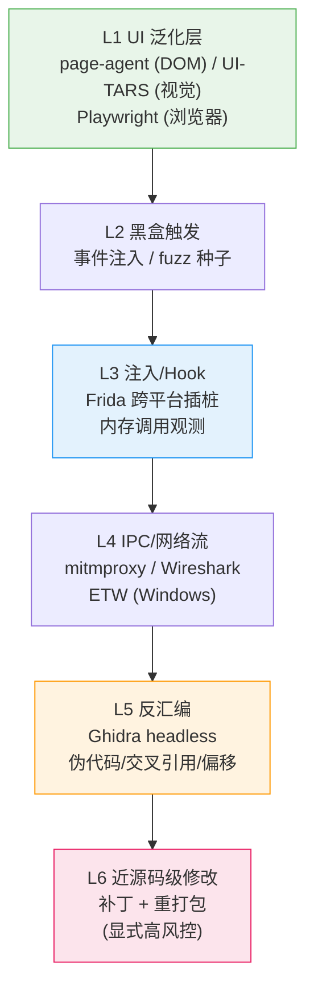
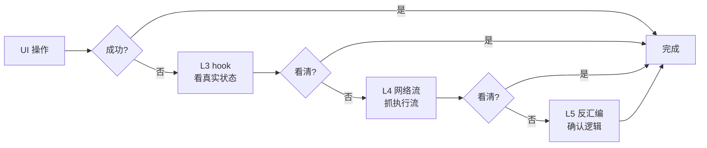

# 深度操作工具链 — 设计文档（2026-08-10）

> 触发讨论：用户提出"从 UI 自动化到二进制级操作"的完整工具链构想——
> UI 做泛化入口，反汇编逼近代码级操作。
> 结论先行：**不做独立项目**，作为 DialogMesh 的工具族（ToolRegistry 注册），
> 由蓝图编排 + 行为链学习 + 白盒记录——DialogMesh 是能驾驭工具的认知体。
> 状态：设计草案，待讨论拍板。前置：工具层已有 ToolRegistry/ToolAdapter/蓝图 tool 节点。

---

## 一、核心论断

```
深度操作工具链 = 分层逼近体系
  L1 UI 泛化层   → 适配任何界面 (粗粒度, 高频)
  L2 黑盒触发    → 事件注入 (fuzz)
  L3 注入/Hook   → 内存调用观测 (frida)
  L4 IPC/网络流  → 执行流捕获 (mitmproxy)
  L5 反汇编      → 伪代码/交叉引用/偏移 (Ghidra)
  L6 近源码修改  → 补丁/重打包

目标: UI 做泛化入口, 反汇编逼近代码级操作
  → 层间降级 = 自适应: UI 失败 → hook 看真实状态 → 网络看流量 → 反汇编确认逻辑
```

**关键判断：不是"专门做一个可操作项目"，而是给 DialogMesh 加一个工具族。**

```
理由:
  ① 每一层都有成熟开源 (page-agent/UI-TARS/Frida/mitmproxy/Ghidra)
  ② 缺的不是工具, 是"统一编排 + 层间降级" — 这是蓝图能干的事
  ③ 各层操作历史 = 行为数据 (A9) → 学习 + 白盒回看 (A19)
  ④ 层间降级 = 信息论分治实例化 (A7)
```

---

## 二、分层架构

### 2.1 六层全景



### 2.2 每层选型与状态

| 层 | 能力 | 开源选型 | 现状 | 接入方式 |
|---|------|---------|:---:|---------|
| L1 | UI 自动化 | page-agent (DOM) / UI-TARS (视觉) / Playwright | 调研完成 | ToolRegistry |
| L2 | 黑盒触发 | 自定义事件注入 (基于 L1 基础设施) | 待设计 | ToolRegistry |
| L3 | 注入/Hook | Frida (跨平台事实标准) | 待调研 | ToolRegistry + 子进程 |
| L4 | IPC/网络 | mitmproxy (Python, 可嵌入) | 待调研 | ToolRegistry |
| L5 | 反汇编 | Ghidra headless (NSA, 开源) | 待调研 | ToolRegistry + headless |
| L6 | 近源码修改 | frida patch / detours / apktool | 待设计 | **显式高风控** (PlanGate) |

### 2.3 层间降级协议（自适应）

```
执行一条深度操作指令时, 蓝图层自动编排:

UI 操作 → 失败?
  └─ L1 重试 (不同选择器/坐标) → 仍失败?
      └─ L3 hook 看真实状态 (元素是否真的在? 状态机在哪?)
          └─ L4 网络流 (请求发了没? 响应是什么?)
              └─ L5 反汇编确认逻辑 (这个分支到底怎么走?)

每层降级 = 信息论分治: 高层低成本先试, 低层高成本按需启用
```



---

## 三、与 DialogMesh 的集成

### 3.1 工具注册（L1 先行）

```python
ToolRegistry.register(ToolAdapter(
    name="ui_test",
    description="UI 自动化测试 (page-agent DOM / UI-TARS 视觉)",
    keywords_zh=["界面测试", "UI测试", "点击", "截图操作"],
    execute=run_ui_test,          # 调 page-agent / UI-TARS
    validate=validate_ui_cmd,     # T2 调用前校验
))

ToolRegistry.register(ToolAdapter(
    name="hook_probe",
    description="Frida 注入观测: 进程内存/函数调用",
    keywords_zh=["hook", "注入", "内存观测", "函数调用"],
    execute=run_hook_probe,       # 调 frida
    validate=validate_hook_cmd,   # 需要目标进程白名单
))

ToolRegistry.register(ToolAdapter(
    name="net_trace",
    description="IPC/网络执行流捕获 (mitmproxy)",
    keywords_zh=["抓包", "网络流", "IPC", "请求追踪"],
    execute=run_net_trace,
    validate=validate_net_cmd,
))

ToolRegistry.register(ToolAdapter(
    name="disasm_lib",
    description="Ghidra 反汇编/伪代码/交叉引用",
    keywords_zh=["反汇编", "伪代码", "交叉引用", "偏移"],
    execute=run_ghidra_headless,
    validate=validate_disasm_cmd,
    risk="high",                  # L5/L6 高风险
))
```

### 3.2 蓝图 tool 节点（全复用）

```
每个工具 = 蓝图 tool 节点:
  T2 调用前校验 (validate)
  T3 结果回灌 llm_reply (操作结果 → 对话上下文)
  T4 ReAct 子循环 (失败重试/换策略)
  T5/T6 归因 (plan/constraint/data/tool 回流)

FLOW_SELF_GROWTH: 每加一个工具 = 系统能力增长
  LLM_DRIVEN 生成 → 执行成功 → 沉淀模板
```

### 3.3 行为闭环

```
操作历史 → 行为链学习:
  "用户习惯用 UI 自动化点这个按钮" → 行为链记录
  "hook 确认了状态机在 X" → 关联链知识
  "反汇编确认偏移 0x1234" → 工程链约束

→ 下次同类操作更快 (启发库存)
→ 全链路白盒可回看 (A19)
```

---

## 四、安全边界（A21 不可协商）

```
默认边界: L1-L4 (UI 自动化 + 注入观测 + 网络分析)
  → 测试/调试正当手段, 无法律风险

显式高风控: L5/L6 (反汇编 + 近源码修改 + 重打包)
  → 仅对自己/开源软件正当
  → 对闭源商业软件: 逆向工程条款风险
  → 必须:
    ① 用户显式确认 (PlanGate 高风控)
    ② 用途声明 (调试/定制, 非绕过授权)
    ③ 操作记录 (A17 记录永不可删)

技术护栏:
  hook_probe/disasm_lib 需要目标进程/文件白名单
  L6 补丁操作独立沙箱 + 签名校验
```

---

## 五、实施计划（阶段化）

```
阶段 1 (现在): L1 — UI-TARS/page-agent 注册
  ├─ pip install ui-tars (轻量解析器, 验证链路)
  ├─ page-agent 调研 (web 前端测试)
  ├─ ToolRegistry 注册 ui_test 工具
  ├─ 蓝图 tool 节点接入 (T2/T3/T4)
  └─ 验收: "帮我点这个按钮" → ui_test 执行 → 结果回灌

阶段 2: L3 — Frida 封装
  ├─ frida 调研 (Windows 支持)
  ├─ hook_probe 工具注册
  ├─ 目标进程白名单机制
  └─ 验收: hook 观测函数调用 → 结果回灌

阶段 3: L4 — mitmproxy 封装
  ├─ net_trace 工具注册
  ├─ 执行流捕获 → 结构化事件
  └─ 验收: 抓 IPC/网络流 → 分析回灌

阶段 4 (可选): L5/L6 — Ghidra 集成
  ├─ Ghidra headless 调研
  ├─ disasm_lib 工具注册 (高风控)
  ├─ patch_build (显式启用)
  └─ 验收: 反汇编确认逻辑 → 近源码级修改 → 重打包
```

---

## 六、与对标项目的差异（为什么不是重复造轮子）

| 项目 | 做什么 | 缺什么 | 我们补什么 |
|------|--------|--------|-----------|
| UI-TARS-desktop | 视觉 GUI 自动化 | 无编排/无认知层 | 蓝图编排 + 行为学习 |
| page-agent | DOM 级网页操作 | 只限浏览器 | 多工具族统一编排 |
| Frida | 插桩观测 | 无上层语义 | 认知层理解观测结果 |
| Ghidra | 反汇编/伪代码 | 无任务编排 | LLM 驱动任务级使用 |
| testzeus-hercules | 测试 agent | 单域 | 跨域工具族 + 自增长 |

**核心差异**：这些是单层工具，我们是**驾驭所有层的认知体**——工具的操作历史变成行为数据，层间降级由蓝图编排，成功路径沉淀为模板。

---

## 七、待拍板问题

```
P1  默认边界确认: L1-L4 默认, L5/L6 高风控显式 — 认可?
P2  阶段顺序: L1 → L3 → L4 → L5/L6 — 认可? (L2 黑盒触发并入 L1 基础设施)
P3  UI 选型: 先 page-agent (DOM, web 前端) 还是 UI-TARS (视觉, 通用)?
    建议: 两者都注册, page-agent 优先 (你们前端是 web)
P4  工具名: ui_test / hook_probe / net_trace / disasm_lib — 命名 OK?
P5  是否现在开始阶段 1 (pip install ui-tars + page-agent 调研)?
```
