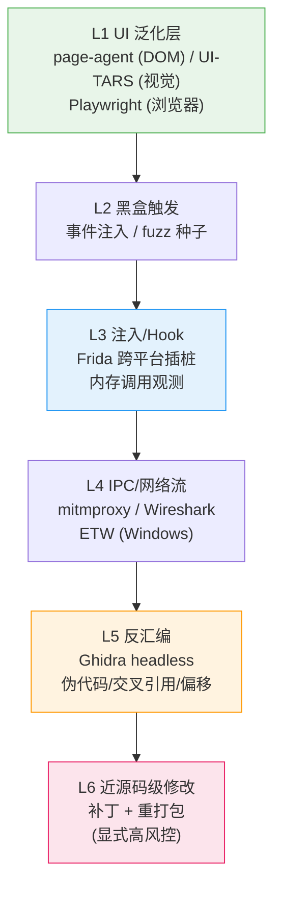
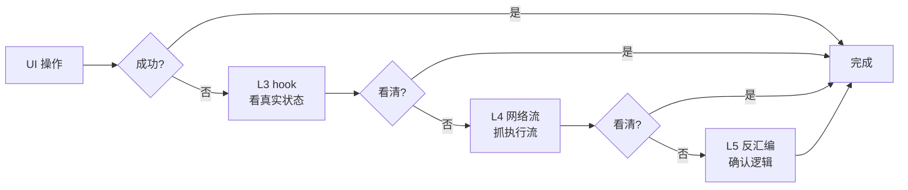

# 深度操作工具链 — 设计文档（2026-08-10）

> 触发讨论：用户提出"从 UI 自动化到二进制级操作"的完整工具链构想——
> UI 做泛化入口，反汇编逼近代码级操作。
> 结论先行：**不做独立项目**，作为 DialogMesh 的工具族（ToolRegistry 注册），
> 由蓝图编排 + 行为链学习 + 白盒记录——DialogMesh 是能驾驭工具的认知体。
> 状态：设计草案，待讨论拍板。前置：工具层已有 ToolRegistry/ToolAdapter/蓝图 tool 节点。
>
> **2026-08-10 重大更新①：发现前身资产（MemoryGraph_old）**
> MemoryGraph_old 是 DialogMesh 的前身（操作助手独立出来的项目）。
> 其逆向工具层（策略 4）**全部现成可用**——Ghidra Bridge 1597 行、
> Frida Bridge 356 行、Angr 符号执行 847 行、Capstone/Zydis 反汇编、
> mg_engine.dll 断点引擎。实施从"从零调研"改为"移植 + 适配"。
>
> **2026-08-10 重大更新②：策略总纲修正——反汇编是兜底不是默认**
> 用户提出操作策略分层：源码优先（repomix）→ CLI 化（CLI-Anything，
> "CLI 即运维控制"）→ UI 自动化 → 注入观测 → 逆向兜底（前身资产）。
> 反汇编从默认手段降级为闭源+高频的最后手段。CLI 控制层未来可 RPC 化。
>
> **2026-08-10 术语修正（用户质疑"CLI 即内核"出处）**：
> DialogMesh 的 B4-5 准确表述 = **"内核唯一 (dispatch 函数集) + 传输可插拔
> (CLI/REST/MCP/WS)"**——CLI 只是传输层之一，不是内核本身。
> "CLI 即内核" 是文档口语化简称，易误导，本设计一律用准确表述。
> CLI-Anything 的 "CLI 即运维控制" 与 B4-5 同构：都是"函数/命令 =
> 控制单元，CLI 是一种暴露方式"——差异只在范围（内部 vs 外部软件）。

---

## 一、核心论断

```
深度操作工具链 = 分层逼近体系
  L1 UI 泛化层   → 适配任何界面 (粗粒度, 高频)
  L2 黑盒触发    → 事件注入 (fuzz)
  L3 注入/Hook   → 内存调用观测 (frida)
  L4 IPC/网络流  → 执行流捕获 (mitmproxy)
  L5 反汇编      → 伪代码/交叉引用/偏移 (Ghidra)
  L6 近源码修改  → 补丁/重打包

目标: UI 做泛化入口, 反汇编逼近代码级操作
  → 层间降级 = 自适应: UI 失败 → hook 看真实状态 → 网络看流量 → 反汇编确认逻辑
```

**关键判断：不是"专门做一个可操作项目"，而是给 DialogMesh 加一个工具族。**

```
理由:
  ① 每一层都有成熟开源 (repomix/CLI-Anything/page-agent/UI-TARS/Frida/Ghidra)
  ② 缺的不是工具, 是"统一编排 + 层间降级" — 这是蓝图能干的事
  ③ 各层操作历史 = 行为数据 (A9) → 学习 + 白盒回看 (A19)
  ④ 层间降级 = 信息论分治实例化 (A7)
```

---

## 一.5 操作策略总纲（反汇编是兜底，不是默认）

**核心修正（用户 2026-08-10）**：不是"UI 泛化 → 逆向逼近"一条道，
而是**五层策略按成本优先**——能读源码就不逆向。

```
┌────────────────────────────────────────────────────┐
│ 策略 0: 源码层 (最优先, 零风险零成本)                │
│   repomix (⭐27.7K) 打包仓库 → LLM 理解 → CLI 操作   │
│   "能读源码就直接读, 别碰界面"                      │
├────────────────────────────────────────────────────┤
│ 策略 1: CLI 化 (CLI-Anything HKUDS, ⭐46.8K)         │
│   "CLI 即运维控制" — 对外部软件的操作控制层            │
│   任何软件 → 自动生成 Python CLI → agent-native      │
│   CLI-Hub (clianything.cc) 现成包装集散地            │
│   演进: 常用操作 → RPC 化 (更高效率)                 │
├────────────────────────────────────────────────────┤
│ 策略 2: UI 自动化 (page-agent DOM / UI-TARS 视觉)   │
│   无 CLI 但有界面 → 视觉/DOM 操作                   │
├────────────────────────────────────────────────────┤
│ 策略 3: 注入观测 (Frida hook — 前身资产)            │
│   UI 不够 → 看真实状态 (内存/函数调用)              │
├────────────────────────────────────────────────────┤
│ 策略 4: 逆向兜底 (Ghidra/angr/Zydis — 前身资产)     │
│   闭源 + 频繁使用 → 反汇编 → 代码级操作             │
│   (最后手段, 高成本, 高风控, PlanGate 显式)          │
└────────────────────────────────────────────────────┘

→ 80% 场景死在策略 0/1 (源码/CLI)
→ 策略 2 (UI) 覆盖"有界面无 CLI"
→ 策略 3/4 (hook/逆向) 只留给闭源高频
```

**CLI-Anything 的定位澄清**：
```
"CLI 即运维控制" — 对外部软件的操作控制层
  (DialogMesh 的 B4-5 是"内核唯一 dispatch 函数集 + 传输可插拔 CLI/REST/MCP/WS",
   与 CLI-Anything 同构: 都是"函数/命令 = 控制单元, CLI = 一种暴露方式")

演进路径:
  阶段 1: CLI 包装 (现在) — "操作 X" → cli_gen 生成 CLI → 控制
  阶段 2: RPC 化 (可行后) — 常用操作 → RPC 调用 → 比 CLI 更高效
    (与 B4-5 同一哲学: CLI 轻量起步, RPC 高效升级)
```

**CLI-Anything 与蓝图哲学同源**："Making ALL Software Agent-Native"
≈ "函数/命令 = 控制单元"哲学在外部软件上的应用——它证明了架构方向正确，
且给了现成的工具生成器（自动把软件变 CLI）。

---

## 二、分层架构

### 2.1 六层全景



### 2.2 每层选型与状态（含前身资产）

| 层 | 能力 | 开源选型 | 前身资产 (MemoryGraph_old) | 现状 | 接入方式 |
|---|------|---------|--------------------------|:---:|---------|
| L1 | UI 自动化 | page-agent (DOM) / UI-TARS (视觉) / Playwright | — (前身无 UI 自动化, 新补) | 调研完成 | ToolRegistry |
| L2 | 黑盒触发 | 自定义事件注入 (基于 L1 基础设施) | — | 待设计 | ToolRegistry |
| L3 | 注入/Hook | Frida | **`core/frida_bridge.py` (356 行)** — FridaBridge: attach/hook 脚本生成/内存扫描/栈追踪 | ✅ 现成 | 移植 + ToolRegistry |
| L4 | IPC/网络 | mitmproxy (Python, 可嵌入) | — | 待调研 | ToolRegistry |
| L5 | 反汇编 | Ghidra headless | **`core/ghidra_bridge.py` (1597 行)** — headless 分析/伪代码/PCode/结构导出<br/>**`core/angr_bridge.py` (847 行)** — 符号执行<br/>**`disasm/` (2858 行)** — Capstone 封装 + CodeScanner 交叉引用 + DataDepGraph 数据流<br/>**`core/capstone_disasm.py` (397 行)** | ✅ 现成 | 移植 + ToolRegistry |
| L6 | 近源码修改 | frida patch / detours / apktool | **`analysis/zydis_engine.py` (929 行)** + ScannerEngine.cpp + build_zydis.bat<br/>**`core/deobfuscator.py` / `junk_code.py` / `anti_debug.py` / `dfg.py` (1665 行)**<br/>**`mg_engine.dll` (84KB) + lib/Release** — int3 断点引擎 | ✅ 现成 | 移植 + **显式高风控** (PlanGate) |
| 执行追踪 | Ghidra 引导断点 | — | **`disasm/tracer_v2.py` (327 行)** — Ghidra 语义标签 → int3 断点 → 运行时执行流 | ✅ 现成 | 移植 |

### 2.3 层间降级协议（自适应）

```
执行一条深度操作指令时, 蓝图层自动编排:

UI 操作 → 失败?
  └─ L1 重试 (不同选择器/坐标) → 仍失败?
      └─ L3 hook 看真实状态 (元素是否真的在? 状态机在哪?)
          └─ L4 网络流 (请求发了没? 响应是什么?)
              └─ L5 反汇编确认逻辑 (这个分支到底怎么走?)

每层降级 = 信息论分治: 高层低成本先试, 低层高成本按需启用
```



---

## 三、与 DialogMesh 的集成

### 3.1 工具注册（策略 0/1 优先）

```python
ToolRegistry.register(ToolAdapter(
    name="repo_scan",
    description="打包开源仓库为单个 LLM 文件 (repomix)",
    keywords_zh=["扫源码", "仓库打包", "读源码", "项目理解"],
    execute=run_repomix,          # 调 repomix
    validate=validate_repo_cmd,
))

ToolRegistry.register(ToolAdapter(
    name="cli_gen",
    description="为软件生成 agent-native CLI 包装 (CLI-Anything)",
    keywords_zh=["生成CLI", "CLI化", "软件控制", "操作接口"],
    execute=run_cli_anything,     # 调 CLI-Anything
    validate=validate_cli_gen_cmd,
))

ToolRegistry.register(ToolAdapter(
    name="ui_test",
    description="UI 自动化测试 (page-agent DOM / UI-TARS 视觉)",
    keywords_zh=["界面测试", "UI测试", "点击", "截图操作"],
    execute=run_ui_test,          # 调 page-agent / UI-TARS
    validate=validate_ui_cmd,     # T2 调用前校验
))

ToolRegistry.register(ToolAdapter(
    name="hook_probe",
    description="Frida 注入观测: 进程内存/函数调用",
    keywords_zh=["hook", "注入", "内存观测", "函数调用"],
    execute=run_hook_probe,       # 调 frida
    validate=validate_hook_cmd,   # 需要目标进程白名单
))

ToolRegistry.register(ToolAdapter(
    name="net_trace",
    description="IPC/网络执行流捕获 (mitmproxy)",
    keywords_zh=["抓包", "网络流", "IPC", "请求追踪"],
    execute=run_net_trace,
    validate=validate_net_cmd,
))

ToolRegistry.register(ToolAdapter(
    name="disasm_lib",
    description="Ghidra 反汇编/伪代码/交叉引用 (前身资产移植)",
    keywords_zh=["反汇编", "伪代码", "交叉引用", "偏移"],
    execute=run_ghidra_headless,  # 移植 core/ghidra_bridge.py
    validate=validate_disasm_cmd,
    risk="high",                  # L5/L6 高风险
))

ToolRegistry.register(ToolAdapter(
    name="xref",
    description="交叉引用: 哪些指令触碰目标地址 (前身资产移植)",
    keywords_zh=["交叉引用", "谁调用", "触碰", "引用"],
    execute=run_xref,             # 移植 disasm/code_scanner.py find_instructions_touching
    validate=validate_xref_cmd,
    risk="high",
))

ToolRegistry.register(ToolAdapter(
    name="dataflow",
    description="数据流因果链: 数据怎么流到目标 (前身资产移植)",
    keywords_zh=["数据流", "因果链", "流向", "来源"],
    execute=run_dataflow,         # 移植 disasm/depgraph.py
    validate=validate_dataflow_cmd,
    risk="high",
))

ToolRegistry.register(ToolAdapter(
    name="sym_exec",
    description="符号执行: 自动探索路径/约束求解 (前身资产移植)",
    keywords_zh=["符号执行", "路径探索", "约束求解"],
    execute=run_sym_exec,         # 移植 core/angr_bridge.py
    validate=validate_sym_exec_cmd,
    risk="high",
))
```

> 注: hook_probe / disasm_lib / xref / dataflow / sym_exec 五个工具
> 全部移植自前身 MemoryGraph_old 逆向层 (core/ 和 disasm/), 非从零实现。

### 3.2 蓝图 tool 节点（全复用）

```
每个工具 = 蓝图 tool 节点:
  T2 调用前校验 (validate)
  T3 结果回灌 llm_reply (操作结果 → 对话上下文)
  T4 ReAct 子循环 (失败重试/换策略)
  T5/T6 归因 (plan/constraint/data/tool 回流)

FLOW_SELF_GROWTH: 每加一个工具 = 系统能力增长
  LLM_DRIVEN 生成 → 执行成功 → 沉淀模板
```

### 3.3 行为闭环

```
操作历史 → 行为链学习:
  "用户习惯用 UI 自动化点这个按钮" → 行为链记录
  "hook 确认了状态机在 X" → 关联链知识
  "反汇编确认偏移 0x1234" → 工程链约束

→ 下次同类操作更快 (启发库存)
→ 全链路白盒可回看 (A19)
```

---

## 四、安全边界（A21 不可协商）

```
默认边界: L1-L4 (UI 自动化 + 注入观测 + 网络分析)
  → 测试/调试正当手段, 无法律风险

显式高风控: L5/L6 (反汇编 + 近源码修改 + 重打包)
  → 仅对自己/开源软件正当
  → 对闭源商业软件: 逆向工程条款风险
  → 必须:
    ① 用户显式确认 (PlanGate 高风控)
    ② 用途声明 (调试/定制, 非绕过授权)
    ③ 操作记录 (A17 记录永不可删)

技术护栏:
  hook_probe/disasm_lib 需要目标进程/文件白名单
  L6 补丁操作独立沙箱 + 签名校验
```

---

## 五、实施计划（阶段化，移植优先）

```
阶段 0 (前置): 前身资产移植盘点
  ├─ 盘点 MemoryGraph_old 逆向层完整清单 (core/frida_bridge + ghidra_bridge +
  │   angr_bridge + capstone_disasm + disasm/ + analysis/zydis + mg_engine.dll)
  ├─ 确认依赖: capstone / angr / frida / ghidra 12.1.2 (zip 在仓库)
  ├─ 确认 mg_engine.dll 的 C++ 源码完整性 (ScannerEngine.cpp 155 行是主源?)
  └─ 移植目录: core/agent/tools/reverse/ (只搬工具层, 不搬业务层)

阶段 0.5 (策略 0/1 — 最高优先): repomix + CLI-Anything
  ├─ repomix 安装/验证 (打包仓库 → LLM 理解)
  ├─ CLI-Anything 安装/验证 (软件 → CLI 包装 → agent 控制)
  ├─ repo_scan + cli_gen 工具注册
  ├─ 蓝图 tool 节点接入 (T2/T3/T4)
  └─ 验收: "操作 X" → repo_scan 看源码? → cli_gen 生成 CLI? → 控制成功

阶段 1: L1 — UI-TARS/page-agent 注册 (前身无此层, 新补)
  ├─ pip install ui-tars (轻量解析器, 验证链路)
  ├─ page-agent 调研 (web 前端测试 — 你们前端是 React)
  ├─ ToolRegistry 注册 ui_test 工具
  └─ 验收: "帮我点这个按钮" → ui_test 执行 → 结果回灌
  └─ (用户建议: 可先在 MemoryGraph_old 验证 UI 链路 — 它已有逆向层,
      加 UI = 完整闭环; DialogMesh 做认知层)

阶段 2: L3/L5 — 前身资产直接注册 (不用从零调研!)
  ├─ 移植 core/frida_bridge.py → hook_probe 工具 (目标进程白名单)
  ├─ 移植 core/ghidra_bridge.py → disasm_lib 工具 (高风控)
  ├─ 移植 disasm/code_scanner.py → xref 工具 (交叉引用)
  ├─ 移植 disasm/depgraph.py → dataflow 工具 (数据流因果链)
  └─ 验收: hook 观测函数调用 + 反汇编确认逻辑 → 结果回灌

阶段 3: L4 — mitmproxy 封装 (前身无此层, 新补)
  ├─ net_trace 工具注册
  ├─ 执行流捕获 → 结构化事件
  └─ 验收: 抓 IPC/网络流 → 分析回灌

阶段 4 (可选): L6 — 前身基础完善
  ├─ 移植 analysis/zydis_engine.py + deobfuscator/junk_code/anti_debug
  ├─ patch_build 工具 (显式高风控)
  ├─ mg_engine.dll 断点追踪接入 (tracer_v2)
  └─ 验收: 反汇编确认偏移 → 近源码级修改 → 重打包

阶段 5 (未来): CLI 控制层 RPC 化
  ├─ 常用操作 → RPC 调用 (B4-5 外部版)
  ├─ 比 CLI 更高效 (长连接/批量/结构化)
  └─ 触发: 常用控制路径稳定后
```

> 注: 阶段 2 原计划"从零调研 Frida/Ghidra"→ 因前身资产发现改为"移植 + 适配"。
> 阶段 0.5 (repomix/CLI-Anything) 是用户补充的最高优先层——80% 场景在此解决。
> 阶段 1/3 (L1/L4) 是前身没有的, 保持新补。

---

## 六、与对标项目的差异（为什么不是重复造轮子）

| 项目 | 做什么 | 缺什么 | 我们补什么 |
|------|--------|--------|-----------|
| UI-TARS-desktop | 视觉 GUI 自动化 | 无编排/无认知层 | 蓝图编排 + 行为学习 |
| page-agent | DOM 级网页操作 | 只限浏览器 | 多工具族统一编排 |
| Frida | 插桩观测 | 无上层语义 | 认知层理解观测结果 |
| Ghidra | 反汇编/伪代码 | 无任务编排 | LLM 驱动任务级使用 |
| testzeus-hercules | 测试 agent | 单域 | 跨域工具族 + 自增长 |

**核心差异**：这些是单层工具，我们是**驾驭所有层的认知体**——工具的操作历史变成行为数据，层间降级由蓝图编排，成功路径沉淀为模板。

---

## 七、待拍板问题

```
P1  默认边界确认: 策略 0-3 默认, 策略 4 (逆向) 高风控显式 — 认可?
    (用户已表态: 技术本身合理, 单用户 + 显式操作 + PlanGate, 风险可控)
P2  阶段顺序: 阶段0(移植盘点) → 0.5(repomix/CLI-Anything) → L1(UI)
    → L3/L5(前身资产) → L4 → L6 — 认可?
    (L2 黑盒触发并入 L1 基础设施)
P3  UI 选型: 先 page-agent (DOM, web 前端) 还是 UI-TARS (视觉, 通用)?
    建议: 两者都注册, page-agent 优先 (你们前端是 web)
P4  工具命名: repo_scan / cli_gen / ui_test / hook_probe / net_trace /
    disasm_lib / xref / dataflow / sym_exec — 命名 OK?
    (xref/dataflow/sym_exec 是前身资产直接映射)
P5  前身资产移植范围: 只搬工具层 (core/frida_bridge 等 + disasm/) —
    不搬业务层 (agent/ai_assistant 等) — 认可?
P6  UI 验证位置: 先在 MemoryGraph_old 验证 UI 链路 (用户建议) —
    还是直接在 DialogMesh 装? 
P7  是否现在开始阶段 0.5 (repomix + CLI-Anything 安装验证)?
```
