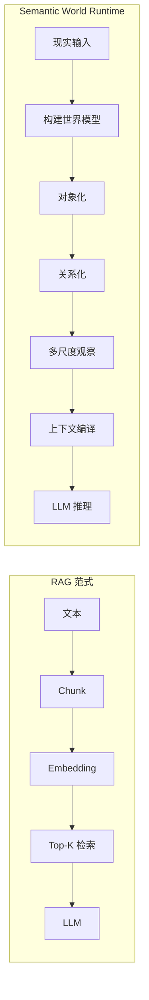
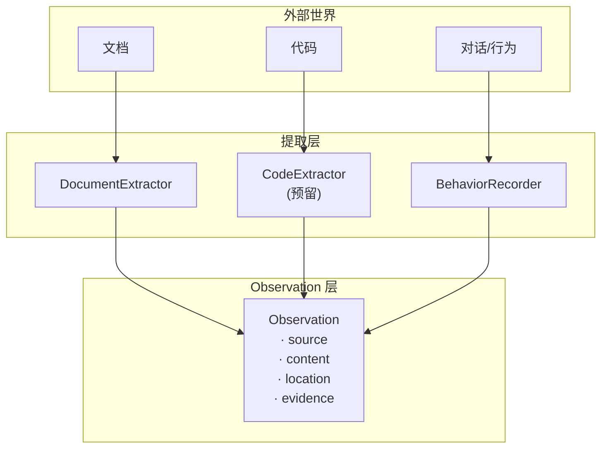
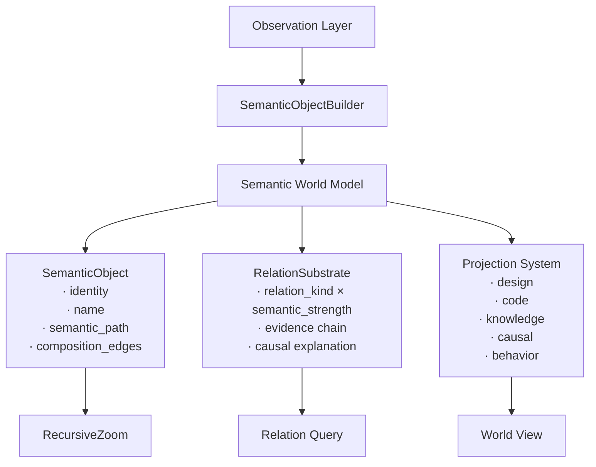
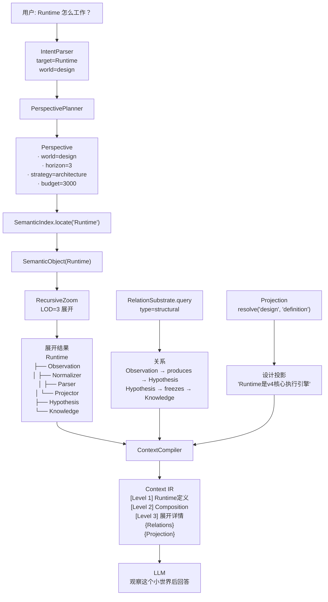
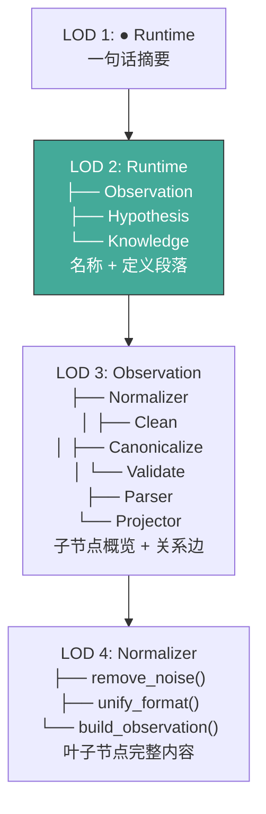
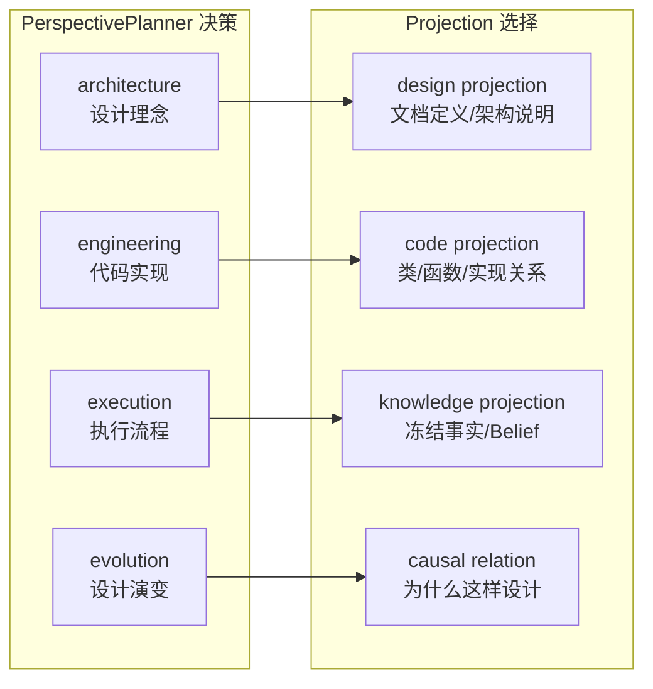
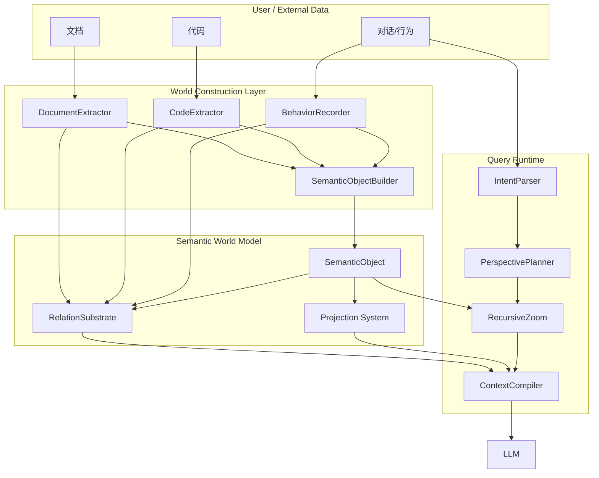
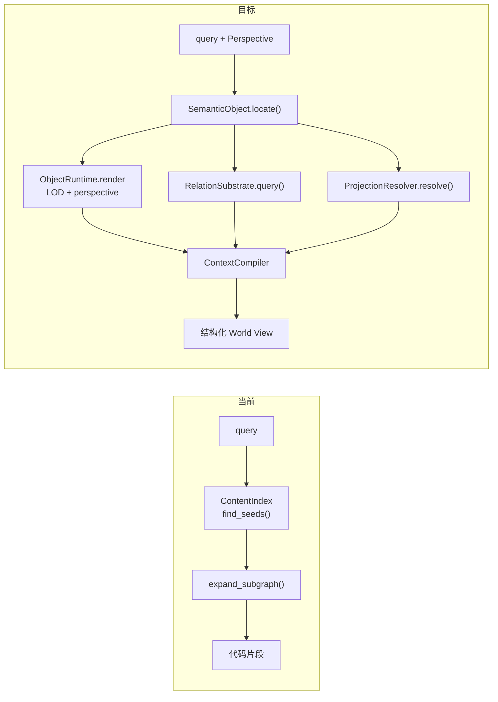

# Semantic World Model — 语义世界运行时

> 版本: v1.0 | 日期: 2026-07-16
> 状态: Draft
> 关联: DESIGN_PERSPECTIVE_PLANNER.md, DESIGN_SEMANTIC_OBJECT.md, DESIGN_RELATION_SUBSTRATE.md

## 一、范式转变

### 1.1 RAG → Semantic World Runtime

> **LLM 不直接面对信息碎片，而是通过一个可缩放的世界接口观察。**

### 1.2 核心命题

| 旧假设 | 新假设 |
|--------|--------|
| 信息 = 独立片段 (Chunk) | 信息 = 持续展开的结构实体 (SemanticObject) |
| 图上的 Node = 世界里的 Object | Node 是子图的入口，不是终点 |
| 检索 = 找到相关文本 | 渲染 = 构造适合当前问题的局部世界 |
| Context = 拼接片段 | Context = 世界视图 (World View) |

## 二、宏观架构

### 2.1 世界构建层

### 2.2 语义世界模型（核心）

### 2.3 模块职责

| 模块 | 回答的问题 | 职责 |
|------|-----------|------|
| **SemanticObject** | 这个东西是什么？ | identity, hierarchy, composition, projection |
| **RelationSubstrate** | 它和其他东西有什么关系？ | depends, implements, produces, causes, follows |
| **Projection** | 从哪个世界看它？ | design / code / knowledge / behavior / causal |
| **RecursiveZoom** | 我要看到多细？ | LOD 1-4 连续缩放 |
| **PerspectivePlanner** | 我应该怎么看？ | strategy, horizon, domain allocation |
| **ContextCompiler** | 如何压缩成 LLM 可读的上下文？ | 结构化 IR 组装 |

## 三、运行时查询流程

## 四、RecursiveZoom — 连续尺度

## 五、Projection 路由

## 六、完整模块关系

## 七、和现有实现的对照

| 模块 | 设计 | 实现 | 缺口 |
|------|------|------|------|
| SemanticObject | 纯数据 + identity + composition + projection | ✅ 9.8K objects | ContextCompiler 未消费 |
| RelationSubstrate | 统一关系基座 + evidence chain | ✅ 5.4K edges, 6 Resolver | Context IR 未注入关系 |
| PerspectivePlanner | 期望→策略→域分配 | ✅ 接入 PCR 期望推断 | 域权重未改变渲染路径 |
| RecursiveZoom | LOD + perspective 的 continuous zoom | ✅ ObjectRuntime.render | ContextCompiler 未调用 |
| ContextCompiler | 世界渲染器 | ❌ BFS + keyword match | 仍是检索模式 |
| Projection | Resolver 动态生成 | ⚠️ DesignResolver 可用，其余 stub | 未接入管线 |

**核心缺口：ContextCompiler 从 "检索模式" 升级为 "世界渲染模式"。**

## 八、ContextCompiler 升级路线

### 实现步骤

1. **ContextCompiler 接 ObjectRuntime**: `render(obj, LOD=horizon.d, perspective=persp)`
2. **注入 RelationSubstrate**: 每条 context entry 附带 relation edges
3. **注入 Projection**: design/code/knowledge/causal 按 perspective 选择
4. **废弃 ContentIndex BFS**: 替换为 SemanticPath 导航
