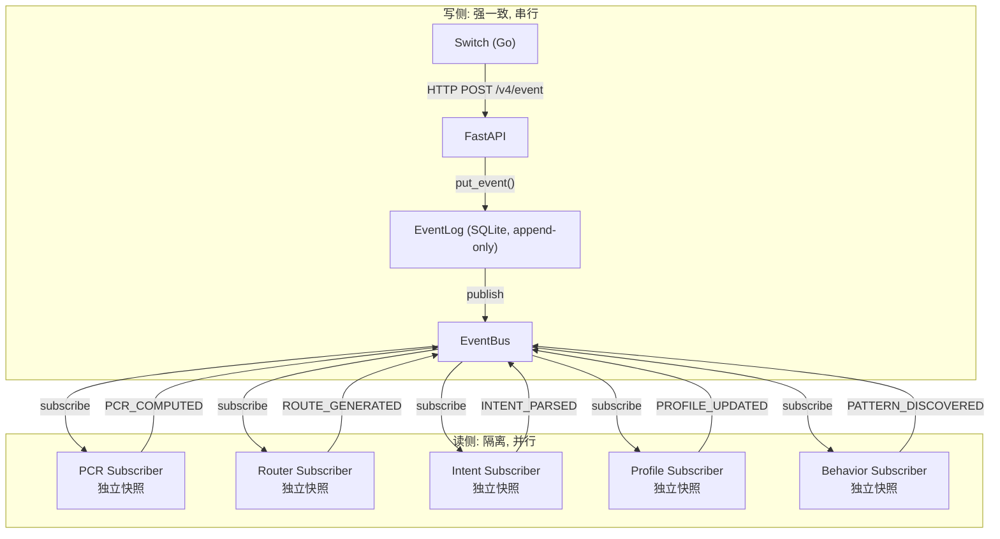

# DialogMesh — Event Sourcing + CQRS 内核架构

> 2026-07-22 · 合并 v4(EventBus) + v5(StateEvolution) + v6(Decider)
>
> 前置: DESIGN_API_EVENT_LOG.md + DESIGN_STATE_EVOLUTION_SYSTEM.md + DESIGN_GLOBAL_STATE_MACHINE.md

---

## 一、设计演化与根本矛盾

```
v4 (07-13): EventBus + EventLog     → 事件驱动, pub/sub, "EventBus 已有"
v5 (07-19): State Evolution System  → 抱怨四空间各自维护状态
v6 (07-19): Global Decider           → Command→Event→State, 防广播风暴
现实:       engine.on_event()        → 顺序管道, EventBus从未建造
```

**根因**: v4 的 EventBus 从未建造。v5 的状态分散问题和 v6 的广播风暴问题，都是"EventBus 缺失"的并发症。有了 EventBus 作为唯一事件分发层，状态自然会收敛，链间自然隔离。

---

## 二、Event Sourcing + CQRS: 三个需求一起满足



**三个需求**：

| 需求 | 微服务 | CQRS | Event Sourcing | Event Sourcing + CQRS |
|------|:---:|:---:|:---:|:---:|
| 隔离 | ✅ 独立DB | ✅ 独立读模型 | ✅ Event只追加 | ✅ |
| 一致性 | ❌ 最终一致性 | ⚠️ 最终一致性 | ✅ append-only强一致 | ✅ 写侧强一致, 读侧最终一致 |
| 并行 | ✅ 独立部署 | ✅ 独立查询 | ❌ 串行写入 | ✅ 无依赖链并行投射 |
| 审计/回放 | ❌ | ❌ | ✅ 完整事件流 | ✅ |
| 纠错 | ❌ 需分布式事务 | ❌ | ✅ 重放修正 | ✅ 重放修正 |

---

## 三、核心机制

### 3.1 EventLog — 唯一真相源

```python
# 所有链只写 EventLog, 不直接修改任何 DB
class EventLog:
    def append(self, event: Event) -> int:
        """Append-only. 强一致. 不可变."""
        # SQLite INSERT, 单写入线程
        return self._db.execute(
            "INSERT INTO events (type, payload, trace_id, created_at) VALUES (?, ?, ?, ?)",
            (event.type, json.dumps(event.payload), event.trace_id, time.time())
        ).lastrowid

    def replay(self, from_seq: int = 0) -> Iterator[Event]:
        """完整回放 — 可从任意 checkpoint 重建状态."""
        for row in self._db.execute(
            "SELECT * FROM events WHERE seq > ? ORDER BY seq", (from_seq,)
        ):
            yield Event.from_row(row)
```

### 3.2 EventBus — 分发层

```python
class EventBus:
    """环形缓冲 + 订阅分发. 零背压(满则丢弃+标记, EventLog可重放)."""
    
    def __init__(self, buffer_size: int = 1024):
        self._buffer = collections.deque(maxlen=buffer_size)
        self._subscribers: Dict[EventType, List[Callable]] = defaultdict(list)
        self._dropped = 0
    
    def publish(self, event: Event):
        self._buffer.append(event)
        for subscriber in self._subscribers.get(event.type, []):
            subscriber(event)  # 同步分发 — 链是轻量投射, <10ms
    
    def subscribe(self, event_type: EventType, handler: Callable):
        self._subscribers[event_type].append(handler)
```

### 3.3 Projection — 各链独立读模型

```python
class ChainProjection:
    """每个链维护自己的投射 — 从 EventLog 推导, 非直接修改."""
    
    def __init__(self, event_log: EventLog, last_seq: int = 0):
        self._log = event_log
        self._seq = last_seq          # 已消费到哪个序列号
        self._state = StateSnapshot()  # 当前投射状态
    
    def catch_up(self):
        """回放未消费的事件 → 更新投射."""
        for event in self._log.replay(from_seq=self._seq):
            self._state = self._evolve(self._state, event)
            self._seq = event.seq
    
    def _evolve(self, state: StateSnapshot, event: Event) -> StateSnapshot:
        """纯函数 — 事件 → 新状态. 无副作用, 可测试, 可重放."""
        # 各链实现自己的 evolve 逻辑
        raise NotImplementedError
```

---

## 四、与微服务的对比

```
微服务:
  ServiceA → DB_A (独立)
  ServiceB → DB_B (独立)
  ServiceA 修改 → 发消息 → ServiceB 更新 DB_B
  问题: 消息丢失/重复/乱序 → 最终一致性不可控

Event Sourcing + CQRS:
  PCR → EventLog (append PCR_COMPUTED)
  Router → EventLog (append ROUTE_GENERATED)  
  Profile 投射: 从 EventLog replay → 本地读模型
  优势:
    ① 写侧强一致 (单线程 append)
    ② 读侧隔离 (各链独立投射, 互不影响)
    ③ 并行投射 (无依赖的链同时 replay)
    ④ 完整审计 (EventLog 不可变)
    ⑤ 纠错可重放 (错误投射 → 删本地快照 → replay 修复)
```

---

## 五、效率分析

**微服务是否牺牲效率？**

| 场景 | 微服务 | Event Sourcing + CQRS |
|------|------|------|
| 单链写入 | ~1ms (本地DB) | ~0.5ms (SQLite append) |
| 多链并行处理 | 各服务独立, 网���开销 | 各链独立投射, 内存分发, <10ms |
| 跨链查询 | RPC/消息 → 10-100ms | 本地读模型 → <1ms |
| 故障恢复 | 需分布式事务/补偿 | 重放 EventLog → <1s |
| 一致性维护 | 最终一致性, 延迟不可控 | 写侧强一致, 读侧最终一致但延迟可控(<10ms) |

**结论**: 对于 DialogMesh 这种 10 条链、单进程运行的场景，微服务的网络开销反而更大。Event Sourcing + CQRS 在单进程内用内存分发 + SQLite 持久化，效率远高于微服务。

---

## 六、迁移路径

### 当前 → 目标

```
当前: engine.on_event() 顺序管道
  self._pcr.evaluate()
  self._router.route()
  self._intent.parse()
  ...12 chains in sequence

目标: EventLog → EventBus → Subscribers
  PCR.subscribe(MESSAGE_RECEIVED) → PCR.evaluate() → publish(PCR_COMPUTED)
  Router.subscribe(PCR_COMPUTED) → Router.route() → publish(ROUTE_GENERATED)
  Intent.subscribe(ROUTE_GENERATED) → Intent.parse() → publish(INTENT_PARSED)
  Profile.subscribe(PCR_COMPUTED, LLM_REPLY) → Profile.update()
  Behavior.subscribe(LLM_REPLY) → Behavior.record()
  Meta.subscribe(BEHAVIOR_RECORDED) → Meta.review()
```

### 实施步骤

| 步骤 | 内容 | 影响 |
|:---:|------|------|
| 1 | 建 EventBus (环形缓冲 + 订阅) | 基础设施 |
| 2 | PCR 迁移到 subscriber | 第一链 |
| 3 | Router + Intent 迁移 | 前半链 |
| 4 | Profile + Behavior 迁移 | 后半链 |
| 5 | Meta + ABC + Mind 迁移 | 最后链 |
| 6 | 删除 sequential on_event | 清理 |
