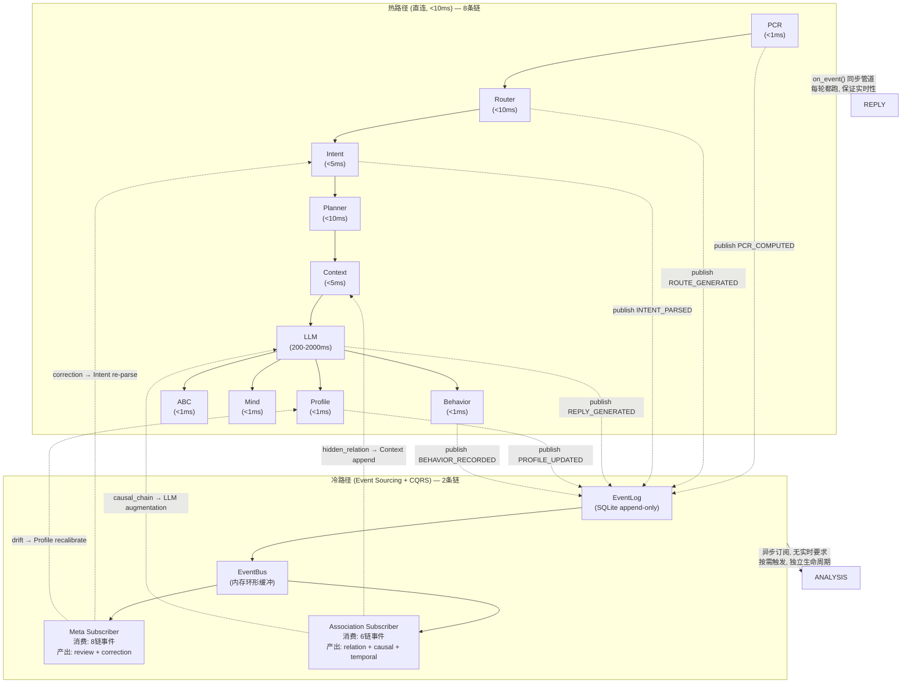

# DialogMesh v6 — 混合架构：热路径直连 + 冷路径 Event Sourcing

> 2026-07-22 · 核心决策：不全量重构，只为广播风暴高风险链引入 Event Sourcing
>
> 前置: DESIGN_EVENT_SOURCING_CQRS.md + MESH_DEPENDENCY.md + DESIGN_GLOBAL_STATE_MACHINE.md

---

## 一、问题边界

```
全量重构 = 过度设计。10 条链中 8 条热路径（<10ms），不需要事件溯源。
真正需要隔离的是 Meta 和 Association —— 广播风暴的根源。
```

### 广播风暴溯源

```
Meta (元认知):
  消费: PCR + Router + Intent + LLM + Profile + Behavior + Mind + ABC
  产出: review_result → Profile (修正)
       + anomaly_flag → 所有链 (降级)
       + correction → Intent (重新解析)
  → 消费 8 条链, 产出影响 3+ 条链 = 广播风暴根源 ①

Association (关联链):
  消费: PCR + Router + Intent + DiscourseTree + TopicTree + Behavior
  产出: hidden_relation → Context (追加)
       + causal_chain → LLM (推理增强)
       + temporal_pattern → Behavior (模式学习)
  → 消费 6 条链, 产出影响 3+ 条链 = 广播风暴根源 ②
```

---

## 二、混合架构全景



---

## 三、热路径：引擎直连管道

```
不变。保持 engine.on_event() 的同步管道:
  PCR → Router → Intent → Planner → Context → LLM → Profile → Behavior → ABC → Mind

变化: 每个链完成后 publish event 到 EventLog (fire-and-forget, 不阻塞热路径)
```

```python
# engine.on_event() — 热路径不变, 加一行 publish
def on_event(self, event: EventIR) -> Optional[str]:
    # ... 现有逻辑不变 ...
    
    pcr_output = self._pcr.evaluate(input)     # 热路径: 直接调用
    self._event_log.append(PCR_COMPUTED(...))   # 冷路径: 异步发布, 不阻塞
    
    route = self._router.route(text)            # 热路径: 直接调用
    self._event_log.append(ROUTE_GENERATED(...)) # 冷路径: 异步发布
    
    # ... 其余链同理 ...
    
    return llm_response
```

**原则**：publish 是 fire-and-forget，不阻塞 on_event 返回。最坏情况 EventLog 满 → 丢弃 + 计数，不影响热路径。

---

## 四、冷路径：Meta + Association 通过 Event Sourcing 隔离

### 4.1 EventLog — 热路径的副输出

```python
@dataclass
class Event:
    seq: int                  # 自增序列号, 单调
    type: EventType           # PCR_COMPUTED | ROUTE_GENERATED | INTENT_PARSED | ...
    payload: Dict[str, Any]   # 链产出的关键数据
    trace_id: str             # 本轮对话的 trace_id
    timestamp: float          # 产生时间

class EventLog:
    """SQLite append-only. 单写入线程 = 强一致."""
    
    def append(self, event: Event) -> int:
        return self._db.execute(
            "INSERT INTO events VALUES (NULL, ?, ?, ?, ?)",
            (event.type.value, json.dumps(event.payload), event.trace_id, event.timestamp)
        ).lastrowid
    
    def tail(self, from_seq: int, limit: int = 100) -> List[Event]:
        """增量拉取 — 订阅者用于追赶."""
        rows = self._db.execute(
            "SELECT * FROM events WHERE seq > ? ORDER BY seq LIMIT ?",
            (from_seq, limit)
        ).fetchall()
        return [Event.from_row(r) for r in rows]
    
    def purge(self, before_seq: int):
        """清理旧事件 — 保留期 30 天."""
        self._db.execute("DELETE FROM events WHERE seq < ?", (before_seq,))
```

### 4.2 Meta Subscriber — 订阅 8 种事件, 定期审核

```python
class MetaSubscriber:
    """
    订阅: PCR_COMPUTED, ROUTE_GENERATED, INTENT_PARSED, REPLY_GENERATED,
          PROFILE_UPDATED, BEHAVIOR_RECORDED, ABC_EVALUATED, MIND_LEARNED
    
    触发: 每 5 轮对话 OR behavior 突变 OR profile 漂移 > 0.3
    
    产出:
      - review_result → publish(META_REVIEWED)
      - correction → publish(INTENT_CORRECTION) → Intent 重解析
      - anomaly → publish(ANOMALY_DETECTED) → 所有链降级
    """
    
    def __init__(self, event_log: EventLog, bus: EventBus):
        self._log = event_log
        self._bus = bus
        self._last_seq = 0
        self._turn_count = 0
        self._state = MetaState()  # 本地投射
    
    def tick(self):
        """EventBus 通知有新事件 → 增量追赶."""
        new_events = self._log.tail(from_seq=self._last_seq)
        for event in new_events:
            self._state = self._evolve(self._state, event)
            self._last_seq = event.seq
        
        self._turn_count += len(new_events)
        
        # 触发条件
        if self._should_review():
            result = self._review(self._state)
            self._bus.publish(Event(type=META_REVIEWED, payload=result))
    
    def _should_review(self) -> bool:
        return (self._turn_count % 5 == 0 or
                self._state.behavior_surge or
                self._state.profile_drift > 0.3)
    
    def _evolve(self, state: MetaState, event: Event) -> MetaState:
        """纯函数 — 事件 → 新状态. 可重放, 可测试."""
        if event.type == EventType.BEHAVIOR_RECORDED:
            state.behavior_count += 1
        elif event.type == EventType.PROFILE_UPDATED:
            if abs(event.payload.get('trust', 0.5) - state.last_trust) > 0.3:
                state.profile_drift = abs(event.payload['trust'] - state.last_trust)
            state.last_trust = event.payload.get('trust', 0.5)
        return state
```

### 4.3 Association Subscriber — 订阅 6 种事件, 按需发现关联

```python
class AssociationSubscriber:
    """
    订阅: PCR_COMPUTED, ROUTE_GENERATED, INTENT_PARSED, REPLY_GENERATED,
          DISCOURSE_UPDATED, TOPIC_SWITCHED, BEHAVIOR_RECORDED
    
    触发: topic 切换 OR behavior 新模式 OR discourse 粘合度 cliff
    
    产出:
      - hidden_relation → publish(ASSOCIATION_DISCOVERED) → Context 追加
      - causal_chain → publish(CAUSAL_CLOSURE) → LLM 增强
      - temporal_pattern → publish(TEMPORAL_PATTERN) → Behavior 学习
    """
    
    def __init__(self, event_log: EventLog, bus: EventBus):
        self._log = event_log
        self._bus = bus
        self._last_seq = 0
        self._state = AssociationState()
    
    def tick(self):
        new_events = self._log.tail(from_seq=self._last_seq)
        for event in new_events:
            self._state = self._evolve(self._state, event)
            self._last_seq = event.seq
        
        if self._should_discover():
            relations = self._discover(self._state)
            for rel in relations:
                self._bus.publish(Event(type=ASSOCIATION_DISCOVERED, payload=rel))
    
    def _evolve(self, state: AssociationState, event: Event) -> AssociationState:
        """纯函数 — 累积关联证据."""
        if event.type == EventType.INTENT_PARSED:
            state.current_intent = event.payload.get('category')
        elif event.type == EventType.TOPIC_SWITCHED:
            state.topic_shift_count += 1
        elif event.type == EventType.DISCOURSE_UPDATED:
            state.cohesion = event.payload.get('cohesion', 1.0)
        return state
```

---

## 五、EventBus — 内嵌环形缓冲

```python
class EventBus:
    """
    单进程内存分发。同步调用 subscriber.handler()。
    原因: subscriber 是轻量 evolve(<1ms), 不需要异步线程。
    如需异步: subscriber.handler 内部自行 submit 到线程池。
    """
    
    def __init__(self, buffer_size: int = 1024):
        self._buffer = collections.deque(maxlen=buffer_size)
        self._subscribers: Dict[EventType, List[Tuple[str, Callable]]] = defaultdict(list)
        self._dropped_count = 0
    
    def publish(self, event: Event):
        """写入环形缓冲 + 通知订阅者."""
        if len(self._buffer) >= self._buffer.maxlen:
            self._dropped_count += 1
            # 最旧事件丢弃, EventLog 可重放
        self._buffer.append(event)
        for name, handler in self._subscribers.get(event.type, []):
            try:
                handler(event)
            except Exception as e:
                logger.error("Subscriber %s failed: %s", name, e)
    
    def subscribe(self, event_type: EventType, name: str, handler: Callable):
        self._subscribers[event_type].append((name, handler))
```

---

## 六、一致性保证

| 方面 | 机制 |
|------|------|
| 写入一致性 | EventLog 单线程 append → 强一致 |
| 读取一致性 | Subscriber 拉取 from `last_seq` → 单调不重不丢 |
| 故障恢复 | Subscriber 崩溃 → 重启后从 `last_seq` 重放 |
| 纠错 | 错误的 evolve → 删本地投射 → replay 修正 |
| 热冷一致性 | 热路径 publish 后才返回用户 → EventLog 一定已写入 |
| 反压 | EventBus 满 → 丢弃最旧 + 计数 → EventLog 完整 → 重放可恢复 |

---

## 七、迁移步骤

| 步骤 | 内容 | 影响 |
|:---:|------|------|
| 1 | 建 EventLog (SQLite) + EventBus (环形缓冲) | 基础设施, 不改变现有行为 |
| 2 | 热路径 publish (PCR/Router/... 完成后追加) | +1 行/链, fire-and-forget, 不阻塞 |
| 3 | Meta Subscriber 实现 + 订阅 | 替代现有每5轮触发 |
| 4 | Association Subscriber 实现 + 订阅 | 新增, 关联链首次接入 |
| 5 | 热路径 consume 冷路径产出 (correction/relation) | 跨路径通信闭合 |
| 6 | 清理旧的 Decider/Trigger (不再需要) | 移除控制面 |

---

## 八、效率对比

| 指标 | 全量 Event Sourcing | 混合架构 (本方案) |
|------|:---:|:---:|
| 热路径延迟 | +0.5ms/链 (publish) | +0.5ms × 8 = +4ms |
| 冷路径延迟 | 独立 | 独立 |
| 广播风暴风险 | 零 (全部隔离) | 零 (Meta+Association隔离) |
| 代码改动量 | 大 (重构全部 10 链) | 小 (新增 3 个类 + publish 行) |
| 回滚风险 | 高 | 低 (热路径不变, 冷路径独立) |
| 一致性 | write-ahead log 强一致 | 同 |
