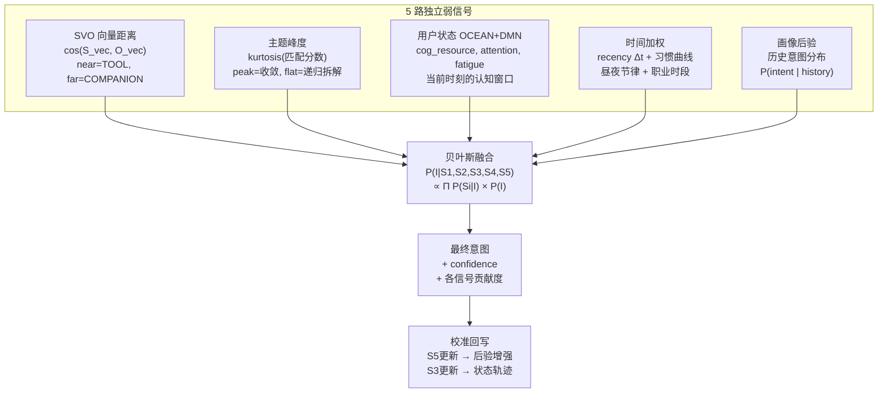

# 意图识别 — 贝叶斯多源融合设计

> 2026-07-21 · 从 SVO 距离讨论推导

---

## 一、为什么需要多源融合

单信号不可靠：

```
P(intent | text_only):
  "能不能用ML预测内存访问" → SVO距离远 → COMPANION (猜测)

P(intent | text + time + user + topic):
  "能不能用ML预测内存访问" + 用户是逆向工程师 + 下午2点工作高峰 + 
  前5轮都在讨论frida hook + 当前topic=动态分析
  → TOOL (高置信: 这不是闲聊, 是跨域工具探索)
```

核心：单信号方差大，多信号贝叶斯融合缩小方差。

---

## 二、信号源架构



---

## 三、S1: SVO 向量距离 (主信号, 0.1-5ms)

```python
# stanza 依存解析
subj, verb, obj = extract_svo(text)

# BGE 编码
emb_s = bge.encode(subj)  # "机器学习"
emb_o = bge.encode(obj)   # "内存地址访问模式"

cosine = dot(emb_s, emb_o) / (|emb_s| * |emb_o|)

# 距离 → TIER
if cosine > 0.6:     near_transfer("同一语义域 → TOOL")
elif cosine > 0.3:   mid_transfer("相关域 → ADVISOR")
elif cosine > 0.1:   far_transfer("跨域探索 → COMPANION")
else:                unknown_transfer("无关联 → UNKNOWN")
```

---

## 四、S2: 主题峰度 (后验校验, 0.1ms)

```python
# 主题匹配分数分布
topic_scores = [0.9, 0.88, 0.05, 0.02]  # 4个候选主题

k = kurtosis(topic_scores)
# k > 1: 尖峰分布 → 主题明确 → 增强 S1 confidence
# k < 0: 平坦分布 → 主题模糊 → 降低 S1 confidence, 触发递归拆解
```

主题快匹配 (BUSINESS_CHAIN_02_APPENDIX) 已在递归收敛文档中定义。

---

## 五、S3: 用户状态 OCEAN+DMN (动态窗口, <1ms)

```python
# OCEAN 10维 → 压缩为认知状态向量
state = {
    "cog_resource": 0.72,      # 认知资源剩余 (inertia EMA)
    "attention_anchor": "frida", # 当前注意力锚点
    "fatigue_curve": 0.15,      # 疲劳度 (距离上次休息的时间)
    "emotion_entropy": 0.23,    # 情绪熵 (话题跳转频率)
}

# 状态 → 意图偏置
if state.cog_resource < 0.3:   # 疲劳 → 低复杂度期望
    bias_toward("FAST_EXECUTE")
if state.emotion_entropy > 0.6: # 情绪波动 → 降低置信
    reduce_confidence(0.15)
if state.attention_anchor == "frida" and "hook" in text:
    boost_tool_score(0.2)       # 注意力一致 → 增强
```

---

## 六、S4: 时间加权 (节律+习惯, <1ms)

```python
# Layer 1: 实时recency
Δt = now - last_interaction_time
if Δt < 60s:       weight = 1.0    # 连续对话
elif Δt < 5min:    weight = 0.9    # 稍等
elif Δt < 1h:      weight = 0.7    # 回来了
else:              weight = 0.5    # 新会话

# Layer 2: 昼夜节律 (中国人习惯)
hour = now.hour
if 7 <= hour < 9:   state = "morning_ramp"     # 上班, 高认知
if 9 <= hour < 12:  state = "deep_work"         # 黄金时段
if 12 <= hour < 14: state = "lunch_low"          # 午休, 低认知
if 14 <= hour < 17: state = "afternoon_work"     # 下午高峰
if 17 <= hour < 19: state = "evening_winddown"   # 下班
if 19 <= hour < 23: state = "personal_learning"  # 自学时段
if 23 <= hour < 7:  state = "night_owl"          # 夜猫子

# Layer 3: 职业时段 (画像学习)
# 逆向工程师典型: 14-17 分析, 19-23 自学/实验
# 这些由 Profile 从历史数据学习, 不是硬编码
```

---

## 七、S5: 画像后验 (长期学习, <1ms)

```python
# 从 ExecutionTrace 学习
profile.intent_dist_by_hour = {
    9:  {"TOOL": 0.6, "ADVISOR": 0.3, "COMPANION": 0.1},
    14: {"TOOL": 0.4, "ADVISOR": 0.4, "COMPANION": 0.2},
    21: {"COMPANION": 0.5, "ADVISOR": 0.3, "TOOL": 0.1},
}

# 学习用户习惯
profile.avg_session_length = 45min
profile.typical_domains = ["reverse_engineering", "memory_analysis"]
profile.communication_style = CS=0.78   # 偏直接

# 后验概率
P_TOOL = profile.intent_dist_by_hour[now.hour]["TOOL"]  # 先验
```

---

## 八、融合公式

```python
def bayesian_fusion(signals, priors):
    """
    P(I|S1..S5) ∝ P(S1|I) × P(S2|I) × P(S3|I) × P(S4|I) × P(I|S5)
    
    P(S1|I): SVO距离 → 似然 (BGE cosine)
    P(S2|I): 峰度 → 信号可靠性因子
    P(S3|I): 用户状态 → 认知偏置
    P(S4|I): 时间 → 节律 + 习惯
    P(I|S5): 画像后验 → 先验概率
    """
    posteriors = {}
    for intent in ["TOOL", "ADVISOR", "COMPANION", "UNKNOWN"]:
        # 乘积
        p = 1.0
        p *= svo_likelihood(intent, signals["cosine"])
        p *= kurtosis_factor(intent, signals["kurtosis"])
        p *= state_bias(intent, signals["océan_dmn"])
        p *= temporal_weight(intent, signals["hour"], signals["recency"])
        p *= profile_prior(intent, signals["history"])
        posteriors[intent] = p
    
    # 归一化
    total = sum(posteriors.values())
    return {k: v/total for k, v in posteriors.items()}
```

---

## 九、Profile 精进需求

当前 Profile 只有 TrackA (EMA) + TrackB (标签)。需要新增：

| 新维度 | 来源 | 作用 |
|--------|------|------|
| 时间曲线 | 历史记录聚合 | S4 Layer 3: 职业时段 |
| 意图分布 | ExecutionTrace 统计 | S5: 后验先验 |
| 认知疲劳曲线 | 交互间隔 + 话题跳转 | S3: 认知窗口 |
| 注意力锚点序列 | 连续话题跟踪 | S3: attention_anchor |
| 昼夜节律偏移 | 长期使用时间 | S4 Layer 2 个性化 |

---

## 十、实施优先级

| 优先级 | 内容 | 新增代码 | 当前状态 |
|:---:|------|:---:|------|
| P0 | SVO + BGE cosine (S1) | ~100行 | stanza实验进行中 |
| P0 | 贝叶斯融合框架 | ~80行 | 设计完成, 未实现 |
| P1 | 主题峰度 (S2) | ~20行 | fusion.py 已有, 未接入 |
| P1 | recency权重 (S4 L1) | ~10行 | 未实现 |
| P2 | OCEAN状态注入 (S3) | ~30行 | CognitiveProfile 已有, 需接入 |
| P2 | 画像后验 (S5) | ~50行 | Profile 需扩展 |
| P3 | 昼夜节律 (S4 L2-3) | ~40行 | Profile 扩展后 |
