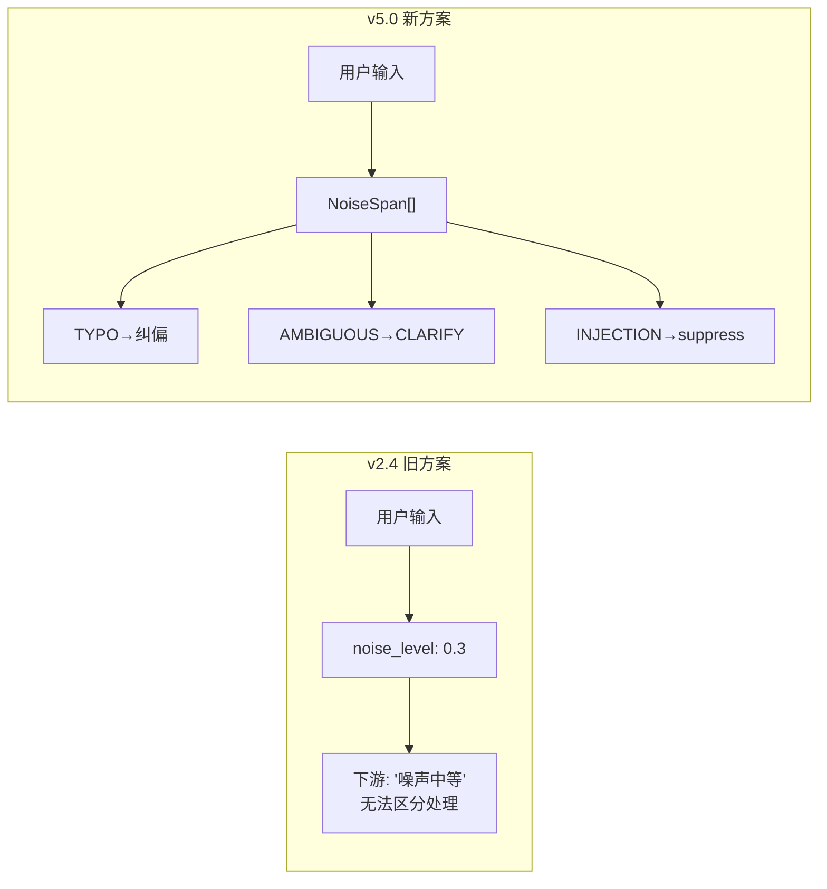
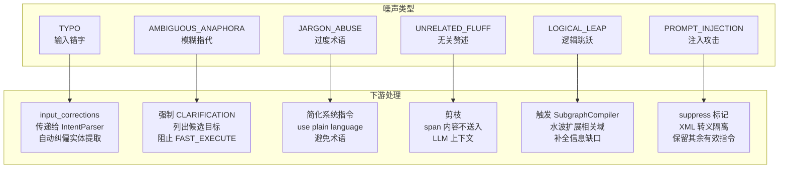

# NoiseSpan — 局部噪声拓扑标记系统

> 版本: v5.0 | 日期: 2026-07-21
> 
> 替代: PCR v2.4 的全局 `noise_level: float`
> 设计来源: PCR 业务链讨论 + 噪声度三维模型 (design_layer0_pcr_and_layer1_intent_parser §4.3.1)

---

## 一、为什么替代全局标量



| 旧设计缺陷 | 新方案解决 |
|-----------|---------|
| 全局标量丢信息 | 定位到 char 级别的标记 |
| 无类型区分 | 6 种噪声类型 × 差异化策略 |
| "噪声高→拒绝" | "TYPO→纠偏, AMBIGUOUS→CLARIFY" |
| 无认知刷新豁免 | 三维判别(时间/指代/描述) |

---

## 二、数据模型

```python
from dataclasses import dataclass, field
from enum import Enum
from typing import List, Optional

class NoiseType(Enum):
    TYPO = "typo"                          # 输入错字
    AMBIGUOUS_ANAPHORA = "ambiguous_anaphora"  # 模糊指代
    JARGON_ABUSE = "jargon_abuse"          # 过度术语
    UNRELATED_FLUFF = "unrelated_fluff"     # 无关赘述
    LOGICAL_LEAP = "logical_leap"          # 逻辑跳跃
    PROMPT_INJECTION_SUSPECT = "prompt_injection_suspect"  # 注入攻击
    CONTEXT_BREAK = "context_break"        # 上下文断裂(认知刷新豁免前)
    STRUCTURAL = "structural"              # 结构噪声(无动词/语法错)
    LEXICAL = "lexical"                    # 词汇噪声(模糊词密度)

@dataclass(frozen=True)
class NoiseSpan:
    """单个噪声标记 — 定位到 char 级别"""
    start_char: int
    end_char: int
    noise_type: NoiseType
    severity: float                         # 0-1, 该局部的干扰程度
    suggested_correction: Optional[str] = None  # TYPO 时的修正建议
    reason: str = ""                        # 解释为什么标记这里
    suppress: bool = False                  # INJECTION 时是否隔离该 span

@dataclass(frozen=True)
class NoiseAssessment:
    """噪声评估结果 — 替代单一的 noise_level"""
    spans: List[NoiseSpan]                  # 核心: 局部标记列表
    noise_level: float = 0.0               # 降级用聚合值 = sum(severity)/len(spans) or 0
    noise_source: str = ""                 # semantic / structural / referential / context_break
    temporal_gap_factor: float = 1.0       # 时间间隔因子 (认知刷新感知)
    referential_dissonance: float = 0.0     # 指代失调度
    discursive_shift: float = 0.0          # 描述方式变化度
    topic_shift_detected: bool = False     # 话题切换豁免标记
```

---

## 三、6 种噪声类型 × 下游处理策略



### 处理表

| 类型 | 链路 | 动作 | 参数 |
|------|------|------|------|
| TYPO | 链02 LLM回复 | `input_corrections` 字段 | `{original, corrected, position}` |
| AMBIGUOUS_ANAPHORA | 链01 对话树 | 强制 CLARIFICATION mode | 列出历史候选实体 |
| JARGON_ABUSE | 链02 LLM | system_instruction 追加 plain language | 降低术语密度 |
| UNRELATED_FLUFF | 链02 LLM | 剪枝 — 不送入上下文 | span 的 char range |
| LOGICAL_LEAP | 链10 子图 | 触发水波扩展 | 缺口维度列表 |
| PROMPT_INJECTION | 链02 LLM | suppress — XML 隔离 | `<ignore>span</ignore>` |
| CONTEXT_BREAK | 链09 元认知 | 触发 Audit Signal | 三维评分详情 |
| STRUCTURAL | 链01 | Fast Path 门控关闭 | 强制走完整 Pipeline |
| LEXICAL | 链01 | 歧义阈值收紧 | `max_ambiguities_before_ask↓` |

---

## 四、检测算法

### TYPO 检测 (键盘距离 + 词频)

```python
def detect_typos(self, text: str) -> List[NoiseSpan]:
    spans = []
    words = jieba.lcut(text)  # 中文分词
    for i, word in enumerate(words):
        if word in self._freq_dict:  # 常用词 → 跳过
            continue
        # 计算键盘距离
        candidates = self._keyboard_distance_candidates(word)
        if candidates and candidates[0].distance <= 2:
            spans.append(NoiseSpan(
                start_char=self._word_start(text, i),
                end_char=self._word_end(text, i),
                noise_type=NoiseType.TYPO,
                severity=min(0.9, candidates[0].distance * 0.3),
                suggested_correction=candidates[0].word,
                reason=f"Keyboard distance {candidates[0].distance} → {candidates[0].word}"
            ))
    return spans

# 键盘距离矩阵: QWERTY 布局
# 'a'→'q': 1, 'a'→'w': 1, 'a'→'s': 1, 'a'→'z': 1
# 中文字形相似: 歌→个 (拼音相邻), 的→得 (同音)
```

### 模糊指代检测

```python
def detect_ambiguous_anaphora(self, text: str, history: List[HistoryEntry]) -> List[NoiseSpan]:
    spans = []
    strong_referential = {"这个", "那个", "它", "刚才的", "之前那个", "上面的"}
    for ref in strong_referential:
        idx = text.find(ref)
        if idx < 0:
            continue
        # 检查历史中是否有可解析的目标
        candidates = self._resolve_reference(ref, history)
        if len(candidates) == 0 or len(candidates) > 1:
            spans.append(NoiseSpan(
                start_char=idx,
                end_char=idx + len(ref),
                noise_type=NoiseType.AMBIGUOUS_ANAPHORA,
                severity=0.7 if len(candidates) == 0 else min(0.9, len(candidates)*0.2),
                reason=f"指代'{ref}'可解析目标: {len(candidates)}" 
                       if candidates else f"指代'{ref}'无匹配实体"
            ))
    return spans
```

### 注入攻击检测

```python
def detect_injection(self, text: str) -> List[NoiseSpan]:
    spans = []
    injection_patterns = [
        r"忽略.*指令", r"ignore.*instruction", r"disregard.*above",
        r"forget.*previous", r"你.*现在.*是", r"you.*are.*now",
        r"system.*prompt", r"override",
    ]
    for pattern in injection_patterns:
        for m in re.finditer(pattern, text, re.IGNORECASE):
            spans.append(NoiseSpan(
                start_char=m.start(),
                end_char=m.end(),
                noise_type=NoiseType.PROMPT_INJECTION_SUSPECT,
                severity=0.95,
                suppress=True,
                reason=f"Injection pattern matched: {m.group()}"
            ))
    return spans
```

---

## 五、三维认知刷新感知 (保留自 v2.4)

```python
def estimate_context_break(self, text: str, history: List[HistoryEntry], 
                           current_time: float) -> NoiseAssessment:
    """三维判别: 时间/指代/描述 — 区分'认知刷新'与'上下文断裂'"""
    
    # 维度1: 时间间隔
    temporal = self._temporal_gap_factor(current_time, history[-1].timestamp if history else None)
    
    # 维度2: 指代失调
    referential = self._referential_dissonance(text, history)
    
    # 维度3: 描述变化
    discursive = self._discursive_shift_score(text, history)
    
    score = temporal * (0.4 * referential + 0.6 * discursive)
    
    # 话题切换豁免
    if self._is_topic_shift(text):
        return NoiseAssessment(spans=[], noise_source="context_break",
                              temporal_gap_factor=temporal,
                              topic_shift_detected=True)
    
    if score > 0.5:
        span = self._identify_break_span(text, history)
        return NoiseAssessment(spans=[span], noise_level=score,
                              noise_source="context_break")
    
    return NoiseAssessment(spans=[], noise_source="")
```

---

## 六、PCROutput_v1 修改

```python
# v2.4 旧字段 — 废弃但保留兼容
noise_level: float = 0.0                  # ⚠️ deprecated: 聚合值, 仅监控用

# v5.0 新字段
noise_assessment: Optional[NoiseAssessment] = None  # 核心: 噪声拓扑
```

### 兼容策略

```python
# 旧代码: if pcr.noise_level > 0.8: reject()
# 新代码: for span in pcr.noise_assessment.spans:
#              if span.noise_type == NoiseType.PROMPT_INJECTION: suppress(span)

# 降级: 如果 PCROutput 来自旧版 PCR (没有 noise_assessment)
#        noise_assessment = None → 下游回退到旧行为
```

---

## 七、实现计划

| 阶段 | 内容 | 依赖 |
|------|------|------|
| P0 | NoiseSpan dataclass + NoiseAssessment | 无 |
| P0 | TYPO 检测 (键盘距离) | jieba 已安装 |
| P1 | 模糊指代 + 注入检测 | history 参数 |
| P1 | 链02 _call_llm 接收 NoiseSpan | PCR 已接入 |
| P2 | 链01 CLARIFICATION 强制 | Decider 模式 |
| P2 | 链10 水波扩展触发 | SubgraphCompiler |
