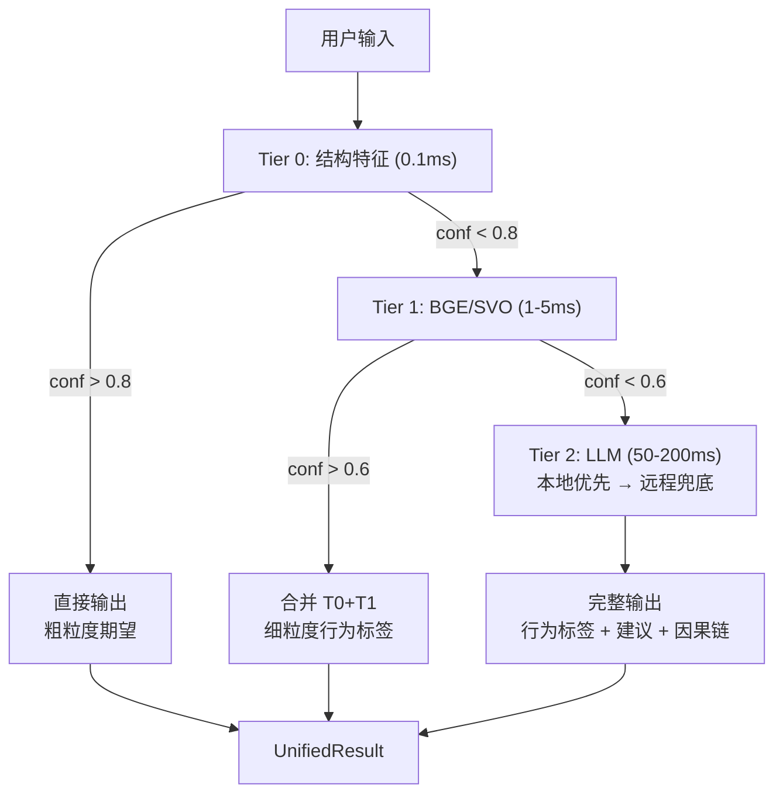

# Intent + Association Chain — 五层统一方案

> 版本: v5.0 | 日期: 2026-07-21
>
> 合并: IntentParser (Layer 1) + Association Chain (Layer 1-5)
> 原则: 结构化速度优先 → LLM only when needed

---

## 一、当前问题

```
IntentParser:          3000行代码 · 8阶段全部规则 · LLM从未触发 (conf 太高)
Association Chain:     独立模块 · Fusion 闲置 · 与 IntentParser 互不知道对方
五层漏斗:              设计完整 · 代码存在 · 从未接入引擎
```

两个模块做的事本质相同——区别只是粒度：
- IntentParser: `ADVISOR` (粗)
- Association Layer 3: `[故障诊断]` (细)

但各走各的规则管道，LLM 永不被调用。

---

## 二、统一管道: 3 Tier · 速度保证

```
Tier 0: 纯结构特征 (0.1ms, zero-LLM)
  ├── 句子长度、问号数、祈使结构 (dependency parse)
  ├── 实体计数、动词形态 (stanza)
  └── 输出: {expectation_hint, complexity_hint} + confidence

Tier 1: BGE/SVO 语义匹配 (1-5ms, zero-LLM)
  ├── SVO 三元组 → 预计算的行为向量库 (Cosine)
  ├── 依存路径 → 预计算的 pattern 向量库
  └── 输出: {behavior_label, entities} + confidence

Tier 2: LLM few-shot (50-200ms, ONLY when T0+T1 conf < 0.6)
  ├── 本地模型 (nemotron / LM Studio) 优先
  ├── 远程 DeepSeek 兜底
  └── 输出: {final_expectation, suggested_actions, causal_chain}
```

**关键**: Tier 0-1 不用任何关键词——只用**结构特征** (长度/问号/依存/SVO) 和**向量相似度** (BGE)。不是"硬编码词表"。

---

## 三、Tier 0: 纯结构特征 (速度层)

```python
def tier0_structural(query: str) -> StructFeatures:
    """No keywords. No LLM. Pure grammar. 0.1ms."""
    doc = stanza_parse(query)  # dependency parse
    
    return StructFeatures(
        sentence_count=len(doc.sentences),
        has_question=any(t.upos == "PART" and "?" in t.text for t in doc),
        has_imperative=any(t.deprel == "root" and "VB" in t.upos for t in doc),
        entity_count=sum(1 for t in doc if t.ent_type),
        verb_count=sum(1 for t in doc if t.upos == "VERB"),
        avg_depth=np.mean([len(list(t.ancestors)) for t in doc]),
    )
```

- 问句 + 低实体 → `ADVISOR` 倾向
- 祈使 + 高实体 + 高动词 → `TOOL` 倾向
- 高深度 + 长句 → 高复杂度
- 单字/无动词/无实体 → 高噪声

---

## 四、Tier 1: BGE/SVO 语义匹配 (精度层)

```python
def tier1_semantic(query: str) -> SemanticMatch:
    """BGE embeddings + SVO extraction. 1-5ms."""
    # Step 1: SVO extraction (jieba + stanza)
    triples = extract_svo(query)  # [(subj, verb, obj), ...]
    
    # Step 2: BGE encode
    vec = bge.encode(query)  # 768-dim
    
    # Step 3: Cosine against precomputed behavior library
    # Library: {[故障诊断]: vec, [性能分析]: vec, [代码修改]: vec, ...}
    matches = cosine_topk(vec, behavior_library, k=3)
    
    # Step 4: Merge with SVO signals
    return SemanticMatch(
        top_behaviors=matches,
        entities=[t.obj for t in triples],
        confidence=max(m.similarity for m in matches),
    )
```

- 行为向量库: 预计算 200+ 行为标签的 BGE embedding
- 跨语言: BGE 对中英文都有效
- 无硬编码: 完全依赖向量距离

---

## 五、Tier 2: LLM 懒加载 (兜底层)

```
触发条件:
  T0.confidence < 0.5 OR T1.confidence < 0.5

策略:
  1. 本地 LLM (LM Studio nemotron) 优先 → 50-200ms
  2. 远程 DeepSeek 兜底 → 500-1500ms

LLM 做的事:
  1. 细粒度行为标签 (替代粗粒度 ADVISOR/TOOL)
  2. 建议下一步动作 (替代硬编码 defaults)
  3. 因果链闭合 (Layer 4-5)
```

**LLM 用的不是"关键词匹配"，是"结构+语义+上下文"三信号融合后发过去**。

---

## 六、Tier 演进路径



---

## 七、与当前代码的映射

| 设计 | 当前代码 | 状态 |
|------|---------|:---:|
| Tier 0 结构特征 | IntentParser._classify() | ⚠️ 用关键词, 需改结构特征 |
| Tier 0 复杂度 | ComplexityEstimator | ⚠️ 用领域词表, 需改语法复杂度 |
| Tier 1 SVO | jieba_parser.py | ✅ 已有 |
| Tier 1 BGE | 无 | ❌ 需新增 |
| Tier 1 行为向量库 | 无 | ❌ 需构建 |
| Tier 2 LLM | _llm_fallback() | ✅ 接口已有, LLMProvider 已注入 |
| Layer 3 行为标注 | Association chain | ❌ 闲置 |
| Layer 4 时序 | 无 | ❌ |
| Layer 5 因果 | 无 | ❌ |

---

## 八、实施计划

| 阶段 | 内容 | 耗时 |
|:---:|------|:---:|
| P0 | Tier 0 替换硬编码关键词为语法结构特征 | 30行 |
| P0 | Tier 2 降低 confidence 阈值 (0.95→0.6) | 3行 |
| P1 | Tier 1 BGE 行为向量库构建 | 100行 |
| P1 | Tier 1-2 与 Tier 0 合并到统一管道 | 50行 |
| P2 | Layer 4-5 时序+因果接入 | 50行 |
