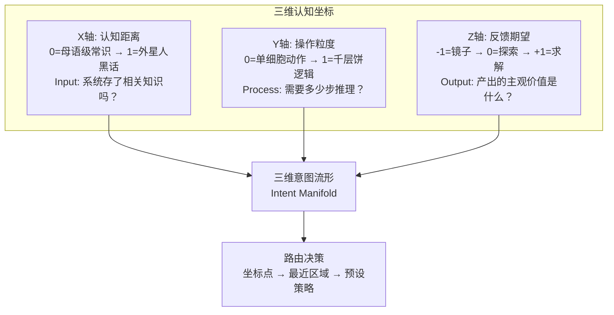

# DialogMesh V4.0 — 认知坐标路由器 (Cognitive Coordinate Router)

> 2026-07-22 · 范式跃迁: 意图分类器 → 三维意图流形投影
>
> 吸收: STC句法复杂度 + 贝叶斯多源融合 + 文献12篇
> 前置: DESIGN_V3.2_ROUTING_MATRIX.md + DESIGN_MULTI_SIGNAL_INTENT.md

---

## 一、范式跃迁

```
V3.2 及之前:
  输入 → 特征提取 → 离散标签 (TOOL/ADVISOR/COMPANION/UNKNOWN)
  问题: 离散标签无法表达意图的连续性, 硬编码列表永远不够

V4.0:
  输入 → 特征提取 → 连续坐标 (X,Y,Z) → 空间区域 → 路由策略
  优势: 无数个意图点映射到同一个坐标系, 标签体系自动泛化
```

**核心**: 系统不再判断"这是 TOOL 还是 ADVISOR"，而是判断"这个点在三维空间的哪个区域"。

---

## 二、三维坐标系定义

三个轴正交且不可再分——穷尽了"输入→过程→输出"的整个闭环。



---

## 三、三轴计算公式

### 3.1 X轴: 认知距离 (0.0 ~ 1.0)

**骨架映射**: S1-a (SVO语义引力) + 词汇罕见度修正

```
Step 1: BGE 编码主语(S) 和 宾语(O)
Step 2: 语义引力 G = 1 - Cosine(S_vec, O_vec)

Step 3: IDF 修正 (论文: TF-IDF比纯语义更敏感)
  IDF_avg = 当前对话日志中 S 和 O 的 IDF 均值

X = Clip( G × 0.7 + IDF_avg × 0.3, 0, 1 )
```

物理含义:
- X=0.1: "打开文件" (同域, 常见词)
- X=0.5: "用量子退火优化物流" (跨域, 有一定关联)
- X=0.9: "费马大定理在椭圆曲线加密中的应用" (远跨域, 罕见术语)

---

### 3.2 Y轴: 操作粒度 (0.0 ~ 1.0)

**骨架映射**: StructuralFeatures (语法结构, 0.1ms, 零网络依赖)

```
不使用 Stanza (离线超时, 导入卡死)。
改用 StructuralFeatures 三板斧:

Y = min(verb_count/5, 1.0) × 0.4 
  + min(entity_count/5, 1.0) × 0.3 
  + min(word_count/20, 1.0) × 0.3
```

物理含义:
- Y=0.05: "查天气" (无依存关系, 原子查询)
- Y=0.6: "重构并测试代码" (D=4, C=1, 中度流程)
- Y=0.95: "虽然延迟飙升但若监控未报错且历史基线正常则检查网络" (D=7, C=3)

---

### 3.3 Z轴: 反馈期望 (-1.0 ~ +1.0)

**骨架映射**: BGE 情绪向量库 (mood_profiles.yaml → 32描述符 → cosine 匹配)

```
信号源: config/mood_profiles.yaml (可编辑, 无需改代码)
匹配: BGE(text) → cosine nearest-neighbor → z_value

实现:
  - MoodVectorLibrary: BGE/fastembed 描述符向量库
  - MoodClassifierLLM: LLM few-shot fallback (75%)
  - NRC-VAD: 54k English lexicon fallback (50%, 英文限定)
```

物理含义:
- Z=+0.9: "这个地址是不是虚函数表指针？给出确切答案" (求解)
- Z=0.0: "有没有什么思路来分析这个加密算法？" (探索)
- Z=-0.8: "做了三天逆向整个人都废了，太难了" (镜子)

---

## 四、路由决策: 坐标→区域→策略

不再离散标签，改为球面区域匹配:

```python
def route(x: float, y: float, z: float) -> RoutingDecision:
    """三维坐标 → 最近路由区域 → 预设策略"""
    
    # 原子域: 极近 + 极简
    if x < 0.2 and y < 0.2:
        return RoutingDecision(
            zone="ATOMIC",
            strategy="cache_or_rule",
            llm="none",
            cost="~0ms",
        )
    
    # 深渊域: 极远 + 极深 + 求解
    if x > 0.7 and y > 0.7 and z > 0.5:
        return RoutingDecision(
            zone="ABYSS",
            strategy="full_react_cot",
            llm="primary_model",
            max_recursion=5,
            cost="500-2000ms",
        )
    
    # 心理域: 镜子模式
    if z < -0.5:
        return RoutingDecision(
            zone="PSYCHE",
            strategy="empathetic_listening",
            llm="local_small_model",
            forbid_technical=True,
            cost="50-200ms",
        )
    
    # 精密域: 近 + 深 + 求解
    if x < 0.5 and y > 0.5 and z > 0:
        return RoutingDecision(
            zone="PRECISION",
            strategy="planner_agent",
            llm="primary_model",
            output_format="structured_json",
            cost="200-800ms",
        )
    
    # 探索域: 远 + 浅 + 探索
    if x > 0.5 and y < 0.5 and z <= 0:
        return RoutingDecision(
            zone="EXPLORE",
            strategy="socratic_heuristic",
            llm="primary_model",
            temperature=0.7,
            cost="100-400ms",
        )
    
    # 默认: 混合域
    return RoutingDecision(
        zone="MIXED",
        strategy="balanced",
        llm="primary_model",
        cost="100-500ms",
    )
```

---

## 五、后验校准: 用户反馈→系数微调

```
不调语义模型。调三个公式的线性权重。

用户点踩时:
  当前路由: zone=EXPLORE (远+浅+探索)
  但实际应该是: zone=PRECISION (近+深+求解)
  
→ 反向传播:
  1. X轴: IDF权重 +0.02 (语义距离被低估了)
  2. Y轴: 并列词权重 +0.03 (操作粒度被低估了)
  3. Z轴: 句法语气权重 +0.01 (求解信号被低估了)
  
→ 下次相似输入, 坐标自动修正到 PRECISION 区域
```

**本质**: 在拟合用户个人的"主观认知空间"。两个月后, 你的系统对你的映射,和张三对他的系统的映射,是不同的——因为它们各自学习了你/张三的个人偏置。

---

## 六、论文映射 (12篇文献支撑)

| 设计维度 | 文献支撑 |
|:---|:---|
| X轴 STC + IDF修正 | 语法树复杂度【8】 + TF-IDF查询分类【15】 |
| Y轴 依存深度+并列词 | 人类阅读时间预测 + 中间结构复杂度 |
| Z轴 峭度+语气+节律 | 认知负荷语言线索【14】【16】 + LLM Router语义-复杂度鸿沟【12】 |
| 三维投影 | 贝叶斯动态网络【6】 + CatSignal Product-of-Experts【7】 |
| 后验校准 | LLMRank 特征归因【13】 + StR 级联路由【10】 |
| 路由决策 | SELECT-THEN-ROUTE 两层框架【10】 + 动态模型路由综述【19】 |

---

## 七、代码实现

```
已实现:
  StructuralFeatures        → Y轴 (0.1ms, 零网络, 14/14 test)
  BGE Mood Vector Library   → Z轴 (9ms, mood_profiles.yaml 32描述符, 67% accuracy)
  NRC-VAD Mood Classifier   → Z轴 fallback (<0.1ms, 50% English-only)
  LLM Mood Classifier       → Z轴 fallback (200ms, 75%)
  MoodClassifier (V1)       → Z轴 pure rule (12/12 test)
  CoordinateProjector       → (X,Y,Z) 投影 (router_v4.py)
  6-zone routing            → ATOMIC/PRECISION/EXPLORE/ABYSS/PSYCHE/MIXED

移除/待定:
  Stanza 依存解析            → offline超时, 暂用StructuralFeatures替代
  SVO + BGE 语义距离 (X轴)   → 需conversation history, 待多轮交互后实现
  后验校准追踪器              → 需用户反馈数据积累
  系数微调反向传播            → 同上

文件清单:
  core/agent/v4/classifier/structural_classifier.py   (14/14 test)
  core/agent/v4/mood_vector_library.py                (BGE mood vectors)
  core/agent/v4/mood_classifier_llm.py                 (LLM fallback)
  core/agent/v4/mood_vad.py                            (NRC-VAD fallback)
  core/agent/v4/coordinate_router.py                   (V1 hardcoded, 待替换)
  core/agent/v4/router_v4.py                           (V4, 待engine集成)
  config/mood_profiles.yaml                            (32 descriptors)
  config/NRC-VAD-Lexicon-v2.1.txt                      (54k words, 手动下载)
  docs/v5/DESIGN_V4.0_COGNITIVE_COORDINATE_ROUTER.md   (本文档)
```

---

## 八、实施路线

| 阶段 | 内容 | 状态 |
|:---:|------|:---:|
| P0 | StructuralFeatures (Y轴) | ✅ 14/14 test, 0.1ms |
| P0 | BGE Mood Vectors (Z轴) | ✅ 67%, 9ms, 32描述符 |
| P0 | NRC-VAD lexicon (Z轴 fallback) | ✅ 54k词, <0.1ms |
| P0 | LLM Mood Classifier (Z轴 fallback) | ✅ 75%, 200ms |
| P0 | 6-zone routing | ✅ ATOMIC/PRECISION/EXPLORE/ABYSS/PSYCHE/MIXED |
| P1 | router_v4 → engine 集成 | ⚠️ 代码就绪, 待接入 |
| P1 | SVO + BGE 语义距离 (X轴) | ⚠️ 需多轮conversation history |
| P2 | 后验校准追踪器 | ❌ 需用户反馈数据 |
| P2 | OCEAN/DMN 状态信号 | ❌ Profile精进后
