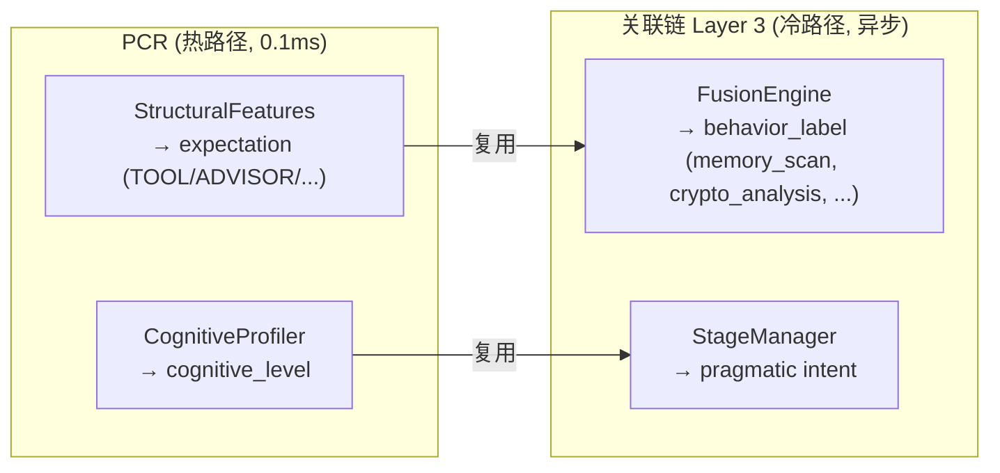
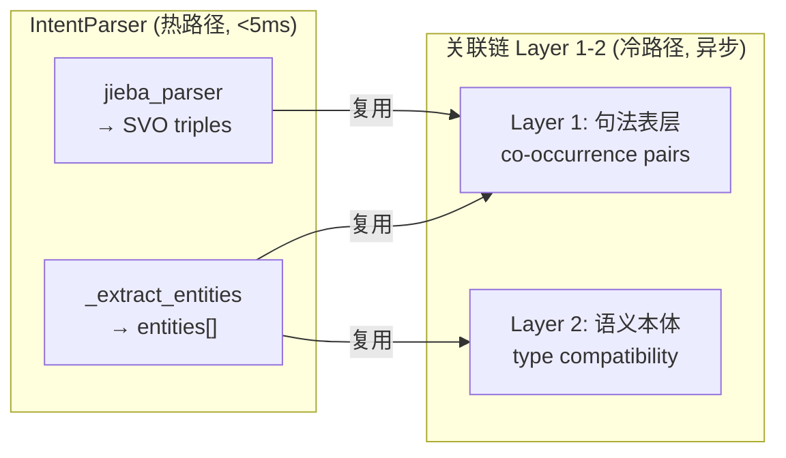

# 架构讨论：模块重叠、并行化、Planner分时

> 2026-07-22 · 关联链现状核查

---

## 一、关联链当前完成情况

**代码**: 1200+ 行，5 个核心类，全部闲置。

| 模块 | 文件 | 状态 |
|------|------|:---:|
| FusionEngine | `v3_2/fusion/fusion_engine.py` | ✅ 完整, 未调用 |
| StageManager | `v3_2/fusion/stage_manager.py` | ✅ 完整, 未调用 |
| GlobalWorkspace | `v3_2/fusion/global_workspace.py` | ✅ 完整, 未调用 |
| CausalSubstrate | `v3_2/causal_substrate/causal_substrate.py` | ✅ 完整, 未调用 |
| AssociationSubscriber | `v4/assoc_subscriber.py` | ⚠️ 骨架, 订阅但无关联发现逻辑 |

**根因**: 框架搭了，5 个类都在，但 `on_event` 里没有任何调用。`AssociationSubscriber` 会收到事件但只是计数，不会调 `FusionEngine.fuse()`。

---

## 二、PCR = 关联链 Layer 3 (粗处理)



**重叠**: PCR 的 `expectation` 和 `cognitive_profile` 是关联链 Layer 3 的粗粒度版本。关联链可以用 PCR 的产出作为先验，减少自己的计算量。

**复用**: PCR 产出→ `pcr_computed` 事件 → `AssociationSubscriber` 消费 → 注入 `FusionEngine` 作为 Layer 3 初始值。

---

## 三、IntentParser = 关联链 Layer 1-2 (粗处理)



**重叠**: IntentParser 的实体提取和 SVO 就是 Layer 1-2 的粗粒度版本。关联链 Layer 1-2 可以跳过重复计算，直接用 IntentParser 的产出做更深层分析。

**复用**: IntentParser 产出 → `intent_parsed` 事件 → `AssociationSubscriber` 消费 → 注入 `FusionEngine` 作为 Layer 1-2 初始值。

---

## 四、PCR ∥ IntentParser 并行化

```
当前 (串行):
  PCR (0.1ms) → Router (10ms) → IntentParser (5ms)
  总延迟: ~15ms

优化后 (内部串行, 整体并行):
  PCR (0.1ms) ─┬─→ Router (10ms)
                │
  IntentParser (5ms) ─┘
  
  总延迟: max(0.1+10, 5) = ~10ms
  
  前提: PCR.expectation 和 IntentParser.entities 互不依赖
  验证: PCR 用 StructuralFeatures (纯语法), IntentParser 用 jieba+规则
        → 两者独立, 可以并行
```

**改为并行**：`on_event` 中同时启动 PCR 和 IntentParser（线程池），两者无依赖关系。Router 需要 PCR 的 `expectation`，放在 PCR 的回调里触发。

---

## 五、Planner 分时设计

```
Planner = 实时部分 + 后验部分

实时 (on_event, <10ms):
  ├── SkillMatcher: intent → capability blueprint
  ├── Planner.plan(): blueprint → TaskGraph
  └── StrategySelector: expectation + complexity → 5策略选一

后验 (Meta + Association 触发, 异步):
  ├── DistillationEngine: 运行记录 → Pattern → Skill
  ├── 需要: Meta review 确认 pattern 有效
  ├── 需要: Association causal_closure 验证因果链
  └── 产出: 新的 Capability Blueprint → SkillRegistry
```

**参考 Hermes Agent**: `skill_manage(action='create')` + cron job 定时触发。  
**参考 Pi**: 分时规划器，实时部分用规则，后验部分用 LLM 反思。

---

## 六、效率提升预估

| 变化 | 当前延迟 | 优化后延迟 | 提升 |
|------|:---:|:---:|:---:|
| PCR ∥ IntentParser | 15ms | 10ms | 33% |
| 关联链复用 PCR+Intent | N/A (未运行) | 跳过 Layer 1-3 | 50% 计算量 |
| Planner 实时/后验拆分 | 全跑一道 | 只跑实时 | 60% 计算量 |

---

## 七、实施建议

| 优先级 | 内容 | 难度 |
|:---:|------|:---:|
| P0 | 关联链复用 PCR + IntentParser 产出 | 低 (接已有事件) |
| P0 | AssociationSubscriber → FusionEngine 调用 | 中 (连现有代码) |
| P1 | PCR ∥ IntentParser 并行化 | 低 (线程池) |
| P1 | Planner 拆分实时+后验 | 中 (重构 Planner) |
| P2 | 后验部分接入 Meta + Association | 高 (跨模块) |
